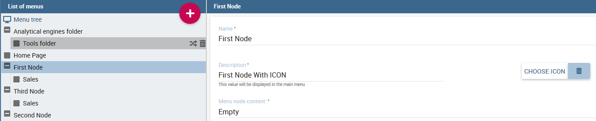
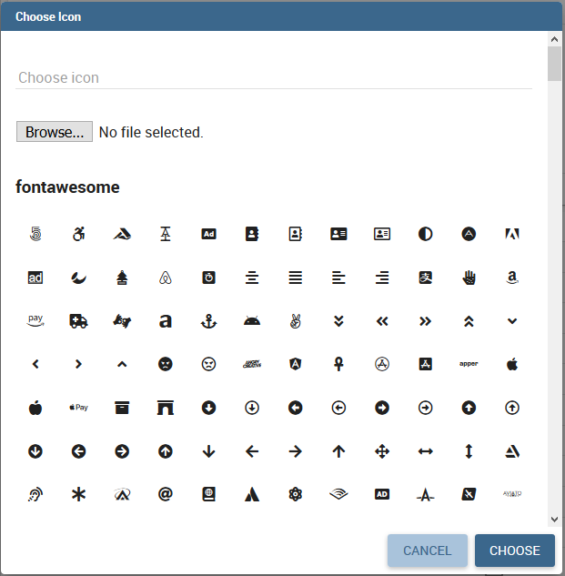
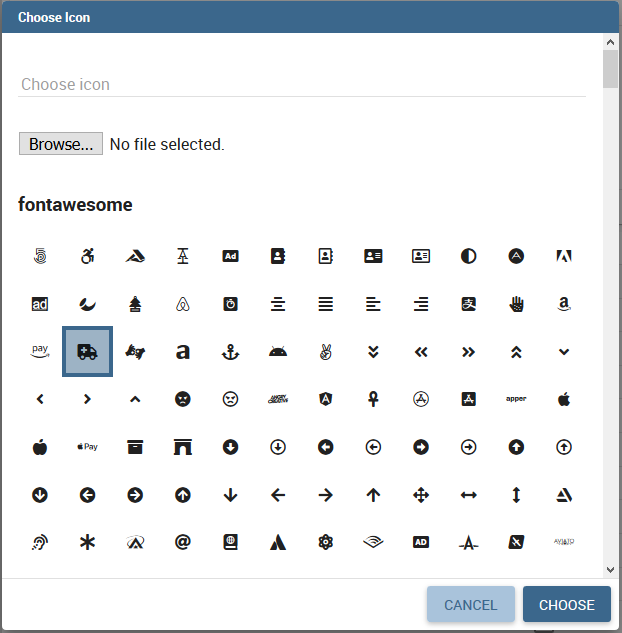
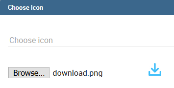

# Modelo analítico

El *modelo analítico* le permite organizar documentos analíticos en jerarquías y carpetas. Echemos un vistazo a su estructura.

## Estructura y derechos del repositorio

Knowage adopta una estructura de carpetas virtuales para organizar documentos analíticos en jerarquías y carpetas. Esta estructura se denomina árbol de funcionalidades y es accesible a través de **Gestión de perfiles** > **Gestión de funcionalidades**.

Hay dos razones principales para organizar los documentos en carpetas y jerarquías: para facilitar su búsqueda y accesibilidad, y para administrar eficazmente la visibilidad de los documentos de acuerdo con los roles de usuario.

Por defecto *Los permisos se establecen en el nivel de carpeta*. Esto garantiza que un usuario no pueda ver nada fuera de esa carpeta (a menos que también tenga permisos en otras carpetas). También es posible restringir aún más el alcance de visibilidad de un usuario asociando derechos a valores específicos de los atributos del perfil.

Además de las limitaciones de visibilidad heredadas por las carpetas que las contienen, el desarrollador puede agregar más restricciones a un solo documento.

Para crear una nueva carpeta, seleccione **Gestión de perfiles** > **Gestión de funcionalidades**. Se muestra el árbol de funcionalidades. Al hacer clic en un elemento, puede seleccionar una de las siguientes opciones:

*   Insertar: para agregar un nuevo hijo al árbol. Seleccione esta opción para crear una nueva carpeta y vaya al siguiente paso.
*   Detalle: para ver detalles de un artículo.
*   Borrar: para eliminar un elemento. Esta opción sólo está disponible si la carpeta no tiene ningún nodo secundario en el árbol.
*   Subir: para mover el elemento hacia arriba en la jerarquía.
*   Mover hacia abajo: para mover el elemento hacia abajo en la jerarquía.

Una vez que seleccione **Insertar**, se abren los detalles de la funcionalidad.

.. \_createnewfolder:
.. figura:: media/image34.png

Cree una nueva carpeta y asigne permisos.

Introduzca una etiqueta y un nombre para la nueva carpeta (funcionalidad). En la tabla, asigne permisos a los roles.
Hay cuatro tipos de permiso:

*   **Desarrollo**: para crear, editar y eliminar documentos analíticos;
*   **Prueba**: para ejecutar el documento y modificar su estado desde la prueba hasta la publicación;
*   **Ejecución**: para ejecutar el documento;
*   **Creación**: para crear documentos de informes ad-hoc como hojas de trabajo y cabinas (para el usuario final).

Para asignar permisos a los roles, marque las casillas relacionadas. Cada usuario con ese rol tendrá permisos en esa carpeta, excepto en caso de restricciones específicas en el documento único.

      .. warning::
         **Permission Inheritance**
            A subfolder inherits the permissions assigned to the parent folder. While it is possible to further restrict inherited permissions, the opposite is not allowed: rights cannot be extended going down the hierarchy.

## Configuración del menú

Knowage permite la definición de un menú para el usuario final. Este menú se mostrará en la barra izquierda de la página de inicio de Knowage, debajo del icono de Knowage. Es posible asociar a cada nodo una página estática, un documento, una funcionalidad (como carpeta) o nada (nodo vacío). Cada nodo se puede asociar a diferentes roles. Esta estructura de menú puede ser creada y modificada exclusivamente por el administrador en el **Herramientas** área. Para acceder al área de configuración del menú, vaya a **Gestión de perfiles** > **Configuración del menú** desde el Menú Principal.

Basta con hacer clic en el "Más" de la página Configuración del menú para agregar una nueva carpeta al **Árbol de menú**. Al seleccionar un nodo del árbol y hacer clic en el icono "Más", el usuario puede agregar una nueva carpeta como hija de la anterior.

.. figura:: media/image35.png

Acciones del árbol de menús.

En general puedes:

*   definir un nombre: el nombre es un campo obligatorio y tiene que ser único;
*   definir una descripción: la descripción es un campo obligatorio y se muestra en el menú principal;
*   elegir un icono para asociarlo al menú y que se muestre en el menú principal;
*   definir el contenido del elemento de menú;
*   elija los roles elegibles para ver ese elemento de menú en particular. Solo los usuarios asociados con los roles seleccionados verán este elemento de menú.

Observe que cuando uno inserta un elemento de menú como un niño, esto heredará los detalles generales de un nodo de menú.

Icono de menú de configuración

```

Creating a menu, you can choose an icon to be shown in the main menu. **This feature is available only for first level menu**.



   Menu choose icon feature

To associate an icon to the menu, click on "*CHOOSE ICON*" and then you can:

-  choose icon from the predefined icons included in Knowage;
-  upload a new file containing a custom icon (*File type allowed are .ico, .svg, .png and the maximum size allowed is 50 KB*).

To remove the menu icon, click on the trash basket.

Dialog shown in figure below allows you to select an icon or click on "Browse..." to choose the image on your pc and upload it. After choose is completed, click on "*CHOOSE*" button to apply the changes. If no errors occurred, you'll come back to menu configuration and see the icon you choose. If you want to filter predefined icons, you can start writing in the text field on the top of the dialog.



   Menu choose icon dialog

If you decide to choose a predefined icon, select it click on "CHOOSE" to apply the changes.



   Menu choose selected icon

If you decide to upload a new image, click on "*Browse...*" and select your file. After that, the icon will be displayed as in the image below. Click on "*CHOOSE*" and apply the changes.



   Menu choose uploaded icon

There are four types of menu item content: empty, document, static page and functionality.

.. figure:: media/image3637.PNG

   **Empty** (left) and **document** (right) content type.

The **empty** content type corresponds to a blank page, and it is typically chosen for father nodes.

The **document** content type runs directly a document. For this type you have to choose a related document through the
lookup button and define the list of parameters in the standard URL (i.e.: ``par1=val1&par2=val2&...``). You can also choose to hide the toolbar or the slider panel.

The **static page** content type shows a static HTML page. In this case, the administrator must define the static page that he wants to load. The HTML page combo is loaded with all HTML pages found in a folder called **static-menu** that must be located under the path defined in the system variable called ``knowage_resource_path``.

Finally, the **external application** content type, see Figure below, runs a URL address.

.. figure:: media/image39.png

   External application content type.
```
