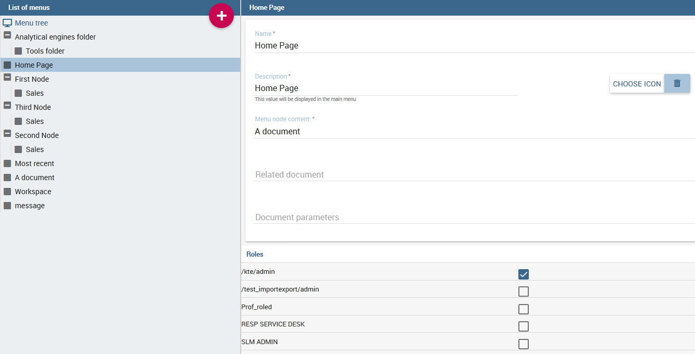
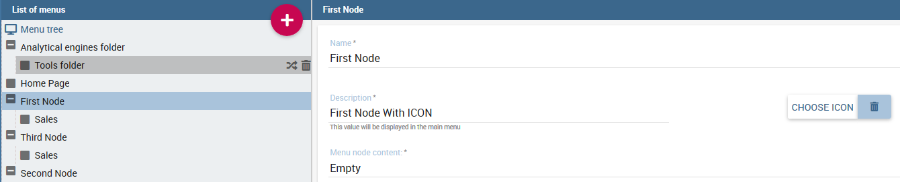
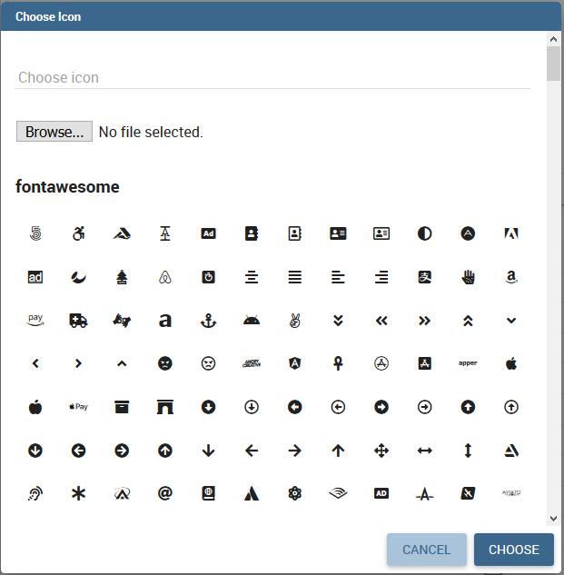
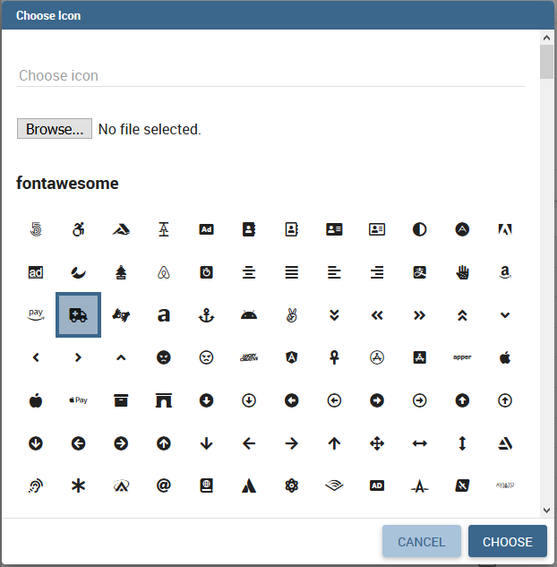

Analytical Model 
====================

The *analytical model* let you organize analytical documents in hierarchies and folders. Let’s have a look on its structure.

Repository structure and rights
---------------------------------

Knowage adopts a virtual folder structure to organize analytical documents in hierarchies and folders. This structure is called the Functionalities tree and is accessible via **Profile Management** > **Functionalities management**.

There are two main reasons for organizing documents into folders and hierarchies: to facilitate their search and accessibility, and to effectively manage visibility on documents according to user roles.

By default *permissions are set at folder level*. This guarantees that a user can not see anything outside that folder (unless he has permissions on other folders as well). It is also possible to further restrict the visibility scope of a user by associating rights to specific values of the profile attributes.

Besides visibility limitations inherited by the containing folders, the developer can add further restrictions to a single document.

To create a new folder, select **Profile Management** > **Functionalities Management**. The functionality tree is shown. Clicking on an item you can select one of the following options:

-  Insert: to add a new child to the tree. Select this to create a new folder and go to the next step.
-  Detail: to see details of an item.
-  Erase: to delete an item. This option is available only if the folder does not have any children nodes in the tree.
-  Move up: to move the item up into the hierarchy.
-  Move down: to move the item down into the hierarchy.

Once you select **Insert**, the functionality details opens.

.. _createnewfolder:
.. figure:: media/image34.png

   Create a new folder and assign permissions.

Enter a label and name for the new folder (functionality). In the table, assign permissions to roles.
There are four types of permission:

-  **Development**: to create, edit and delete analytical documents;
-  **Test**: to execute the document and modify its status from test to released;
-  **Execution**: to execute the document;
-  **Creation**: to create ad-hoc reporting documents like worksheets and cockpits (for the end user).

To assign permissions to roles, check the related boxes. Each user with that role will have permissions on that folder, except in case of specific restrictions on the single document.

      .. warning::
         **Permission Inheritance**
            A subfolder inherits the permissions assigned to the parent folder. While it is possible to further restrict inherited permissions, the opposite is not allowed: rights cannot be extended going down the hierarchy.

Menu configuration
-------------------

Knowage allows the definition of a menu for the end user. This menu will be displayed in the left bar of Knowage homepage, under the Knowage icon. It is possible to associate to each node a static page, a document, a functionality (as a folder) or nothing (empty node). Every node can be associated to different roles. This menu structure can be created and modified exclusively by the administrator in the **Tools** area. To access the Menu configuration area, go to **Profile Management** > **Menu Configuration** from the Main Menu.

It sufficient to click on the “Plus” of the Menu Configuration page to add a new folder to the **Menu Tree**. When selecting one node of the tree and clicking on the “Plus” icon, the user can add a new folder as a child of the former one.

   Menu tree actions.

In general you can:

-  define a name: the name is a mandatory field and has to be unique;
-  define a description: the description is a mandatory field and it is displayed in the main menu;
-  choose an icon to associate to the menu and to be shown in the main menu;
-  define the content of the menu item;
-  choose the roles eligible to see that particular menu item. Only users associated with the selected roles will see this menu item.

Observe that when one inserts a menu item as a child, this will inherit the general details of a menu node.

Setting menu icon
~~~~~~~~~~~~~~~~~

Creating a menu, you can choose an icon to be shown in the main menu. **This feature is available only for first level menu**.

   Menu choose icon feature

To associate an icon to the menu, click on "*CHOOSE ICON*" and then you can:

-  choose icon from the predefined icons included in Knowage;
-  upload a new file containing a custom icon (*File type allowed are .ico, .svg, .png and the maximum size allowed is 50 KB*).

To remove the menu icon, click on the trash basket.

Dialog shown in figure below allows you to select an icon or click on "Browse..." to choose the image on your pc and upload it. After choose is completed, click on "*CHOOSE*" button to apply the changes. If no errors occurred, you'll come back to menu configuration and see the icon you choose. If you want to filter predefined icons, you can start writing in the text field on the top of the dialog.

   Menu choose icon dialog

If you decide to choose a predefined icon, select it click on "CHOOSE" to apply the changes.

   Menu choose selected icon

If you decide to upload a new image, click on "*Browse...*" and select your file. After that, the icon will be displayed as in the image below. Click on "*CHOOSE*" and apply the changes.

.. figure:: media/image109.png

   Menu choose uploaded icon

There are four types of menu item content: empty, document, static page and functionality.

.. figure:: media/image3637.PNG

   **Empty** (left) and **document** (right) content type.

The **empty** content type corresponds to a blank page, and it is typically chosen for father nodes.

The **document** content type runs directly a document. For this type you have to choose a related document through the
lookup button and define the list of parameters in the standard URL (i.e.: ``par1=val1&par2=val2&...``). You can also choose to hide the toolbar or the slider panel.

The **static page** content type shows a static HTML page. In this case, the administrator must define the static page that he wants to load. The HTML page combo is loaded with all HTML pages found in a folder called **static-menu** that must be located under the path defined in the system variable called ``knowage_resource_path``.

Finally, the **external application** content type, see Figure below, runs a URL address.

.. figure:: media/image39.png

   External application content type.
