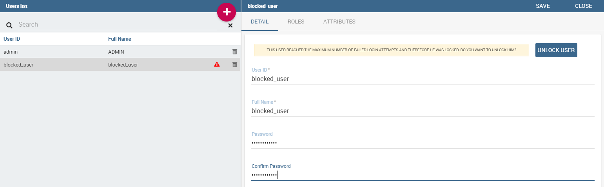
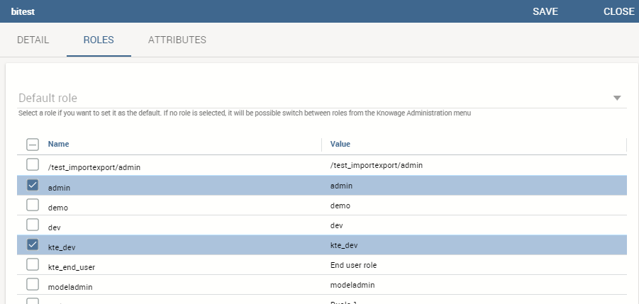

# Modelo de comportamiento

Un tema importante a explorar antes de iniciar un nuevo proyecto es la creación y gestión de los llamados *modelo conductual*.

Regula la visibilidad sobre documentos y datos según los roles y perfiles de los usuarios finales. Ofrece muchas ventajas en un proyecto de BI, incluyendo: reducir el número requerido de documentos analíticos a desarrollar y mantener; codificar reglas de visibilidad una sola vez y aplicarlas a varios documentos, cada uno con sus propias lógicas analíticas; asegurar un crecimiento uniforme del proyecto a lo largo del tiempo; garantizando el respeto de las normas de visibilidad a lo largo del tiempo, sin limitación en el número de motores y documentos analíticos que se pueden añadir a lo largo del tiempo.

El modelo de comportamiento se basa en cuatro conceptos principales:

*   *perfil de usuario*, definiendo los roles y atributos del usuario;
*   *derechos de repositorio*, definir los derechos de los usuarios en términos de accesibilidad de los documentos;
*   *controladores analíticos*, definiendo qué datos de un documento se pueden mostrar al usuario;
*   *entorno de presentación* configuración, definiendo cómo el usuario puede acceder y ejecutar sus propios documentos.

En otras palabras, el modelo de comportamiento responde principalmente a lo siguiente:
Preguntas:

*   *QUIÉN* utiliza la solución de inteligencia empresarial (perfil de usuario);
*   *QUÉ* es visible para los usuarios, en términos de documentos y datos (derechos de repositorio e impulsores analíticos);
*   *CÓMO* los usuarios trabajan con sus documentos (controladores analíticos y configuración del entorno de presentación).

## Roles, usuarios y atributos

Los usuarios de Knowage se definen por:

*   Identidades
*   Papeles
*   Perfiles.

El *identidad* de un usuario consiste en todos los datos utilizados para identificar a ese usuario, es decir, un nombre de usuario y una contraseña, así como un nombre completo legible por humanos.

El *perfil* de un usuario consiste en un conjunto de propiedades llamadas atributos, que describen información general sobre el usuario, por ejemplo, edad y sexo, pero también propiedades específicas del dominio, como la unidad organizativa a la que pertenece. Algunos atributos, como el nombre y el correo electrónico, se definen de forma predeterminada en Knowage. Otros pueden ser agregados por el administrador del modelo, como se explica en las siguientes secciones.

El *rol* de un usuario representa una categorización de un grupo de usuarios. Estos roles pueden corresponder a puestos específicos en la empresa, por ejemplo, "gerente general" o un "director de ventas", o a un puesto con respecto al proyecto de BI, por ejemplo, "administrador de datos" y "desarrollador de BI". Diferentes usuarios pueden tener el mismo rol, así como el mismo usuario puede tener múltiples roles.

.. \_knowageroletype:
.. tabla:: Tipos de roles de knowage.
:widths: automático

    +-----------------------+-----------------------+-----------------------+
    |    Role Type          | Description           | Standard User         |
    +=======================+=======================+=======================+
    |    ADMIN              | General               | biadmin               |
    |                       | administrator.        |                       |
    |                       |                       |                       |
    |                       | Manages all Knowage   |                       |
    |                       | functionalities.      |                       |
    +-----------------------+-----------------------+-----------------------+
    |    MODEL_ADMIN        | Model administrator.  | bimodel               |
    |                       |                       |                       |
    |                       | Manages the           |                       |
    |                       | Behavioural Model and |                       |
    |                       | its associated        |                       |
    |                       | functionalities.      |                       |
    +-----------------------+-----------------------+-----------------------+
    |    DEV_ROLE           | Developer.            | bidev                 |
    |                       |                       |                       |
    |                       | Creates and modifies  |                       |
    |                       | datasets and          |                       |
    |                       | documents.            |                       |
    +-----------------------+-----------------------+-----------------------+
    |    TEST_ROLE          | Test user.            | bitest                |
    |                       |                       |                       |
    |                       | Tests analytical      |                       |
    |                       | documents.            |                       |
    +-----------------------+-----------------------+-----------------------+
    |    USER               | End user.             | biuser                |
    |                       |                       |                       |
    |                       | Executes documents    |                       |
    |                       | visible to him and    |                       |
    |                       | creates ad-hoc        |                       |
    |                       | reporting analysis.   |                       |
    +-----------------------+-----------------------+-----------------------+

Knowage le permite crear varios roles, de acuerdo con las necesidades de su proyecto. Sin embargo, todos los roles deben pertenecer a un *tipo de rol*. Un tipo de rol es una categorización de nivel superior utilizada por Knowage, con el fin de asignar roles para las diferentes características de la suite.

Los roles predefinidos se resumen en la Tabla 5.1. Los primeros cuatro roles son roles técnicos, mientras que el último, el usuario, es el usuario final real. Cada tipo de rol tiene asociado un usuario predeterminado. Se pueden crear otros usuarios y asociarlos a un tipo de rol.

Cuando un usuario inicia sesión en Knowage, su perfil se carga automáticamente. El nombre completo es visible haciendo clic en el botón de información en la esquina inferior izquierda de la página.

La autenticación puede ser manejada internamente por Knowage o delegada a un sistema externo de inicio de sesión único (SSO).

.. indirecta::
**Administración de autenticación**:
La elección de manejar la autenticación internamente o delegarla en un sistema SSO externo generalmente depende de la presencia de un sistema de autenticación ya implementado. Si este es el caso, Knowage puede integrarse perfectamente con la infraestructura de autenticación existente.

Una vez que el usuario ha iniciado sesión, se carga su rol. Los roles se administran internamente. En caso de que el usuario esté asociado con varios roles, se le pedirá que elija uno.

Alternativamente, haciendo clic en el icono que se muestra a continuación, puede seleccionar un rol predeterminado que se mantendrá válido hasta que cierre la sesión.

.. figure:: medios/image28\_bis.png

Roles de usuario en Knowage.

Los pasos para crear un modelo de comportamiento siguen:

*   Crear atributos de perfil;
*   Crear roles;
*   Cree usuarios y asígneles valores y roles de atributos.

Knowage apoya la gestión de perfiles de usuario y roles a través de la **Gestión de perfiles** sección de menú. Este menú solo es visible para el administrador de Knowage y para el administrador del modelo, ya que la administración de usuarios y roles es una operación crítica que requiere un nivel adecuado de responsabilidad.

El **Gestión de perfiles** La sección de menú contiene tres elementos de submenú:

*   **Administración de atributos de perfil**: para definir nuevos atributos de perfil y gestionar los existentes.

*   **Gestión de roles**: para crear nuevos roles y administrar permisos para cada rol.

*   **Gestión de usuarios**: para crear usuarios, administrar sus identidades, asignar valores a sus atributos de perfil y asociarlos con roles.

A continuación, mostramos cómo el administrador del modelo puede definir perfiles de usuario y roles utilizando estas funcionalidades. Recuerde que la gestión de perfiles de Knowage también se puede integrar con sistemas de perfiles externos.

Haciendo clic en **Administración de atributos de perfil**, se muestra la lista de atributos definidos actualmente. Para agregar un nuevo atributo, haga clic en el botón **Botón Agregar**: se agrega una nueva fila a la lista, donde puede insertar el nombre y la descripción del nuevo atributo. Para eliminar un atributo, seleccione la fila correspondiente y haga clic en **Borrar**.

Los atributos definidos en esta sección estarán disponibles para todos los perfiles de usuario. No es obligatorio asignar un valor a cada atributo para cada usuario, ya que los atributos de perfil sin valores no se considerarán en la definición del perfil de usuario.

Además de los atributos de perfil creados por el administrador, de forma predeterminada Knowage proporciona los siguientes atributos de perfil:

*   **user_id**: establecer con el identificador único del usuario;

*   **user_roles**: establecer con roles de usuario seleccionados en la ficha ROLES del menú Administración de usuarios;

*   **TENANT_ID**: establecer con el identificador único del inquilino;

*   **user_session_roles**: establecer como *user_roles* , si no se establece ningún rol predeterminado. Establecer con el rol predeterminado seleccionado, de lo contrario.

*   **Idioma**: establecido con el idioma seleccionado por el usuario

.. figure:: media/image29.png

Gestión de atributos de perfil.

Una vez definidos los atributos, el administrador del modelo puede definir roles, utilizando el **Gestión de roles** funcionalidad. La herramienta de administración de roles tiene dos caras: a la izquierda puede ver la lista de roles ya definidos. Al principio de un proyecto, solo se ven los roles predeterminados. Para agregar un nuevo rol, haga clic en el icono **Agregar** y desplazarse al panel derecho. Para eliminar un rol, simplemente haga clic en el botón **Borrar** al final de la fila del rol.

.. indirecta::
**Gestión de roles**:
El modelo de comportamiento debe construirse teniendo en cuenta la especificidad de cada organización y las necesidades del proyecto de BI.    Por lo tanto, es una buena práctica definir roles específicos para el proyecto de BI y evitar usar solo roles técnicos de Knowage.

En el panel derecho hay tres pestañas. El **Detalle** permite al administrador definir el nombre y el tipo de rol (obligatorio). El tipo de rol regula la visibilidad de ese rol en función de los tipos ya descritos. También se puede agregar un código y una descripción, como se muestra a continuación.

.. figure:: media/image3031.png

Gestión de roles.

El **Autorizaciones** le permite asignar permisos a cada rol. Los derechos están predefinidos y agrupados en categorías, como se muestra arriba.

El **Modelos de Negocio**, **Conjuntos de datos** y **Categorías de KPI** tabs está destinado a asignar categorías específicas a cada rol, de manera que cada usuario solo pueda ver los modelos de negocio, conjuntos de datos o KPI que pertenecen a las categorías asociadas con su rol.

El **Modelos de Negocio** la ficha sólo está disponible para KnowageBD y KnowageSI, mientras que la ficha **Categorías de KPI** uno solo está disponible para KnowagePM. Se pueden encontrar más detalles sobre los modelos de negocio y los KPI en los capítulos correspondientes.

Puede crear nuevas categorías para modelos de negocio y conjuntos de datos mediante el **Configuración del servidor** > **Gestión de dominios** elemento de menú.

***

## Gestión de usuarios

Por último, pero no menos importante, el **Gestión de usuarios** incluye un panel izquierdo que permite al administrador crear y eliminar usuarios, y un panel derecho que le permite administrar los detalles, roles y atributos del usuario.

.. figure:: media/image32.png

Gestión de usuarios.

Desbloqueo de usuario
^^^^^^^^^^^

Si el usuario alcanza el número máximo de intentos de inicio de sesión fallidos (editable en configuraciones avanzadas), Será bloqueado por Knowage y se denegará el acceso. Al acceder a Knowage con un usuario que tiene privilegios de administración de usuarios, el usuario bloqueado se mostrará con una señal de advertencia roja y será posible desbloquearlo utilizando el botón "desbloquear usuario". Después de eso, el usuario podrá iniciar sesión con el último conjunto de credenciales.

    Users Management - Roles settings example

Configuración de roles
^^^^^^^^^^^^^^^^^^

Al hacer clic en la pestaña ROLES, debe seleccionar uno o más roles para asociar con el usuario.
Después de eso, si hay más de un rol asociado al usuario, puede elegir el rol predeterminado seleccionándolo en el cuadro combinado en la parte superior de la página.

El rol predeterminado es opcional: si no selecciona un rol predeterminado, en el momento del inicio de sesión se cargarán todos los roles disponibles para el usuario. Si selecciona un rol, en el momento del inicio de sesión
será el rol de sesión seleccionado.

    Users Management - Roles settings example

En el ejemplo anterior, para el usuario "*mordedor*" puede elegir entre "admin" y "*kte_dev*" como rol predeterminado.
