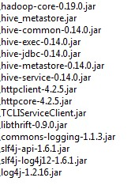

# Configurar orígenes de datos

Para que todas las herramientas de BI funcionen correctamente, debe configurar la conexión de base de datos. Hay dos opciones diferentes disponibles para la configuración **JNDI** (recomendado) y **JDBC**.

## Conéctese a sus datos

Para conectarse a sus datos, debe definir una nueva conexión de origen de datos.

Knowage administra dos tipos de conexiones de origen de datos:

*   conexiones recuperadas como recursos JNDI, que son administrados por el servidor de aplicaciones en el que knowage está trabajando. Esto permite al servidor de aplicaciones optimizar el acceso a los datos (por ejemplo, definiendo grupos de conexiones) y, por lo tanto, son los preferidos. Aquí puede encontrar información sobre cómo crear un grupo de conexiones en Tomcat: https://tomcat.apache.org/tomcat-8.0-doc/jndi-datasource-examples-howto.html
*   conexiones JDBC directas, que son administradas directamente por Knowage;

.. importante::
**Cómo crear JNDI de conexión en Tomcat**

         - Create connection pool on ``TOMCAT_HOME/conf/server.xml``
         - Add ResourceLink on context.xml

Para agregar una nueva conexión, primero agregue el controlador JDBC relativo a la carpeta `TOMCAT_HOME/lib` y reinicie Knowage. Luego, inicie sesión como administrador (usuario: *biadmin*contraseña: *biadmin* son la credencial predeterminada) y seleccione la opción **Origen de datos** del elemento del **Proveedor de datos** en el menú del administrador.

Haciendo clic en el botón **Agregar** en la esquina superior derecha del panel izquierdo, se mostrará un formulario vacío a la derecha.

.. figura:: media/image25.png

     Add a new data source

.. figura:: media/image26.png

     Data source details.

La página de detalles de cada origen de datos (en el lado derecho, como se muestra en las figuras anteriores) incluye las siguientes propiedades:

Etiqueta
Identificador obligatorio del origen de datos.
Descripción
Descripción del origen de datos.
Dialecto
El dialecto utilizado para acceder a la base de datos. Los dialectos admitidos son:

      .. table:: Certified Data Sources
         :widths: auto

         +-----------------------+-------------------+
         |    Certified Data Sources                 |
         +=======================+===================+
         | Oracle                | 11, 12            |
         +-----------------------+-------------------+
         | MySQL                 | 5.7, 8            |
         +-----------------------+-------------------+
         | PostgreSQL            | 8.2, 9.1, 12.3    |
         +-----------------------+-------------------+
         | Maria DB              | 10.1, 10.2, 10.3  |
         +-----------------------+-------------------+
         | Teradata              | 15.10.0.7         |
         +-----------------------+-------------------+
         | Vertica               | 9.0.1-0           |
         +-----------------------+-------------------+
         | Cloudera              | 5.8.9             |
         +-----------------------+-------------------+
         | Apache Hive 1         | 1.1.0             |
         +-----------------------+-------------------+
         | Apache Hive 2         | 2.3.2             |
         +-----------------------+-------------------+
         | Apache Impala         | 2.6.0             |
         +-----------------------+-------------------+
         | Apache Spark SQL      | 2.3.0             |
         +-----------------------+-------------------+
         | Apache Cassandra      | 2.1.3             |
         +-----------------------+-------------------+
         | Mongo DB              | 3.2.9             |
         +-----------------------+-------------------+
         | Orient DB             | 3.0.2             |
         +-----------------------+-------------------+
         | Google Big Query      | -                 |
         +-----------------------+-------------------+
         | Amazon RedShift       | (JDBC driver v1)  |
         +-----------------------+-------------------+
         | Azure Synapse         | -                 |
         +-----------------------+-------------------+

Sólo lectura
Las opciones disponibles son: *Sólo lectura* y *Lectura y escritura*. En caso de que el origen de datos se defina como lectura y escritura, Knowage puede utilizarlo para escribir tablas temporales.
Escribir
Valor predeterminado Si un origen de datos se establece como *Escritura predeterminada* luego es utilizado por Knowage para escribir tablas temporales que también provienen de otros *Sólo lectura* fuentes de datos. Tenga en cuenta que cada instalación de Knowage solo puede tener una *Escritura predeterminada* origen de datos.
Tipo
Las opciones disponibles son

      + If you want to define a direct **JDBC** connection, then you have to also set the following fields:

         - **URL** Database URL. An example for MySQL databases is ``jdbc:mysql://localhost:3306/foodmart_key``
         - **User** Database username.
         - **Password** Database password.
         - **Driver** Driver class name. An example for MySQL databases is ``com.mysql.jdbc.Driver``.
      + If instead you want to define a **JNDI** connection, fill in the following fields:

         - **Multischema** Available options are *Yes* or *No*. If *Yes*, the JNDI resource full name is calculated at runtime by appending a user’s profile attribute (specified in the *Multischema attribute* field) to the JNDI base name defined in the server.xml, we suppose it has been told at the end of installation or during server configuration.
         - **Schema attribute** The name of the profile attribute that determines the schema name.
         - **JNDI NAME** It depends on the application server. For instance, for Tomcat 7 it has the format ``java:comp/env/jdbc/<resource_name>``. If the data source is multischema, then the string is ``java:comp/env/jdbc/<prefix>``.

Una vez que haya completado el formulario, puede probar la nueva fuente de datos haciendo clic en el botón *Prueba* en la esquina superior derecha de la página y luego guárdelo.

¡Ahora está conectado a sus datos y puede comenzar un nuevo proyecto de Business Intelligence con Knowage!

## Big Data y NoSQL

En esta sección describimos cómo puede conectar Knowage a diferentes fuentes de datos de Big Data.

.. importante::
**Solo Enterprise Edition**

         Please note that these connections are available for products KnowageBD and KnowagePM only.

Colmena

```

Apache Hive is a data warehouse infrastructure built on top of Hadoop for providing data summarization, query, and analysis. Apache Hive supports analysis of large datasets stored in Hadoop’s HDFS and compatible file systems such as Amazon S3 filesystem. It provides an   SQL-like language called HiveQL with schema on read and transparently converts queries to map/reduce, Apache Tez and Spark. All three execution engines can run in Hadoop YARN.

Every distribution of Hadoop provides its JDBC driver for Hive. We suggest you to use or the Apache one or the one specific of your distribution. In general the JDBC driver for Hive is composed by different .jars, and so you should deploy the JDBC driver with all dependencies in your application server. If you are creating a model you should create a new *Data Source Connection* and import the JDBC driver and all the dependencies.

For example suppose you want to connect to Hive using Apache driver you should include these libraries (according to your Hive version) shown in Figure below.



   Libraries to include in the apache driver.

If you forget to add one or more libraries, you will likely get a ``NoClassDefFoundError`` or ``ClassNofFoundException``.

The parameters for the Hive connection are:

-  **Dialect:** Hive QL;

-  **Driver Class:** ``org.apache.hive.jdbc.HiveDriver`` (if you are not using some specific driver of some distribution. In this case search in the documentation of the distribution);
-  **Connection URL:** ``jdbc:\hive2:\//<host1>:<port1>,<host2>:<port2>/dbName;sess\\_var_list?hive_conf_list#hive_var_list``.

Here ``<host1>:<port1>,<host2>:<port2>`` is a server instance or a comma separated list of server instances to connect to (if dynamic service discovery is enabled). If empty, the embedded server will be used.

A simple example of connection URL is ``jdbc:\hive2://192.168.0.125:10000``.

Spark SQL
```

Spark SQL reutiliza el front-end y el metaalmacén de Hive, lo que le brinda compatibilidad total con los datos, consultas y UDF de Hive existentes. Simplemente instálelo junto a Hive. Para la instalación de Spark le sugerimos que consulte el sitio web de spark `http://spark.apache.org/. <http://spark.apache.org/>`\__ Para crear una conexión con el servidor Spark SQL Apache Thrift debe utilizar el mismo controlador JDBC de Hive.

*   **Clase de conductor:** `org.apache.hive.jdbc.HiveDriver` (si no está utilizando algún controlador específico de alguna distribución. En este caso buscar en la documentación de la distribución);

*   **URL de conexión:** `jdbc:\hive2://<host1>:<port1>,<host2>:<port2>/dbName;sess\\_var_list?hive_conf_list#hive_var_list`.

Consulte la sección Hive para obtener detalles sobre los parámetros. El puerto en este caso no es el puerto de Hive sino el del servidor de ahorro Spark SQL (normalmente `10001`).

Impala

```

Impala (currently an Apache Incubator project) is the open source, analytic MPP database for Apache Hadoop. To create a connection to Impala you should download the jdbc driver from the Cloudera web site and deploy it, with all dependencies, on the application server. The definition of the URL can be different between versions of the driver, please check on the Cloudera web site.

Example parameters for Impala connection are:

-  **Dialect:** Hive SQL;
-  **Driver Class:** ``com.cloudera.impala.jdbc4.Driver``;
-  **Connection URL:** ``jdbc:\impala://dn03:21050/default``.

MongoDB
```

MongoDB es una base de datos de documentos de código abierto que proporciona alto rendimiento, alta disponibilidad y escalado automático. MongoDB evita la necesidad de un Mapeo Relacional de Objetos (ORM) para facilitar el desarrollo.

MongoDB es diferente de los otros dbs que Knowage puede manejar, porque no proporciona un controlador JDBC, sino un conector Java. El controlador Java de MongoDB (en este momento se incluye la versión 3.5.0) ya está incluido dentro de Knowage, por lo que no es necesario descargarlo y agregarlo al servidor de aplicaciones.

Los parámetros de ejemplo para la conexión son:

*   **Dialecto:** MongoDB;
*   **Clase de conductor:** mongo;
*   **URL de conexión:** mongodb://localhost:27017/foodmart (no incluya el usuario y la contraseña en esta URL).

También preste atención a que el usuario debe tener los privilegios correctos para acceder a la base de datos especificada. Entonces, por ejemplo, en MongoDB puede crear un usuario con este comando en el shell de Mongo:

.. code-block:: javascript
:linenos:
:caption: Creación de usuarios.

      db.createUser(
        {
          user: "user",
          pwd: "user",
          roles: [ { role: "readWrite", db: "foodmart" }  ]
        }
      )

A continuación, debe crear un rol que sea capaz de ejecutar funciones (esta es la forma utilizada por Knowage para ejecutar el código escrito en la definición del conjunto de datos de MongoDB) y asignarlo al usuario:

.. code-block:: javascript
:linenos:
:caption: Asignación de roles .

      use admin
      db.createRole( { role: "executeFunctions", privileges: [ { resource: { anyResource: true }, actions: [ "anyAction" ] } ], roles: [] } )
      use foodmart
      db.grantRolesToUser("user", [ { role: "executeFunctions", db: "admin" } ])

Vea también estos enlaces útiles:

*   (`https://docs.mongodb.com/manual/tutorial/enable-authentication/) <https://docs.mongodb.com/manual/tutorial/enable-authentication/>`\__
*   (`https://www.claudiokuenzler.com/blog/555/allow-mongodb-user-execute-command-eval-mongodb-3.x#.W59wiaYzaUl) <https://www.claudiokuenzler.com/blog/555/allow-mongodb-user-execute-command-eval-mongodb-3.x#.W59wiaYzaUl>`\__

Casandra

```

Apache Cassandra is an open source distributed database management system designed to handle large amounts of data across many commodity servers, providing high availability with no single point of failure. Cassandra offers robust support for clusters spanning multiple datacenters, with asynchronous masterless replication allowing low latency operations for all clients.

There are different ways to connect Knowage to Cassandra.

If you are using DataStax Enterprise you can use Spark SQL connector and query Cassandra using pseudo standard SQL (`https://github.com/datastax/spark-cassandra-connector/blob/master/doc/2_loading.md) <https://github.com/datastax/spark-cassandra-connector/blob/master/doc/2_loading.md>`__

Another solution is to download the JDBC Driver suitable for your Cassandra distribution and query Cassandra using the CQL language. You must deploy the JDBC driver with all dependencies in your application server (copy them into ``TOMCAT_HOME/lib`` folder and restart).

Refer to the JDBC driver documentation in order to see how to configure the JDBC connection parameters.

Unless you are using Spark SQL to read from Cassandra, the definition of a business model over Cassandra data using Knowage Meta will be available in the next releases.

Google Big Query
```

Knowage admite fuentes de datos de Google Big Query a través del controlador JDBC de Simba: consulte `official documentation <https://cloud.google.com/bigquery/providers/simba-drivers>`\_.

Por ejemplo, para crear una conexión JDBC a un conjunto de datos de Google Big Query mediante una cuenta de servicio, puede agregar la siguiente configurtaion a `TOMCAT_HOME/conf/server.xml`:

.. code-block:: xml

<Resource auth="Container" driverClassName="com.simba.googlebigquery.jdbc42.Driver" logAbandoned="true" maxActive="20" maxIdle="4"
  maxWait="300" minEvictableIdleTimeMillis="60000" name="jdbc/my-bigquery-ds" removeAbandoned="true" removeAbandonedTimeout="3600"
  testOnReturn="true" testWhileIdle="true" timeBetweenEvictionRunsMillis="10000" type="javax.sql.DataSource"
  url="jdbc:bigquery://https://www.googleapis.com/bigquery/v2:443;ProjectId=<<project-id>>;OAuthType=0;OAuthServiceAcctEmail=<<service-account-email>>;OAuthPvtKeyPath=<<json-key>>;DefaultDataset=<<default-dataset>>;FilterTablesOnDefaultDataset=1;"/>

Google Cloud Spanner

```

Knowage supports Google Cloud Spanner datasources via the official open source JDBC driver: see `official documentation <https://cloud.google.com/spanner/docs/use-oss-jdbc>`_.

For example, to create a JDBC connection to a Google Cloud Spanner dataset using a service account you can add the following configurtaion to ``TOMCAT_HOME/conf/server.xml``:

.. code-block:: xml

 <Resource auth="Container" driverClassName="com.google.cloud.spanner.jdbc.JdbcDriver" logAbandoned="true" maxActive="20" maxIdle="4"
     maxWait="300" minEvictableIdleTimeMillis="60000" name="jdbc/my-spanner-ds" removeAbandoned="true" removeAbandonedTimeout="3600"
     testOnReturn="true" testWhileIdle="true" timeBetweenEvictionRunsMillis="10000" type="javax.sql.DataSource"
     url="jdbc:cloudspanner:/projects/<<project-id>>/instances/<<instance-name>>/databases/<<db-name>>;credentials=${catalina.home}/conf/google-cloud-spanner-auth-key.json"/>


Amazon RedShift
~~~~~~~~~~~~~~~~

Knowage supports Amazon RedShift datasources via Official v1 JDBC Driver: see `official reference <https://docs.aws.amazon.com/redshift/latest/mgmt/configure-jdbc-connection.html>`_.
According to documentation using JDBC drivers v1 a RedShift connection configuration can be done exactly like a PostgreSQL configuration.
You can test it creating an example db like this one:  `official sample testing db <https://docs.aws.amazon.com/redshift/latest/dg/c_sampledb.html>`_.
To create a JDBC connection to an Amazon RedShift dataset using a RedShift-only connection you can add the following configuration to ``TOMCAT_HOME/conf/server.xml``:

.. code-block:: xml

 <Resource auth="Container" driverClassName="com.amazon.redshift.jdbc.Driver" logAbandoned="true" maxActive="10" maxIdle="1" minEvictableIdleTimeMillis="60000" name="jdbc/redshift" password="password" removeAbandoned="true" removeAbandonedTimeout="3600" testOnReturn="true" testWhileIdle="true" timeBetweenEvictionRunsMillis="10000" type="javax.sql.DataSource" url="jdbc:redshift://examplecluster.abc123xyz789.us-west-2.redshift.amazonaws.com:5439/dev" username="user" validationQuery="SELECT 1"/>

Azure Synapse
~~~~~~~~~~~~~

Knowage supports connections to Azure Synapse datasources via SQL Server JDBC Driver (`official documentation <https://docs.microsoft.com/en-us/azure/synapse-analytics/sql/connection-strings>`_).

The following example shows how to create a JDBC connection to an Azure Synapse dataset, by adding the following configuration to ``TOMCAT_HOME/conf/server.xml``:

.. code-block:: xml

 <Resource auth="Container" driverClassName="com.microsoft.sqlserver.jdbc.SQLServerDriver" logAbandoned="true" maxIdle="4" maxTotal="50" maxWait="-1"
	 minEvictableIdleTimeMillis="60000" removeAbandoned="true" removeAbandonedTimeout="3600" testOnReturn="true" testWhileIdle="true"
	 timeBetweenEvictionRunsMillis="10000" type="javax.sql.DataSource" name="jdbc/synapse" username="<user>" password="<password>" 
	 url="jdbc:sqlserver://your-synapse-instance.sql.azuresynapse.net:1433;database=<database>" validationQuery="select 1"/>

```
