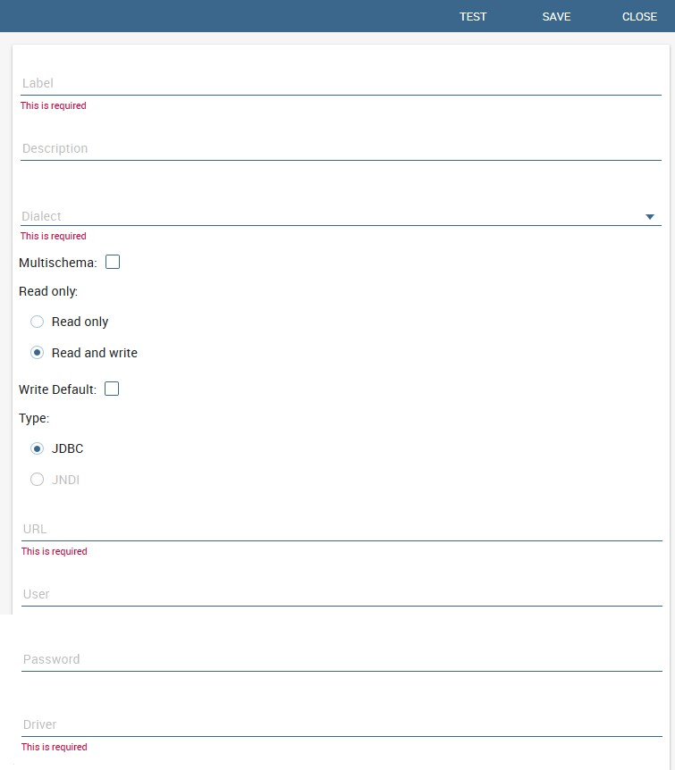

Configure data sources
=========================

To let all the BI tools work properly you need to configure DB connection. There are two different options available for the configuration **JNDI** (recommended) and **JDBC**.

Connect to your data
--------------------

In order to connect to your data, you have to define a new data source connection. Defining a data source allows Knowage to access data transparently without the need to redefine the connection to the database in case some of its configuration properties change over time. 

Knowage manages two types of data source connections:

- connections retrived as JNDI resources, which are managed by the application server on which Knowage is working. This allows the application server to optimize data access (e.g. by defining connection pools) and thus are the preferred ones.
- direct JDBC connections, which are directly managed by Knowage;

To add a new connection, first add the relative JDBC driver to the folder ``KnowageServer-<version>/lib`` and restart Knowage. Then, login as administrator (user: *biadmin*, password: *biadmin* are the default credential) and select the **Data source** item from the **Data provider** panel in the administrator menu.
      
By clicking the **Add** button on the top right corner of the left panel, an empty form will be displayed on the right.

.. figure:: media/image25.png 
    
     Add a new data source
    

    
     Data source details.

The detail page of each data source (on the right side as shown in the figures above) includes the following properties:

Label 
  Mandatory identifier of the data source.
Description 
  Description of the data source.
Dialect 
  The dialect used to access the database. Supported dialects are: 
            
      .. table:: Certified Data Dources
         :widths: auto

         +-----------------------+-------------------+
         |    Certified Data Dources                 |
         +=======================+===================+
         | Oracle                | 11, 12            |
         +-----------------------+-------------------+
         | MySQL                 | 5.2, 5.5, 5.6     |
         +-----------------------+-------------------+
         | PostgreSQL            | 8.2, 9.1          |
         +-----------------------+-------------------+
         | Maria DB              | 10.1, 10.2, 10.3  |
         +-----------------------+-------------------+
         | Teradata              | 15.10.0.7         |
         +-----------------------+-------------------+
         | Vertica               | 9.0.1-0           |
         +-----------------------+-------------------+
         | Cloudera              | 5.8.9             | 
         +-----------------------+-------------------+
         | Apache Hive 1         | 1.1.0             |    
         +-----------------------+-------------------+
         | Apache Hive 2         | 2.3.2             | 
         +-----------------------+-------------------+     
         | Apache Impala         | 2.6.0             |
         +-----------------------+-------------------+
         | Apache Spark SQL      | 2.3.0             |
         +-----------------------+-------------------+
         | Apache Cassandra      | 2.1.3             |
         +-----------------------+-------------------+
         | Mongo DB              | 3.2.9             |  
         +-----------------------+-------------------+
         | Orient DB             | 3.0.2             |
         +-----------------------+-------------------+
   
   
Read Only
   Available options are: *Read Only* and *Read-and-write*. In case the data source is defined as read-and-write, it can be used by Knowage to write temporary tables.
Write
   Default If a data source is set as *Write Default* then it is used by Knowage for writing temporary tables also coming from other *Read Only* data sources. Note that each Knowage installation can have only one *Write Default* data source.
Type
   The available options are 
   
      + If you want to define a direct **JDBC** connection, then you have to also set the following fields:
      
         - **URL** Database URL. An example for MySQL databases is ``jdbc:mysql://localhost:3306/foodmart_key``
         - **User** Database username
         - **Password** Database password.
         - **Driver** Driver class name. An example for MySQL databases is ``com.mysql.jdbc.Driver``.
      + If instead you want to define a **JNDI** connection, fill in the following fields:
      
         - **Multischema** Available options are *Yes* or *No*. If *Yes*, the JNDI resource full name is calculated at runtime by appending a user’s profile attribute (specified in the *Multischema attribute* field) to the JNDI base name defined in the server.xml, we suppose it has been told at the end of installation or during server configuration.
         - **Schema attribute** The name of the profile attribute that determines the schema name.
         - **JNDI NAME** It depends on the application server. For instance, for Tomcat 7 it has the format ``java:comp/env/jdbc/<resource_name>``. If the data source is multischema, then the string is ``java:comp/env/jdbc/<prefix>``.

Once you have filled the form, you can test the new data source by clicking on the *Test* button at the top right corner of the page and then save it.

Now you are connected to your data and you can start a new Business Intelligence project with Knowage!

Big Data and NoSQL
-------------------

In this section we describe how you can connect Knowage to different Big Data data sources.

.. important::
         **Enterprise Edition only**

         Please note that these connections are available for products KnowageBD and KnowagePM only.

Hive
~~~~~~

Apache Hive is a data warehouse infrastructure built on top of Hadoop for providing data summarization, query, and analysis. Apache Hive supports analysis of large datasets stored in Hadoop’s HDFS and compatible file systems such as Amazon S3 filesystem. It provides an   SQL-like language called HiveQL with schema on read and transparently converts queries to map/reduce, Apache Tez and Spark. All three execution engines can run in Hadoop YARN.

Every distribution of Hadoop provides its JDBC driver for Hive. We suggest you to use or the Apache one or the one specific of your distribution. In general the JDBC driver for Hive is composed by different .jars, and so you should deploy the JDBC driver with all dependencies in your application server. If you are creating a model you should create a new *Data Source Connection* and import the JDBC driver and all the dependencies.

For example suppose you want to connect to Hive using Apache driver you should include these libraries (according to your Hive version) shown in Figure below.

.. figure:: media/image27.png

   Libraries to include in the apache driver.

If you forget to add one or more libraries, you will likely get a ``NoClassDefFoundError`` or ``ClassNofFoundException``.

The parameters for the Hive connection are:

-  **Dialect:** Hive QL;

-  **Driver Class:** ``org.apache.hive.jdbc.HiveDriver`` (if you are not using some specific driver of some distribution. In this case search in the documentation of the distribution);
-  **Connection URL:** ``jdbc:\hive2:\//<host1>:<port1>,<host2>:<port2>/dbName;sess\\_var_list?hive_conf_list#hive_var_list``.

Here ``<host1>:<port1>,<host2>:<port2>`` is a server instance or a comma separated list of server instances to connect to (if dynamic service discovery is enabled). If empty, the embedded server will be used.

A simple example of connetction url is ``jdbc:\hive2://192.168.0.125:10000``.

Spark SQL
~~~~~~~~~~

Spark SQL reuses the Hive front end and metastore, giving you full compatibility with existing Hive data, queries and UDFs. Simply install it alongside Hive. For the installation of Spark we suggest you to look at the spark website `http://spark.apache.org/. <http://spark.apache.org/>`__ To create a connection to the Spark SQL Apache Thrift server you should use the same JDBC driver of Hive. 

-  **Driver Class:** ``org.apache.hive.jdbc.HiveDriver`` (if you are not using some specific driver of some distro. In this case search in the documentation of the distro);

-  **Connection URL:** ``jdbc:\hive2://<host1>:<port1>,<host2>:<port2>/dbName;sess\\_var_list?hive_conf_list#hive_var_list``.

Look at the Hive section for the details about parameters. The port in this case is not the port of Hive but the one of Spark SQL thrift server (usually ``10001``).

Impala
~~~~~~

Impala (currently an Apache Incubator project) is the open source, analytic MPP database for Apache Hadoop. To create a connection to Impala you should download the jdbc driver from the Cloudera web site and deploy it, with all dependencies, on the application server. The definition of the url can be different between versions of the driver, please check on the Cloudera web site.

Example parameters for Impala connection are:

-  **Dialect:** Hive SQL;
-  **Driver Class:** ``com.cloudera.impala.jdbc4.Driver``;
-  **Connection URL:** ``jdbc:\impala://dn03:21050/default``.

MongoDB
~~~~~~~~

MongoDB is an open-source document database that provides high performance, high availability, and automatic scaling. MongoDB obviates the need for an Object Relational Mapping (ORM) to facilitate development.

MongoDB is different from the other dbs Knowage can handle, because it doesnt provide a JDBC driver, but a java connector. The MongoDB Java driver (at this moment version 3.5.0 is included) is already included inside Knowage so isn't required to download and add it to the application server.

Example parameters for the connection are:

-  **Dialect:** MongoDB;
-  **Driver Class:** mongo;
-  **Connection URL:** ``mongodb://localhost:27017/foodamart``(please don't include user and password in this url).

Also please pay attention that the user must have the correct priviledges to access the specified database. So for example on MongoDB you can create a user with this command on the Mongo shell:

.. code-block:: javascript
    :linenos:
    :caption: User creation.
    
      db.createUser(
        {
          user: "user",
          pwd: "user",
          roles: [ { role: "readWrite", db: "foodmart" }  ]
        }
      )

Then you must create a role that is able to run functions (this is the way used by Knowage to run the code wrote in the MongoDB's dataset definition) and assign it to the user:

.. code-block:: javascript
    :linenos:
    :caption: Role assignment .
    
      use admin
      db.createRole( { role: "executeFunctions", privileges: [ { resource: { anyResource: true }, actions: [ "anyAction" ] } ], roles: [] } ) 
      use foodmart
      db.grantRolesToUser("user", [ { role: "executeFunctions", db: "admin" } ])
      
See also this useful links:
- (`https://docs.mongodb.com/manual/tutorial/enable-authentication/) <https://docs.mongodb.com/manual/tutorial/enable-authentication/>`__
- (`https://www.claudiokuenzler.com/blog/555/allow-mongodb-user-execute-command-eval-mongodb-3.x#.W59wiaYzaUl) <https://www.claudiokuenzler.com/blog/555/allow-mongodb-user-execute-command-eval-mongodb-3.x#.W59wiaYzaUl>`__

Cassandra
~~~~~~~~~~

Apache Cassandra is an open source distributed database management system designed to handle large amounts of data across many commodity servers, providing high availability with no single point of failure. Cassandra offers robust support for clusters spanning multiple  datacenters, with asynchronous masterless replication allowing low latency operations for all clients.

There are different ways to connect Knowage to Cassandra. 

If you are using Datastax Enterprise you can use Spark SQL connector and query Cassandra using pseudo standard SQL (`https://github.com/datastax/spark-cassandra-connector/blob/master/doc/2_loading.md) <https://github.com/datastax/spark-cassandra-connector/blob/master/doc/2_loading.md>`__

Another solution is to download the Apache JDBC Driver and query Cassandra using the language CQL. Also in this case the JDBC driver is composed by different jars, and so you should deploy the JDBC driver with all dependencies in your application server.

An example of Cassandra Apache driver (with dependencies) is:

-  apache-cassandra-clientutil-1.2.6.jar
-  apache-cassandra-thrift-1.2.6.jar
-  cassandra-all-1.2.9.jar
-  cassandra-jdbc-2.1.1.jar
-  guava-15.0.jar
-  jackson-core-asl-1.9.2.jar
-  jackson-mapper-asl-1.9.2.jar
-  libthrift-0.7.0.jar
-  log4j-1.2.16.jar
-  sfl4j-api-1.6.1.jar
-  sfl4j-log4j12-1.6.1.jar

Example parameters for the connection are:

-  **Dialect:** Cassandra;
-  **Driver Class:** ``org.apache.cassandra.cql.jdbc.CassandraDriver``;
-  **Connection URL:** ``jdbc:cassandra://193.109.207.65:9160/foodmart``.

Unless you are using Spark SQL to read from Cassandra, the definition of a business model over Cassandra data using Knowage Meta will be available in the next releases.

