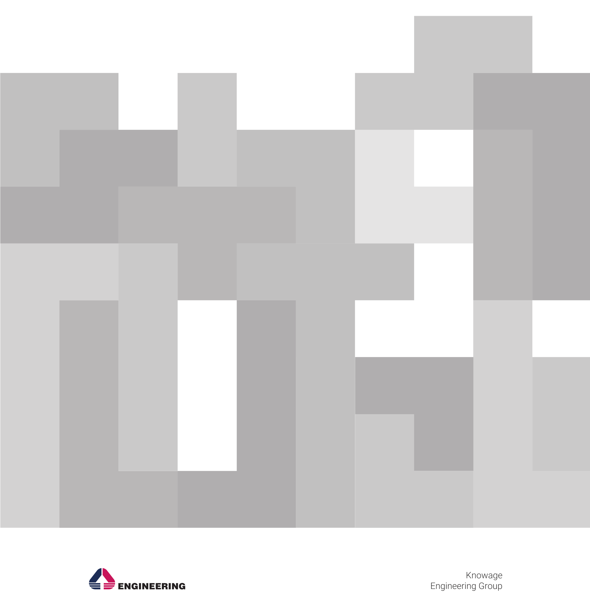

Administration Manual
#########################

.. toctree::
   	:caption: Table of Contents

   	knowage-at-a-glance.rst
	user-interface.rst
	configure-data-sources.rst
	behavioural-model.rst
	analytical-model.rst
	operational-engines.rst
	scheduler.rst
	server-manager.rst
	server-settings.rst

.. |image13| image:: media/image13.png
   :width: 0.2756in
   :height: 0.2756in

   

.. |image1| image:: media/image2.png
   :width: 5.0075in
   :height: 4.14184in
.. |image36| image:: media/image4.png
   :width: 5.0075in
   :height: 1.41271in
.. |image39| image:: media/image4.png
   :width: 5.0075in
   :height: 1.25635in
.. |image43| image:: media/image3.png
   :width: 5.78738in
   :height: 1.58376in

