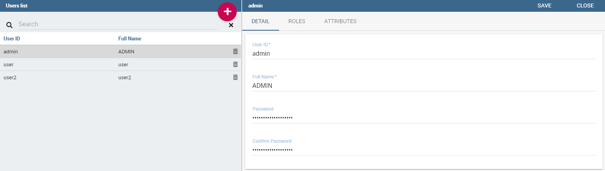

Behavioural Model
====================

An important topic to explore before starting a new project is the creation and managing the so-called *behavioural model*.

It regulates the visibility on documents and data according to the roles and profiles of the end users. It offers many advantages in a BI project, including: reducing the required number of analytical documents to be developed and maintained; coding visibility rules once only and apply them to several documents, each one with its own analytical logics; ensuring a uniform growth of the project over time; guaranteeing the respect of the visibility rules over time, with no limitation on the number of engines and analytical documents that can be added over time.

The bevioural model is based on four main concepts:

-  *user profile*, defining the user’s roles and attributes;
-  *repository rights*, defining the users’ rights in terms of document accessibility;
-  *analytical drivers*, defining which data of a document can be shown to the user;
-  *presentation environment* settings, defining how the user can reach and run his own documents.

In other words, the bevioural model mainly answers the following
questions:

-  *WHO* uses the business intelligence solution (user profile);
-  *WHAT* is visible to users, in terms of documents and data (repository rights and analytical drivers);
-  *HOW* users work with their documents (analytical drivers and presentation environment settings).

Roles, users and attributes
-------------------------------

Knowage users are defined by:

-  identities,
-  roles,
-  profiles.

The *identity* of a user consists of all data used to identify that user, i.e., a username and a password, as well as a human readable full name.

The *profile* of a user consists of a set of properties called attributes, describing general information about the user, e.g., age and gender, but also domain-specific properties, such as the organizational unit to which he belongs. Some attributes, such as name and email, are defined by default in Knowage. Others can be added by the model administrator, as explained in the following sections.

The *role* of a user represents a categorization of a group of users. These roles may correspond to specific positions in the company, e.g., “general manager” or a “sales director”, or to a position with respect to the BI project, e.g., “data administrator” and “BI developer”. Different users may have the same role, as well as the same user may have multiple roles.

.. _knowageroletype:
.. table:: Knowage Role Types.
    :widths: auto

    +-----------------------+-----------------------+-----------------------+
    |    Role Type          | Description           | Standard User         |
    +=======================+=======================+=======================+
    |    ADMIN              | General               | biadmin               |
    |                       | administrator.        |                       |
    |                       |                       |                       |
    |                       | Manages all Knowage   |                       |
    |                       | functionalities.      |                       |
    +-----------------------+-----------------------+-----------------------+
    |    MODEL_ADMIN        | Model administrator.  | bimodel               |
    |                       |                       |                       |
    |                       | Manages the           |                       |
    |                       | Behavioural Model and |                       |
    |                       | its associated        |                       |
    |                       | functionalities.      |                       |
    +-----------------------+-----------------------+-----------------------+
    |    DEV_ROLE           | Developer.            | bidev                 |
    |                       |                       |                       |
    |                       | Creates and modifies  |                       |
    |                       | datasets and          |                       |
    |                       | documents.            |                       |
    +-----------------------+-----------------------+-----------------------+
    |    TEST_ROLE          | Test user.            | bitest                |
    |                       |                       |                       |
    |                       | Tests analytical      |                       |
    |                       | documents.            |                       |
    +-----------------------+-----------------------+-----------------------+
    |    USER               | End user.             | biuser                |
    |                       |                       |                       |
    |                       | Executes documents    |                       |
    |                       | visible to him and    |                       |
    |                       | creates ad-hoc        |                       |
    |                       | reporting analysis.   |                       |
    +-----------------------+-----------------------+-----------------------+

Knowage allows you to create several roles, according to your project needs. However, all roles must belong to a specific *role type*. A role type is a higher-level categorization used by Knowage, in order to map roles for the different features of the suite.

Pre-defined roles are summarized in the Table 5.1. The first four roles are technical roles, while the last one, the user, is the actual end user. Each role type has a default user associated to it. Other users can be created and associated to a role type.

When a user logs in into Knowage, his profile is automatically loaded. The full name is visible by clicking on the info button at the bottom left corner of the page.

Authentication can be handled internally by Knowage or delegated to an external Single Sign On (SSO) system.

   .. hint::
      **Authentication Management**:
         The choice of handling authentication internally or delegating it to an external SSO system typically depends on the presence of an authentication system already in place. If this is the case, Knowage can seamlessly integrate with the existing authentication infrastructure.

Once the user has logged in, his role is loaded. Roles are managed internally. In case the user is associated with multiple roles, he will be asked to choose one.

Alternatively, by clicking on the icon shown below, he can select a default role that will be kept valid until he logs out.

.. figure:: media/image28_bis.png

   User roles in Knowage.

The steps to create a behavioural model follow:

-  Create profile attributes;
-  Create roles;
-  Create users and associate attribute values and roles to them.

Knowage supports the management of user profiles and roles through the **Profile Management** menu section. This menu is only visible to Knowage administrator and to the model administrator, since users and roles management is a critical operation that requires an appropriate level of responsibility.

The **Profile Management** menu section contains three sub-menu items:

-  **Profile Attribute Management**: to define new profile attributes and manage the existing ones.

-  **Role Management**: to create new roles and manage permissions for each role.

-  **User Management**: to create users, manage their identities, assign values to their profile attributes and associate them with roles.

In the following, we show how the model administrator can define user profiles and roles using these functionalities. Remember that Knowage profile management can also be integrated with external profiling systems.

Clicking on **Profile Attribute Management**, the list of currently defined attributes is shown. To add a new attribute, click the **Add button**: a new row is added to the list, where you can insert the name and description of the new attribute. To delete an attribute, select the corresponding row and click **Delete**.

Attributes defined in this section will be available to all user profiles. It is not mandatory to assign a value to each attribute for each user, since profile attributes without values will not be considered in the definition of the user profile.

.. figure:: media/image29.png

   Profile attributes Management.

Once the attributes are defined, the model administrator can define roles, using the **Role Management** functionality. The role management tool is two-sided: on the left you can see the list of already defined roles. At the beginning of a project, only default roles are visible. To add a new role, click the **Add** button and move to the right panel. To delete a role, simply click the **Delete** button at the end of the role’s row.

   .. hint::
      **Role Management**:
         The behavioural model should be built taking into account the specificity of each organization and the needs of the BI project.    Therefore, it is a good practice to define specific roles for the BI project and avoid using Knowage technical roles only.

In the right panel there are three tabs. The **Detail** tab allows the administrator to define role name and role type (mandatory). The role type regulates the visibility of that role based on the types already described. A code and a description can be added too, as shown below.

.. figure:: media/image3031.png

   Roles Management.

The **Authorizations** tab allows you to assign permissions to each role. Rights are predefined and grouped into categories, as shown above.

The **Business Models**, **Data sets** and **KPI Categories** tabs are is intended to assign specific categories to each role, in a way that each user can only see the business models, datasets or KPI that belong to the categories associated with his role.

The **Business Models** tab is available only for KnowageBD and KnowageSI, while the **KPI Categories** one is available only for KnowagePM. More details on business models and KPIs can be found in the corresponding chapters.

You can create new categories for business models and datasets using the **Server Settings** > **Domain management** menu item.

Last but not least, the **User Management** section includes a left panel that allows the administrator create and delete users, and a right panel that allows him to manage user details, roles and attributes.

   Users Management.
