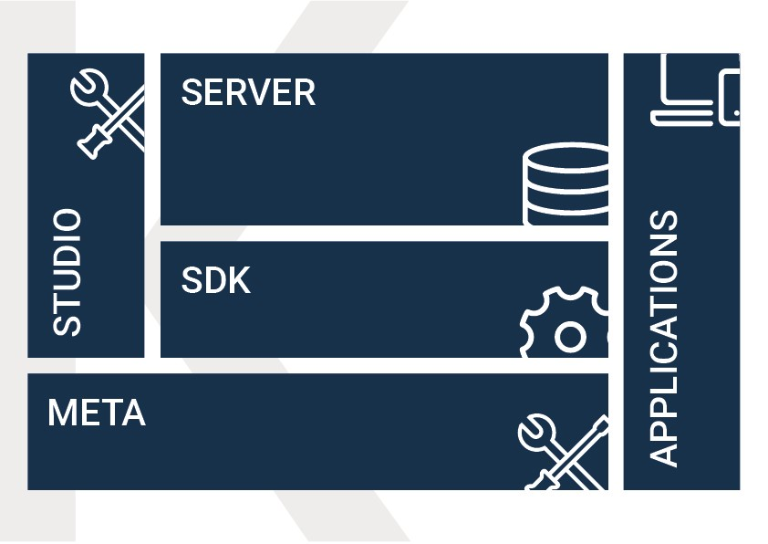
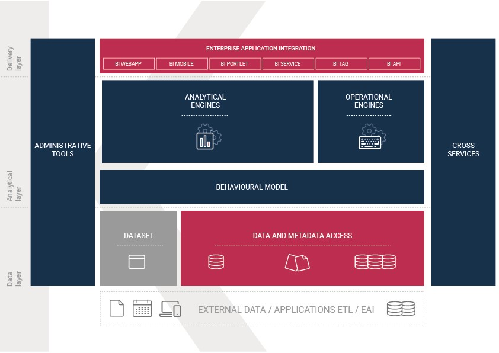
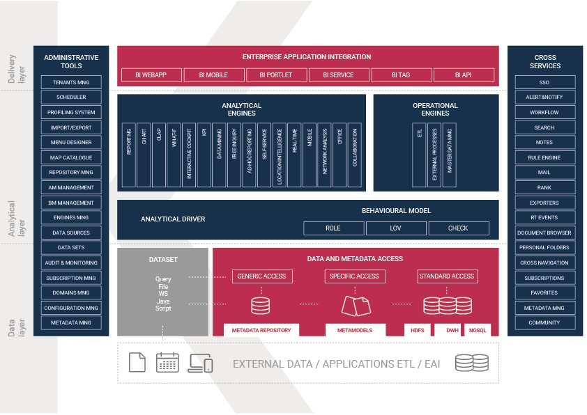

Knowage at a glance
=======================

Discovering Knowage
----------------------

Knowage is the business intelligence suite developed and managed by Engineering Group. Knowage is *flexible*, since it is based on a modular architecture and open standards in order to facilitates its customization and integration according to users’ needs. It also provides a *comprehensive* set of analytical features and capabilities ranging from traditional reporting and charting tools, to more advanced analytics.

.. important::
         **Enterprise Edition only**

         KnowageER and KnowageSI, as submodules of Knowage Enterprise Edition, also supports **multi-tenancy** (i.e. a single Knowage instance serving multiple organizations, called tenants). In a multi-tenancy architecture, each tenant owns and manages his own users, documents, configuration and parameters, which are completely independent from those owned by other tenants.

Modules
-----------------

   
   Knowage modules.

Knowage Server
   The core of the suite, which includes all analytical features. This is the reference environment for the end user and the administrator;
Knowage Meta
   The environment supporting the creation and management of metadata models. This module is conceived for BI developers.
Knowage Studio
   The environment that allows BI developers to configure analysis and related analytical features that are then released and made available to the end user on the Server.
Knowage SDK
   A set of APIs compliant with the SOA architecture, allowing external applications to interact with the Knowage Server   and its metadata.
Knowage Applications
   A set of analytical models ready to use in specific business domains. 
   
Here we focus on Knowage Server considering the administrator perspective.

It is the main module of the suite, which provides, as we will see, the whole analytical power of the product and all administrative
functionalities.

It represents an enterprise level solution for BI, supporting the whole project life-cycle, managing security and guaranteeing scalability, clustering and high availability architectures. Moreover, it is the main reference for all potential users and usages; it leads the development trend in terms of features, services and delivery models.

Layers
-------

Knowage Server architecture is functionally layered on three main levels.
   

   Knowage Server architecture structure.

Delivery layer
   It manages all possible usages of the Server by end users or from external applications.
Analytical layer
   It provides all analytical functionalities of the product.
Data layer
   It regulates data loading through many access strategies.

Every layer of the functional architecture is composed of different application modules.

   Knowage Server architecture detail.

Delivery layer
~~~~~~~~~~~~~~~~~~~~~~

The delivery layer covers all publication requirements. It can be accessed by third-party applications, and it offers end users all features and services needed to perform their BI analysis.

It can be accessed in different ways:

BI Webapp
   It is the default use mode. Knowage suite provides a web application, working on a standard application server A customizable web application is provided, working on a standard application server (e.g. Tomcat, JBoss, WAS). The administrator can define the layout and specific views for each end user type.
BI Mobile
   Thanks to the interaction between Knowage Server and the remote client interface, users’ reports, charts or cockpits can also be accessed and displayed on mobile devices, such as tablets and smartphones.
BI Service
   Web services allowing Knowage components to interact with external applications or to collect the results of static documents (report, image of a chart, etc.).
BI Tag
   Tag libraries allowing you to encapsulate a dynamic document (OLAP, GEO, etc.) into a different context.
BI API
   For the integration of enterprise applications behind or without the end user GUI.

Analytical layer
~~~~~~~~~~~~~~~~~~~~~~

The analytical layer is the core of the Server. It provides all analytical features and capabilities, in a secure and role-based access
mode. Its main components are:

Analytical Engines
   covering all analytical requirements, it provides different tools for each type of analysis (e.g. reports, charts, cockpits), in order to ensure high flexibility and end users satisfaction.
Operational Engines
   to interact with OLTP systems by means of ETL or processes, and manage basic BI registries such as master data or lookup domains;
Behavioural Model
   which regulates the visibility over documents and data, according to end users’ roles.

Offering multiple solutions for the same analytical requirement and/or multiple instances for the same engine, Knowage logic and architecture provide various benefits, such as: limited workload on each engine, guaranteeing high performances; openness to improve or extend the suite and its capabilities, minimizing the impact on exiting environments; high flexibility and modularity; high scalability, with minimum economic, infrastructural and applicationlevel impact.

Data layer
~~~~~~~~~~~~~~~~~~~~~~

The data layer allows data and metadata storage and usage. BI data is often located in a data warehouse, whose design is out of the BI product scope and strictly related to the specific customer’s world. Most of Knowage products offer a specific ETL tool allowing to load data at this level, covering the whole BI stack.

Knowage can directly access the data warehouse through JDBC connections (for intance, using SQL queries) or, on a higher level, it can use a specific access strategy based on metamodels, built through Knowage Meta.

As described in the next chapters, Knowage can also access less traditional data sources, like Big Data and NoSQL data sources.

All Knowage metadata are stored in a private repository hosted on a generic RDBMS and accessed by means of a generic description based on Hibernate technology. Knowage metadata contains technical information, business metadata and metamodels registry.

What you can do with Knowage
----------------------------

This section focuses on Knowage analytical and operational funciontalities, administration tools and cross services.

It is important to point out that Knowage adopts an evolutionary approach, allowing you to use and adapt the different features provided
by the suite according to your specific needs, and adapt them over time. The Server reflects this strategy, guaranteeing security and
consistency, thanks to the independence of the behavioural model that regulates visibility over documents and data.

Moreover, Knowage has a distributed logic and handles more instances of a same engine. This allows the workload distribution on several servers, ensuring the linear system scalability.

Analytical and operational functionalities
~~~~~~~~~~~~~~~~~~~~~~~~~~~~~~~~~~~~~~~~~~~

Knowage server provides a wide range of analytical functionalities,
covered by the different products of the suite.

Concerning the operative level, Knowage Server works with:

- **ETL**, not only for the continuous loading of source data into the DWH, but even for the internal movement of data, high-level consolidations or returning of the produced information to the operational systems.
- **External processes**, for a bidirectional interaction with operational systems and external ones.
- **Master data**, to manually manage domain data.

Administrative tools and cross services
~~~~~~~~~~~~~~~~~~~~~~~~~~~~~~~~~~~~~~~~~~~~

Besides its analytical, delivery and data access capabilities, Knowage Server provides all the administration tool needed to handle your
Knowage instance, as well as several cross-product services to make its features even more powerful.

The **administrative tools** support developers, testers and administrators in their daily work, providing various functionalities, such as: scheduler, profiling system, import/export capabilities, menu designer, map catalogue, management of repository, analytical model, behavioural model and engines, configuration of data sources and data sets, audit & monitoring analysis, subscriptions, management of value domains, configuration settings and metadata, management of user data, hierarchies editor and community management.

The **cross services** include the common features of the product, shared by all analytical engines and documents. They are: single sign on, alert and notification, workflow, search engine, collaborative tools, sending e-mails, ranking, multiformat exporter, RT events, document browser, personal folders, cross navigation, subscription service, hot link, metadata view.
