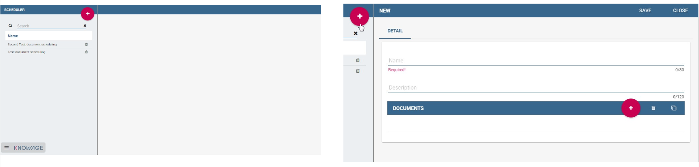
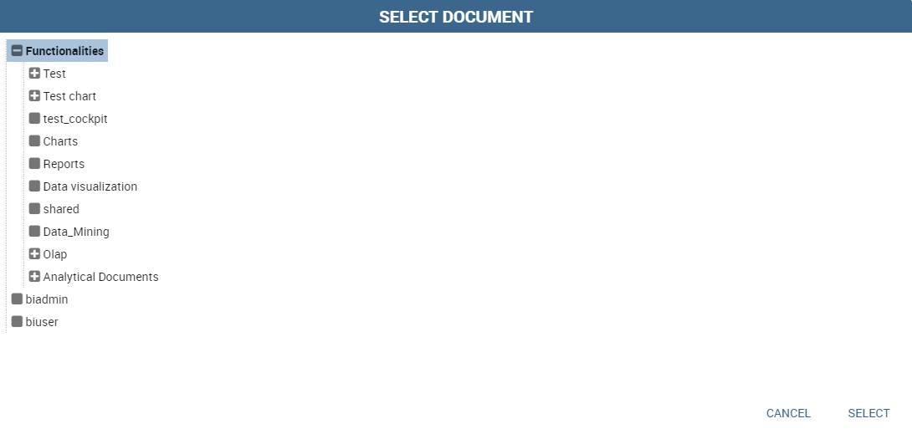
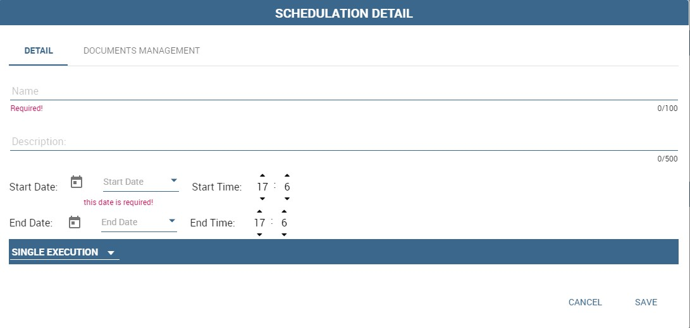
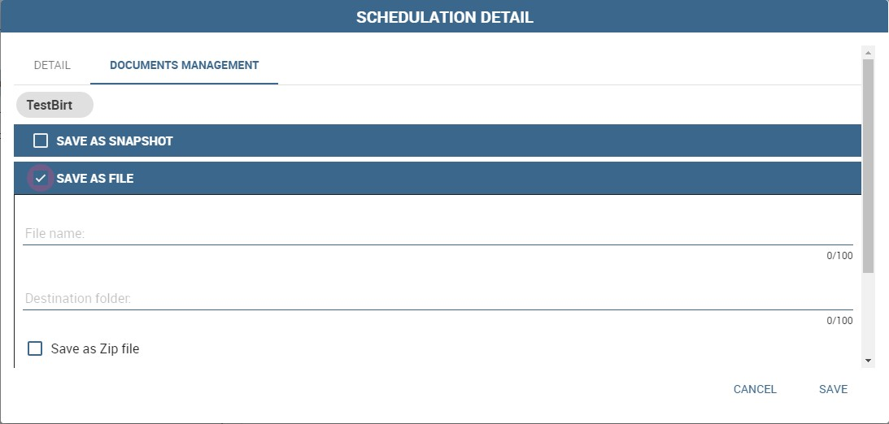
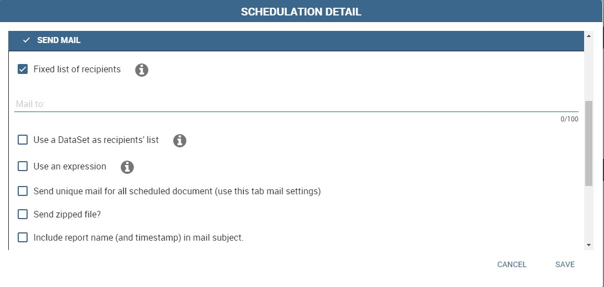
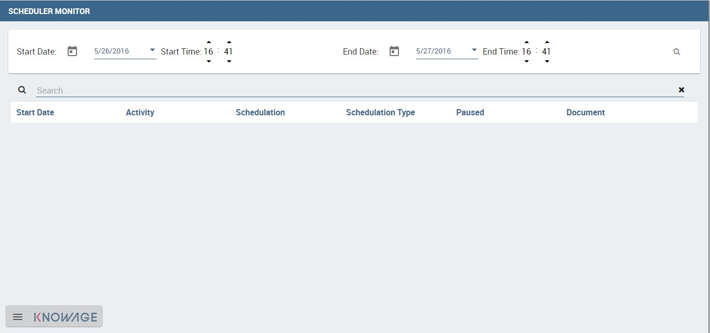

Scheduler
=========

Knowage scheduler allows to schedule the execution of one or more analytical documents published on the Server. Documents executed by the scheduler can then be distributed along different dispatching channels. In the following we describe how to create an activity, schedule it and dispatch the results.

Create an Activity
------------------

In order to define a new scheduled activity the administrator must specify which documents compose the activity and how to execute them. The list of all scheduled activities can be seen selecting **Tools** > **Scheduler**. To create a new activity click on the “Plus” icon at the top of the page in the left area. In Figure below you can see the main scheduler page and the new activity GUI.

   Left: scheduler main page. Right: New activity GUI

Give a name and a description to the new activity. Then select the documents that compose it by clicking on the “Plus” icon and selecting them from the pop up wizard, see Figure below.

   Adding a document to an activity.

Now you need to specify how the scheduler must handle the analytical drivers of each selected document having parameters.

.. _manageparameters:
.. figure:: media/image43.png

   Manage parameters.

There are two possibilities:

- selecting a value from those available for the specific analytical driver at definition time; 
- executing the report one time for each possible values of the analytical driver.

A scheduled activity can be composed by more than one report. It is also possible to add the same report to a scheduled activity more times. You can use the icon |image50| to easily duplicate a document. Once all esired documents have been added and the management configuration of their parameters has been set up, save the activity by clicking on the save button. The new activity is shown in the list and can be modified or deleted using intended specifically icons.

.. |image50| image:: media/image44.png
   :width: 30

You can manage your activity at any time just clicking on the name of the scheduling item (left side of the window) and all its features will be displayed aside (right half part of the window).

To see and modify the list of the schedules associated to an activity, click on the “Plus” icon you find in the schedulation area in the bottom right side. Similarly, click on the same button to associate schedules
to newly created activities.

Schedulation details opens (Figure below).

    Schedulation detail panel.

It is composed by two areas: **Detail** and **Documents management**.
The details tab let you set all properties of you schedulation. Indeed here you decide its name, description and timing.
A schedulation can be made in a choosen date and time if you choose **Single Execution** as type.
Otherwise it can be realised for fixed periods or start on a fixed event.

You can decide it, by choosing the schedulation type.

Available schedulation type are:

-  Single Execution;
-  Customized Execution;
-  Event Exectution.

A **Single Execution** is a fixed execution for a date and a time which happens only once. A **Customized Execution** repeats your schedulation perodically according to your settings. The **Event Execution** starts the scheduling when an event happens.

You can choose among these event types:

-  REST service,
-  JMS Queue,
-  ContextBroker messge,
-  Dataset verification.

If you choose **Dataset verification**, you have to select a right structured dataset. It has to give as results only true or false. Then set the frequency in seconds. This is the frequency the dataset will be verified. For example if you set it on 10 seconds it means that each 10 seconds the dataset is executed. If the result of its execution is true, the schedulation is trigged otherwise it isn’t.

Once you are done, switch to the **Document Management** tab.

.. figure:: media/image46.png

    Document management.

Here you can find the dispatch configurations, that can be different for all the documents that compose the scheduled activity. All documents that compose the activity have their own dispatch configuration and the same document can be distributed along multiple dispatch channels. You can switch among the documents included in your activity by cliking on their name in the upper toolbar. There are many different possible dispatch channels that can be used to distribute the results of the execution of a scheduled activity:

- Save as snapshot,
- Save as file,
- Save as document,
- Send to Java class,
- Send mail

In the following sections we explain them in detail.

Save as snapshot
~~~~~~~~~~~~~~~~~~

The executed document can be saved as snapshots in cyclic buffers of configurable size. For example, it is possible to store in the buffer the last 12 snapshots (the **History Length** field) of one report, scheduled to be executed one per month, in order to have a one-year long history.

The list of all snapshots contained in the buffer can be accessed from the **Show scheduled executions** contained in the **Shortcuts** menu. You can find it in the document toolbar at the top right corner. Each snapshot can be opened or deleted from this panel. These steps are shown in the following figure. A snapshot contains data queried from the database at the moment of its execution performed by the scheduler.

.. figure:: media/image47.png

    Steps to open saved snapshots

Save as file
~~~~~~~~~~~~

The executed document can be saved as file on the filesystem in the path /knowage-<version> /resources (if no destination folder is specified). Otherwise, you can create the relative path of this subfolder by writing your subfolder name. For instance, if you write “MyFirstScheduler” as file name and “Schedulation” as destination folder, after the schedulation execution a subfolder Schedulation containg the file “MyFirstScheduler” is created in /knowage-<version> /resources. If the subfolder Schedulation already exist your file is added to this subfolder. You can have a look at the form in Figure below.

   Save as File form.
   
If you prefer to generate a .zip file containing the scheduled documents, you can check the dedicated mark.

Save as document
~~~~~~~~~~~~~~~~~~

The executed document can be saved as an **Ad hoc reporting** document in the Knowage functionality tree. The document execution will be saved in the specified folder and will be visible to all yous that can access that particular folder. For those documents whose execution is iterated over a parameter value, it is also possible to use the value of the parameter to decide to which folder the document shall be dispatched. To do so, define a mapping dataset composed of two columns:

-  the first containing a specific parameter value;
-  the second containing the label of the folder where the document shall be dispatched when the document is executed with the corresponding parameter value.

Once you have defined the mapping dataset, you can use it in the configuration settings of the document dispatcher. Like in the previous case, the scheduler will execute the report one time for each possible value of the parameter. This time, however, execution results will be dispatched in different folders, according to the mapping defined in the dataset.

Send to Java class
~~~~~~~~~~~~~~~~~~

The executed document can be sent to a Java class implementing a custom dispatch logic. The custom class must extend the abstract class JavaClassDestination that implements the method execute. This method is called by the scheduler after document execution. Below an example of Java class.
   
.. code-block:: java
         :linenos:
         :caption: Java Class Code Example.

            package it.eng.spagobi.tools;
            import it.eng.spagobi.analiticalmodel.document.bo.BIObject
            public abstract class JavaClassDestination
            implements IJavaClassDestination {
            BIObject biObj=null;
            byte[] documentByte=null;
            public abstract void execute();
            public byte[] getDocumentByte() { 
            return documentByte;
            } public void setDocumentByte(byte[] documentByte) {
            this.documentByte = documentByte;
            }
            public BIObject getBiObj() {
            return biObj;
            }
            public void setBiObj(BIObject biObj) {
            this.biObj = biObj;
            }
            }

The method getDocumentByte can be used to get the executed document, while the method getBiObj can be used to get all metadata related to the executed document. The following code snippet shows an example of a possible extension of class JavaClassDestination.
   
.. code-block:: java
         :linenos:
         :caption: JavaClassDestination example.

         public class FileDestination extends JavaClassDestination {
         public static final String OUTPUT_FILE_DIR = "D:\\ScheduledRpts\\";
         public static final String OUTPUT_FILE_NAME = "output.dat";
         private static transient Logger logger = Logger.getLogger(FileDestination.class);
         public void execute() {
         File outputDir;
         File outputFile;
         OutputStream out;
         byte[] content = this.getDocumentByte();
         String outputFileName;
         logger.debug("IN");
         outputFile = null;
         out = null;
         try {
         outputFileName = getFileName();
         logger.debug("Output dir [" + OUTPUT_FILE_DIR + "]");
         logger.debug("Output filename [" + outputFileName + "]");
         outputDir = new File(OUTPUT_FILE_DIR);
         outputFile = new File(outputDir, outputFileName);
         if(!outputDir.exists()) {
         logger.debug("Creating output dir [" + OUTPUT_FILE_DIR + "] ...");
         if(outputDir.mkdirs()) {
         logger.debug("Output dir [" + OUTPUT_FILE_DIR + "] succesfully created");
         } else {
         throw new SpagoBIRuntimeException( "Impossible to create outputd dir
         [" + OUTPUT_FILE_DIR + "]");
         }
         } else {
         if(!outputDir.isDirectory()) {
         throw new SpagoBIRuntimeException( "Outputd dir [" + OUTPUT_FILE_DIR + "]
         is not a valid directory");
         }
         }
         try {
         out = new BufferedOutputStream( new FileOutputStream(outputFile));
         } catch (FileNotFoundException e) {
         throw new SpagoBIRuntimeException(
         "Impossible to open a byte stream to file
         [" + outputFile.getName() + "]", e);
         } try {
         out.write(content);
         } catch (IOException e) {
         throw new SpagoBIRuntimeException( "Impossible to write on file
         [" + outputFile.getName() + "]", e);
         }
         } catch(Throwable t) {
         throw new SpagoBIRuntimeException( "An unexpected error occurs while saving
         document" + " to file [" + outputFile.getName() + "]", t);
         } finally {
         if(out != null) {
         try {
         out.flush(); out.close();
         } catch (IOException e) {
         throw new SpagoBIRuntimeException( "Impossible to properly close file
         [" + outputFile.getName() + "]", e);
         }
         }
         logger.debug("OUT");
         }
         }
         private String getFileName() {
         String filename = "";
         BIObject analyticalDoc;
         List analyticalDrivers;
         BIObjectParameter analyticalDriver;
         String extension = "pdf";
         analyticalDoc = getBiObj();
         analyticalDrivers = analyticalDoc.getBiObjectParameters();
         for(int i = 0; i < analyticalDrivers.size(); i++) {
         analyticalDriver = (BIObjectParameter)analyticalDrivers.get(i);
         String parameterUrlName = analyticalDriver.getParameterUrlName();
         List values = analyticalDriver.getParameterValues();
         if(!parameterUrlName.equalsIgnoreCase("outputType")){
         filename += values.get(0);
         } else {
         extension = "" + values.get(0);
         }
         }
         filename = filename.replaceAll("[^a-zA-Z0-9]", "_");
         filename += "." + extension;
         return filename;
         }
         }

The class FileDestination copies the executed documents to the local filesystem in a folder named D:\\textbackslashScheduledRpts . The name of the report file is generated concatenating all the parameter values used by the scheduler during execution. Once implemented and properly compiled, the Java class must be exposed to the classpath of Knowage web application. For example, you can pack the compiled class into a .jar file, copy it into the lib folder of Knowage web application and restart the server. As a last step, it is necessary to assign the fully qualified name of the new class, e.g., it.eng.spagobi.tools.DestinationFile., to the configuration property classpath.

Send mail
~~~~~~~~~

.. important::
         **Enterprise Edition only**

         This feature is avaiable only with KnowageER and KnowageSI, submodules of Knowage Enterprise Edition

The executed document can be sent to one or more mail recipients. The list of mail addresses to be used to forward the executed document can be defined in three different ways:

-  statically;
-  dynamically, using a mapping dataset;
-  dynamically, using a script.

In Figure below you can have a look at the mail form. In the following we will focus on each typology, clicking on the info icon you get detailed information.

    Sending mail form.

Static list
^^^^^^^^^^^^

If you want to choose a static list, check the option **Fixed list of recipients** and fill the configuration property **Mail to** with the list of desired mail addresses separated by a comma. An mail for each executed document will be sent to all the mail addresses contained in the list.

Dynamic list with mapping dataset
^^^^^^^^^^^^^^^^^^^^^^^^^^^^^^^^

In this case, you have to define a two-column dataset:

-  the first containing a specific parameter value;
-  the second containing each mail address the executed document should be dispatched to.

   You can see an example of dataset in the following Figure.
   
.. figure:: media/image54.png

Example of mapping dataset for dynamic distribution list

Basically, when the parameter has a given value, the document will be sent to the corresponding email address. Once you have defined the mapping dataset, you can use it in the configuration settings of the document dispatcher. With this configuration, the scheduler will execute the report one time for each possible value of the parameter **Position**, then dispatching the results to different recipients. Specifically, all execution results passing a value of the **Position** parameter to the report starting with VP will be sent to ``name1surname1@gmail.com``, the ones starting with HQ will sent to ``name2surname2@gmail.com`` and the ones starting with President will be sent to ``namesurname@gmail.com``.

Dynamic List with script
^^^^^^^^^^^^^^^^^^^^^^^^

Check the option **Use an expression** and assign a value to the configuration property **Expression** with a parameter-dependent expression like the following:

.. code-block:: bash
         :linenos:

         $P{dealer}@eng.it

Here dealer is a document parameter label (``$P{dealer}`` will be replaced by the parameter value of the scheduled execution).

Schedulation panel
------------------

To conclude our overview on the scheduler features, save your settings and go back to the main scheduler page.

Here you can select one of the available scheduled activities to explore details. 

.. figure:: media/image55a.png

    Exploring the detailed of a scheduled activity.

A general overview of the selected schedulation is given in the right side of the page. You can inspect two tabs: **Overview activity** and **Detail**. In the Overview activity tab the main details of the schedulation are displayed summed up. Namely it is showed the documents involved, the related parameters and their eventually default values, what kind of scheduling has been chosen (Single Execution, Customized Execution or Event Exectution), the start date and so on. Note that at the end of the row you have the possibilities to explore more details by clicking on the “three dots” icon.

Here you find the following information:

- **Schedulation informations**, it give some extra information about your schedulation concerning sending emails
   
- **Schedulation detail**, it opens the scheduling configuration and let you change them.
   
   .. figure:: media/image57.png

    Schedulation information pop up example
    
- **Execute now**, by clicking it you immediatly start the execution of your schedulation.
- **Pause schedulation**, it lets you pause your schedulation.
- **Resume schedulation**, it appears after having paused a schedulation, it enables you to resume it.
- **Delete Schedulation**, it lets you delete a schedulation.

In the **Detail** tab you can analyze the settings on document, that is which parameters are associated to it and how to manage them.

.. _scheduldettab:
.. figure:: media/image58.png

    Schedulation detail tab

Scheduler Monitor
----------------------

You can monitor the whole scheduling situation by entering the **Scheduler Monitor** item from the Knowage Menu. This feature allows you to check which schedulations are active in a certain future time interval and, eventually, to be redirected to the schedulation area in order to modify the selected schedulation.
  

    Schedulation detail tab
