# Administrador del servidor

.. important::
**Solo Enterprise Edition**

         All the functionalities shipped within the Server Manager are available only with Knowage Enterprise Edition

En **Administrador del servidor** en el panel de menú encontrará algunas funcionalidades de administración.

.. figure:: media/image60_bis.png

    Server Manager Panel

Aquellos sobre **Importación/Exportación** permite exportar algunas configuraciones o elementos de una instalación a otra. Esto puede ser útil, por ejemplo, en la gestión de una prueba y una zona de producción. Vamos a dar la descripción completa de estas funcionalidades a continuación.

## Gestión de inquilinos

Comenzamos esta sección subrayando que solo aquellos usuarios que tienen el rol de superadministrador pueden usar esta funcionalidad. **Gestión de inquilinos** solo está disponible para usuarios que posean la licencia de Knowage Enterprise Reporting (ER). Un **arrendatario** es generalmente un usuario que puede o no puede emplear tipos de productos específicos o acceder a algunas (o todas) las fuentes de datos dentro del mismo entorno. Luego, esta funcionalidad le permite crear nuevos inquilinos o administrar los antiguos.

.. figure:: media/image61.png

    Tenants Management window.

En la imagen de arriba, a la izquierda tiene la lista de inquilinos existentes. En la parte superior de dicha lista está disponible el **Buscar** para ayudar a los usuarios a explorar los inquilinos. Al hacer clic en el icono "Más", puede crear un nuevo inquilino. Se abre un formulario en el área derecha. Insertar un **Nombre** y un **Tema**. A continuación, cambie las pestañas para establecer el acceso a los tipos de producto y seleccione qué fuentes de datos se pueden lograr.

.. figure:: media/image6465.PNG

    Product types tab (Left) Datasources tab (Right).

Tenga en cuenta que, en un entorno de un solo inquilino, el administrador y el superadmin coinciden. En un entorno multiinquilino (desarrollado entonces a través de la funcionalidad del Administrador del servidor), solo *Uno* el usuario tiene el rol de superadministrador para cada inquilino, mientras que puede haber uno o más usuarios con el rol de administrador. En particular, en comparación con el caso de administración, la superadministración tiene la posibilidad de administrar el multi-tenancy. Además, es el único que puede configurar las fuentes de datos JNDI y acceder a la configuración de caché (a través del elemento de menú del administrador de caché).

## Gestión de plantillas

Cada documento de Knowage está asociado a un *plantilla*. La plantilla define el diseño estándar de un documento, incluyendo información específica sobre su apariencia y la forma en que se debe mostrar el contenido. Las plantillas se pueden codificar a mano o utilizando diseñadores de Knowage Studio, cuando estén disponibles. Para cada documento analítico se mantiene el historial de plantillas. Las plantillas antiguas se pueden restaurar si es necesario. Se guarda una nueva versión en cada implementación, ya sea manual o desde Knowage Studio.

El **Gestión de plantillas** le permite elegir una fecha de inicio antes de la cual eliminar las versiones de las plantillas. Esto podría ser muy útil porque permite al administrador limpiar el entorno y ahorrar espacio en la base de datos de metadatos de Knowage una vez que se completa el ciclo de vida de un documento.

En primer lugar, se le pide que inserte una fecha haciendo clic en el icono del calendario. Luego haga clic en el icono de la lupa y seleccione los documentos que le interesan. La lista que se muestra contiene sólo documentos creados antes de la fecha seleccionada. Al hacer clic en el icono de la papelera, se elimina la plantilla de los documentos seleccionados que se cargaron antes de la fecha elegida. Si todas las plantillas de un documento preceden a la fecha elegida, se conservará la última plantilla cargada, de modo que ningún documento se elimine accidentalmente. Resumimos los pasos descritos en la Figura a continuación.

.. figure:: media/image66.png

    Deleting templates

## Importación/Exportación

Estas opciones son sobre Importación\Exportación de Galería, Documentos, Menú, Usuarios, KPI y Catálogos. Centrémonos en cada una de estas características.

Galería

```

This feature let you create and download a .zip of whole or a part of the functions and widgets gallery existing in your Knowage installation. In this way you can upload it in another installation or keep it as backup.


**Export Gallery**

Below we show the export editor openable through the EXPORT button on the toolbar. Consists in two sections: Gallery and Functions. Both of them show a list with all widgets and functions existing within the Knowage installation. Details about Type and Tags/Keyword are given.

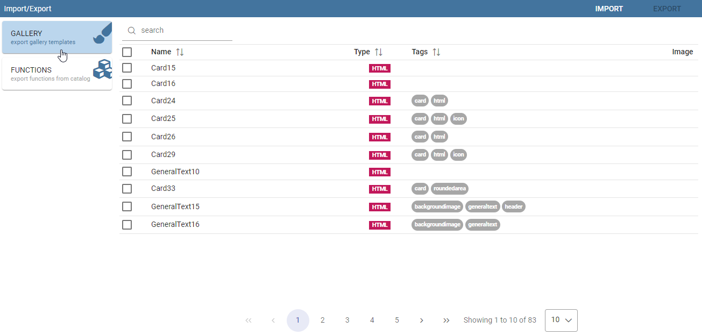
    
    Gallery Export

You are able to select interested elements to export. Is it possible to choose a subset or all and/or a mix between widgets and functions:

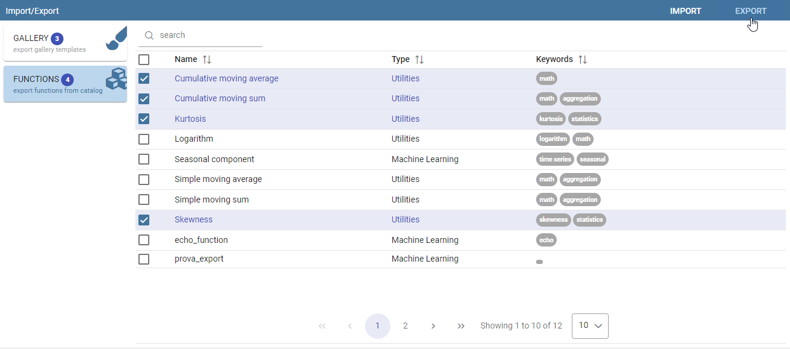
    
    Gallery Export - Items selection

After the selection, is just necessary set a name for the export file and the operation will done.

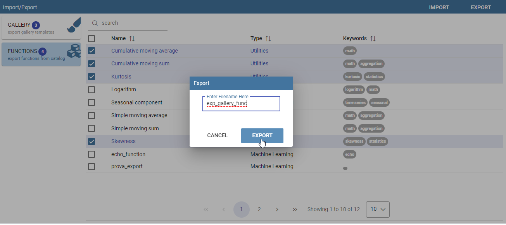
    
    Gallery Export - setting name for zip file

**Import Gallery**

To use the import functionality is necessary to select the IMPORT button on the toolbar. A new popup window is so opened to choose the exported zip file obtained previously:

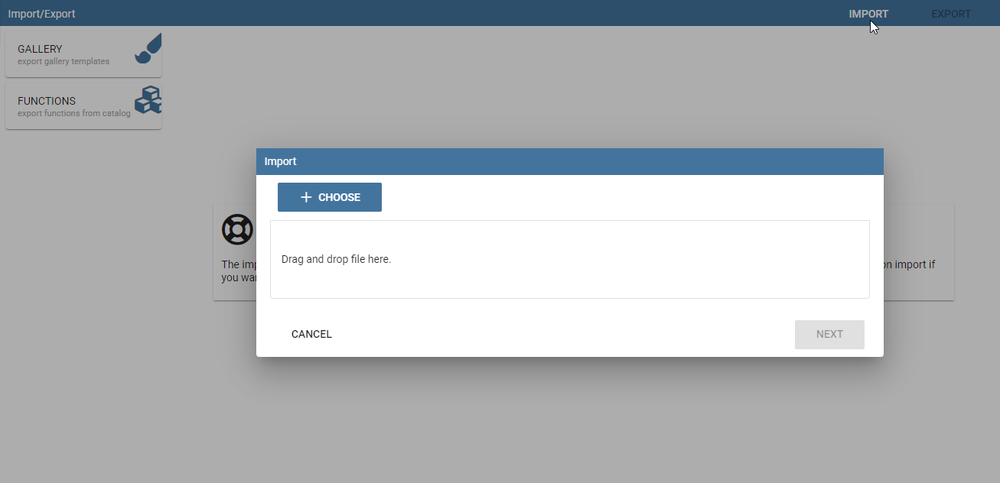

    Gallery Import - Export file selection #1


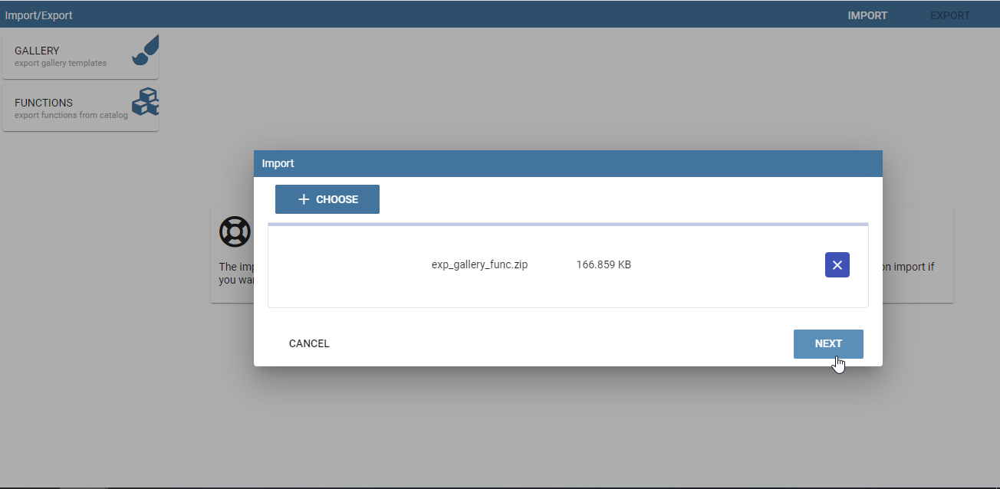

    Gallery Import - Export file selection #2

At this point, selecting the NEXT button is possible review all elements available and choose which of them you want really import in the target Knowage environment:

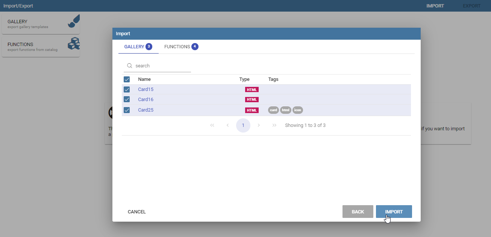

    Gallery Import - items selection

  
For last, is necessary click on the IMPORT button to start the real import activity.

At this point, widgets and functions will be available too in the target environment as you can see directly opening their specific guis:

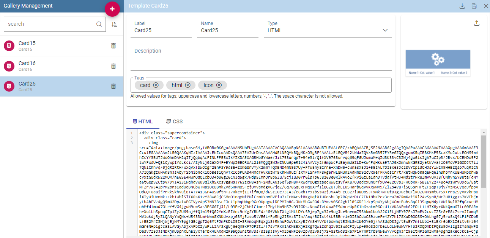

    Gallery Management Gui
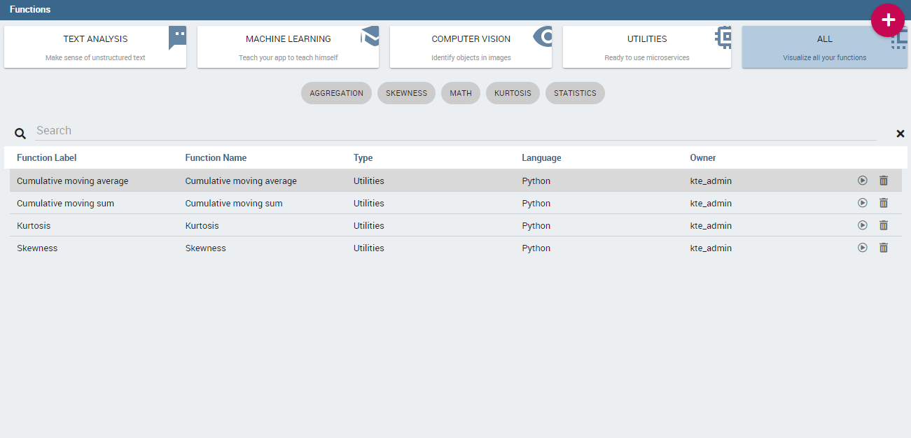

    Functions Management Gui


Documents
```

Esta función le permite crear y descargar una .zip de la totalidad o una parte de los documentos existentes en su instalación de Knowage. De esta manera puedes subirlo en otra instalación o guardarlo como copia de seguridad.

Al importar, se crean todos los "objetos" asociados a esos documentos (como conjuntos de datos, lovs, controladores, roles y carpetas). En cambio, los usuarios, las configuraciones de menú, KPI, catálogo, glosario y alerta no se exportan con esta herramienta.

Echemos un vistazo a los pasos para crear el .zip.

A continuación mostramos el editor de exportación.

.. figure:: media/image67.png

    Document Export

En primer lugar, elija el nombre que desea dar a su exportación (es decir, si elige MyFirstExport, creará el `MyFirstExport.zip`).

A continuación, seleccione los documentos que desea exportar. Puede examinar la carpeta haciendo clic en el icono de carpeta. Elija los elementos o carpetas que desea incluir marcando la casilla de verificación relacionada. Una verificación en una carpeta principal seleccionará / anulará automáticamente la selección de todas sus carpetas / hojas secundarias.

Cuando haya elegido un nombre y seleccionado algunos documentos, el icono de exportación cambiará de color de gris a rosa. Esto significa que todos los elementos están configurados para comenzar a exportar.

Antes de continuar decide si quieres exportar **Vista personalizada de Olap** y/o **Documentos programados** y/o **Traducción BIRT** y/o **Programar configuraciones** y/o **Documentar sólo en la funcionalidad seleccionada**.

*   **Vista personalizada de Olap**
    Al comprobar esta propiedad, la exportación incluirá todas las vistas personalizadas guardadas en los documentos OLAP elegidos. Puede encontrar la Vista personalizada en el menú del documento OLAP y hacer clic en *Mostrar vista personalizada OLAP*. Vea la siguiente figura:

.. figure:: media/OCW.PNG

    Olap customized view

*   **Documentos programados**
    Comprobando esta propiedad, la exportación incluirá toda la ejecución programada guardada en los documentos elegidos. Puede encontrar la ejecución programada en el menú del documento y haciendo clic en *Mostrar ejecución programada*. Vea la siguiente figura:

.. figure:: media/SDOC.png

    Scheduled documents

*   **Traducción BIRT**
    Al comprobar esta propiedad, la exportación incluirá toda la traducción agregada a las funcionalidades de 'Localización' de las plantillas BIRT.
*   **Programar configuraciones**
    Comprobando esta propiedad la exportación incluirá toda la programación asociada a los documentos elegidos. Al final de la importación, debe tener la programación guardada en la sección Programador en el área Herramientas.
*   **Exportar el documento sólo en la funcionalidad seleccionada**
    Al comprobar esta propiedad, la exportación incluirá documentos solo si están dentro de una funcionalidad seleccionada.
*   **Documentos relacionados**
    Comprobando esta propiedad la exportación incluirá documentos enlazados por navegación cruzada a los seleccionados.

Ahora está listo para hacer clic en el icono de exportación para generar y descargar el .zip.
Supongamos que desea cargar MyFirstExport.zip en otra instalación. Inicie sesión y muévase a **Administrador del servidor** > **Importar\Exportar documentos** área Cambie al **Importación** y haga clic en **Hojear** para acceder a sus carpetas personales. En la siguiente figura mostramos la interfaz de importación de documentos.

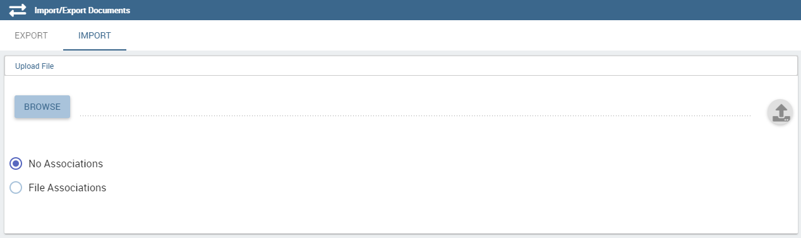

    Document Import

Elija el .zip obtenido en el **Exportar** y haga clic en el icono de importación. Pocos pasos lo guían a través de la importación.
Se le pedirá que asigne de origen a destino: roles, motores, orígenes de datos y metadatos.

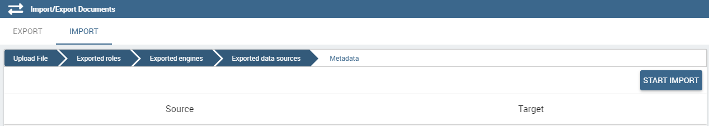

Asistente para importación de documentos

Si un rol no asigna ninguno de los existentes en el de destino, se creará. **Preste atención antes de iniciar la importación porque los metadatos de destino se sobrescribirán**: documentos, lov, controlador, etc. que tiene la misma etiqueta de los exportados tendrá metadatos sobrescritos al final del procedimiento de importación. Después de haber comprobado cuidadosamente, puede iniciar el procedimiento de importación haciendo clic en "*INICIAR IMPORTACIÓN*"

*Faltan licencias*
Si una o más licencias no son válidas o faltan, durante el procedimiento de exportación se le informará con una alerta. Los documentos relacionados no se pueden exportar ni se exportarán.

.. figure:: media/image113.png

Exportación de documentos Licencias faltantes

Las licencias también se comprueban durante el procedimiento de importación y, si faltan uno o más o no son válidos, no se importarán los documentos relacionados. Estos documentos se enumerarán en la última fase antes del inicio del procedimiento de importación y para cada uno se mostrará la licencia no válida o faltante.

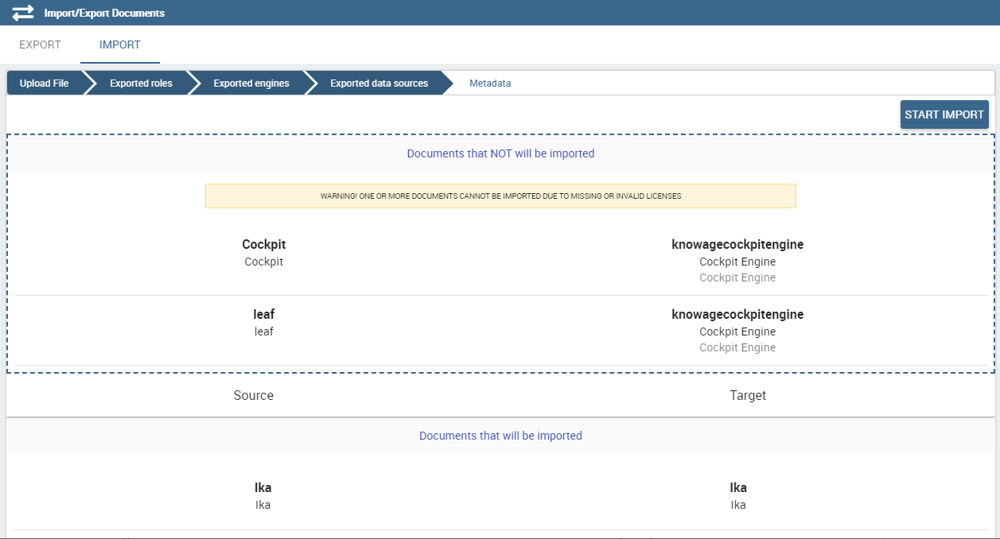

Importación de documentos Licencias faltantes

Menú

```

This feature let you export the menu structure.

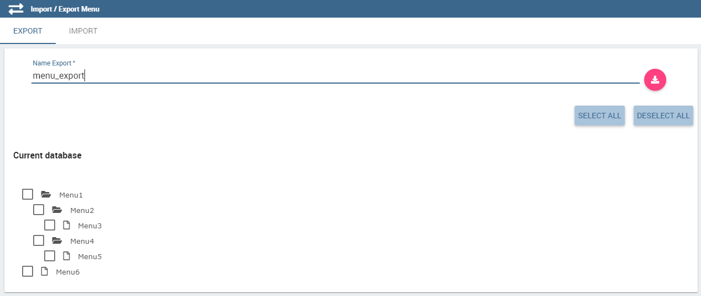

    Menu Export

To start the export you need only to insert the Export name. Once inserted the name, the export icon changes color from grey to pink to let you understand all mandatory fields to start the export were filled. Click on this icon and the related .zip is downloaded.

To upload it in another installation, accede to the **Import\\Export** Menu area and switch to the tab **import**. Here click on **Browse** to search in your folders the .zip previously created, see the following Figure.

.. figure:: media/image72.png

    Menu Import

After clicking on "*START IMPORT*" menu items which match with existing ones will be override by the exported ones and menu items which don’t match with the existing ones will be added. You are asked to map roles from source to target. If a role doesn’t map any of the existing in the target one, it will be created.

.. figure:: media/image111.png

   Menu Import Wizard

In the first step of import procedure you'll see source-target comparison. In particular source tree contains menu that are in the package you are importing and target tree contains the menu already present in the target system.

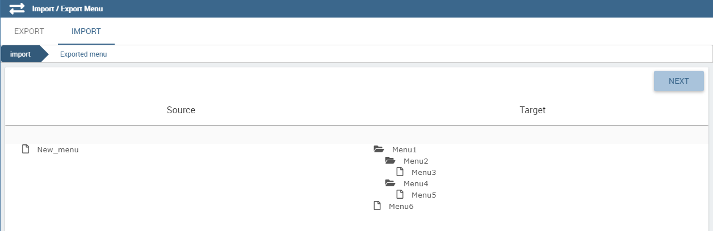

   Menu Import Wizard Tree comparison

Users
```

En esta área puede exportar los usuarios de una instalación a otra, consulte la siguiente figura.

.. figure:: media/image73.png

    User Export

Para generar el .zip hay que marcar el usuario a incluir en la exportación e insertar un nombre de exportación. Guarde la exportación en las carpetas de su PC y muévase a la otra instalación. Tiene la oportunidad de incluir la carpeta personal de los usuarios elegidos en la Exportación. Poner una marca en el **Exportar carpeta personal** y elija si desea incluir instantáneas y subvistas también.

Para importar el .zip en otra instalación, inicie sesión y abra el **Administrador del servidor** > **Importar\Exportar usuarios**, cambiar a **Importación** área. Aquí haga clic en **Hojear** para elegir el .zip creado por exportación. Luego haga clic en el icono de importación. Los usuarios contenidos en el archivo se cargan y los catálogos se muestran en el lado izquierdo de la pantalla. Elige entre los usuarios que se muestran el que quieres importar, márcalos y haz clic en la flecha para moverlos por el otro lado. Ahora haga clic en **Iniciar importación** y los usuarios también se crean correctamente en esta instalación. Preste atención al marcar la casilla de verificación carpeta personal si desea que se importen carpetas personales. En la siguiente figura puedes ver **Importación de usuarios** interfaz.

.. figure:: media/image74.png

    User Import

.. importante::

    All users involved into import procedure will have his password changed with the value set in advanced configuration.

Catálogos

```

In this area you can export the different catalogs (such as datasets catalogs, business models catalogs and so on) from one installation to another, see the following Figure.

.. figure:: media/image75.png

    Catalogs Export

To generate the .zip you have to mark the elements to include in the export and insert an export name. Save the export somewhere in your local system and move to the other installation. You have the chance to include the personal folder of the chosen users in the Export. Put a mark in the **Export Personal folder** checkbox and choose if you want to include snapshots and subviews too.

To import the .zip in another instance, log in and open the **Server Manager** > **Import\\ Export Catalogs**, switching to **Import** area. Here click **Browse** to choose the .zip created through exportation. Uploading the file, the available exported catalogs are displayed in the bottom area. Selecting a catalogs (for instance, the **Dataset** one), all the catalogs exported elements are displayed in the left side of the screen. Choose the ones that you want to import, decide if you want to override or to just add the missing ones and then click **Start import**. Your catalogs are successfully created in this environment. In Figure below you can see **User Import** interface.

.. figure:: media/image76.png

    Catalogs Import

KPIs
~~~~

In this section we describe how to manage the import/export of KPIs between two tenants.

The user must enter Knowage as administrator of source tenant and click on **Import/Export KPIs** from Server Manager menu panel.

.. figure:: media/image77.png

    KPIs Import/Export from menu

The page contains the **Export** and the **Import** tab, where the user can select the KPIs for the export/import respectively.

.. figure:: media/image78.png

    KPIs Import window

Let’s start from the export feature. The user must check the KPIs for the export using the tab interface. He/she can add some more functionalities to the export action, namely:

- to include targets,
- to include those scorecards related to the selected KPIs,
- to include schedulations.

Finally click on the red download button to get a zipped folder that will be used to conclude the export.

.. figure:: media/image79.png

    Start export button

Once the .zip file is downloaded, the user has to switch tenant (the one on which he/she wants to do the import). As admin of the destination tenant, enter the Import/Export KPIs functionality and move to the Import tab.

The user must therefore browse the personal folder to catch the zipped folder and click on the red upload button just aside, as shown in the following figure.

.. figure:: media/image82.png

    Import tab

Referring to the following image, the user has to specify if:

-  to overwrite the existing KPIs and their related formulas
-  to import targets,
-  to import scorecards,
-  to import schedulations.

.. figure:: media/image83.png

    Import KPIs settings

Once the import is started, the GUI leads the user to finalize the import procedure. In particular, the user is asked to map data sources correctly (Figure below).

.. figure:: media/image84.png

    Mapping data sources

The process ends successfully when the wizard shows up as following.

.. figure:: media/image85.png

    Import KPIs ended successfully

Analytical Drivers
```

Esta opción permite importar/exportar los controladores analíticos y su LOV relacionado.

.. figure:: media/image86.png

    Import/Export of analytical drivers

Como se muestra en la figura anterior, la ventana contiene la pestaña Exportar e Importar. Utilice la ficha Exportar para descargar el archivo de .zip que se utilizará en el proceso de importación.

Para producir un archivo de este tipo, el usuario debe iniciar sesión como administrador del tentant de origen. Luego tiene que asignar un nombre a la exportación, verificar los controladores analíticos de interés y hacer clic en el botón rojo de descarga disponible en la esquina superior derecha de la página. Tenga en cuenta que es posible adelgazar la investigación de los controladores analíticos filtrando sus datos de creación.

Cambie de inquilino e inicie sesión como administrador. Utilice la pestaña Importar para cargar la carpeta comprimida y finalizar la importación.

Utilice la GUI para cargar la carpeta comprimida, para especificar si desea sobrescribir en los controladores analíticos existentes o agregar los que faltan. Luego haga clic en siguiente y continúe asignando roles entre inquilinos y fuentes de datos.

.. figure:: media/image87.png

    Import of analytical drivers

.. figure:: media/image88.png

    Import of analytical drivers

.. figure:: media/image89.png

    Import of analytical drivers

El proceso termina con un mensaje que contiene la información sobre la importación.

Glosario

```

The export/import of glossary allows the user to align glossaries among tenants.

.. figure:: media/image90.png

    Export/Import of glossaries window

There are the two tabs of Export and Import. The user is asked to select the glossaries to export and to type a name that will be assigned to the zipped folder. The user can help himself/herself by using the filter on data (of creation of the glossary).

Once the user has got the zipped folder he/she must switch tenant and enter as its admin. Then select the import tab from the Export/Import main window.

.. figure:: media/image91.png

    Import of glossaries

The user must use the arrows to indicate the glossaries he/she wants to import in the target tenant. No further information are needed to end the process. Then the user has to enter the target tenant as administrator and use the import tab to finalize the import.

Catalog
```

Esta funcionalidad permite Exportar/Importar los siguientes elementos

*   Conjuntos de datos,
*   Modelos de negocio,
*   Catálogos Mondrian,
*   Capas
*   Archivos SVG.

Los pasos para realizar la Exportación/Importación son iguales a los vistos en las secciones anteriores. Es decir, el usuario tiene que entrar en el **Catálogo de importación/exportación** del panel de menús del Administrador del servidor. La ventana contendrá las pestañas Importar y Exportar. La ficha exportar se utiliza para producir la carpeta zip que se va a importar en el inquilino de interés. Tenga en cuenta que el usuario puede aplicar un filtro temporal para ayudarle a buscar elementos en la lista.

.. figure:: media/image92.png

    Import of catalog

La importación requiere que se cargue la carpeta comprimida, que se comprueben los elementos que se van a importar, que se asignen roles entre inquilinos y que se asignen orígenes de datos.
