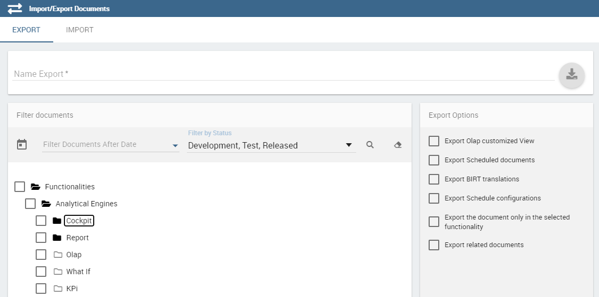

Server Manager
==============

.. important::
         **Enterprise Edition only**

         All the functionalities shipped within the Server Manager are available only with Knowage Enterprise Edition

In the **Server Manager** menu panel you find some management functionalities.
   
.. figure:: media/image60_bis.png

    Server Manager Panel

Those about **Import/Export** let you export some configurations or elements from one istallation to another. This can be helpful for example in managing a test and a production areas. We are going to give the full description of these funtionalities in the following.

Tenants Management
------------------

We start this section underlining that only those users who have the superadmin role can use this functionality. **Tenants Management** is available only for users who possess the Knowage Enterprise Reporting (ER) license. A **tenant** is generally a user who can or cannot employ specific product types or access some (or all) datasources inside the same environment. Then, this functionality allows you to create new tenants or manage old ones. 

.. figure:: media/image61.png

    Tenants Management window.

In the image above, on the left you have the list of existing tenants. On the top of such list it is available the **Search** box to help users to browse the tenants. When clicking on the “Plus” icon you can create a new tenant. A form opens on the right area. Insert a **Name** and a **Theme**. Then change tabs to set product types access and select which datasources are achievable.

.. figure:: media/image6465.PNG

    Product types tab (Left) Datasources tab (Right).

Note that, in a single-tentant environment admin and superadmin coincides. In a multitenants environment (developed then through the Server Manager functionality), only *one* user has the superadmin role for each tenant, while there can be one or more users with admin role. In particular compared to the admin case, the superadmin has the possibility to manage the multi-tenancy. Moreover, he is the only one who can configure the JNDI datasources and access the cache configuration (through the cache manager menu item).

Template Management
-------------------

Each Knowage document is associated to a *template*. The template defines the standard layout of a document, including specific information on its appearance and the way contents should be displayed. Templates can be encoded by hand or using Knowage Studio designers, when available. For each analytical document the history of templates is maintained. Old templates can be restored if needed. A new version is saved at each deployment, either manual or from Knowage Studio.

The **Template Management** let you choose a starting date before which delete the templates versions. This could be very useful because it allows the administrator to clean the environment and save space in Knowage metadata database once a document life cycle is completed.

First of all you are asked to insert a date by clicking on the calendar icon. Then click the magnifier icon and select the documents you are interested in. The list displayed contains only documents created before the selected date. Clicking the trash icon you delete the template of the selected documents which were uploaded before the chosen date. If all the templates of a document precede the chosen date, the last template uploaded will be kept, so that no document is deleted accidentally. We sum up the steps described in Figure below.

.. figure:: media/image66.png

    Deleting templates

Import\\Export
--------------

These options are about Import\\Export of Documents, Menu, Users, KPIs and Catalogs. Let’s focus on each of these features.

Documents
~~~~~~~~~

This feature let you create and download a .zip of whole or a part of the documents existing in your Knowage installation. In this way you can upload it in another installation or keep it as backup.

When you import, all the “objects” associated to those documents (such as datasets, lovs, drivers, roles and folders) are created. Instead users, menu configurations, KPI, catalog, glossary and alert are not exported with this tool.

Let’s have a look on the steps to create the .zip.

Below we show the export editor.

    Document Export
   
First of all choose the name to give to your exportation (i.e. if you choose MyFirstExport, you will create the ``MyFirstExport.zip``).

Then select which documents do you want to export. You can browse the folder by clicking the folder icon. Choose the elements or folders you want to include by marking the related checkbox. A check in a parent folder will automatically select/deselect all its childer folders/leaves.

When you have chose a name and select some documents the export icon change colour from gray to pink. This means all elements are set to start exporting. Before going on decide if you want to export **Olap customized View** and/or **Scheduled documents** and/or **CrossNavigation** and/or **BIRT Translation** and/or **Schedule configurations** . 

- **Olap customized View**
   Clicking on this functionalities the export will include all the customized views saved into the chosen OLAP documents. You can find the Customized View going on the OLAP Document Menu and clicking on *Show OLAP custom View*. See the figure below:
   
.. figure:: media/OCW.PNG

    Olap customized view
   
- **Scheduled documents**
   Clicking on this functionalities the export will include all the scheduled execution saved into the chosen documents. You can find the scheduled execution going on the Document Menu and clicking on *Show Scheduled Execution*. See the figure below:
   
.. figure:: media/SDOC.png

    Scheduled documents
   
- **CrossNavigation**
   Clicking on this functionalities the export will include all the cross navigation associated to the chosen documents and the documents related to navigation.
- **BIRT Translation**
   Clicking on this functionalities the export will include all the translation added into 'Localization' functionalities of the BIRT templates. 
- **Schedule configurations**
   Clicking on this functionalities the export will include all the schedulation associated to the chosen documents. At the end of the import you must have the schedulation saved into Scheduler section under the Tools area.

Now you are ready to click on the export icon to generate and download the .zip.
Suppose you want to upload MyFirstExport.zip in another installation. Log in it and move to **Server Manager** > **Import\\Export Documents** area Switch to the **Import** tab and click on **Browse** to accede your personal folders. In Figure below we show the document import interface.

.. figure:: media/image68.png

    Document Import

Choose the .zip obtained from the **Export** phase and click on the import icon. Few steps guide you trought importation. You are asked to map from source to target: the Roles, the Engines and the Metadata. If a role doesn’t map any of the existing among the target one, it will be created. Please keep attention during the metadata step beacause you can choose to overwrite or don’t the target metadata. By default this option is set to false. If you change to yes documents, lov, driver, etc. which has the same label of the exported ones will have metadata overwritten at the end of import procedure.

Menu
~~~~~

This feature let you export the menu structure.

.. figure:: media/image71.png

    Menu Export

To start the export you need only to insert the Export name. Once inserted the name, the export icon changes colour from grey to pink to let you understand all mandatory fields to start the export were filled. Click on this icon and the related .zip is downloaded.

To upload it in another istallation, accede to the **Import\\Export** Menu area and switch to the tab **import**. Here click on **Browse** to search in your folders the .zip previously created, see the following Figure.

.. figure:: media/image72.png

    Menu Import

Then choose between the two import modes: **Override** and **Add Missing**. If you choose **Override**, the menu items which match with existing ones will be override by the imported. If you choose **Add missing** only the menu items which don’t match with the existing one will be added. You are ready to start importation by clicking on **Start Import**.

Users
~~~~~

In this area you can export the users from an installation to another, see the following Figure.

.. figure:: media/image73.png

    User Export

To generate the .zip you have to mark the user to include in the export and insert an export name. Save the export in the folders of your pc and move to the other installation. You have the chance to include the personal folder of the chosen users in the Export. Put a mark in the **Export Personal folder** checkbox and choose if you want to include snapshots and subviews too.

To import the .zip in another installation, log in and open the **Server Manager** > **Import\\Export Users**, switching to **Import** area. Here click on **Browse** to choose the .zip created by exportation. Then click on the import icon. The users contained in your file are uploaded and Catalogs displayed in the left side of the screen. Choose among the users displayed the one you want to import, mark them and click on the arrow to move them in the other side. Now click on **Start import** button and your users are successfully created in this installation too. Keep attention in marking personal folder checkbox if you want that personal folders are imported. In Figure below you can see **User Import** interface.

.. figure:: media/image74.png

    User Import

Catalogs
~~~~~~~~

In this area you can export the different catalogs (such as datasets catalogs, business models catalogs and so on) from one installation to another, see the following Figure.

.. figure:: media/image75.png

    Catalogs Export

To generate the .zip you have to mark the elements to include in the export and insert an export name. Save the export somewhere in your local system and move to the other installation. You have the chance to include the personal folder of the chosen users in the Export. Put a mark in the **Export Personal folder** checkbox and choose if you want to include snapshots and subviews too.

To import the .zip in another instance, log in and open the **Server Manager** > **Import\\ Export Catalogs**, switching to **Import** area. Here click **Browse** to choose the .zip created through exportation. Uploading the file, the available exported catalogs are displayed in the bottom area. Selecting a catalogs (for instance, the **Dataset** one), all the catalogs exported elements are displayed in the left side of the screen. Choose the ones that you want to import, decide if you want to override or to just add the missing ones and then click **Start import**. Your catalogs are successfully created in this environment. In Figure below you can see **User Import** interface.

.. figure:: media/image76.png

    Catalogs Import
   
KPIs
~~~~

In this section we describe how to manage the import/export of KPIs between two tenants.

The user must enter Knowage as administrator of source tenant and click on **Import/Export KPIs** from Server Manager menu panel.

.. figure:: media/image77.png

    KPIs Import/Export from menu

The page contains the **Export** and the **Import** tab, where the user can select the KPIs for the export/import respectively.

.. figure:: media/image78.png

    KPIs Import window

Let’s start from the export feature. The user must check the KPIs for the export using the tab interface. He/she can add some more functionalities to the export action, namely:

- to include targets,
- to include those scorecards related to the selected KPIs,
- to include schedulations.

Finally click on the red download button to get a zipped folder that will be used to conclude the export.

.. figure:: media/image79.png

    Start export button

Once the .zip file is downloaded, the user has to switch tenant (the one on which he/she wants to do the import). As admin of the destination tenant, enter the Import/Export KPIs functionality and move to the Import tab.

The user must therefore browse the personal folder to catch the zipped folder and click on the red upload button just aside, as shown in the following figure.

.. figure:: media/image82.png

    Import tab

Referring to the following image, the user has to specify if:

-  to overwrite the existing KPIs and their related formulas
-  to import targets,
-  to import scorecards,
-  to import schedulations.

.. figure:: media/image83.png

    Import KPIs settings

Once the import is started, the GUI leads the user to finalise the import procedure. In particular, the user is asked to map data sources correctly (Figure below).

.. figure:: media/image84.png

    Mapping data sources

The process ends successfully when the wizard shows up as following.

.. figure:: media/image85.png

    Import KPIs ended successfully

Analytical Drivers
~~~~~~~~~~~~~~~~~~~~

This option allows to import/export the analytical drivers and their related LOV.

.. figure:: media/image86.png

    Import/Export of analytical drivers 
   
As shown in Figure anowe, the window contains the Export and the Import tab. Use the Export tab to download the .zip file to be used in the import process.

To produce suce a file, the user has to log in as administrator of the source tentant. Then he has to assign a name to the export, check the analytical drivers of interest and click on the red download button available at the top right corner of the page. Note that it is possible to slim down the research of the analytical drivers by filtering on their data of creation.

Switch tenant and log in as administrator. Use the Import tab to upload the zipped folder and finalise the import.

Use the GUI to upload the zipped folder, to specify if to overwrite on the existind analytical drivers or add missing. Then click on next and continue by mapping roles among tenants and data sources.

.. figure:: media/image87.png

    Import of analytical drivers

.. figure:: media/image88.png

    Import of analytical drivers

.. figure:: media/image89.png

    Import of analytical drivers

The process ends with a message containing the information about the import.

Glossary
~~~~~~~~

The export/import of glossary allows the user to allign glossaries among tenants.

.. figure:: media/image90.png

    Export/Import of glossaries window

There are the two tabs of Export and Import. The user is asked to select the glossaries to export and to type a name that will be assigned to the zipped folder. The user can help himself/herself by using the filter on data (of creation of the glossary).

Once the user has got the zipped folder he/she must switch tenant and enter as its admin. Then select the import tab from the Export/Import main window.

.. figure:: media/image91.png

    Import of glossaries

The user must use the arrows to indicate the glossaries he/she wants to import in the target tenant. No further information are needed to end the process. Then the user has to enter the target tenant as administrator and use the import tab to finalise the import.

Catalog
~~~~~~~~

This functionality allows to Export/Import the following elements

-  Data sets,
-  Business models,
-  Mondrian catalogs,
-  Layers,
-  SVG files.

The steps to perform the Export/Import are equal to those seen in the previous sections. Namely, the user has to enter the **Import/Export catalog** menu item from Server Manager menu panel. The window will contain the Import and Export tabs. The export tab is used to produce the zip folder to be imported in the tenant of interest. Note that the user can apply a temporal filter to help him/her to look up elements in the list.

.. figure:: media/image92.png

    Import of catalog

The import requires the zipped folder to be uploaded, to check the elements to import, to map roles among tenants and to map datasources.
