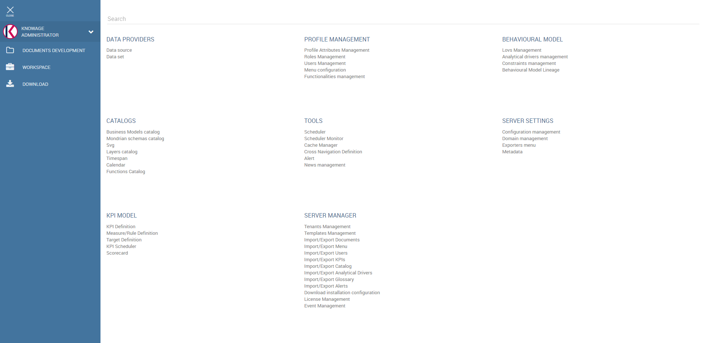
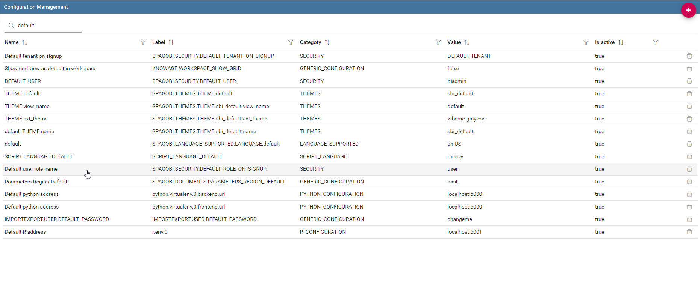
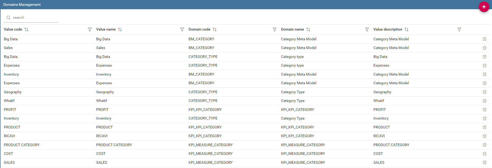
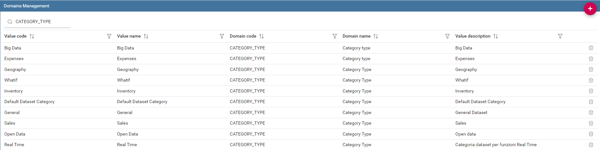

Server Settings
===============

In this chapter we describe all functionalities available in Server Settings panel of the Administrator Menu shown below.

   Server Settings Panel.

Similar editors give you access to configurations and domains. We are going to provide an example of both cases to let you understand how thier management works. A complete overview of metadata creation, editing and management conclude this chapter.

Configuration Management
-------------------------

By clicking on the **Server Settings** > **Configuration Management**, you can manage many configuration elements. For example here you can set default language as well as mail settings. Start typing ``DEFAULT`` in the search form, as shown below, to filter among available items and find what you are interested it.

   Configuration categories list.

We provide an example to let you understand the usage of the interface. Suppose you want to set italian as default language. Select the row with ``SPAGOBI.LANGUAGE_SUPPORTED.LANGUAGE``. default as label and click the pencil icon at the end of the row to edit the element. Insert ``it,IT`` as **Value Check** as click **Save**.

You can view available languages and their code (**Value Check column)** in the row SPAGOBI.LANGUAGE_SUPPORTED.LANGUAGES.

Domain Management
-----------------

By clicking on **Domains Management** item menu, you can manage categories. In the figure below we show Domain Management editor. You can add for example new categories for a business model, for a dataset and for all domain you can see in the **Domain name column**.

   Domain management editor.

We provide an example to describe how it works. Suppose you want to add a new category among the datasets, named “Costs”. Below you can see the categories already existing.

   Business Model Categories already existing.

Click on the plus red button in the top right corner and by default a new page opens with the form you need to fill in. An example is shown in Figure below. Fill the columns as follow:

.. figure:: media/image97.png

   Form to be filled to create a new category.

-  **Value code**: Costs
-  **Value name_image**: Costs
-  **Domain code**: CATEGORY_TYPE
-  **Domain name_image**: Costs Datasets
-  **Value description**: Costs Datasets

All the values except the **Domain code** to you. the last are mandatory for correct configuration. Now Click on Save. You have successfully create your new dataset category.

You can also modify an existing domain by selecting its dedicated row and clicking the edit button.

Metadata
--------

Knowage offers the possibility to define metadata categories and then give them a value for each analytical document and for each subobject.

In the metadata page, shown below, you can see the list of existing metadata. Here you can also define a new metadata using the dedicated button.

.. figure:: media/image98.png

   List of existing metadata.

You define a new metadata by giving it a **Label**, a **Name**, a **Description** and a **Type**. The **Label** is a unique identifier, the **Name** is what will be shown to the end user and the **Type** can be either ``SHORT TEXT`` or ``LONG TEXT``.

We recall that metadata visibility is one of the authorization you can set while creating roles. Only the users associated to roles which have this authorization will view metadata. In addition, in order to edit metadata the user roles need to have another authorization called **Save Metadata**.
