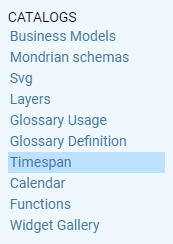
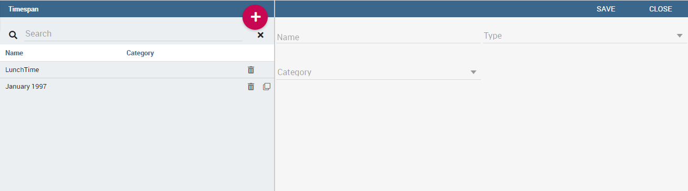
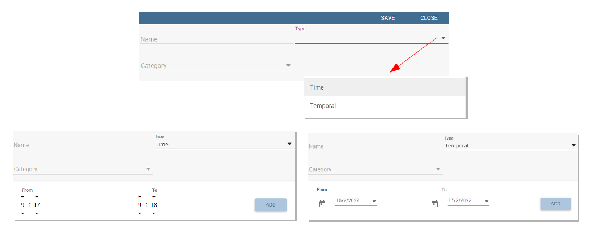
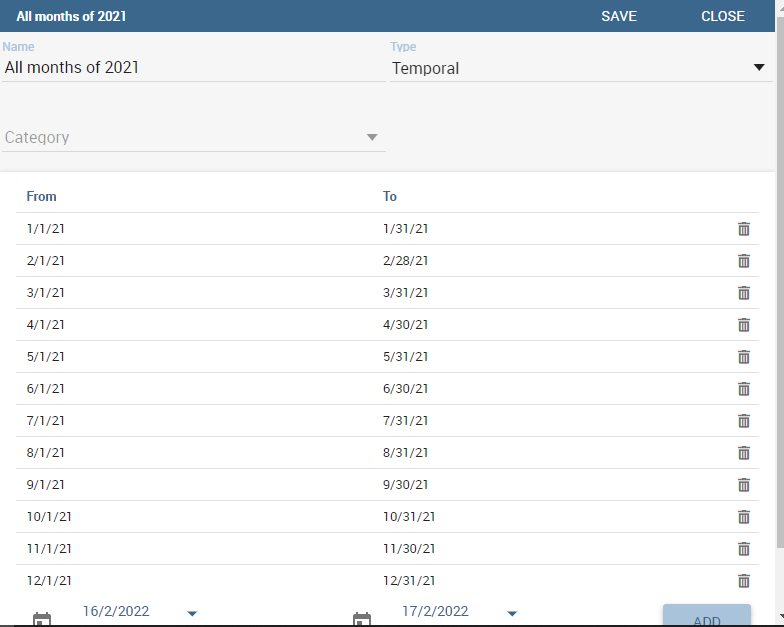

Timespan
========

Most of times a technical user develops a business solution for the use and consumption of a third not-skilled end user. In the contest of self-service capability of Knowage, when business models are available for allowing the end users to query data, it is possible to arrange time or temporal intervals so that end users can use those time periods to filter data when using the QbE interface.

Create a new Timespan
---------------------

The Timespan functionality is available under the Catalog section of Knowage main menu. 

   Timespan

When clicking on menu item "Timespan", Knowage redirects the user to the list of periods, if any was already set. It is possible to open an existing timespan simply clicking on the item from the list, to seach for one using the search box, to delete one item or clone it. THe delete and clone button are available aside the timespan item name.

   Timespan list page
   
To configure a new period the user must click on the red plus icon on the top right corner of Timespan list area. After clicking on the button the half right part of the page will display the form to fill in all necessary information. 

In particular, the technical user is asked to assign a name to the new timespan, to specify if it is a time or temporal type period. To associate a category for profiling issues and finally to define the start and the end time or the start and end date, if it is a time or temporal timespan respectively, as we can see in Figure below. 

   Time and temporal type
 
In both cases, the technical user defines the start and the end of the interval and then clicks on the add button to insert it. remember to clcik on the save button to validte the settings. Note that it is possible, for each type, to add more than one interval.  

   Adding more than one temporal intervals in one timespan
 
Once that intervals have been defined they can be used inside the QbE interface to filter time or temportal attributes. For this part we refer to the Free Inquiry chapter, in particular the Filter paragraph.
   

