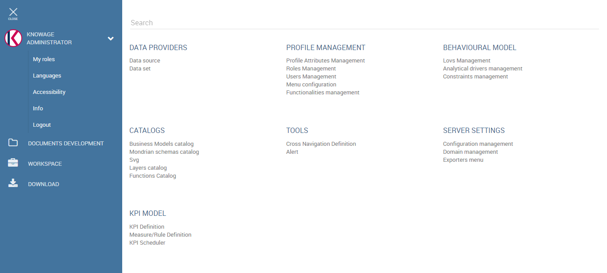

User Interface
================

This chapter focuses on Knowage user interface, providing detailed information on the Main Menu.

Main menu
-----------------

Knowage menu gives you access to all its functionalities. By default you find the menu button at the left bottom corner of the home page, click it to open the menu.

   Home page

You can minimize it by clicking somewhere else outside the menu. In this way the menu button appears and you can reopen the menu according to your needs. You can move this button around the page by dragging and dropping it. Choose the position that best fits with your work.

Knowage main menu is divided in three submenus: the user menu, the BI functionalities menu and the administrator one. The left panel contains the user menu, which is collapsed, and the BI functionalities menu, while the administrator menu is on the right panel.

   Menu

The user menu (see below) is identified with the first icon in Table above and a label containing your user name. Opening the user menu you have the following extra buttons:

- **Select role** If your user is associated with more than one role, Knowage requests you to specify the default one. You can select it when executing a document, or right after authentication by clicking on this icon and choosing a default role.
- **Languages** To select the language of Knowage environment.
- **Info** To view the details of current Knowage version.
- **Log out** To go back to log in page.

.. table:: Menu components - User menu
   :widths: auto
    
   +--------------------------------+-----------------------+-----------------------+
   |    Icon                        | Name                  | Description           |
   +================================+=======================+=======================+
   | .. figure:: media/image11.png  | Knowage user          | It opens a hidden     |
   |                                |                       | menu with extra       |
   |                                |                       | functionalities.      |
   +--------------------------------+-----------------------+-----------------------+
   | .. figure:: media/image12.png  | Select role           | To select the default |
   |                                |                       | role (available if    |
   |                                |                       | the user is           |
   |                                |                       | associated to more    |
   |                                |                       | than one role).       |
   +--------------------------------+-----------------------+-----------------------+
   | .. figure:: media/image13.png  | Languages             | Language options.     |
   +--------------------------------+-----------------------+-----------------------+
   | .. figure:: media/image14.png  | Info                  | Info on Knowage       |
   |                                |                       | version.              |
   +--------------------------------+-----------------------+-----------------------+
   | .. figure:: media/image15.png  | Log out               | log out.              |
   +--------------------------------+-----------------------+-----------------------+

The BI functionalities menu consists in a set of icons associated with basic features:

- **Documents development** This is a standard functionality of Knowage Server. It enables you to create the analytical document as well as access and execute them.
- **Workspace** From this section you can access the **Models** and create datasets and federations.

.. table:: Menu components - BI Functionalities Menu.
   :widths: auto

   +-------------------------------+-----------------------+-----------------------+
   |    Icon                       | Name                  | Description           |
   +===============================+=======================+=======================+
   | .. figure:: media/image16.png | Documents development | Document creation and |
   |                               |                       | acces to the archive  |
   |                               |                       | folders.              |
   +-------------------------------+-----------------------+-----------------------+
   | .. figure:: media/image17.png | Workspace             | Inquiry your business |
   |                               |                       | models, navigate and  |
   |                               |                       | create your datasets  |
   +-------------------------------+-----------------------+-----------------------+

The administrator menu is divided in subpanels which maps the different managing areas:

- **Data Providers** Here you can set and manage Data Sources.
- **Profile Management** In this panel you can organize the users profilation, authorizations and attributes, but also organize the Analitycal model. It means you can create/manage Roles, Users and Attributes as well as configure the functionality tree and the menu, i.e. the list of quick access link to analytcal document or other resources provided to the users.
- **Behavioural model** Here you manage all the Behavioural model, which means create analytical drivers and lov. In this area you can access the contraints configuration too.
- **Catalogs** In this area you manage different catalogs, that may vary from product to product: the **Business Model** catalogues used for QbE; the **Layer Catalogs** for the creation of GIS analitycal documents and so on.
- **Tools** In this area you can access the different scheduler options.
- **Server Settings** In this panel you have access to all server settings configuration options, such as configuration or domain management.
- **Server Manager** This is an optional package. It gives you access to different server functionalities, such as template management and all the import/export features.

.. table:: Menu components - Administrator Menu.
   :widths: auto

   +-----------------------+-----------------------+-----------------------+
   |    Icon               | Name                  | Management areas      |
   +=======================+=======================+=======================+
   |    |image27|          | Data Providers        | Data source settings. |
   +-----------------------+-----------------------+-----------------------+
   |    |image28|          | Profile               | Profile Attributes,   |
   |                       | Management            | Roles, User and Menu  |
   |                       |                       | configuration         |
   +-----------------------+-----------------------+-----------------------+
   |    |image29|          | Behavioural model     | Lovs, Analytical      |
   |                       |                       | Driver and Contraints |
   +-----------------------+-----------------------+-----------------------+
   |    |image30|          | Catalogs              | Business Models and   |
   |                       |                       | Layers                |
   +-----------------------+-----------------------+-----------------------+
   |    |image31|          | Tools                 | Scheduler             |
   +-----------------------+-----------------------+-----------------------+
   |    |image32|          | Server Settings       | User Data Properties, |
   |                       |                       | Configuration,        |
   |                       |                       | Domains and Metadata  |
   +-----------------------+-----------------------+-----------------------+
   |    |image33|          | Server Manager        | Template manager and  |
   |                       |                       | Import-Export         |
   |                       |                       | options               |
   +-----------------------+-----------------------+-----------------------+
