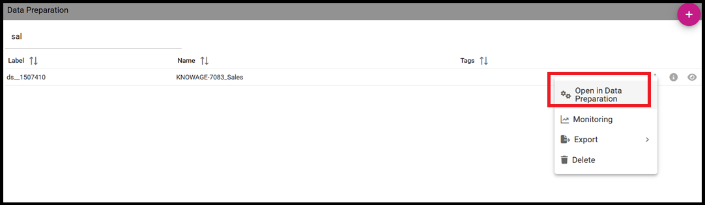
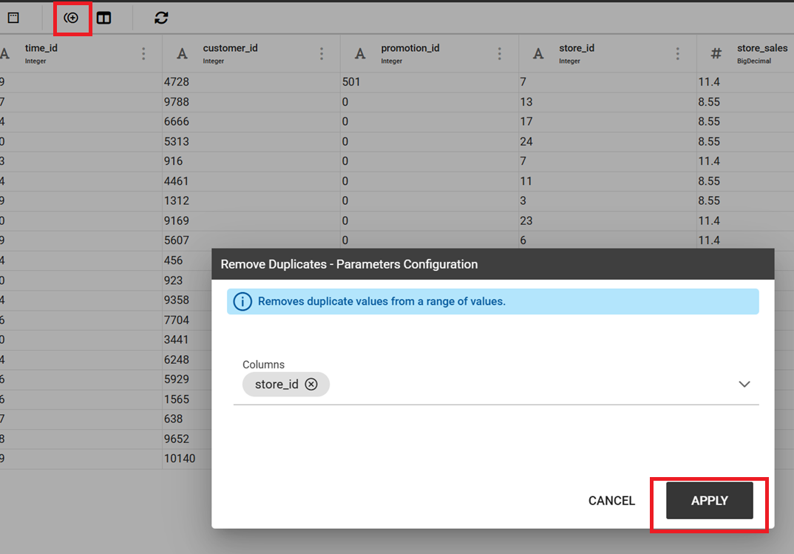
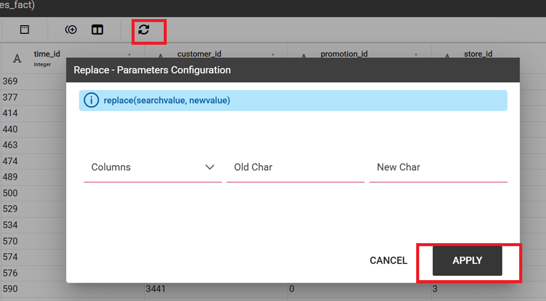
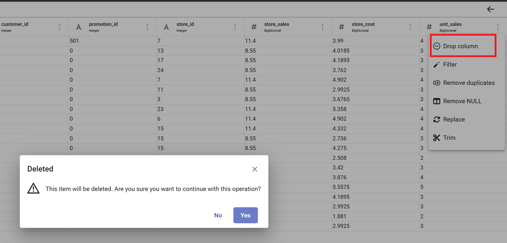
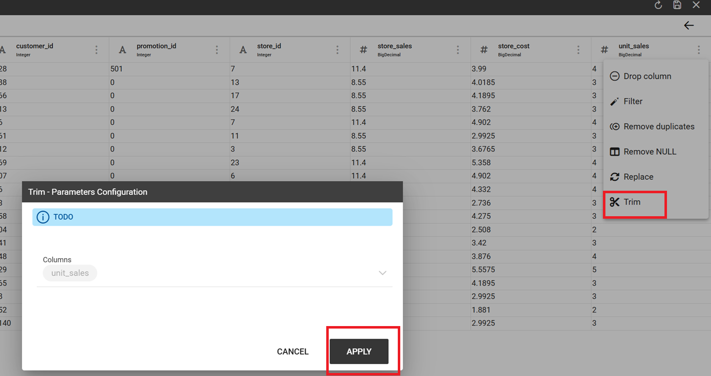
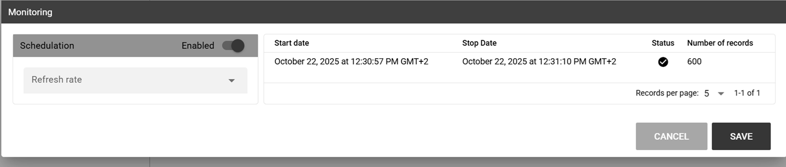

How to create a Data Preparation
========================================================================================================================

What is Data Preparation for?
------------------------------------------------------------------------------------------------------------------------

The **Data Preparation** is a functionality available since version 8.1 that allows the users to create a prepared dataset, starting from an existing one.
In this way users can apply transformations to a dataset to be used inside a dashboard or simply using it as another different dataset.
Users have the capability of creating complex and specific datasets quite easily and quickly, in order to use them for any purpose.

Preparing a dataset
------------------------------------------------------------------------------------------------------------------------

The first step is selecting a dataset to work on.
You can do it selecting the desired dataset into your workspace section:

    The Data Preparation entry.

There are two ways to prepare and start a data preparation process.
The first one is starting from *MyData* section.
By Clicking MyData and selecting the desired dataset whenever a data preparation has been formerly launched.

    Searching your dataset.

Afterwards, from the three dots menu select *Open Data Preparation*.

.. figure:: media/image5.png

    Open Data Preparation

*Opening the data preparation* triggers the process depicted below. The process consists of five steps

    Data preparation process

After completing the last step, the interface shows the structure of the dataset with the associated information.

    Data preparation wizard

As highlighted above, the wizard contains the *transformation* functionalities allowing to work on the data preparation.

The second way is clicking the *Plus* botton on the top right of the section in order to select the dataset.

    Creating a data preparation.

After clicking *Open* the data preparation process starts as depicted above and the final wizard with the data of the dataset is displayed.

Data Preparation Transformations
------------------------------------------------------------------------------------------------------------------------

You can apply transformations to the source dataset just picking the transformation action, step by step, until you reach the desired result.

In the main toolbar menu, there is a set of main transformations (most of them can be applied on many columns in the same time):

.. figure:: media/image33.png

    Transformations toolbar icons.

-   **Add column**: Adds a new column as a calculated field.
-   **Merge columns**: Adds a new column merging two selected ones.
-   **Split columns**: Adds two columns splitting a selected one.
-   **Filter**: Filters a selected column by math conditions (more info later on).
-   **Padding**: Adds characters on left or right side of a selected column.
-   **Remove duplicates**: Removes duplicates from selected columns.
-   **Remove null**: Removes null values from selected columns.
-   **Replace**: Replace selected values from specific columns.
-   **Trim**: Removes white spaces from specific columns. (Available for single column only)
-   **Drop**: Remove a specific columns. (Available for single column only)

The **Add column** transformation allow user to add a **calculated field** of type numeric, string or temporal.
These functions are a subset of Spark SQL language functions and are used for calculations or handling with data.
The available functions are a subset of the Spark SQL language functions.
For more info see https://spark.apache.org/docs/2.4.8/api/sql/index.html.

    Available functions

**Merge columns**: to add a new column by merging two selected columns through a separator.

    Merge columns dialog.

**Split columns**: to create two new columns by splitting a selected column through a specific condition (ie a character).

.. figure:: media/image11.png

    Split columns dialog.

**Filter**: to filter a selected column by special conditions.

    Applying filters

The image below shows how to remove a filter.

    Removing filters

As you can see the transformation applied by a filter is highlighted. In this example we only have one trasnformation related to the filter.

**Padding**: to add characters on left or right side of a selected column.

    Padding dialog example.

**Remove duplicates**: Removes duplicated values from a selected column.

    Remove duplicates dialog example.

**Remove null**: Removes null values from a selected column.

    Remove null dialog example.

**Replace**: Replace selected values from specific columns. Old char is the old value to be replaced.

    Replace dialog example.

From the three dots menu of a specific column two more transformations are available: **TRIM** and **DROP** transformations.

**Drop column**: Removes a specific column from table.

    Drop columns dialog warning.

**Trim column**: Removes white spaces from column.

    Trim column dialog example.

Data Preparation technical detail
------------------------------------------------------------------------------------------------------------------------

**What is an AVRO file?**

Avro is a data serialization system.

Avro is a data serialization framework developed within Apache's Hadoop project. It uses JSON for defining data types and protocols, and serializes data in a compact binary format.

Avro relies on schemas. When Avro data is read, the schema used when writing it is always present. This permits each datum to be written with no per-value overheads, making serialization both fast and small. This also facilitates use with dynamic, scripting languages, since data, together with its schema, is fully self-describing.

When Avro data is stored in a file, its schema is stored with it, so that files may be processed later by any program. If the program reading the data expects a different schema this can be easily resolved, since both schemas are present.

Please refer to official documentation for more info: https://avro.apache.org/

Avro is used for store Knowage datasets data and schema (with columns metadata) in order to use them as input source for Data Preparation process.

When user open a dataset for data preparation for the first time, ad avro file is created.
This file is read and then it will be used as data source for data transformations that will be sent to Livy-Spark.

Saving and Using a prepared dataset
------------------------------------------------------------------------------------------------------------------------

After applying all the trasformation to the original dataset you can save it. 
The image below shows an example with a daily schedulation.

    Saving the prepared dataset.

After saving, the prepared dataset will be available in the list of all the prepared datasets.

    New prepared dataset.

You can use the preview functionality to display all the contents.

    Preview functionality.

You can monitor the process by clicking on *Monitoring* from the three dots menu.

    Monitoring menu entry.

The Schedulation details are visualized from a pop-up. You can change them and save in case.

    Schedulations and monitoring panel example.

It is possible to see the prepared dataset into the *Dataset Management* section. In our example if you look for dataset ds__9056592 you should find it.

    Dataset Management panel.
