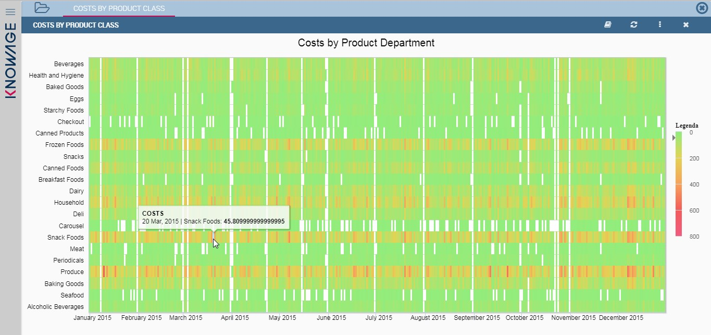
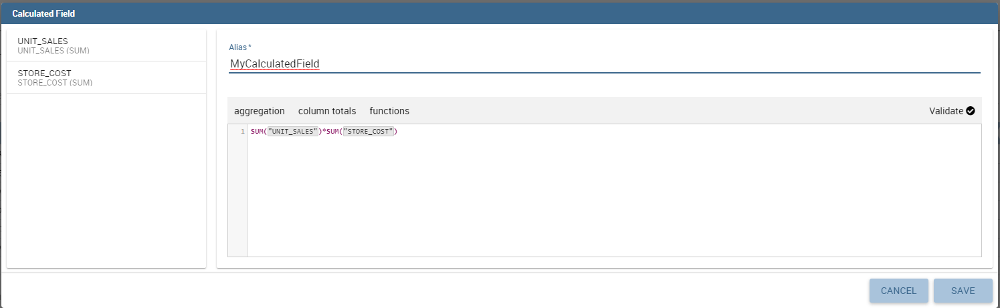
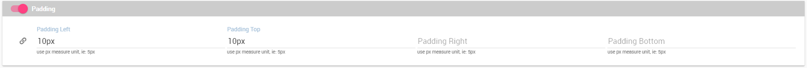
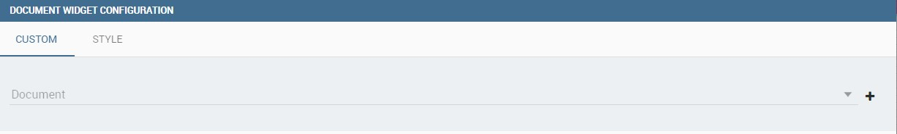
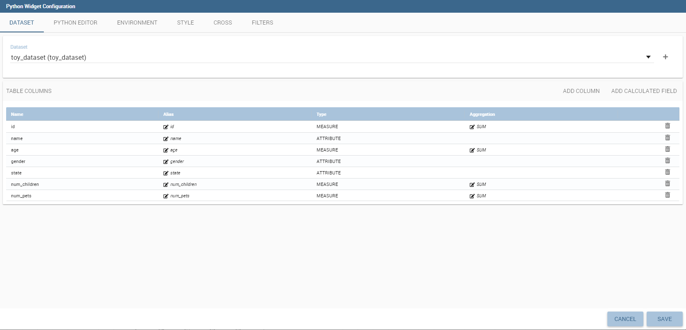

Create a New Dashboard (old)
========================================================================================================================

Knowage allow end users to *self-build interactive cockpits* through an intuitive and interactive interface, with a few clicks and simple drag and drop. This allows you to compose your analytical documents with multiple widgets and define associations among them, so that clicking on one widget data are automatically updated in other widgets.

    Cockpit document example.

It enables *data mash-up* to integrate enterprise data and externally sourced data.

Cockpit document can be created and executed both by technical users and end users and are part of Knowage ad-hoc reporting system. A key aspect is that different widget can rely on different datasets and hence on different data sources. The only requirement needed to define associations between two or more datasets is the presence in each of them of one or more columns containing the same data.

.. warning::
    **Section structure exception**

    Since there are no differences between the cockpit interface reached by a final user and the one reached by a technical user, the cockpit designer is described in one unique My first Cockpit for both those kind of users. By the way, when necessary we will   highlight how the same functionality can be exploited accordingly to the user’s role.

My first Cockpit
------------------------------------------------------------------------------------------------------------------------

You can create your new Cockpit from the **Analysis** area of the **Workspace** by clicking on the “Plus” icon and selecting **Cockpits** if you enter Knowage Server as final user, while you can enter the document browser and start a new cockpit using the “Plus” icon if you enter Knowage Server as admin.

.. important::
    **Reaching the cockpit designer**

    We stress that the cockpit interface is reached by the final user and the administrator following two different paths.

Let us see how to build a cockpit and how the interface is displayed within the server. Once opened, the cockpit interface is an empty page with a toolbar containing different options described in Table below.

.. table:: Cockpit editor toolbar.
   :widths: auto

   +--------------------------------+-----------------------+-----------------------+
   |    Icon                        | Name                  | Function              |
   +================================+=======================+=======================+
   | .. figure:: media/image136.png | **Cockpit menu**      | Configuration menu of |
   |                                |                       | Cockpit.              |
   +--------------------------------+-----------------------+-----------------------+
   | .. figure:: media/image137.png | **Add widget**        | It opens a window     |
   |                                |                       | where you can create  |
   |                                |                       | a new chart or table, |
   |                                |                       | add texts, images or  |
   |                                |                       | Knowage documents.    |
   +--------------------------------+-----------------------+-----------------------+
   | .. figure:: media/image138.png | **General             | It opens the window   |
   |                                | configuration**       | where you set the     |
   |                                |                       | general cockpit       |
   |                                |                       | options (name, label, |
   |                                |                       | show menu, etc.) and  |
   |                                |                       | widget style (header, |
   |                                |                       | titles, borders,      |
   |                                |                       | etc.).                |
   +--------------------------------+-----------------------+-----------------------+
   | .. figure:: media/image139.png | **Data                | It opens a window     |
   |                                | configuration**       | where you can manage  |
   |                                |                       | the dataset, the      |
   |                                |                       | association between   |
   |                                |                       | datasets and the      |
   |                                |                       | refresh frequency.    |
   +--------------------------------+-----------------------+-----------------------+
   | .. figure:: media/image140.png | **Selections**        | It opens a window     |
   |                                |                       | where you can         |
   |                                |                       | manage selections.    |
   +--------------------------------+-----------------------+-----------------------+
   | .. figure:: media/image141.png | **Clear Cache**       | It cleans temporary   |
   |                                |                       | data.                 |
   +--------------------------------+-----------------------+-----------------------+
   | .. figure:: media/image142.png | **Save as**           | It opens the window   |
   |                                |                       | to save the cockpit   |
   |                                |                       | document as a new     |
   |                                |                       | document.             |
   +--------------------------------+-----------------------+-----------------------+

By clicking the button **Add Widget** you can add a widget containing a **Text**, an **Image**, a **Chart**, an **HTML**, a **Table**, a **Cross table**, a **Document**, a **Map**, the **Active selections** or the **Selector** to your cockpit, as shown below. **Python**, **R**, **Discovery** and **Custom charts** are available according to the license installed.

        Widget Type.

In the following we go into details of each available widget.

Text widget
~~~~~~~~~~~~~~~~~~~~~~~~~~~~~~~~~~~~~~~~~~~~~~~~~~~~~~~~~~~~~~~~~~~~~~~~~~~~~~~~~~~~~~~~~~~~~~~~~~~~~~~~~~~~~~~~~~~~~~~~

By clicking the button Text Widget you can add text to your cockpit. As shown in figure below, the widget editor opens and it is divided in three tabs: the **Text editor**,
the **Style**, the **Dataset** and the **Filters** tab.

.. _texteditwidgetconf:

     Text editor of text widget configuration.

On the “Text editor” tab you can type the desired text in center panel and customize it. Using the dataset tab it is possible to associate dataset values to the text and
read it real time at each execution. Move to the dataset tab to add a dataset to the widget. Then, going back to the Text editor tab, the user will find the dataset
columns on the right side, as well as a set of functions to eventually apply to the fields. We summed up main steps in the Figure below. To add a function to a measure
first select the desired function and then the field of numeric type.

    Editing a dynamic text.

It's also possible to add variables values if at least one of them is defined. During the execution of the widget the value will be displayed based on the current variable value.

.. figure:: media/image144b.png

    Variables in text widget.

On the “Style” tab you can customize the text widget. We have provided all details about this tab in the Table widget. On the “Dataset” tab you can add more dataset to be
used in the dynamic value. Finally, the “Filters” tab can be used to extract limited output from the dataset. We put details off to the table widget subsection.

Image widget
~~~~~~~~~~~~~~~~~~~~~~~~~~~~~~~~~~~~~~~~~~~~~~~~~~~~~~~~~~~~~~~~~~~~~~~~~~~~~~~~~~~~~~~~~~~~~~~~~~~~~~~~~~~~~~~~~~~~~~~~

By clicking the button **Image Widget** you can add images to your cockpit. As already seen the widget editor opens and it is divided in
three sections.

On the **Gallery** tab you can upload an image, delete it or select one from the gallery. Refer to the following figure.

    Gallery tab of Image Widget Configuration.

On the **Style** tab you can configure the style of your image widget with the different options offered by this tab. Many of them are defined in the table widget that you will find later.

On the **Cross** tab you can define navigation to another document, as shown in figure below.

    Cross tab of Image Widget Configuration.

.. warning::
    **Cross navigation only for technical users**

    Due to the fact that parameters can only be managed by a technical user the cross navigation cannot be implemented by the final user.

For this purpose, you must activate **Enable cross navigation** flag and select the destination document through the list of cross navigation definition.
This last flag is optional. If you select a cross navigation definition, when you launch the cross navigation it will go to the document of arrival directly.
If the cross navigation definition is not defined, then when you launch the image widget cross navigation will be shown a pop up (refer to figure below) with the list of cross navigation definition that exist for this cockpit.

.. _crossnavmultchoice:

    Cross navigation multiple choices.

Chart widget
~~~~~~~~~~~~~~~~~~~~~~~~~~~~~~~~~~~~~~~~~~~~~~~~~~~~~~~~~~~~~~~~~~~~~~~~~~~~~~~~~~~~~~~~~~~~~~~~~~~~~~~~~~~~~~~~~~~~~~~~

Charts are an essential representation of data, Knowage lets you use many different charts type and configure them according to your needs. We have provided all details about charts type and configuration in Chart chapter.

We recall that also for chart widget it is possible to set cross navigation on elements.

.. warning::
    **Cross navigation only for technical users**

    Due to the fact that parameters can only be managed by technical user the cross navigation cannot be implemented by the final user.

As shown in next figure, it is mandatory to enable the cross navigation feature by using the dedicate tab of chart editor GUI. It is mandatory to choose the column element to be passed to the destination document and associate it to the right output parameter (previoulsy added to the document using the detail interface).

The cross navigation name can be left empty. In case multiple cross navigation definitions have been configured for the document, a pop up will be displayed, letting the user to choose which destination to reach (exactly as we saw earlier for Image widget in the last figure of that paragraph).

.. _crossnavchartwidget:

    Cross navigation for chart widget.

In addition, if the navigation expects other parameters to be passed, use the bottom part of the page to add the additional parameters. Figurebelow shows an example.

    Add all output parameters involved in the cross navigation.

It is also possible using Solr datasets and calculated fields with charts.

Dataset fields editing and configuration is possible using the first tab inside widget edit mode, in this way, for example, users can modify aggregations for measures:

In this way it is possible adding new calculated fields on chart by clicking on "Add Calculated field", the standard calculated field editing mode will appear.

Adding new calculated fields is easy as using other measure fields, using Chart Engine Designer structure tab:

.. figure:: media/image152d.png

As said before charts are the most adopted method in presenting BI data since they allow an immediate perception of 
a phenomenon and are easily understandable. Thatis why it is worth having an overview through them when creating a dashboard that includes a chart widget.

Knowage provides a chart engine to create several types of charts, including:

-  Bar
-  Line
-  Pie
-  Sunburst
-  Wordcloud
-  Treemap
-  Parallel
-  Radar
-  Scatter
-  Heatmap
-  Chord
-  Gauge
-  Bubble

Once you enter the Knowage environment as a final user, enter the **Analysis** area under the **Workspace** menu item, click on the **Create Analysis** icon and choose **Cockpit**. 

.. important::
         **Enterprise Edition only**

         Please note that this operation is available only in KnowageBD and KnowageSI. Using the KnowagePM license, only a technical user can create Cockpit document.

Once opened, the cockpit interface is an empty page with a toolbar containing different options, the second of which is the **Add chart** feature.

    Add a chart to a cockpit.
   
.. note::
       **Cockpit**
         
         The Cockpit Engine allows the user to self-build interactive cockpits through an intuitive and dynamic interface. Read more in *Cockpit* chapter.

Clicking on the **Add Chart** icon, you will be asked to choose among some available widgets. Pick out the **Chart** one and let’s now go into details on how to build a chart from scratch. The designer editor is divided into four principal tabs: **Dataset**, **Chart Engine Designer**, **Style**, **Cross** and **Filters**. As soon as the user clicks on the “Add Chart” button, he/she enters the “Dataset” tab editor. Here the user must select, using the “little plus” icon placed just aside the combobox line, one dataset. Then the user must switch to the “Chart Engine Designer” tab and choose a chart type among the available ones, as shown in figure below.

    Chart editor.

After choosing the appropriate chart type you must go into the **Structure** page. Here it is possible to select the measures and the attributes chosen for the chart.

.. _chartstructure:

     Chart structure.

Clicking on the **Configuration** page you will found eight different blocks as you can see in figure below.

     Chart configuration.

In detail these blocks concern:

-  **Generic Details**, as the orientation of the chart, the family and the size font.
-  **Title and Subtitle details**
-  **No data message** where it is possible to put a message where the data are not founded.
-  **Legend Title**
-  **Legend Items**
-  **Color Palette**
-  **Advanced Series Configuration**
-  **Custom Colors**

These eight blocks are common to all chart types; anyway, there could be some additional blocks for specific types.

The **Advanced** tab contains extra features, usually exploited by an expert user. Here the user can see all settable properties associated to the chart: it reflects the property tabs that an expert user should manually edit to generate a json template.

    Chart Advanced Features.

In the next subsections, the available functionalities of the Structure, the Configuration and the Advanced tabs are described in a more specific way.

.. important::
         **Enterprise Edition only**

         Please note that the "Advanced" tab is available only in Knowage Enterprise Edition.

The “Structure” tab of the designer is the core of the Chart development. Here it is possible and mandatory to choose the measures and the attributes. When selected, the tab shows a two axes panel. The horizontal axis indicates the X-axis where you must choose one or more attributes. As well, the left axis is the Y-axis and here you must choose measures. You can also insert manually the axis title for both the X and the Y axis if the chart is configured to have axis titles.

.. warning::
    **Chart type changemens may cause broke down**
    
    Before creating any chart, it is convenient to be sure of    what kind of chart you want to develop. We stress that the user can    change the chart type afterwards, but at the expense of a loss of just defined settings.

In this section it’s possible to customize the labels of the axis, titleand grid style clicking on different buttons. With the arrow button, on the top of the Y-axis and X-axis, it’s possible to choose the axis configuration detail, the axis title configuration, the major and minor grid configuration (just for Y-axis) and ordering column (just for X-axis). With the pencil button opens a window on the right with the series configuration details where it’s possible to choose the aggregation way, the order type of the series, if the data will be shown e so on. Finally, with the strip cartoon button you can choose the features of the tooltip (font color, text alignment, ecc). If the chart in place does not allow the customization of the axes the specific button will be disabled or not visible. The Figure below will show in detail the three buttons above explained:

    From left to right: (a) Generic configuration axis (the specific arrow). (b) Generic configuration axis.

    Series style configuration.

    Series tooltip details.

The **Configuration** section contains options to define the generic style of the chart. Here you can set the dimensions of the chart, the background color, insert the title and subtitle and define their style, choose the series palette, associate a specific color to a particular serie or category, add and configure the legend. The listed options are an example of what you can configure in the tab.

Note that for the color palette details you can use one already in the list or you can choose any color inserting the hex color code with the hashtag symbol. This is a very useful feature to customize the output.

    Color box editing.

In particular, in the 6.3 version, it has been introduced a new configuration option: the Custom Color.

    Custom Colors details.

With this new option it is possible to assign a specific color to a particular category and/or serie or to a particular value of a category and/or serie. Look at the following figure for an example.

.. figure:: media/charts/image201.png

    Custom Colors example.

To add a custom color simply write the category/serie value or name, select a color with the color piker and then click on the plus button. In the figure example it is assigned a color for each value of the ‘QUARTER’ category.

Indeed, the options available in this tab change according to the chart selected enabling different configurations. See Chart types in detail for a detailed description of the specific options of each chart.

The **Advanced** tab contains some advanced options to more customize the chart. Here it is possible, for example, to set the tooltip options, the widget dimensions, if the chart is stacking or not, the grouping type.

    Advanced tab.

Down here are listed some of the most useful and new options.

The **dataLabels** option can be found under the path VALUES -> SERIE -> 0 or another serie -> dataLabels. The option is available only for measures. Here it is possible to set the labels style such as the color, font family or font weight.

    dataLabels option.

The **TOOLTIP** option allows to set the width and the radius of hte tooltip's border.

The **plotBands** and **plotLines** options can be found under the path AXES_LIST -> AXIS -> 0 or another serie. With these options is possible to plot respectively bands and lines on the chart with fixed values and to set their style, like the line width and the line type or the band color.

    plotBands option.

The **min** and **max** options are under the path AXES_LIST -> AXIS -> 0 or another serie. They are available only for series and allow to set the maximum and minimum axis value for the selected sere's axis.

    min and max options.

Following, a description on how to create charts within the **Chart Engine** of Knowage.

**Traditional charts**

Knowage allows you to create the so-called *traditional charts* like bar, line, pie, radar and scatter chart in a fancy way.

Each chart type is built on a specific dataset. Despite all, there are some general rules that can be applied to those “simplier” and common charts. The minimum requirement is to define/have a dataset with at least one attribute column and one measure column. Then you can select the type of chart you want to use from the **Chart** section; meanwhile using the **Structure** section you can fill in the category box with one or more attributes (typically these will be place in the X-axis) and in the series box with one or more measures (typically placed as Y-axis’ values). Refer to *Chart Structure* figure as example.

Once you have selected the attributes and measures you can edit the series style and axis style configurations as explained in My first Chart. Then go to **Configuration** to set the chart dimension, the title, the legend and to choose how to associate colors to series.

Some charts are endowed with datetime and grouping functions. In particular, it is possible to enable the grouping/splitting functions to **Bar** and **Line** charts.

The user can reach those functions just clicking on the “little arrow” located at the right end of category bar.

    Datetime and grouping function.

The grouping functions can be implemented only through specific categories and series configurations. As shown in figure below, the grouping function cannot be applied with just one attribute as category. To allow the function to be applied, the user must define two attributes as category fields.

     Error alarm when enabling the grouping function.

As well, the user can use the splitting functions to divide one series over the second one or over the second category.

To split the first series over the second one, remember that it is necessary to choose only one attribute as category field and two measures as series values. The following figure shows an example.

    Split over second series.

Meanwhile to split a measure over second category it is mandatory to choose exactly two attributes as category field and only one measure as series value, as shown in figure below.

    Split over second category.

Futhermore, in the occurance the chart uses one datetime attribute as category field, the user can improve visualization applying the datetime function to custom date format.

    Datetime function usage.
    
For bar and line chart you can add more then one container for adding series in **Structure** section. In that case you will have in your chart more then one axis for series. 
In **Advanced** section you can specify to align these axis to 0 (zero) value. It is check box **alignAxis** where checked means that axises will be aligned to 0, and unchecked means that they will not be aligned.
 
For pie chart inside **Advanced** section you can set configuration for your toolip: to show/hide absolute value and/or percentage. Inside **tooltip** property of serie object you can find properies **showAbsValueTooltip** and **showPercentageTooltip**.

**Scatter chart**

A scatter chart is a graphical representation of scattering phenomenon of data. It is useful when the user wants to underlight the density of data upon certain spots to the detriment of readability of single points. If you select a scatter chart in the **Configuration** section you will have Ticks and Lables Details instead of Advanced Series Configuration. Be carefull to fill in the **Scatter configuration** with the **Zoom type**, as showed below.

    Scatter Chart, ticks and labels details.

You must check if you want that the values in the Y-axis start (or end) in the first (last) tick or in the first (last) value of the dataset and if you want that the last label of the category axis should be showed.

**Sunburst chart**

The sunburst chart is a graph with a radial layout which depicts the hierarchical structure of data displaying a set of concentric rings. The circle in the center represents the root nodes, with the hierarchy moving outward from the center. The slices in the external rings are children of the slice in the inner circle which means they lie within the angular sweep of the inner circle. The area of each slice corresponds to the value of the node. Even if sunburst charts are not efficient space-wise, they enable the user to represent hierarchies in a more immediate and fascinating way.

To create a sunburst chart in Knowage you just have to select a dataset with at least two attribute columns describing the hierarchy and at least a measure column that indicates the width of the slices. An
example of dataset for the sunburst chart is showed in Table below.

.. _exampleofdatsetsunburst:
.. table:: Example of dataset for the sunburst chart.
   :widths: auto
   
   +----------------------+----------------+------+
   |    CATEGORY          | SUBCATEGORY    | UNIT |
   +======================+================+======+
   |    Baking Goods      | Cooking Oil    | 349  |
   +----------------------+----------------+------+
   |    Baking Goods      | Sauces         | 109  |
   +----------------------+----------------+------+
   |    Baking Goods      | Spices         | 290  |
   +----------------------+----------------+------+
   |    Baking Goods      | Sugar          | 205  |
   +----------------------+----------------+------+
   |    Bathroom Products | Conditioner    | 64   |
   +----------------------+----------------+------+
   |    Bathroom Products | Mouthwash      | 159  |
   +----------------------+----------------+------+
   |    Bathroom Products | Shampoo        | 254  |
   +----------------------+----------------+------+
   |    Bathroom Products | Toilet Brushes | 92   |
   +----------------------+----------------+------+
   |    Bathroom Products | Toothbrushes   | 94   |
   +----------------------+----------------+------+

Once you selected the dataset and the type of chart, choose at least two attributes in the X-axis panel and a measure in the Y-axis panel as showed in the following figure.

     Sunburst configuration.

Then click on **Configuration**. As you can see the features are not exactly the same as traditional chart. We give some tips on most important sunburst settings.

Using the **Generic** button you can set the **opacity** on mouse movement and choose how to display the measure values: absolute, percentage or both. These two features allow the visualization of data just moving the mouse over the slice: the slice is highlighted and values are shown in the center of the ring while the root-node path for the node selected is displayed on the left bottom corner of the page. Opacity and Breadcrumb configuration are available only on Comunity Edition. The tooltip is a mandatory field since it shows the value of the selected slice. Therefore be sure to have filled it before saving by using the **Explanation detail** panel. On Comunity Edition you have option custom the root-node path, clicking on the **Sequence** icon and choose position, label tail size and text style. **Sequence** option is not available on Enterprise edition, it is deprecated. Figure below sums up the three features.

    Generic, Sequence and Explanation configuration

In Figure below you find the sunburst obtained with data of :numref:`exampleofdatsetsunburst`.

    From left to right: (a) Sunburst. (b) Sunburst category.(c) Sunburst subcategory.
    
Inside **Advanced** section you can set value for scale that will increase/decrease your chart. You need to set numeric value for property **scale**. 

**Wordcloud chart**

The wordcloud chart is a graphic to visualize text data. The dimension of the words and colors depend on a specified weight or on the frequency of each word.

The dataset to create a wordcloud should have at least a column with attributes and only one column with numerical data which represents the weight to assign to each attribute. Choose one attribute as category field (the wordcloud accept only one attribute in the category box) and a measure as series field.

Switch to the **Configuration** section to set the generic configuration of the chart and to custom fields of the **Word settings datails**. Here the use can decide if to resize the words accordingly to the measure retrieved in the dataset (**Series** option) or accordingly to the frequency of the attributes in the dataset (**Occurrences** option). Moreover it is possible to set the maximum number of words that you want to display, the padding between the words, the word layout and whether or not you want to prevent overlap of the words as showed in Figure below.

     Wordcloud chart specific configuration.

**Treemap chart**

The treemap is a graphical representation of hierarchical data, which are displayed as nestled rectangles. Each branch of the tree is given by a rectangle, which is tiled with smaller rectangles representing sub-branches. The area of the rectangles is proportional to a measure specified by a numerical attribute. The treemap is usefull to display a large amount of hierarchical data in a small space.

To create a treemap chart you have to select a dataset as the one described for the sunburst chart in the  Parallel chart.

Once you have selected the dataset, choose the treemap chart type in the designer and then at least two attributes into the X-axis panel. The order of the attributes in the X-axis panel must reflects the order of the attributes in the hierarchy starting from the root to the top.

Finally you can set generic configurations and colors palette in the **Configuration** tab and advanced configurations in **Advanced editor** tab.

In Figure below we show the Treemap resulting with data of our example

.. figure:: media/charts/image11415.PNG

    From left to right: (a) Treemap. (b) Treemap sub-branches.

**Parallel chart**

The parallel chart is a way to visualize high-dimensional geometry and multivarious data. The axes of a multidimensional space are represented by parallel lines, usually equally spaced-out, and a point of the space is represented by a broken line with vertices on the parallel axes. The position of the vertex on an axis correspond to the coordinate of the point in that axis.

To create a parallel chart select a dataset with at least one attribute and two columns with numerical values. You can find an interesting example of dataset in the next table where we display some of its rows.

.. _exampleofdatsetparallel:
.. table:: Example of dataset for the parallel chart.
   :widths: auto
   
   +--------+--------------+-------------+--------------+-------------+-----------------+
   |    ID  | sepal_length | sepal_width | petal_length | petal_width | class           |
   +========+==============+=============+==============+=============+=================+
   |    36  |    5.0       |    3.2      |    1.2       |    0.2      | Iris-setosa     |
   +--------+--------------+-------------+--------------+-------------+-----------------+
   |    37  |    5.5       |    3.5      |    1.3       |    0.2      | Iris-setosa     |
   +--------+--------------+-------------+--------------+-------------+-----------------+
   |    38  |    4.9       |    3.1      |    1.5       |    0.1      | Iris-setosa     |
   +--------+--------------+-------------+--------------+-------------+-----------------+
   |    39  |    4.4       |    3.0      |    1.3       |    0.2      | Iris-setosa     |
   +--------+--------------+-------------+--------------+-------------+-----------------+
   |    40  |    5.1       |    3.4      |    1.5       |    0.2      | Iris-setosa     |
   +--------+--------------+-------------+--------------+-------------+-----------------+
   |    41  |    5.0       |    3.5      |    1.3       |    0.3      | Iris-setosa     |
   +--------+--------------+-------------+--------------+-------------+-----------------+
   |    42  |    4.5       |    2.3      |    1.3       |    0.3      | Iris-setosa     |
   +--------+--------------+-------------+--------------+-------------+-----------------+
   |    43  |    4.4       |    3.2      |    1.3       |    0.2      | Iris-setosa     |
   +--------+--------------+-------------+--------------+-------------+-----------------+
   |    44  |    5.0       |    3.5      |    1.6       |    0.6      | Iris-setosa     |
   +--------+--------------+-------------+--------------+-------------+-----------------+
   |    45  |    5.1       |    3.8      |    1.9       |    0.4      | Iris-setosa     |
   +--------+--------------+-------------+--------------+-------------+-----------------+
   |    66  |    6.7       |    3.1      |    4.4       |    1.4      | Iris-versicolor |
   +--------+--------------+-------------+--------------+-------------+-----------------+
   |    67  |    5.6       |    3.0      |    4.5       |    1.5      | Iris-versicolor |
   +--------+--------------+-------------+--------------+-------------+-----------------+
   |    68  |    5.8       |    2.7      |    4.1       |    1.0      | Iris-versicolor |
   +--------+--------------+-------------+--------------+-------------+-----------------+
   |    69  |    6.2       |    2.2      |    4.5       |    1.5      | Iris-versicolor |
   +--------+--------------+-------------+--------------+-------------+-----------------+
   |    70  |    5.6       |    2.5      |    3.9       |    1.1      | Iris-versicolor |
   +--------+--------------+-------------+--------------+-------------+-----------------+
   |    71  |    5.9       |    3.2      |    4.8       |    1.8      | Iris-versicolor |
   +--------+--------------+-------------+--------------+-------------+-----------------+
   |    101 |    6.3       |    3.3      |    6.0       |    2.5      | Iris-virginica  |
   +--------+--------------+-------------+--------------+-------------+-----------------+
   |    102 |    5.8       |    2.7      |    5.1       |    1.9      | Iris-virginica  |
   +--------+--------------+-------------+--------------+-------------+-----------------+
   |    103 |    7.1       |    3.0      |    5.9       |    2.1      | Iris-virginica  |
   +--------+--------------+-------------+--------------+-------------+-----------------+
   |    104 |    6.3       |    2.9      |    5.6       |    1.8      | Iris-virginica  |
   +--------+--------------+-------------+--------------+-------------+-----------------+
   |    105 |    6.5       |    3.0      |    5.8       |    2.2      | Iris-virginica  |
   +--------+--------------+-------------+--------------+-------------+-----------------+
   |    106 |    7.6       |    3.0      |    6.6       |    2.1      | Iris-virginica  |
   +--------+--------------+-------------+--------------+-------------+-----------------+
   |    107 |    4.9       |    2.5      |    4.5       |    1.7      | Iris-virginica  |
   +--------+--------------+-------------+--------------+-------------+-----------------+
   |    108 |    7.3       |    2.9      |    6.3       |    1.8      | Iris-virginica  |
   +--------+--------------+-------------+--------------+-------------+-----------------+
    
In this example three different classes of iris are studied. Combining the values of some sepal and petal width or lenght, we are able to find out which class we are looking at. In Figure below (a part) you can find the parallel chart made with the suggested dataset. While in next figure (b part) it is easy to see, thanks to selection, that all iris with petal length between 2,5 and 5.2 cm and petal width 0,9 and 1,5 cm belong to the iris-versicolor class.

.. _fromleftparallrighetchart:
.. figure:: media/charts/image11617.png

    From left to right: (a) Parallel. (b) Parallel chart selection.

Therefore, select **parallel** as chart type using the designer interface, then choose one or more attributes in the X-axis panel and one or more measures in the Y-axis panel.

On the **Configuration** tab you can set the generic configuration for the chart and you must fill the **Series as filter column** filed under ”Limit configuration”. Under ”Tooltip configuration” there is new property available - **Maximum number of records to show tooltip**. It is used to limit showing tooltip in case there are lot of records returned from dataset, which make chart more readable. 

**Heatmap chart**

Heatmap chart uses a chromatic Cartesian coordinate system to represent a measure trend. Each point of the Cartesian system is identified by a couple of attributes. Note that one attribute must be a datetime one. Meanwhile, each couple corresponds to a measure that serves to highlight the spot with a certain color according to the chosen gradient. Figure below gives an example of how an heatmap chart looks like inside Knowage.

    Heatmap example.

Before configuring a heatmap chart, be sure that your dataset returns at least two attributes, one of which **must** be a datetime one, and (at least) one measure. Once entered the chart designer, choose the “Heatmap” type and move to the “Structure” tab. Use the datetime attribute and an other attribute as category fields and one measure as series fields. Figure below shows an example.

    Configuring the attributes and the series for the heatmap chart.

Note that for series axis it is possible to specify the values’ range by assigning a minimun and the maximum value, as shown in figure below. Otherwise, the engine will automatically link the axis scale to dataset results set.

    Configure min and max values for series.

The next step is to move to **Configuration** tab and select the **Color palette** icon. Here (figure below) the user has to define the chromatic scale which will be associated to the measure values. The panel will demand the user to insert the first, the last color and the number of bands that will constitute the color scale.

.. _addgradientpanel:

    Add gradient panel.
   
The engine will create a progressive color scale as shown in the left image of figure below. To custom the scale the user can use the Preset colors and use the arrow to move up and down Heatmap chart the added color or the user can increase the number of steps and then
some intermediate color to leave more contrast between them.

    Custom color scale.

Remember to edit both **Legend** and **Tooltip** configuration in the **Tooltip details** panel to improve the readability of the chart.

**Chord chart**

Chord diagram is a graph which allows to show relationship between entities and between data in a matrix. The entities can belong to an unique category while the arc be non-oriented or belong to two different categories. In this latter case, they have direct arcs. The data are arranged radially with arcs that represent the connection between points. The width of the arc connecting two points depends on the weight assigned to the edge connecting these two points. This graphic is usefull when you want to represent a large number of data in a small space.

The chord diagram requires a dataset that have a column with numerical values. These represent the weight of the arc connecting two points. It also must have two columns with the entries for the entities to be connected in the diagram. These two columns must have the same set of values so that the engine can understand the relation between all the entities. If there is not a relation between two entities the weight of the arc is zero. Note that when you create a directed chord diagram with two different categories, all the relations between entities of the same category have a zero weight.

An example of dataset for the chord chart is represented in Table below:

.. table:: Example of dataset for the chord chart.
   :widths: auto
   
   +--------------------+--------------+-----------+
   |    CUSTOMER\_ CITY | STORE\_ CITY | VALUE     |
   +====================+==============+===========+
   |    Beaverton       | Portland     | 4609.0000 |
   +--------------------+--------------+-----------+
   |    Lake Oswego     | Portland     | 4201.0000 |
   +--------------------+--------------+-----------+
   |    Milwaukie       | Portland     | 5736.0000 |
   +--------------------+--------------+-----------+
   |    Oregon City     | Portland     | 3052.0000 |
   +--------------------+--------------+-----------+
   |    Portland        | Portland     | 3984.0000 |
   +--------------------+--------------+-----------+
   |    W. Linn         | Portland     | 3684.0000 |
   +--------------------+--------------+-----------+
   |    Albany          | Salem        | 5544.0000 |
   +--------------------+--------------+-----------+
   |    Corvallis       | Salem        | 8542.0000 |
   +--------------------+--------------+-----------+
   |    Lebanon         | Salem        | 8015.0000 |
   +--------------------+--------------+-----------+
   |    Salem           | Salem        | 6910.0000 |
   +--------------------+--------------+-----------+
   |    Woodburn        | Salem        | 6335.0000 |
   +--------------------+--------------+-----------+
   |    Albany          | Albany       | 0.0000    |
   +--------------------+--------------+-----------+
   |    Beaverton       | Beaverton    | 0.0000    |
   +--------------------+--------------+-----------+
   |    Corvallis       | Corvallis    | 0.0000    |
   +--------------------+--------------+-----------+
   |    Lake Oswego     | Lake Oswego  | 0.0000    |
   +--------------------+--------------+-----------+
   |    Lebanon         | Lebanon      | 0.0000    |
   +--------------------+--------------+-----------+
   |    Milwaukie       | Milwaukie    | 0.0000    |
   +--------------------+--------------+-----------+
   |    Oregon City     | Oregon City  | 0.0000    |
   +--------------------+--------------+-----------+
   |    Portland        | Portland     | 0.0000    |
   +--------------------+--------------+-----------+
   |    Salem           | Salem        | 0.0000    |
   +--------------------+--------------+-----------+
   |    W. Linn         | W. Linn      | 0.0000    |
   +--------------------+--------------+-----------+   

Once you have selected the dataset open the designer and select chord chart type. Then choose the two entities in the X-axis panel and the value in the Y-axis panel as showed in figure below. Now you are ready to customize the chart setting the generic configuration and the palette on **Configuration**.

.. figure:: media/charts/image12526.png

    Chord configuration.

**Gauge chart**

Gauge chart uses needles to show information as a dial reading. It allows to visualize data in a way that resembles a real-life speedometer needle. The value of the needle is read on a colored data scale. Colors are used to provide additional performance context (typically green for good and red for bad). This chart type usually is used in dashboards to show key performance indicators or any measure having reference values.

For gauge chart you should have only series items, the one that gives you values for the chart. So, the defined dataset to be used should provide numerical data for the Y-axis for the gauge chart. After selecting the dataset go to the designer and select **gauge** in chart type combobox. Then choose one or more measure on the Y-axis panel on the **Structure**. Moreover you must not forget to provide all data needed for the **Axis style configuration** of the Y-axis.

When you finished to set all the mandatory and optional parameters and configurations in the **Structure** tab you can select the **Configuration** tab and set the generic configuration of the chart.

**Bubble chart**

A bubble chart requires three dimensions of data; the x-value and y-value to position the bubble along the value axes and a third value for its volume, z-value. It is a generalization of the scatter plot, replacing the dots with bubbles. 

.. figure:: media/charts/bubble_chart.png

    Bubble chart.

Inside X,Y,Z containers, user can put only **measure values**. Inside Categories container user can put **attributes** that he wants to see in the **tooltip**.

.. figure:: media/charts/bubble_chart_conf.png

    Bubble configuration.

.. figure:: media/charts/bubble_tooltip.png

    Bubble tooltip.

**Advanced functionalities**

Inside **Advanced tab**, user can find configuration for **plotband** and **plotline** of xaxis and yaxis. 

    Bubble plotband and plotline configuration.

	
User also has option for **splitting serie** by one of two categories. Split option has limit on **maximum** two categories. User can set which category will be used for coloring bubbles. And also can show/hide values that are inside bubbles.

.. figure:: media/charts/bubble_split_conf.png

    Bubble split configuration.

.. figure:: media/charts/bubble_split.png

    Bubble split examples.
	
Difference between **One category - split disabled** and **Two categories - split disabled** is what is present in the tooltip.

Knowage **Chart Engine** allows you to drill down into categories. This means that the user can explore the details of each category as many times as configured. Indeed, to let the chart admits the drill down, it is necessary first that the chart in place allows it. Secondly the user must have dragged and dropped multiple attributes into the category axis in the **Configuration** tab. The order of the attributes in the X-axis panel determines the sequence in which the categories are going to be showed. When executing the chart the label of the category is linkable and it is possible to click on the label to drill down.

The chart that enables the drill down are:

-  Bar Chart
-  Line Chart
-  Pie Chart
-  Treemap

To give an idea of the outcome, we take as instance the Bar Chart drill down. In the following example, the selected categories are four and called: ``product_family``, ``product_department``, ``product_category`` and ``product_subcategory``. Once we open the document, we get as shown below:

.. figure:: media/charts/image127.png

    Drillable Bar Chart

When selecting ``shelf_depth`` measure of the Food category one gets (see next figure):

.. figure:: media/charts/image128.png

    Drillable Bar Chart: first drill

Once again, we can select ``Frozen food`` subcategory and drill to a second sub-level as below:

    Drillable Bar Chart: second drill

And so on to the fourth subcategory. Selecting the “Back to: ...” icon available at the right corner of the graphic, the user can get back to the previous level. This efficient feature allows the user to have a deep insight of the analysis and draw important conclusions from it.

Table widget
~~~~~~~~~~~~~~~~~~~~~~~~~~~~~~~~~~~~~~~~~~~~~~~~~~~~~~~~~~~~~~~~~~~~~~~~~~~~~~~~~~~~~~~~~~~~~~~~~~~~~~~~~~~~~~~~~~~~~~~~

The **Widget table configuration** opens and it guides you through the steps to configure the widget. The pop up opens showing the **column** tab, as you can see from Figure below. In details, it is mandatory to select a dataset using the combobox (only if at least one dataset has been loaded using the **Data Configuration** feature) or clicking on the icon |image156| available just aside the combobox line. You can page the table specifying the number of rows per sheet. Consequently the user can set columns properties.

    Table configuration window.

In fact, the column area is divided into two parts: on the upper part there are the buttons to add a new column or a calcutated field. Also the new functionality of column grouping is available here. In the lower section, as soon as the dataset is selected, you can indicate the sorting column or modal selection column. The modal selection serves to specify which value will be passed to other widgets (if interaction is enabled) when clicking on the cell at document execution time. You can specify this field by selecting a value from the combobox. In the same way, you indicate the sorting column and the order type that steers the rows ordering. You can select the field and the order from the dedicated comboboxes.

When a dataset is added to a table widget, all of its columns are listed below. If the user doesn’t wish to show some of them, he can use the delete button available at the end of each column row, as shown below.

    Delete a column.

In case of accidental cancellation or new table requirements, it is possible to re-add columns. In order to add a new column you have to
click on the **Add Column** icon on the top right of the second box. Once opened you can select one or more columns. When you have finished selecting the desired columns you can click on save button and your new columns will appear in the field list. Refer to Figure below.

    Add a new column.

**Manage Columns Groups** will open a menu to add or remove columns groups and to set their style. A column group is a container for more than one column that will show a common header between them.

    Example column group.

Likewise, to add a calculated field you have to click on the **Add Calculated field** icon next to add column icon. Once opened the Calculated Field Wizard you have to type an alias for your calculated field in the dedicated area at the top corner of the wizard.
Then you can choose from the left sidebar list the fields that you want to use in your formula. You can also use arithmetical functions or use the functions available in the menu (**aggregations**, **column totals**, **variables**).
If you prefer you can create or modify the expression manually directly in the editable panel.
When you are satisfied with your expression you can click on validate to check your formula sintax or save button and your calculated field appears in the field list.
We provide an example in the following figure.

    Add a calculated field.

If Dataset is of type Solr, the columns displayed on the right panel are dataset columns fields and the calculated field formula elaboration is calculated on the fly.

If variables are set for the present cockpit, the variable menu button will appear, making it possible to add variable values in the calculated field expression.

.. figure:: media/image157c.png

    Variables menu

In the bottom section of the window, you can see the table fields (with their aggregation type) listed and you also can sort columns displayed in the table by dragging
them up or down, insert a column alias and customize it by adding font and style configurations using the brush shaped icon, as you can see from figure below.
Here you can find configuration features to adjust the column size, max cell characters, hide column or column header options, and the row spanning toggler.

    Columns Settings

If you hide the column (from this view or from the column list), the column will not be visible, but will still be used for aggregation purposes.
If you enable the **row span feature**, all the same visible values of the column will be collapsed in one, to avoid repetitions.

If the column is a measure, more functionalities will become available:

    - **Inline chart mode**: you can choose the visualization type of the measure, and if you choose chart and maximum/minimum values, a chart will appear in the view to represent the cell measure.
    - **Thresholds**: you can choose to set some thresholds that will trigger font color, background color or will show icons if the chosen condition is satisfied.
    - **Format**: you can choose the prefix, suffix and the precision (i.e. 9.8 m/s). Please be aware that the data will be formatted following the locale of the user. Otherwise you can choose to treat it as string.

.. _columnsettings:

    Column settings.

Note that here you can indicate the column type and the aggregation. To add an aggregation to a column you must control the type of data that column has. An aggregation can only be added if the column value is of “number” type . The different aggregation functions are: *none (you also can not add any aggregation function)*, *Sum*, *Average*, *Maximum*, *Minimum*, *Count* and *Count distinct*.

If a column group has been set another option will become available in order to set the optional group belonging of the column.

For all the columns, if at least one variable is set, the variables settings box will appear. Depending on the variable usage it will be possible to set a dynamic header or to hide the column conditionally.

    Variable settings box.

Clicking on the plus button you can add one or more conditions. The possible actions are:

    - Hide column: the column will be shown conditionally depending on the condition set.
    - Set column header name: the column name will be replaced by the variable value.

Multiple conditions can be set, but a condition fullfilling the "=" will have higher priority.

    Variable action set.

The **Style** tab is where you can customize the table by using the different options of style. It is divided into eight parts:

- In the **Header Style** section you can find different options for styling the table header. Refer to Figure below.

    
    Header style section of the Style tab.    

- In the **Rows** section you can set the generic style for all the rows (such as alternate color background) or specify different styles according to specific conditions on values. While the multiselectable option allows you to select multiple values and pass them to other cockpit widgets or other external documents. Refer to figure below.

.. figure:: media/image160.png 
    
    Rows section of the Style tab.   

- In the **Summary** section you can customize the appearance of the total of columns using font and style configurations. Refer to Figure below.

    Summary section of the Style tab.

- In the **Titles** section you can add the titles to the widget and modify the font size and weight. In this section you can also change the height of the widget title. Refer to Figure below.

    Titles section of the Style tab.

- In the **Borders** section you can add a border to the widget and customize it by using the colors, thickness and style. Refer to the following figure.

    Borders section of the Style tab.

- In the **Padding** section you can add a padding inside the widget area, specifying a value for top, bottom, left and right zones. Refer to the following figure.

    Padding section of the Style tab.

- In the **Other Options** section you can add the shadows in the widget, you can set the background color of the widget and it is possible to disable or enable the screenshot option or the Excel export (when available) for that particular widget. Refer to the following figure.

    Other Options section of the Style tab.

- In the **Export PDF** section you can enable the export of the widget in PDF format and also specify the orientation and size. Refer to the following figure.

   Export PDF section of the Style tab.

Once the table style settings have been implemented you can switch to the next tab. The **“Cross”** tab is where the navigation to other documents is defined. It is visible to final users but yet only configurable by a technical user (like an administrator). In this tab is possible to select between three different type of interactions: cross navigation to another document, open a preview popup of a dataset content or link to an external URL. 

   Cross tab with preview of a dataset enabled.

Finally, the **“Filters”** tab is where you can filter the table results by adding a limit to the rows or a conditions in the columns. the following figure shows an example of how to set the limit rows or a conditions on dataset columns.

.. _filterstabwidgetconf:

    Filters tab of the table widget configuration.

Once you have finished setting the different configuration options of the table widget, then just click on **“Save”** and your new widget is
displayed inside the cockpit.

Cross Table widget
~~~~~~~~~~~~~~~~~~~~~~~~~~~~~~~~~~~~~~~~~~~~~~~~~~~~~~~~~~~~~~~~~~~~~~~~~~~~~~~~~~~~~~~~~~~~~~~~~~~~~~~~~~~~~~~~~~~~~~~~

Similar configurations are available also for the Cross Table widget. In this data visualization option, you still have the tabs: **Dataset** tab, **Configuration** tab, the **Style** tab and the **Filters** tab as you can see below.

.. figure:: media/image169.png

    Dataset section of the crosstab widget configuration.

Using the “Dataset” tab the user can add the dataset to take values from. Consequently, it is necessary to select the fields you wish to appear as columns, those as row and measures to be exhibited in the pivot table. See figure below. Remember to set column and row fields as attributes, while measure fields as numbers.

.. figure:: media/image170.png

    Selecting columns, rows and measures of the crosstab.

There is also the possibility to add calculated fields as measures clicking on the "Add calculated field button".
The calculated field will work exactly as in the table widget. After creating a calculated field there will be the possibility to edit, remove it or set the properties for it's column clicking on the new measure buttons.

    Calculated field detail.

Once the columns, rows and measures have been selected the style of each column can be set by clicking on the cog settings icon. A popup will open with different options for the selected columnn. See figure below.

    Column style popup.

It is possible to sort the crosstab according to the values of the selected column or, alternatively, according to columns not visible in the crosstab. It can also be set the style of the column, such as the font size, the font weight or the cell alignment. There is also the possibility to specify the size of the column in pixels (you can also use percent values but it is better to use pixels).

In case the selected column is of type measure, there is a dialog to configure the behaviour of that field:

    Measure configuration dialog.

A particular option for a measure is **Exclude from Total and SubTotal**: that checkbox excludes the measure from the sums of Total and SubTotal fields makin the relatives table cells empty.

    Measure threshold setting.

As figure above shows, you can also manage threshold. For measures only, it is possible to associate a particular icon or a specific background color to a particular measure's value or range.
To do so add a new threshold, set a condition for it to appear, and choose the icon from the list or select the color that will be changed to the cell.
It is possible to add more or to remove thresholds using the add or delete button.

    Variables header value.

If one or more variables are set, in column and measure settings another field will appear. It is possible to set the header name to be dynamic using one of the variables set.
If one of the variables are selected in the combo as in example, the header name will be changed depending on the current variable value.

    Column style.

It's also possible to set style elements for both attributes and measures. In measures will also be possible to set the precision and prefix/suffix of the cell value.
The comma and dot used for decimals and thousands will be automatically changed depending on user's locale.

Once the dataset has been properly configured, you can proceed to the “Configuration” tab.

The latter is made up of three sections: **General**, **On rows** and **On columns**, as Figure below shows.

    Configuration tab interface.

In the **“General”** section you can set the following features:

- define the maximum cell number to show;
- decide to hook measures to columns or rows;
- decide to show percentages of measures related to columns or rows.

Thanks to the **“On rows”** feature, you can easily compute totals or subtotals on rows. Figure below exhibit an example.

    Computing totals and/or subtotals on rows.

Otherwise, thanks to the **“On columns”** feature, you can easily compute totals or subtotals on columns. Figure below exhibit an example.

    Computing totals and/or subtotals on columns.

Selecting the **"Hide rows on just null values"** will hide all the rows with just 0 or null values, avoiding space waste if unneeded.

The "Fix attribute's columns" will pin to the left the columns containing the attributes, so side scrolling will be available without losing those columns.

.. figure:: media/image173b.png

    Pinned columns example.

The **"expand/collapse"** functionality will add a + and - button in your rows, in order to easily aggregate your data.
In the widget menu you will also find the expand all/collapse all buttons, in order to reset closing or opening your whole widget.

Be aware that to use this functionality columns subtotal should be selected. If not the functionality check will enable it automatically.

.. figure:: media/image173c.png

    Expand/collapse example.

Switching to the **“Style”** tab you can find the general style settings available for the crosstab.

- **Crosstab General Options**  where the rows' height, the general font and font size can be set; in particular, the layout combo determines how the columns resize themselves in respect of the contained value;

.. figure:: media/image174.png

    General style options for crosstab.

- **Crosstab Headers Font Options** where you can configure the header style settings as color, background, font, etc.

    Crosstab Headers Font Options for crosstab.

- **Measures Font Options** where you can configure several style options for measures, such as color, background, font size, etc.

    Measures Font Options for crosstab.

- Using the **Grid** section you can mark (or not) grid borders, decide for border style, thickness and color. You can also alternate row indicating different colors.

    Grid Options for crosstab.

-  In the **Measures Headers** section you can configure different style option for measure headers, such as color, background, font size, etc.

    Measures Headers Option for crosstab.

- In the **Total** section you can set color and background of totals (if any).

    Color settings for Totals.

- In the **Subtotal** section you can set color and background of subtotals (if any).

    Color settings for Subtotals.

- In the **Titles** section you can add titles to widget and customize them using different styles.

    Title settings.

- In the **Borders** section you can add borders to widgets and customize them using different styles.

    Border settings.

- In the **Other Options** section you can add a shadow to widget layout and indicate its measure, color the widget background at convenience and it is possible to disable or enable the screenshot option or the Excel export for that particular widget.

    Other Options for crosstab.

Opening the **Cross** tab is possible to set a cross navigation to another document or an external link. In addition to other cross-navigations, for cross table widget it is possible to set as a dynamic value the name of the selected measure column or the selected category. The choice is available from the combobox.    

    Cross navigation for cross table widget.

Once some or all (at least the mandatory) of the above mentioned setting features have been set you can save and the widget will be inserted into the cockpit area.

Document section
~~~~~~~~~~~~~~~~~~~~~~~~~~~~~~~~~~~~~~~~~~~~~~~~~~~~~~~~~~~~~~~~~~~~~~~~~~~~~~~~~~~~~~~~~~~~~~~~~~~~~~~~~~~~~~~~~~~~~~~~

The Document widget allows to add an external document into the cockpit area. This widget supports documents like reports, maps, etc.

Use the Data configuration button to add a document source to the cockpit. Click on the “Plus” icon on the right half of the page to choose among all available documents.

The Document Widget configuration is divided into two parts: **Custom** tab and **Style** tab as you can see from Figure below.

    Custom tab of the Document widget.

The Custom tab is the place where the document is uploaded while the Style tab is where all style options are set.

Active Selections widget
~~~~~~~~~~~~~~~~~~~~~~~~~~~~~~~~~~~~~~~~~~~~~~~~~~~~~~~~~~~~~~~~~~~~~~~~~~~~~~~~~~~~~~~~~~~~~~~~~~~~~~~~~~~~~~~~~~~~~~~~

To enable the Active Selections widget, which means the possibility to have all the currently applied selections listed and accessible on a widget, the user must open the **“Active Selections”** feature through the **“Add widget”** functionality and configure the demanded options. Figure below shows the **“Active Selections widget configuration”** interface.

    Active Selections widget configuration.

The Active Selections will display the elements selected by the user. Figure below shows an example.

    Active Selections widget outlook.

If global associations have been set, clicking on table, cross table or chart elements will update all corresponding widgets. Otherwise, only the widget on which selection has been made will be updated. In both cases the Selection widget will display the highlighted attribute values.

Selector Widget
~~~~~~~~~~~~~~~~~~~~~~~~~~~~~~~~~~~~~~~~~~~~~~~~~~~~~~~~~~~~~~~~~~~~~~~~~~~~~~~~~~~~~~~~~~~~~~~~~~~~~~~~~~~~~~~~~~~~~~~~

The **Selector Widget** is a way to include a dataset filter, directly inside the cockpit, that can be displayed like a combobox, radio button or checkboxes.

.. figure:: media/image188.png

    Selector widget outlook.

In detail, use the **Columns** tab to select the dataset and the dataset column on which you want to apply the filter. Then select the **Select modality** options; for instance, choose between single or multivalue or to use a list or a combobox. Note that for the list option you can further choose among “vertical”, “horizontal” or “grid”. You can also decide to add a default value, chosen from main column’s first item, main column’s last item or to simply assign a static value. Finally, by clicking on the Wrap Text option it is possible to wrap the text shown in the selector; this option is useful when the categories to choose from are sting of long dimensions.

In the case of the selector of type list "grid" it is also possible to set the grid columns width.

    Grid columns width.

Move to the **Style** tab to set the widget style in terms of: label, titles, borders, shadows and background color. Figure below shows a customization example.

    Selector widget configuration.

Finally use the **Filters** tab to handle pagination or filter on a dataset column.

    Selector filters.

The Selector widget works effectively as a ready-to-use filter panel.

    Selector widget execution example.

HTML Widget
~~~~~~~~~~~~~~~~~~~~~~~~~~~~~~~~~~~~~~~~~~~~~~~~~~~~~~~~~~~~~~~~~~~~~~~~~~~~~~~~~~~~~~~~~~~~~~~~~~~~~~~~~~~~~~~~~~~~~~~~

The HTML widget allows to add customized HTML and CSS code to implement very flexible and customized dynamic elements to the cockpit. This widget supports all HTML5 standard tags and CSS3 properties.

.. warning::

        For security reasons no custom Javascript code can be added to html tags. Every tag considered dangerous will be deleted after saving the document.

The **Edit** section of the widget is composed by five tabs: the Dataset, HTML editor, Style, Cross and Filters.
In the editor tab is possible to add the code that will be shown in the widget. Clicking on the top expander section in the tab, the one named "CSS" also the CSS editor will be available.

.. important::

        A CSS property will be extended to all the classes in the cockpit with the same name, to apply the property only to the current widget use the id prefix shown in the info panel of the CSS editor

    HTML widget editor

In the right side of the editor is possible to explore the available tags that can be copied inside the code, those tags will be explained in details in the following paragraphs. Given that is not possible to add custom JavaScript code inside the html editor, this available tags are the tools to make the widget dynamic and to use the dataset data.

The **Dataset** tab allows the user to select a dataset to make the Widget dynamic and to bind it to dataset data.
After choosing a dataset the list of available columns will be shown. Those names will be useful inside the dynamic tags. Here it is also possible to order the dataset according to a column and to select the ordering type (ascending or descending).

    Dataset selection

By clicking on the icon |image302| of a specific column the dataset will be ordered by that column by default by ascending order. In order to select the descending ordering type you have to click another time on the icon (the icon will be now like this |image303|).

**Available Tags**

*kn-column*

``[kn-column='COLUMN-NAME' row='COLUMN-ROW-NUMBER' aggregation='COLUMN-AGGREGATION' precision='COLUMN-DECIMALS']``

The ``kn-column`` tag is the main dynamic HTML Widget tool, it allows to select a column name from the selected dataset and to display its values. The value of the kn-column attribute should be the name of the column value you want to read in execution.

The **row** attribute is optional and is a number type attribute. This attribute can let you retrieve a specific row according to the position in the dataset. If no row is selected the first row column value will be shown.

The **aggregation** attribute is optional and is a string type attribute. If inserted the value shown will be the aggregation of all column rows values. The available aggregations are: AVG, MIN, MAX, SUM, COUNT_DISTINCT, COUNT, DISTINCT COUNT.

The **precision** attribute is optional and is a number type attribute. If added and if the result value is a number, the decimal precision will be forced to the selected one.

*kn-parameter*

``[kn-parameter='PARAMETER-NAME']``

The kn-parameter tag is the tool to show a dataset parameter inside the widget execution. The value of the kn-parameter attribute should be the name of the parameter to display.

*kn-calc*

``[kn-calc=(CODE-TO-EVALUATE) precision='VALUE-PRECISION']``

The ``kn-calc`` tag is the tool to calculate expressions between different values on widget execution. Everything inside the brackets will be evaluated after the other tags substitution, so will be possible to use other tags inside.

The **precision** attribute is optional and is a number type attribute. If added and if the result value is a number, the decimal precision will be forced to the selected one.

*kn-repeat*

``
 ... REPEATED-CONTENT ... 
``

The ``kn-repeat`` attribute is available to every HTML5 tag, and is a tool to repeat the element for every row of the selected dataset.

This attribute is naturally linked to ``kn-column`` tag. If inside a ``kn-column`` tag without a row attribute is present, the ``kn-repeat`` will show the column value for every row of the dataset.

Inside a ``kn-repeat`` is possible to use the specific tag ``[kn-repeat-index]``, that will print the index of the repeated column row.

The **limit** attribute is optional and is a number type attribute. If added the number of row repeated will be limited to the selected number. If no limit is provided just the first row will be returned. If you want to get all records, you can set it to -1, but be careful because big datasets can take a while to load completely.

*kn-if*

``
 ... 
``

The ``kn-if`` attribute is available to every HTML5 tag and is a way to conditionally show or hide an element based on some other value. The attribute content will be evaluated after the other tags substitution, so it will be possible to use other tags inside. If the evaluation returns true the tag will be shown, otherwise it will be deleted from the execution.

*kn-cross*

``
 ... 
``

The ``kn-cross`` attribute is available to every HTML5 tag and is a way to make the element interactive on click. This attribute makes the element clickable to open the cross navigation specified in the widget settings. If there is no cross navigation set this tag will not work.

*kn-preview*

``
 ... 
``

The ``kn-preview`` attribute is available to every HTML5 tag and is a way to make the element interactive on click. This attribute makes the element clickable to open the dataset preview dialog. The attribute value will be the *dataset label* of the dataset that you want to open. If a dataset is not specified the cockpit will use the one set for the widget. If no dataset has been set and the attribute has no value this tag will not work.

*kn-selection*

``
 ... 
``

The ``kn-selection-column`` attribute is available to every HTML5 tag and is a way to make the element interactive on click. This attributes makes the element clickable to set the chosen column and value as a selection filter in the cockpit. The default will use as a selection the first row value of the column.

The **kn-selection-value** attribute is optional and will let you specify a specific value as a column selection filter.

*kn-variable*

``[kn-variable='VARIABLE-NAME' key='VARIABLE-KEY']``

The ``kn-variable`` tag is the tool to read the runtime value of one of the defined variables. It will change depending on the current value and can be used inside ``kn-if`` and ``kn-calc``.

The **key** attribute is optional and will select a specific key from the variable object if the variable is "Dataset" type, returning a specific value instead of a complete dataset.

.. warning::
    **Banned Tags**
    In order to avoid Cross-site scripting and other vulnerabilities, some tags are *not allowed* and will automatically be removed by the system when saving the cockpit:

    -  ``<button></button>``
    -  ``<object></object>``
    -  ````

If you need to simulate a button behaviour use a div (or another allowed tag) and replicate the css style like in the following example:

.. code-block:: html
   :linenos:

   
Buttonlike div

.. code-block:: css
   :linenos:

   .customButton {
        border: 1px solid #ccc;
        background-color: #ededed;
        cursor: pointer;
    }
    .customButton:hover {
        background-color: #d8d8d8;
    }

.. warning::
    **Whitelist**
    
    Base paths to external resources (images, videos, anchors, CSS files and inline frames) must be declared within ``TOMCAT_HOME/resources/services-whitelist.xml`` XML file inside Knowage Server, otherwise those external links will be removed by the system. This whitelist file contains safe and trusted websites, to restrict end users of providing unsafe links or unwanted web material. Knowage Server administrator can create or edit it (directly on the file system) to add trusted web sites. Here below you can see an example of ``services-whitelist.xml`` file; as you can see, its structure is quite easy: ``baseurl`` attributes refer to external services, ``relativepath`` must be used for Knowage Server internal resources instead:

.. code-block:: xml
   :linenos:

   <?xml version="1.0" encoding="UTF-8"?>
   <WHITELIST>
      <service baseurl="https://www.youtube.com" />
      <service baseurl="https://player.vimeo.com" />
      <service baseurl="https://vimeo.com" />
      <service baseurl="https://media.giphy.com" />
      <service baseurl="https://giphy.com" />
      <service baseurl="https://flic.kr" />
      <service relativepath="/knowage/themes/" />
      <service relativepath="/knowage/icons/" />
      <service relativepath="/knowage/restful-services/1.0/images/" />
   </WHITELIST>

Like other widgets the **"Style"** tab and the **"Filters"** tab are available in order to set the general style options for the widget and to filter the results displayed in the HTML widget.

Map Widget
~~~~~~~~~~~~~~~~~~~~~~~~~~~~~~~~~~~~~~~~~~~~~~~~~~~~~~~~~~~~~~~~~~~~~~~~~~~~~~~~~~~~~~~~~~~~~~~~~~~~~~~~~~~~~~~~~~~~~~~~

The Map Widget is useful when a user needs to visualize data related to a geographic position. The widget supports multiple layers, one for every dataset added to widget configuration, and one data field for every layer: the user can switch on-the-fly between all data available on the layer.

.. figure:: media/image475.png

    Map widget.

In Map Widget configuration a user can add and remove layers, set the format of the spatial attribute to use and specify the attributes to display on map and on the detail popup:

    .. figure:: media/image476.png

        Map widget configuration.

Every dataset with a spatial attribute is eligible to become a layer in map widget. Only one layer of the widget can be susceptible to user selection: that layer will be the only one with **Target** slide set to on. For each layer a user can also specify its default visibility with **Default visibile** slide. Enabling **Static** switch on a layer make it visible and non clickable, useful when a user wants a fixed background layer with dynamic data from a dataset. With buttons |image478| and |image479| the user can set the metadata and the layer style respectively.

In layer's metadata, the user can add calculated fields (more on that later) and set the spatial attribute of the dataset that will be used to display a markers on the map. Actually, many spatial attribute types are supported:

-  String format: where the value specify two decimal numbers representing latitude and longitude separated by a space;
-  JSON: where the value is a text string in `GeoJSON <https://en.wikipedia.org/wiki/GeoJSON>`_ format;
-  WKT: where the value is a text string in `Well-known Text <https://en.wikipedia.org/wiki/Well-known_text_representation_of_geometry>`_ format;

.. important::
         **Geographic coordinates format**

         For every format above user have to specify what is the format of geographic coordinate: user have to specify if latitude comes first or vice versa.

The first field listed in metadata is the spatial attribute and Knowage let the user to set if the spatial attribute need to be part of the aggregation or not: this let the user to create special query; for example, you may need to just list all the records of a dataset without any aggregations and in this case you can simply uncheck all the aggregate by checks and clean up the aggregation function for the spatial attribute; another example is where the spatial attribute at database side is of a special type like CLOB on Oracle, in that case the user cannot use that field for the aggregation but the user can exclude the spatial attribute from the aggregation, converting the field to measure and setting an aggregation function.

Every field of the dataset, except for the spatial one, can have a custom alias to show on map widget: just double click the label to edit it. A user can also specify if a field have to be shown on detail popup.

For measures a user could specify the aggregation function, if it has to be shown on detail popup and if it has to be shown on map: at least one field has to be shown on map.

For attributes a user could specify if it has to be shown on detail popup or if it has to be show as a filter: in that case, the attribute will be available in the control panel with its all distinct values to let the user to have an immediate evidence of which markers have the selected value for the measure

The user could also select if a specific attribute should be displayed in the tooltip that will be shown when the user hovers a specific feature on the map.

The 3-dots-menu on the right of each column of the dataset contains additional functionalities: for measures, for example, there is the possibility to specify thresholds.

The threshold menu open a dialog where the user can customize marker color by value range: that's very useful when a user wants to immediately identify a marker by it's value.

    .. figure:: media/image482.png

        Threshold dialog.

For all the attributes that are filters, a user could select the relative value from the control panel:

    .. figure:: media/image499.png

        Filter selection.

As said, Map widget supports calculated fields, a way for a user to calculate additional data to show on map or to display into popup detail:

   .. figure:: media/image503.png

       Add calculated field button in layer's metadata.

From the calculated field's dialog a user can combine measures and operations to add more data to the layer. The user can use a SQL-like syntax to create a statement that describe the new calculated field:

  .. figure:: media/image504.png

      Calculated Field's dialog.

The newly calculated field added by the user is shown as a measure in layer's dataset: from the 3-dots menu on the right of the field a user can update or delete the calculated field.

  .. figure:: media/image505.png

      The 3-dots menu on calculated field.

For every layer, a user can specify the way the data will be displayed on map: the user can choose between a markers, cluster, heatmaps and choroplet.

    Style configuration for every layer.

For marker there are multiple choices between a user can select. The first one is the standard marker, where a user can select only the marker color:

.. figure:: media/image483.png

    Standard marker configuration.

The second possibility is to use a custom color and custom scale with a custom marker, for example and icon available in Font Awesome catalog:

.. figure:: media/image484.png

    Custom marker configuration.

A user can also use an image from Knowage media as a marker:

    Marker from Knowage images.

Finally a user can use an image from external URL as a marker:

.. figure:: media/image486.png

    Marker from Knowage images.

Cluster visualization renders circles of different size where every circle aggregating positions by relative values. A user can zoom in to disaggregate the cluster until he see the single data. For this type of visualization, a user can set size and color of the circle and the size and the color of the font used to display the aggregated value:

.. figure:: media/image487.png

    Cluster configuration.

When heatmap is selected, a user can display values by areas colored by a color range from green to red where the values are respectively lower and higher. Setting the radius and the blur, a user can specify the scale of the areas and the scale of the blur around it:

    Heatmap configuration.

The choroplet visualization allows a user to precisely associate values to areas, very useful when spatial attribute specify a geometry instead of a single point. The classes method specify the subdivision algorithm and the classes number specify how many subdivision to make; the colors specify the start and the end of the range color that will follow the same range of the values:

.. figure:: media/image489.png

    Choroplet configuration.

Discovery Widget
~~~~~~~~~~~~~~~~~~~~~~~~~~~~~~~~~~~~~~~~~~~~~~~~~~~~~~~~~~~~~~~~~~~~~~~~~~~~~~~~~~~~~~~~~~~~~~~~~~~~~~~~~~~~~~~~~~~~~~~~

The Discovery Widget is used to easily use and navigate into a Solr Dataset using facets aggregation and a table results.
In order to make searches, aggregations using facets and so on, after selecting the Solr dataset it is possible to choose the fields that should be shown as the result.
The table result can also be configured to show a limited set of fields, as you can see in the widget configuration:

.. figure:: media/image481.png

**Settings**

The settings tab contains the management of the 3 elements that compose a directive:
    - Data table: enabled by default is the grid containing data. You can choose the number of item per page.
    - Facets: if enabled the sidepanel with the facets will appear. It is also possibile to configure facets options:
        - *enable selection on facets*, if enabled a user click on the facets will throw a cockpit selection instead of just filtering the table.
        - *closed by default*, if enabled the facets will be visible as closed groups by default.
        - *facets column width*, this setting allows to choose the dimension of the facets column in px, rem or percentage values.
        - *facets max number*, this setting allows to choose the maximum number of facets visible for every field.
    - Text search: if enabled a searchbar will appear at the top of the widget. It is possible to set a default search for widget initialization.

.. figure:: media/image481b.png

**Important** The options "show column" and "show facets" are only frontend side. They don't affect the real backend Solr query, discovery widget will search for every field even though they are frontend omitted.

**Facets column ordering**

.. figure:: media/image491.png

It is possible to change the facets column ordering, for example if there is the need to move up a field.

As shown in this example, "aggregazione" should be shown upper, just go to the edit widget section:

.. figure:: media/image492.png

And change the columns order dragging the field to the right position.

**Changing Date Format for discovery table date columns**

It is also possibile to change the format used to show date columns inside discovery table:
In order to do that, click on style for date columns fields in edit mode

And change the "date format" property

Python/R Widget
~~~~~~~~~~~~~~~~~~~~~~~~~~~~~~~~~~~~~~~~~~~~~~~~~~~~~~~~~~~~~~~~~~~~~~~~~~~~~~~~~~~~~~~~~~~~~~~~~~~~~~~~~~~~~~~~~~~~~~~~

The Python/R widgets allow to directly embed Python or R scripts inside the cockpit in order to create advanced custom analytics.

In the editor tab it is possible to add the script that will be sent to the execution engine.

.. figure:: media/PythonEditor.png

Before writing the code it is necessary to specify the **type** of the output produced by the script.
Knowage has support for two different output types:

- Image
- HTML

It is also necessary to specify the name of the file in which the script will save its output.

The Dataset tab allows the user to select a dataset that will be accessible directly from the code.
After choosing a dataset the list of available columns will be shown. Here it is also possible to order the dataset according to a column and to select the ordering type (ascending or descending).

    Dataset selection

Once a dataset has been choosen, it will be possible to access it directly from the code via a **dataframe** variable.
This variable will have the same name of the dataset label.

The Environment tab allows the user to choose among a list of available Python/R evironments previously defined inside the **Configuration Management**.
To support this kind of choice a list of available libraries is displayed for each selected environment.

    Environment selection

Inside Python and R scripts it is possible to access analytical drivers by the usual placeholder syntax *$P{}*.

.. warning::
    **This widget is sensible to associative logic, meaning that the widget is updated every time an association is changed, but it DOES NOT trigger associative logic itself.**

Custom Chart Widget
~~~~~~~~~~~~~~~~~~~~~~~~~~~~~~~~~~~~~~~~~~~~~~~~~~~~~~~~~~~~~~~~~~~~~~~~~~~~~~~~~~~~~~~~~~~~~~~~~~~~~~~~~~~~~~~~~~~~~~~~

The Custom Chart allows the user to directly embed html, css and js code using a supported external chart library and integrating with Knowage data and interactions using custom API.

.. important::
         **Chart libraries**

         As a default Knowage supports natively Chart.js (version 1.0.2) for the Community edition and Highcharts.js (version 7.1.1) for the Enterprise Edition. In CE and EE, Knowage supports d3.js library (version 3.5.5). It is possible also to include other libraries adding the CDN script tag in the html Editor. 
         Be aware that url not set in the whitelist will be deleted on save. 
         To use this import use the kn-import tag like the following example:
         
         .. code-block:: html
            :linenos:

            <kn-import src="yourCDNurl"></kn-import>

This widget will be available only if the *create custom chart widget* option is enable for the specified user's role.

The Edit section of the widget is composed by five tabs: dataset, editor, style, cross and filters.

The **dataset tab** allows to select a specific dataset to use as a refferral for the API. Once the dataset has been selected a table with the columns list will appear below.
In the table will be possible to change column alias, the column aggregation for measures and delete columns interacting with the selected column line.
Clicking on *add column* or *add calculated field* buttons on top a popup will appear allowing to choose one of the dataset column to add or to insert the calculated field formula.

The **Editor tab** allows to insert custom code and it's splitted into three components: CSS, HTML, JavaScript.

.. figure:: media/image502.png

The CSS component allows to insert css classes that will be used by the HTML code of the widget. It's also possible to use `@import` command if the referred url is inside the whitelist.

The HTML component allows to insert HTML tags in order to create a structure to host the custom chart and additional structural informations.

The JavaScript component is the code section, and allows to insert the custom chart code, custom Javascript code and the API usage.

To use the API the keyword is **datastore**. Datastore is an object that contains the actual data; it has methods to iterate over results and get all values plus some other methods as the following:

**getDataArray**

|   returns: *data array*
|   params: *custom user function*
|   example:

.. code-block:: javaScript
    :linenos:

    datastore.getDataArray(function(record){
        return {
        name: record.city,
        y: record.num_children_at_home
        }
    })

|   result:

.. code-block:: javaScript
   :linenos:

	[
		{
			name:'New York',
			y: 5
		},
		{
			name:'Boston',
			y: 3
		}
	]

**getRecords**

|   returns: array of objects; each object has nameOfDsColumn: value
|   params: no params
|   example:

.. code-block:: javaScript
   :linenos:

    datastore.getRecords()

|   result:

.. code-block:: javaScript
   :linenos:

	[
		{
			city:'New York',
			total_children: 5,
			country: 'USA'
		},
		{
			name:'Boston',
			total_children: 3,
			country: 'USA'

		}
	]

**getColumn**

|   returns: array of *unique* values for one dataset column
|   params: dataset's column name
|   example:

.. code-block:: javaScript
    :linenos:

    datastore.getColumn('country')

|   result:

.. code-block:: javaScript
	:linenos:

	['USA','Mexico','Canada']

**getSeriesAndData**

|   returns: array of series with data for each series
|   params: serie/measure name, custom user function
|   example:

.. code-block:: javaScript
    :linenos:

    datastore.getSeriesAndData('PRODUCT_FAMILY',function(record){
        return {
            y: record.UNIT_SALES,
            name: record.QUARTER
        }
    })

|   result:

.. code-block:: javaScript
	:linenos:

	[
		{
			name:'Drink',
			data: [
				{
					y: 5000,
					name: 'Q1'
				},
				{
					y: 7000,
					name: 'Q2'

				}
			]
		},
		{
			name:'Food',
			data: [
				{
					y: 6000,
					name: 'Q1'
				},
				{
					y: 4000,
					name: 'Q2'

				},
				{
					y: 3000,
					name: 'Q3'

				}
			]
		}
	]

**sort** - angular sort service (sorting is executed on the client side)

|   returns: datastore sorted by dataset's column/s
|   params: dataset's column name
|   optional: sort type object {column:'asc/desc'}
|   example1:

.. code-block:: javaScript
    :linenos:

    datastore.sort('STORE_ID') //by default, it is asc
    OR:
    datastore.sort({'STORE_ID':'asc'})

**filter** - angular filter service (filtering is executed on the client side)

|   returns: datastore filtered by some value for dataset's column/s
|   params: object that contains dataset's columns names for properties -> value to be filtered, an optional boolean to enable the strict comparison (false as default)
|   example:

.. code-block:: javaScript
    :linenos:

    datastore.filter({'QUARTER':'Q1','STORE_ID':'1'}, true)

**hierarchy**

|   returns: hierarchy object with its functions and tree
|   params: object that contains property levels -> array of dataset's columns names
|   optional: same object with optional property measures -> object that contains dataset's columns names for properites -> aggregation function (sum, min, max)
|   example:

.. code-block:: javaScript
    :linenos:

    var hierarchy = datastore.hierarchy({'levels':['QUARTER','PRODUCT_FAMILY'],'measures': {'UNIT_SALES':'SUM'}})

|   result:

.. code-block:: javaScript
	:linenos:

	[
		{
			"name": "Q1",
			"children": [
				{
					"name": "Non-Consumable",
					"children": [],
					"UNIT_SALES": 7.4571
				},
				{
					"name": "Food",
					"children": [],
					"UNIT_SALES": 12
				}
			],
			"UNIT_SALES": 19.4571
		},
		{
			"name": "Q2",
			"children": [
				{
					"name": "Non-Consumable",
					"children": [],
					"UNIT_SALES": 9.9429
				},
				{
					"name": "Food",
					"children": [],
					"UNIT_SALES": 7.2
				}
			],
			"UNIT_SALES": 17.1429
		}
	]

**getChild**

|   returns: node of hierarchy (node is Node object)
|   params: index of child in hierarchy
|   example:

.. code-block:: javaScript
    :linenos:

    hierarchy.getChild(0)

|   result:

.. code-block:: javaScript
	:linenos:

	{
		"name": "Q1",
		"children": [
			{
				"name": "Non-Consumable",
				"children": [],
				"UNIT_SALES": 7.4571
			},
			{
				"name": "Food",
				"children": [],
				"UNIT_SALES": 12
			}
		],
		"UNIT_SALES": 19.4571
	}

**getLevel**

|   returns: array of nodes of hierarchy on specific level
|   params: index of level in hierarchy
|   example:

.. code-block:: javaScript
    :linenos:

    hierarchy.getLevel(0)

|   result:

.. code-block:: javaScript
	:linenos:

	[
		{
			"name": "Q1",
			"children": [
				{
					"name": "Non-Consumable",
					"children": [],
					"UNIT_SALES": 7.4571
				},
				{
					"name": "Food",
					"children": [],
					"UNIT_SALES": 12
				}
			],
			"UNIT_SALES": 19.4571
		},
		{
			"name": "Q2",
			"children": [
				{
					"name": "Non-Consumable",
					"children": [],
					"UNIT_SALES": 9.9429
				},
				{
					"name": "Food",
					"children": [],
					"UNIT_SALES": 7.2
				}
			],
			"UNIT_SALES": 17.1429
		}
	]

*node* is an instance of Node object. It has convenient functions to explore the node:

.. code-block:: javaScript
    :linenos:

    var node = hierarchy.getChild(0)

|   result:

.. code-block:: javaScript
	:linenos:

	{
		"name": "Q1",
		"children": [
			{
				"name": "Non-Consumable",
				"children": [],
				"UNIT_SALES": 7.4571
			},
			{
				"name": "Food",
				"children": [],
				"UNIT_SALES": 12
			}
		],
		"UNIT_SALES": 19.4571
	}

**getValue**

|   returns: a measure's value for a specific hierarchy's child(node)
|   params: dataset's measures's name
|   example:

.. code-block:: javaScript
    :linenos:

    node.getValue('UNIT_SALES')

|   result: 19.4571

**getChild**

|   returns: a specific node's child
|   params: index of nodes's child
|   example:

.. code-block:: javaScript
    :linenos:

    node.getChild(0)

|   result:

.. code-block:: javaScript
	:linenos:

	{
		"name": "Non-Consumable",
		"children": [],
		"UNIT_SALES": 7.4571
	}

**getParent**

|   returns: a node parent of specific child
|   params: no params
|   example:

.. code-block:: javaScript
    :linenos:

    node.getChild(0).getParent()

|   result:

.. code-block:: javaScript
	:linenos:

	{
		"name": "Q1",
		"children": [
			{
				"name": "Non-Consumable",
				"children": [],
				"sales": 7.4571
			},
			{
				"name": "Food",
				"children": [],
				"sales": 12
			}
		],
		"sales": 19.4571
	}

**getChildren**

|   returns: an array of node's children
|   params: no params
|   example:

.. code-block:: javaScript
    :linenos:

    node.getChildren()

|   result:

.. code-block:: javaScript
	:linenos:

	[
		{
			"name": "Non-Consumable",
			"children": [],
			"sales": 7.4571
		},
		{
			"name": "Food",
			"children": [],
			"sales": 12
		}
	]

**getSiblings**

|   returns: an array of node siblings to a specific child
|   params: no params
|   example:

.. code-block:: javaScript
    :linenos:

    node.getChild(0).getSiblings()

|   result:

.. code-block:: javaScript
	:linenos:

	[
		{
			"name": "Non-Consumable",
			"children": [],
			"sales": 7.4571
		},
		{
			"name": "Food",
			"children": [],
			"sales": 12
		}
	]

**variables**

|   returns: a key/value object with all the declared variables and values
|   params: no params
|   example:

.. code-block:: javaScript
    :linenos:

    var myvariables = datastore.variables;

|   result:

.. code-block:: javaScript
   :linenos:

    {
        variableCity: 'New York',
        variableNum: 100
    }
	

**profile**

|   returns: a key/value object with all the declared profile attributes for the user
|   params: no params
|   example:

.. code-block:: javaScript
   :linenos:

    var user = datastore.profile;

|   result:

.. code-block:: javaScript
   :linenos:

    {
        name: 'My Name',
        tenant: 'Knowage',
        customProfileAttribute: 'Test value',
        role: 'user'
    }
	

**selections**

|   returns: an array with all the selections done; each selection has informations about the dataset where the selection has been done, the column e the value passed through the selection
|   params: no params
|   example:

.. code-block:: javaScript
   :linenos:

    var activeSelection = datastore.selections;

|   result:

.. code-block:: javaScript
	:linenos:

	[
		{
			"ds": "FOODMART_SALES",
			"column": "PRODUCT_FAMILY",
			"value": "Food"
		},
		{
			"ds": "FOODMART_COST",
			"column": "QUARTER",
			"value": "Q1"
		}
	]

**parameters**

|   returns: a key/value object with all the parameters associated to the dashboard
|   params: no params
|   example:

.. code-block:: javaScript
   :linenos:

    var myParameters = datastore.parameters;

|   result:

.. code-block:: javaScript
   :linenos:

    {
        "par_family": "Non-Consumable",
        "par_number": 10
    }

It is also possible to interact with the other cockpit widgets, to do so it's possible to use the **clickManager**:

.. code-block:: javaScript
   :linenos:

    datastore.clickManager(columnName, columnValue);

This method can be added everywhere the code is managing a click event, and will notify Knowage about the interaction.
The default case (if no cross-navigation or preview-navigation is set) will throw a selection filter with the dataset column name and column value set in the method.
If a cross-navigation or a preview has been set in the cross tab, those will have priority on the selection and will trigger the specified interaction. The dynamic values used will be the ones set in the method arguments.

.. warning::
    **Whitelist**

    For security reasons no dangerous Javascript code can be added to html tags. Every tag considered dangerous will be deleted on save by the system.
    Base paths to external resources (images, videos, anchors, CSS files and inline frames) must be declared within ``TOMCAT_HOME/resources/services-whitelist.xml`` XML file inside Knowage Server, otherwise those external links will be removed by the system. This whitelist file contains safe and trusted websites, to restrict end users of providing unsafe links or unwanted web material. Knowage Server administrator can create or edit it (directly on the file system) to add trusted web sites. Here below you can see an example of ``services-whitelist.xml`` file; as you can see, its structure is quite easy: ``baseurl`` attributes refer to external services, ``relativepath`` must be used for Knowage Server internal resources instead:

    .. code-block:: xml
       :linenos:

        <?xml version="1.0" encoding="UTF-8"?>
        <WHITELIST>
            <service baseurl="https://www.youtube.com" />
            <service baseurl="https://player.vimeo.com" />
            <service baseurl="https://vimeo.com" />
            <service baseurl="https://media.giphy.com" />
            <service baseurl="https://giphy.com" />
            <service baseurl="https://flic.kr" />
            <service relativepath="/knowage/themes/" />
            <service relativepath="/knowage/icons/" />
            <service relativepath="/knowage/restful-services/1.0/images/" />
        </WHITELIST>

Like other widgets the **"Cross"**, **"Style"**, and the **"Filters"** tab are available in order to set the general style options for the widget and to filter the results displayed in the Custom Chart widget.

Cross Navigation
~~~~~~~~~~~~~~~~~~~~~~~~~~~~~~~~~~~~~~~~~~~~~~~~~~~~~~~~~~~~~~~~~~~~~~~~~~~~~~~~~~~~~~~~~~~~~~~~~~~~~~~~~~~~~~~~~~~~~~~~

.. warning::
    **Cross navigation tab is only for technical users**

    Due to the fact that parameters can only be managed by technical user the cross navigation cannot be implemented by the final user.

All widgets (except selector and active selections) have the **Cross** tab available, that allows the user to interact with the widget in different ways:

- setting a Cross-navigation between different documents
- setting a Preview of a specific dataset in a popup
- opening an external link

The interactions are mutually exclusive, so just one type can be chosen for every widget.

**Cross-navigation**

The cross-navigation gives the possibility to connect two documents clicking on a widget as a starting point, opening the second one as arrival and showing the breadcrumbs on top.

.. figure:: media/image212.png

    Table widget cross-navigation configuration.

To enable one, first of all is necessary to set a cross navigation inside the *"Cross-navigation definition"* functionality from the administration menu.
There is possible to set the starting/arrival point and to set the connection between different output/input parameters.

After this passage you will have the possibility to enable the cross-navigation in the widget's tab and choose the user interaction that will start the navigation, if more than one are available.

The most complex example is the table widget cross-navigation, because it allows 3 different interactions:

- *Click on the whole row*, where the interaction will start clicking on any row
- *Click on a single column*, where the editor will choose a specific column that will start the interaction (the user will see the column values underlined)
- *Click on an icon*, where the editor will choose an icon positioned to the right side that will start the interaction.

Once the interaction has been chosen you will be able to select the cross-navigation defined before. If you have created more cross-navigation related to the same document
you will be able to choose between them. If you leave this field blank the user will be able to choose that himself.

**Preview**

.. figure:: media/image214.png

    Table widget preview configuration.

The preview configuration is very similar to the cross-navigation one.
First of all you will need to enable the navigation using the switch button.
After that, you will need to choose an interaction type and a target dataset.
The selected dataset will be opened in a popup window but, if you check the "Direct download" property, you will be able to get the dataset content directly in the *download list* functionality.

    Preview example.

    Download list functionality icon.

**Cross and Preview Parameters**

    Parameters example.

Both cross-navigation and preview navigation share the parameters management.
If one or more output parameters are available, you will find the list below the navigation page.
You can choose which values to use clicking on the checkbox at the right side of the name, than you will have the possibility to choose between different modes to get the value:

- *Static*, entering a static value
- *Dynamic*, passing the value of the column at the selected row (or passing the column name if *Selected Column Name* is chosen)
- *Selection*, passing the current value of the selection for the specified dataset and column. Warning: the selection is not triggered clicking on the navigation, so to pass this value the selection must already be present.

Once the user will click on the widget, those parameters will be evaluated before the navigation.

**Link**

The link configuration is very similar to the cross-navigation one too.
First of all you will need to enable the link navigation using the switch button.
Then you will be able to create one or more link navigations.
You will need to choose an interaction type and a base url. The base url will be the url opened by the user click.
You can also decide the type of link between the opening of a new page or the document replace opening in the same page.

    Link configuration with JSON parameter example.

**Link Parameters**

The link parameters are different from the previous because they will be used to make the baseurl selected more precise.
The resulting example url will be something similar: *http://www.knowage-suite.com?**parameter1**=value&**parameter2**=value2*

To do so you will have to create and name different parameters, the selected name will be the one used in the url construction.
You can choose how to get the parameter value with the following modes:

- *Static*, entering a static value
- *Dynamic*, passing the value of the column at the selected row (or passing the column name if *Selected Column Name* is chosen)
- *Selection*, passing the current value of the selection for the specified dataset and column. Warning: the selection is not triggered clicking on the navigation, so to pass this value the selection must already be present.
- *Analytical Driver*, passing a document parameter (input driver)
- *JSON*, passing an escaped JSON inside the url parameter. You can use the editor to create the desired JSON and use the placeholder to set the value at runtime. The placeholders are the usuals *$F{field}* for the fields, *$P{parameter}* for the parameters, *$V{variable}* for the variables.
- *JWT*, passing the JWT token of the user

**Iframe Message**

Iframe messages are a new interaction type that allows the cockpit widgets to send a message to a container via the `postMessage` js API.

First of all you need to select the interaction type, as for the other cross-navigations, then you will have to set the message you want to provide the container with. The only accepted format is JSON, but you can use placeholders like *$P{parameter}* or *$V{variable}* to pass dynamic data.

    Table widget iframe message configuration.

The following message will be sent:

.. code-block:: javaScript
    :linenos:

        parentWindow.postMessage({
            "source": "knowage",
            "type": "message",
            "json": <YOUR JSON CONTENT>
        }, "*")

To retrieve the informations sent you can use a `window.addEventListener()` in the parent, expecting a "message" coming from "knowage" source. You can add more security layers as needed by checking the JSON sent data.

Widget properties
~~~~~~~~~~~~~~~~~~~~~~~~~~~~~~~~~~~~~~~~~~~~~~~~~~~~~~~~~~~~~~~~~~~~~~~~~~~~~~~~~~~~~~~~~~~~~~~~~~~~~~~~~~~~~~~~~~~~~~~~

Once one or more (above mentioned) widgets have been implemented, the technical user has some more options exploring the icon available at the left bottom corner of the widget itself, as Figure below highlights.

    Widget properties.

Here the user can:

-  move the widget in the cockpit area at convenience;
-  modify its dimension;
-  delete it;
-  activate the on-click interaction of the widget with the other ones;
-  activate the updating of widget data due to the interaction with other widgets.

When executing the cockpit in visualization mode, the user has also some more options for widgets. For all widget the user can use the icon |image197| to expand the widget to all page and use the icon |image198| to reduce it again. There are also two other widget options: using the icon |image300| it is possible to capture the screenshot of the widget and clicking on the icon |image301| the data plotted on a chart or displayed in a table or crosstab are exported in an Excel file.

.. |image197| image:: media/image193.png
   :width: 30

Chart widget are endowed with an additional option that allows the user to change the chart type, as you can see in Figure below.

    Change chart type button.

In this case, the available chart types are: parallel, scatter, wordcloud, line, radar, bar and pie. These charts depends on the original chart type, not all can be available at the same time. 

    Available chart types.

Pay attention though to the fact that when grouping functions have been used, the change chart type may not report the same level of aggregation. In fact, not all type of chart allows the grouping function. Refer to Chart types in detail to read more about each chart type configuration. Pay also attention when a two-series chart is chaned with a single-series one. For instance the parallel chart works only when (at least) two series have been set, while the wordcloud works with only one series.

General configuration
------------------------------------------------------------------------------------------------------------------------

This option allows the user to manage all cockpit general settings that we are going to describe through images of the interface. Clicking on the **General configuration** button the window in figure below opens. This contains the **General Settings** tab, the **Widget Style** tab and the **CSS Editor** tab.

    General configuration window.

Editing the fields of the first tab, **General Settings**, you can add or change the name and/or the description of your cockpit; moreover here you can choose the sheet color or a background image and its size. In particular, in order to add a background image for the sheets, firstly you have to add the image to the catalogue of the image widget and then copy the link of the image. It is also possible to decide to enable the menu and the widgets functionalities when the document runs in display mode or to disable the screenshot functionality for every widgets.

The second tab, **Widget Style**, (Figure below) allows to configure a default style for the widgets, like borders, shadows, titles and background color.

    Widget style tab.

The third tab allows to specify CSS properties for the whole cockpit and widgets. Here is also possible to override common CSS properties of the widgets. The editor will highlight possible syntax errors.

.. figure:: media/image497.png

    Css editor tab.

Data configuration
------------------------------------------------------------------------------------------------------------------------

This feature manages the data storage and usage. In fact, here there is the possibility to save data in cache, create associations between datasets, create indexes on cached data, schedule the (data) refresh frequency and so on. Referring to the figure below, the feature is implemented through several tabs: the **Source** tab, the **Associations** tab, the **indexes**, the **Frequency** and the **Template** tab.

.. _dataconfigwindow:

    Data configuration window.

Source
~~~~~~~~~~~~~~~~~~~~~~~~~~~~~~~~~~~~~~~~~~~~~~~~~~~~~~~~~~~~~~~~~~~~~~~~~~~~~~~~~~~~~~~~~~~~~~~~~~~~~~~~~~~~~~~~~~~~~~~~

The Source tab is split into two areas. On the left side the user can find the list of those dataset that are currently used by the cockpit. Here it is possible to add new dataset that will be passed to widgets. In other words, datasets inserted in this area will be listed in the dataset combobox of widgets like the Table, the Pivot Table and the Chart one. Note that the user can delete datasets as well.

Parametric sources management
^^^^^^^^^^^^^^^^^^^^^^^^^^^^^^^^^^^^^^^^^^^^^^^^^^^^^^^^^^^^^^^^^^^^^^^^^^^^^^^^^^^^^^^^^^^^^^^^^^^^^^^^^^^^^^^^^^^^^^^^

If the user is adding a parametric dataset the window will exhibit them in an expandable box right below. It is also mandatory to give default values or to associate proper drivers to the document to secure its correct execution. By the way, a final user has no access to parametric dataset and he/she cannot handle analytical drivers, therefore **parametric sources can be managed only by an admin user**. We stress that the user must also type the driver name in the field box as highlighted in Figure below. You can type it manually or use the look up just aside the parameter line.

    Dataset management.

On the right side of the window the user finds the list of external documents that can be added to the cockpit (through Document widgets), or as well as for the dataset case, of documents that are already in use in (previously set) Document widgets. In the occurrence of Associations parametric documents, parameter boxes are shown below. Note that it is mandatory to link them to analytical drivers (previously hooked to the document) or be assigned a fixed (default) value.

Associations
~~~~~~~~~~~~~~~~~~~~~~~~~~~~~~~~~~~~~~~~~~~~~~~~~~~~~~~~~~~~~~~~~~~~~~~~~~~~~~~~~~~~~~~~~~~~~~~~~~~~~~~~~~~~~~~~~~~~~~~~

If your goal is to show data from a single dataset, it is not necessary to define any association. *Associations should be set within the designer when widgets are built on different datasets*. Associations can be set with the elements: dataset columns, dataset parameters and document parameters. Note that to implement an association the user must have at least one column. We show some examples in the following.

The following figure shows the association between two datasets. In this case the user must detect one field from the first dataset, the same field (in terms of values) in the other one. The relation will appear right below. Click on the save button to confirm the association. If the associations rely on multiple columns the user must add them one by one.

.. _assocbetweendatacolum:

    Associations between dataset columns.

The same procedure can be done in the case of dataset columns and dataset parameters, as shown below.

    Associations between dataset column and dataset parameter.

Another example is supplied in Figure below. Here the association is performed between a dataset column and document parameter.

    Associations between dataset column and document parameter.

Once you have defined the associations, as soon as you refresh one widget, all related widgets are refreshed simultaneously on data update.

**Auto Detect fuctionality**

To correctly set up meaningful associations, the user must have knowledge of extracted data contained in each dataset. There might be though possible matches between datasets that are not known by the user or the columns used are not so similar as thought. Therefore the user can demand to Knowage to retrieve all possible columns that match, to report the percentage of matching values and get knowledge of other possible unexpected matches.

In the "Data cockpit settings" seen in the previous section, we fnd the "Auto Detect" button that redirects the user to the auto dectect page. The button is at the right top corner of the association list area.

    Auto Detect button.

Here the user can decide a minimum percentage of match that Knowage will use to compute and return matching columns. For instance a 20% of similarity means that the values contained by two or more columns of different datasets are the same at least for the 20% of them. Following the example shown in Figure below, we can read that between the three dataset, only two of them have possible associations. The user can use a 100% similarity match using the "produt_family" field, which means that the two columns contained in two different dataset return exactly the same list of distinct values. Or the user can set an association with a 75.23% similarity using "the_date" field which means that some values of one column are not contained in the other column. The minimum length allows the user to specify the lowest number of datasets to be joined.

    Auto Detect page.

To select one of suggested associations, simply click on the specific row and then on the save button. Save the settings and save the dashboard. The new association is ready to be used.

Indexes
~~~~~~~~~~~~~~~~~~~~~~~~~~~~~~~~~~~~~~~~~~~~~~~~~~~~~~~~~~~~~~~~~~~~~~~~~~~~~~~~~~~~~~~~~~~~~~~~~~~~~~~~~~~~~~~~~~~~~~~~
To have faster loading time of the cockpit, is possible to create indexes on cached data. This feature is available only for cached dataset.

If you want to create an index on a column you have to choose that column by clicking on it. The name of the column will appears in the Indexes List
section of the page. If you want to confirm your choose, click on the save icon. If you want to cancel it, click on the cross icon. After saving
a index you'll see in the list surrounded by a continuous border.

    Indexes settings example

For example, in the figure above index on the column "customer_id" of ALL_CUSTOMERS dataset is already saved.
"store_name" column of "SPARKSQL_STORE" dataset is selected. If you want to create an index on it, you have to save it.

Frequency
~~~~~~~~~~~~~~~~~~~~~~~~~~~~~~~~~~~~~~~~~~~~~~~~~~~~~~~~~~~~~~~~~~~~~~~~~~~~~~~~~~~~~~~~~~~~~~~~~~~~~~~~~~~~~~~~~~~~~~~~

The Frequency tab defines a schedulation over dataset involved in the associations. An example is supplied in the next figure. This means that associations are activated automatically and data are reloaded according to this feature. In particular, groups of realtime datasets that compose one or more associations can have different update frequencies. We stress that, in order to secure the right document execution, the group frequency do not affect the other ones and each group is reloaded at different times. In addition, realtime dataset that are not involved in any association can have their own frequency.

.. _frequsettexample:

    Frequency settings example.

Variables
~~~~~~~~~~~~~~~~~~~~~~~~~~~~~~~~~~~~~~~~~~~~~~~~~~~~~~~~~~~~~~~~~~~~~~~~~~~~~~~~~~~~~~~~~~~~~~~~~~~~~~~~~~~~~~~~~~~~~~~~

In this tab the user can define the variables that will be available inside the cockpit.

    Variables tab

Every variable needs a name that will be used to call it and get the value, a type and a value.
The available types are the following:

- *Static*: a static number or string.
- *Dataset*: the value of a selected dataset column. If a column is not selected a set of variables key/value will be created using the first two columns of the selected dataset.
- *Profile*: a set of profile attributes available. (ie. the username)
- *Driver*: the value of a selected analytical driver.

The variables will be available inside the widgets with the $V{variablename} format.

Template
~~~~~~~~~~~~~~~~~~~~~~~~~~~~~~~~~~~~~~~~~~~~~~~~~~~~~~~~~~~~~~~~~~~~~~~~~~~~~~~~~~~~~~~~~~~~~~~~~~~~~~~~~~~~~~~~~~~~~~~~

In this tab the user can find the json code (at the current stage of the work) which composes the template. Figure below shows an example.

   Template example.

Selections
------------------------------------------------------------------------------------------------------------------------

Is possible to keep track of the **Selections** applied to your widgets, namely the possibility to filter widget data according to selection made through the click on a specific item of the cockpit (cell value, chart bar, etc.), also from the cockpit menu. You can check which selections are active on your cockpit at anytime thanks to the *Selections list* functionality. Previously, we already described how to add the *“Active Selections”* widget inside the cockpit area. If the user don't want to add a widget that stay visible inside the cockpit, selections can still be accessed and managed through the cockpit menu by clicking on the *“Selections”* icon (see the figure).

    Selections icon from cockpit menu.

Here all selections and associations are listed, as shown in Figure below. The “Delete” button is available just aside each row to let the user to remove that specific selections. Click on the “Cancel” button to exit the window.

    Selection window.

Clear cache
------------------------------------------------------------------------------------------------------------------------

The **Clear cache** button lets you realign the data shown in your widget to the ones in your database. When you create your widget and associate your datafields, a photo of data is made and stored in temporary tables. This means that your cockpit will display the same data at each execution until you clean the cache, by clicking on the dedicated button, and execute the document again. Now your data are refreshed and updated to the one contained in your database at last execution time. As discussed before this button is available also in “View mode” modality for end users.

Save
------------------------------------------------------------------------------------------------------------------------

You can save the cockpit by clicking on the save button in the right-top corner. The document will be saved in the personal folder (technical users) or in the **My Analysis** section. We remember that it is possible to share the new cockpit with other users clicking on the dedicated icon. You can also choose in which folder, among the ones visible to your role, to place your shared document.

Multisheet functionality
------------------------------------------------------------------------------------------------------------------------

The Cockpit engine allows to manage contents in multiple sheets. In each sheet the user can find and employ the features shown above. Indeed, it is possible to perform a new analysis (as highlighted in Figure below) selecting different datasets and gadgets. The multisheet functionality is particularly useful to focus the analysis in a single spot and have a general overview over it in few clicks at the same time.

    Multisheet cockpit example.

A user can also take advantage of the “move widget” functionality to bring a widget from one sheet to another.
Furthermore it is possible, but not mandatory, to set associations between datasets underlying different sheets. 

Export cockpit
------------------------------------------------------------------------------------------------------------------------

Cockpit document allows to export data into csv file without executing document. This is very useful when you produce data using a heavy query. This option is available if your document has parameters. When you start execution of your document, you will get opened filter panel so you can fill values. To start export, you should click on drop down menu, next to execute button, as on image below.

	Export cockpit into csv.

After process is finished, you will get notification on **download** icon |download| and you can find your file in **Download manager** section.

Clicking on download icon, **Download manager** will open, and you will be able to download zip file that contains csv file/files, depends of how many widgets (chart or table) you have in your document.

.. figure:: media/downloadManager.png

	Download manager section.
