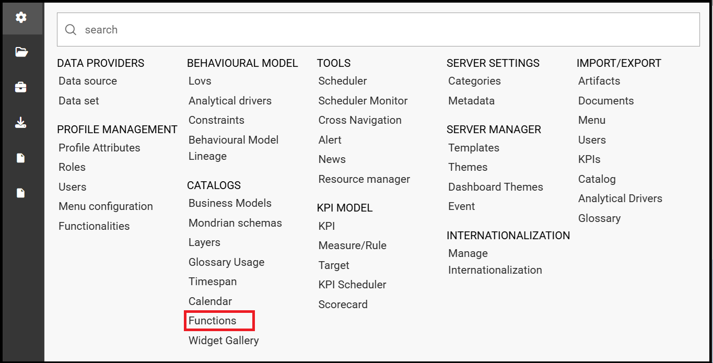
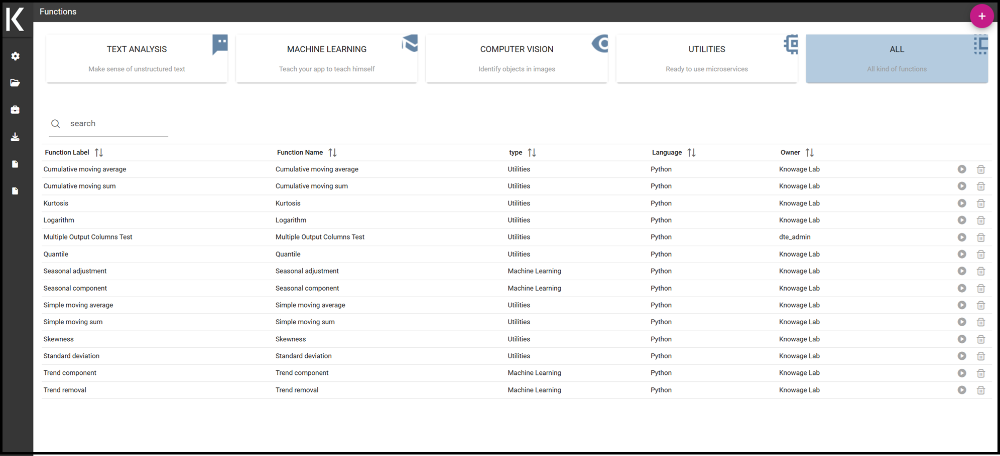
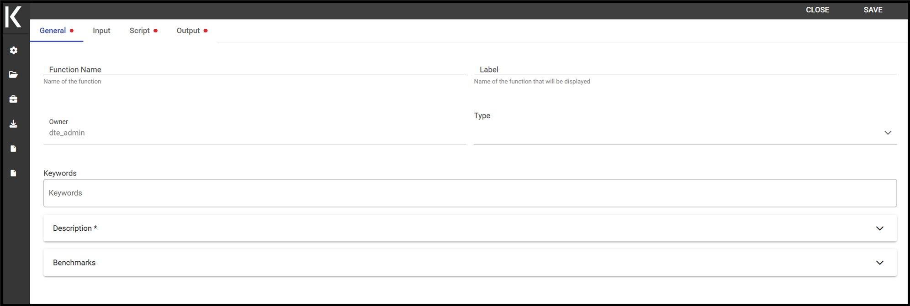
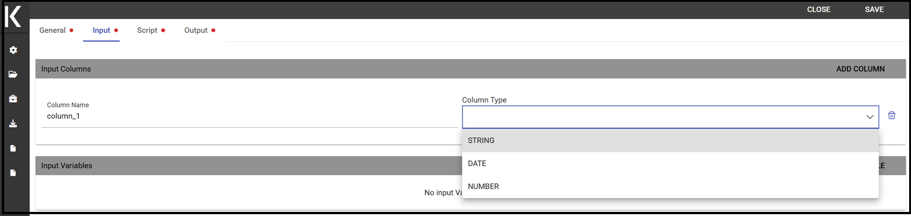
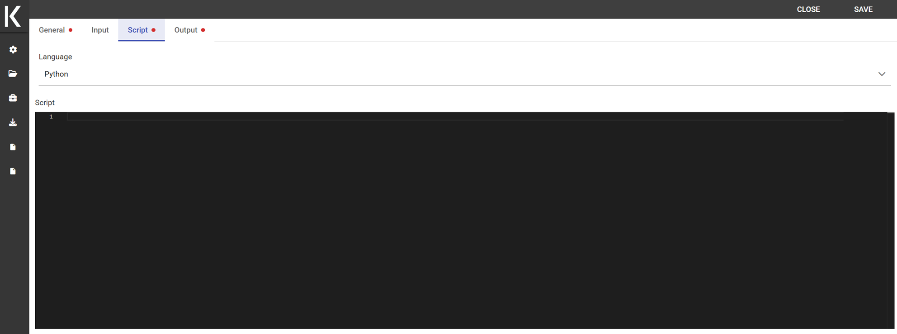
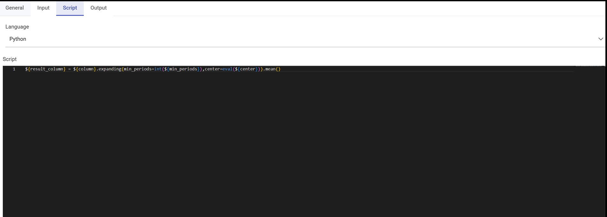
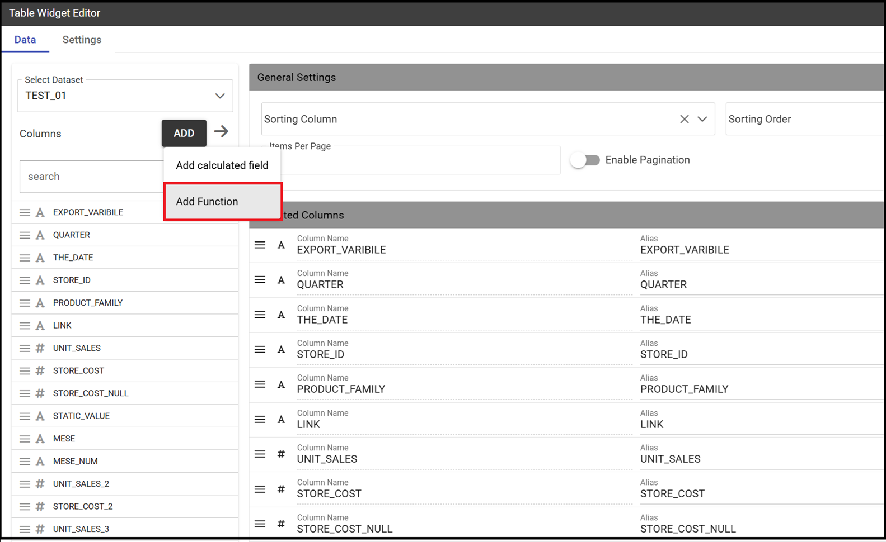
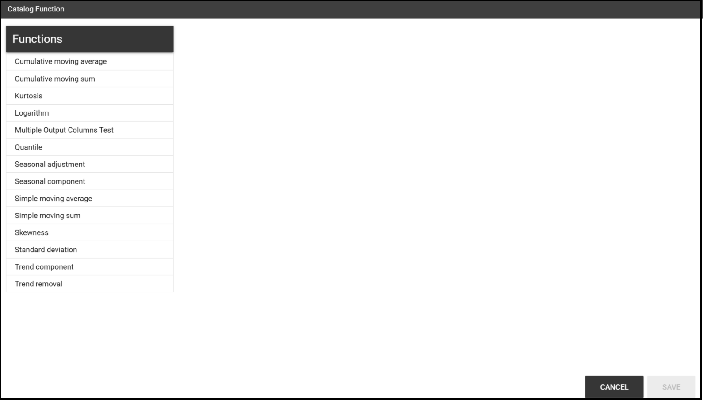
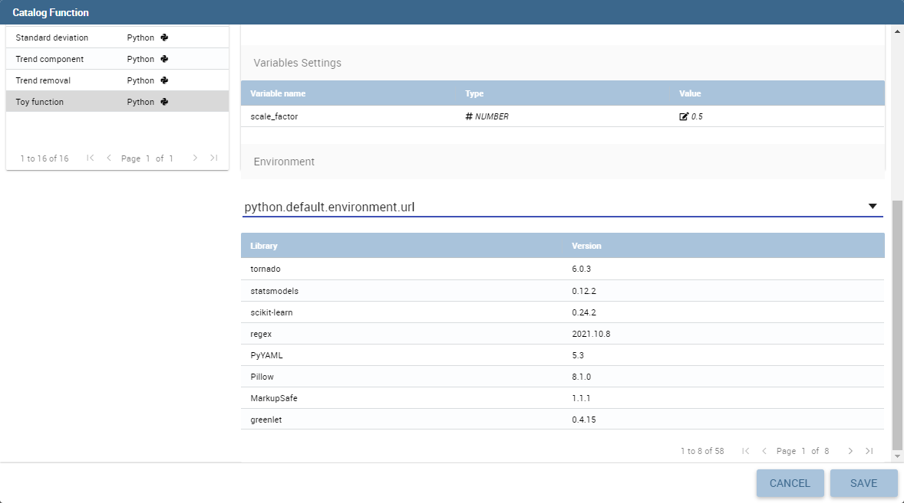

Create Advanced Data Analysis
========================================================================================================================

Knowage supports advanced data analysis allowing you to extract knowledge from large volumes of data, to improve your decision-making and business strategies. In particular, Knowage **Data Mining Engine** integrates Python scripting capabilities.

Thanks to this functionality, it is possible to execute Python scripts in an interactive way and enrich traditional datasets with new information. This means that it allows users to perform statistical or data mining analysis on different Knowage datasets.

The data scientists can thus integrate its own algorithm within Knowage and deliver their output to the end user, together with new advanced visualization options useful to discover meaningful insights hidden in the data.

The Catalog Function features leverage on the Python Engine. To understand how to install and configure it, please refer to the `Installation Manual <https://knowage-suite.readthedocs.io/en/master/installation-guide/python-installation.html>`__

Functions Catalog
------------------------------------------------------------------------------------------------------------------------

In this section we will see how to explore and handle the **Functions** framework., while in *Use a function inside documents* we will see how to use functions.
First click on the **Functions** menu under the **Catalogs** section from the Knowage main page as shown below.

    Functions Catalog from Knowage menu.

You will enter a page like the one shown in figure below.

.. _functioncatalinterf:

   Functions Catalog interface.

The actions that a user can perform depend on the user’s role. However, independently from the user’s role, in the interface all functions are shown by default. Referring to the figure above, the page is composed by:

-  **categories**: these are set by an administrator user and are used to classify the functions accordingly to their definition and goals. Moreover they help in browsing the functions; only the admin user can add and/or modify categories.

-  **search**: to easily search for a specific functions in the list;

-  **list of functions** (if there are any): these are visible and explorable by any kind of user. Anyway only an admin user can add and/or modify them.

.. hint::
    **Add or modify the categories**

         The admin can add a new category using the Domain management available on Knowage Server under the Server Settings section. To know more about this section, please refer to Section “Server settings” under the Installation and configuration section.

The categories for functions depends on an admin user. Taking *Functions Catalog interface* figure as an example, we have:

1. **Text Analysis**: makes sense of unstructured text,

2. **Machine Learning**: teachs your app to teach itself,

3. **Computer Vision**: identifies objects in images,

4. **Utilities**: ready to use microservices,

5. **All**: visualizes all your functions; this is the only category that cannot be changed or removed.

It is possible to search for a specific function in two ways: using the categories and clicking on one of them in order to filter the functions list or using the search box on the top of th list.

A preview of the function can be executed using the icon |image417| which opens a dialog, here you can select and configure a dataset among the available ones in order to test the function. Use the icon |image4172| for deleting the function. Functions cannot be deleted if they are used inside one or more documents.

To create a new function an admin user must click on the “Plus” icon available at the top right corner of the page. The action opens the interface shown below. Here you have four tabs that we describe shortly in the following subsections.

.. _creatingnewfunct:

    Creating a new function.

The General tab
~~~~~~~~~~~~~~~~~~~~~~~~~~~~~~~~~~~~~~~~~~~~~~~~~~~~~~~~~~~~~~~~~~~~~~~~~~~~~~~~~~~~~~~~~~~~~~~~~~~~~~~~~~~~~~~~~~~~~~~~

In this tab the user gives the general information about the function as the figure above shows. The admin user must type: the *name* of the function, the *label* with which it is identified uniquely (remember to use only numbers or letters and do not leave spaces between them) and the *type* that is the function category. The *keywords* are tags that can be assigned to a function, searching for a specific tag in the search box will retrive all the functions that have that tag. In order to add a new keyword you have to write the desired text and then press the submit button on the pc keyboard. The *Description* is where the user can insert a long text or images to be shown when the function is being configured inside documents. In the *Benchmarks* field users can insert information about the function performances.

The Input tab
~~~~~~~~~~~~~~~~~~~~~~~~~~~~~~~~~~~~~~~~~~~~~~~~~~~~~~~~~~~~~~~~~~~~~~~~~~~~~~~~~~~~~~~~~~~~~~~~~~~~~~~~~~~~~~~~~~~~~~~~

As shown in the following figure, the function admits two kinds of input: *columns* and *variables*.

    Input tab.

In the “Column” instance the function takes input columns that will be referenced inside the script. These columns are generic, the user must only specify their type and the name he later wants to use inside the script to access that specific column.

    The dataset input of the function settings.

In the “Variable” case, the user must insert one or more variables and match them with values using the dedicated area.

The Script tab
~~~~~~~~~~~~~~~~~~~~~~~~~~~~~~~~~~~~~~~~~~~~~~~~~~~~~~~~~~~~~~~~~~~~~~~~~~~~~~~~~~~~~~~~~~~~~~~~~~~~~~~~~~~~~~~~~~~~~~~~

The script tab is where an expert user defines the function through the usage of datamining languages (such as Python), as shown in Figure below.

    The script tab.

Inside the script users will have at their disposal a read-only `pandas.Series <http://pandas.pydata.org/pandas-docs/stable/generated/pandas.Series.html>`__ variable for each column defined in the input tab.
To reference one specific column users must use the placeholder *${column_name}*. Input variables will be accessible with the same syntax.

.. code-block:: bash
         :caption: Code syntax to recall inputs
         :linenos:

           ${column_name}
		   ${variable_name}

.. warning::
    **Input variables are read only**

         If you want to manipulate them you should first make a local copy and work on it.

The script will have to produce as output one or more *pandas.Series* variables and will store them inside the corresponding output placeholders. The following is an example of function template.

    Function template example.

The Output tab
~~~~~~~~~~~~~~~~~~~~~~~~~~~~~~~~~~~~~~~~~~~~~~~~~~~~~~~~~~~~~~~~~~~~~~~~~~~~~~~~~~~~~~~~~~~~~~~~~~~~~~~~~~~~~~~~~~~~~~~~

Finally it is important to define what kind of outputs the function has produced, according to the script generated in the previous tab. Using the “Output“ tab shown below, you must specify:

    Output tab.

-  **Field Type**: it can be *ATTRIBUTE* or *MEASURE*, and defines how the column will behave inside documents;
-  **Type**: it depends on the selected Field Type, it can be *String*, *Number (float)* or *Date*;

Use a function inside documents
------------------------------------------------------------------------------------------------------------------------

Now that functions have been created, they must be used inside documents. In this section we will go through all the steps that allow users to execute a function with a specific dataset.
This works both for the function preview and for the function used inside cockpits.
Depending on the scenario, you will have two different dialogs. 

When you are previewing the output of a function, you need to select the dataset you want to use to perform the preview. Therefore on the left card you will be able to select a dataset among the available ones. If the dataset has parameters you will be asked to insert values.

    Preview interface.
	
Instead, when you are creating a new widget that uses a function, you will need to click on the *Add function* link to access the configurator.

    Use a function in a widget.
	
.. warning::
    **You cannot use more than one function in the same widget**

         If you try do so you will get an exception.
		 
.. note::
    **Functions are available only in some widgets**
	
		Table, crosstable, chart and custom chart.
	
If you are using a function inside a widget it means that you have already selected the dataset you want to use. Therefore on the left card you will be able to select a function among the available ones.

    Catalog function interface in widgets.
	
From this point forward the rest of the configuration is identical for both widget and preview. The first thing that you have to do on the right tab, is bind the input columns of the function with the actual columns coming from the chosen dataset.

By doing this you are providing the **actual data** to the function template. From time to time you can provide different data to the same function just by changing the selected dataset. Depending on this, the same algorithm that is saved inside the function template will work on a different set of data and return different outputs. 

    Input columns binding.
	
If you have defined some input variables, you can also set their values.

    Input variables binding.

The last thing you have to choose is the working environment. You can choose the environment among the available ones. To understand better what is an environment, please refer to the `Installation Manual <https://knowage-suite.readthedocs.io/en/master/installation-guide/python-installation.html>`__.

    Choose the working environment.

After choosing an environment, the list of available libraries installed inside that specific environment appears on screen. You can search or filter libraries and their version in order to find the desired ones, and based on this you can choose the environment that suits your needs the most.

    New columns generated by the functions.
	
After saving, if you are inside widget configuration you will see that the new output columns generated by the function have been added to the dataset as shown in figure above.

Instead if you were running a preview you will see the output of the dataset execution appearing on screen as shown in the figure below.

    Output of the function preview.

