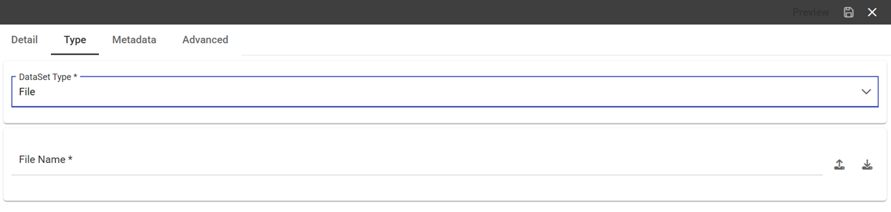

File Data Set
###########

A dataset of type File, see the following figure, reads data from an XLS or CSV file. To define a **File Dataset** select the File type, then upload the file by browsing in your personal folders and set the proper options for parsing it.

    File Dataset.

Once you have uploaded the file, you can check and define the metadata (measure or attribute) of each column.
