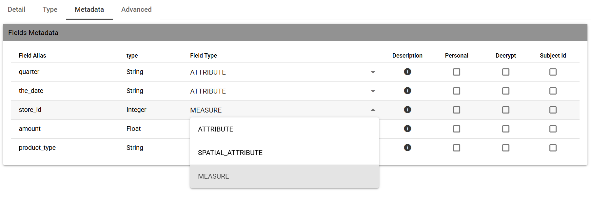

File Data Set
########################################################################################################################

A dataset of type File, see the following figure, reads data from an XLS or CSV file. To define a **File Dataset** select the File type, then upload the file by browsing in your personal folders and set the proper options for parsing it.

.. figure:: media/image30.png

   Creating a File Dataset.

As shown abowe by clicking on the upward arrow you can choose the file to upload.

    Uploading a File for a Dataset.

After choosing the file, the data of the file is automatically processed showing some rilevant information such as the delimiter character, 
the quotation character, the date format, etc.
The preview of some data is also shown. Anyway the whole content of the file can be visualized using the preview functionality available in the upper
right part of the wizard.

    Retrieved information when uploading files for a File Dataset.

Once you have uploaded the file, you can check and define the metadata (measures or attributes) of each column.

    Attributes and measures for a File Dataset.