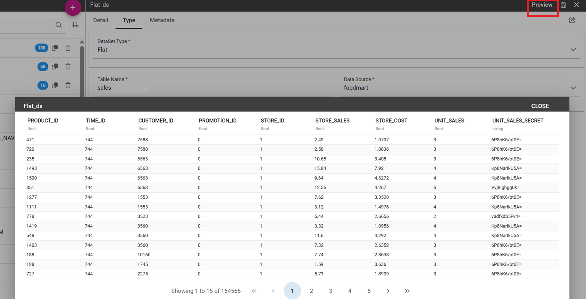

Flat Data Set
#############

A flat dataset allows the retrieval of an entire table from a data source. In other words, it replaces a dummy query like ``select * from sales`` by automatically retrieving all rows in a table. To create a flat dataset, simply enter the table and the data source name, as shown below.

    Flat Dataset.
