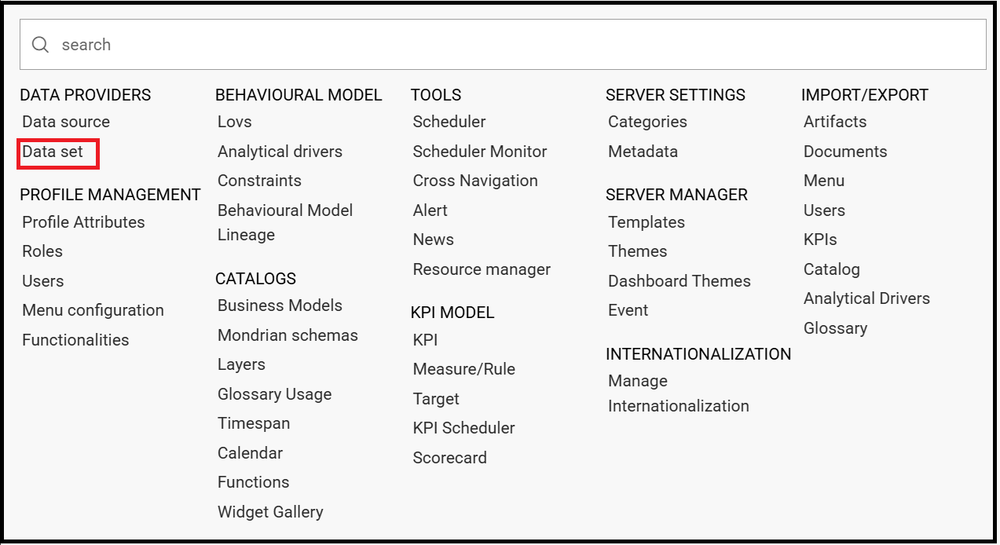

Create a new Data set
########################################################################################################################

A dataset allows you to read data from multiple sources and represents the portion of data used by the analytical documents. 

    Data set GUI.

.. toctree::
   :hidden:
   :caption: Table of Contents
   :maxdepth: 10
   
   query.rst
   file.rst
   flat.rst
   rest.rst
   solr.rst
   python.rst
   qbe.rst
   advanced.rst

.. Indices and tables
.. ==================

.. * :ref:`genindex`
.. * :ref:`modindex`
.. * :ref:`search`