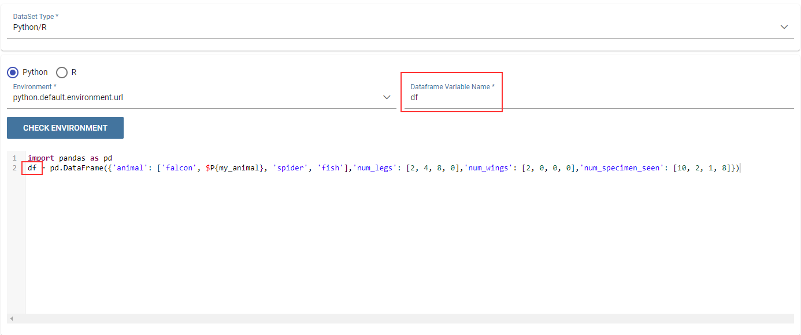

Python Data Set
########################################################################################################################

The Python/R dataset enables users to create a dataset by writing a Python or R script that directly retrieves data.
The developer of the dataset is free to write code which has to produce a **dataframe** variable as output (for Python scripts we refer to pandas dataframes). This variable will contain data that Knowage will later convert into its own format.

    Python/R dataset interface.

As shown in the picture in the field **Dataframe variable name** the developer has to specify the name of the variable in which the final output of the script is stored in the form of a dataframe.

In the field **Python environment** the user can select a working environment among the available ones defined in the **Configuration Management** section.

Inside the scripts it is possible to use parameters by the usual syntax *$P{}*.
