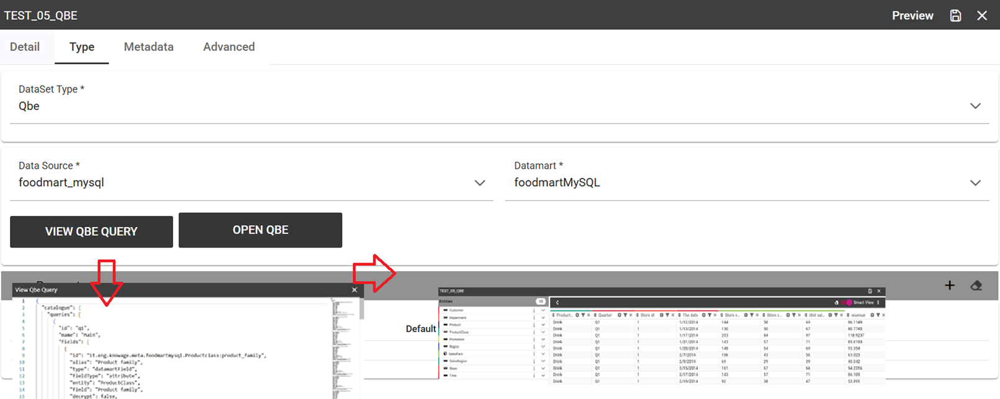

QBE Data Set
#######

.. important::
     **Enterprise Edition**

     If you purchased Knowage EE, this feature is available only in KnowageBD and KnowageSI

The QbE dataset type option allows the definition of dataset results based on a query defined over a metamodel. To define a QbE dataset you need to select the Data Source and Datamart that you want to use. Once chosen your datamart you can click the lookup button of the Open QbE field and a pop up window will appear showing a QbE interface where you can define your query. Once saved, you can check the generated query thanks to the View QbE Query.

All these features are exhibited below.

    QbE Dataset.
