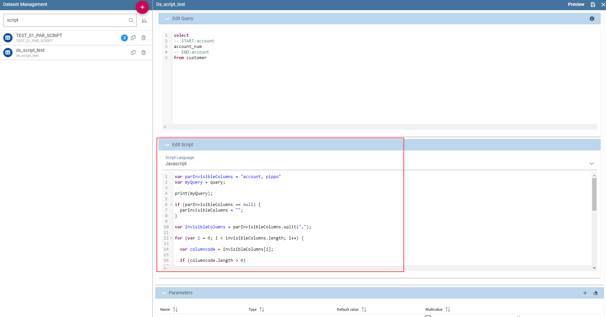

SQL Query Data Set
#############

Selecting the query option requires the BI developer to write an SQL statement to retrieve data.

The SQL dialect depends on the chosen data source. The SQL text must be written in the Query text area. Look at SQL query example.

.. code-block:: sql
         :caption: SQL query example
         :linenos:

          SELECT p.media_type as MEDIA, sum(s.store_sales) as SALES
          FROM sales_fact_1998 s
          JOIN promotion p on s.promotion_id=p.promotion_id
          GROUP BY p.media_type

It is also possible to dynamically change the original text of the query at runtime. This can be done by defining a script (Groovy or JavaScript) and associating it to the query. Click on the **Edit Script** button (see next figure) and the script editor will open. Here you can write the script. The base query is bounded to the execution context of the script (variable query) together with its parameters (variable parameters) and all the profile attributes of the user that executes the dataset (variable attributes).

.. _scripteditingdataset:

    Script editing for dataset.

In Code Query dataset’s script example we uses JavaScript to dynamically modify the ``FROM`` clause of the original query according to the value of the parameter year selected at runtime by the user.

.. code-block:: javascript
         :caption:  Query dataset’s script example
         :linenos:

          if( parameters.get('year') == 1997 ) { query = query.replace(FROM
          sales_fact_1998, FROM sales_fact_1997);
          } else { query = query; // do nothing
          }