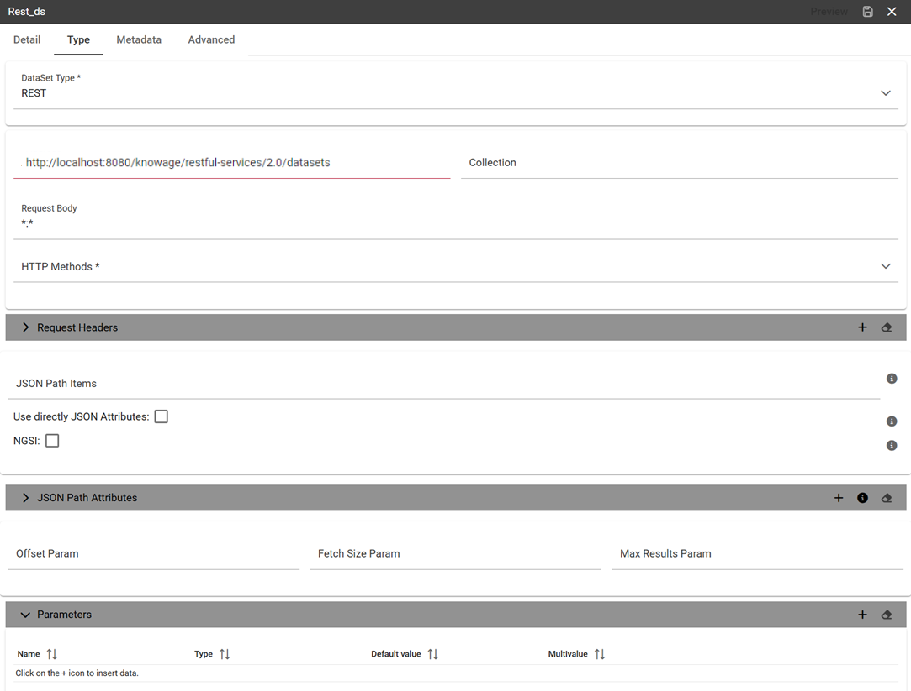

REST Data Set
########################################################################################################################

The REST dataset enables Knowage to retrieve data from external REST services. The developer of the dataset is free to define the body, method, headers and parameters of the request; then he has to specify how to read data from the service response using JSON Path expressions (at the moment no other ways to read data is available, therefore the REST service is presumed to return data in JSON format).

Let’s make as example in order to understand how it works. Suppose an external REST service providing data from sensors, we want to retrieve values from prosumers electricity meters, a prosumer being a producer/consumer of electricity, and that the request body should be something like:

.. code-block:: json
         :caption: Request body code
         :linenos:

         {  "entities": [ {
            "isPattern": "true",
            "id": ".*",
            "type":"Meter"
            } ]
         }

while querying for ``Meter`` entities, and that the JSON response is something like:

.. code-block:: json
         :caption: RJSON response code
         :linenos:

         {
                "contextResponses": [
             {
                "contextElement": {
                "id": "pros6_Meter",
                "type": "Meter",
                "isPattern": "false",
                "attributes": [
                    {
                      "name": "atTime",
                      "type": "timestamp",
                       "value": "2015-07-21T14:49:46.968+0200"
                     },
                     {
                      "name": "downstreamActivePower",
                      "type": "double",
                      "value": "3.8"
                     },
                    {
                      "name": "prosumerId",
                      "type": "string",
                      "value": "pros3"
                    },
                    {
                      "name": "unitOfMeasurement",
                      "type": "string",
                      "value": "kW"
                     },
                     {
                      "name": "upstreamActivePower",
                      "type": "double",
                      "value": "3.97"
                      }
                    ]
                    },
               "statusCode": {
                       "reasonPhrase": "OK",
                       "code": "200"
                             }
                 },
                    {
                "contextElement": {
                       "id": "pros5_Meter",
                       "type": "Meter",
                       "isPattern": "false",
                       "attributes": [
                    {
                       "name": "atTime",
                       "type": "timestamp",
                       "value": "2015-08-09T20:29:45.698+0200"
                    },
                    {
                       "name": "downstreamActivePower",
                       "type": "double",
                       "value": "1.8"
                    },
                     {
                       "name": "prosumerId",
                       "type": "string",
                       "value": "pros5"
                   },
                    {
                      "name": "unitOfMeasurement",
                      "type": "string",
                      "value": "kW"
                   },
                 {
                      "name": "upstreamActivePower",
                      "type": "double",
                      "value": "0"
                  }
                          ]
                 },
                      "statusCode": {
                      "reasonPhrase": "OK",
                      "code": "200"
                       }
                 }
                         ]
                 }

In this example we have two **Context Elements** with the following attributes:

 -  **atTime** ;
 -  **downstreamActivePower**;
 -  **prosumerId**;
 -  **unitOfMeasurement**;
 -  **upstreamActivePower**.

Let’s see how to define a Knowage dataset:

    REST dataset interface.

We specified

-  the URL of the REST service;
-  the request body;
-  the request headers (in this example we ask the service for JSON data);
-  the HTTP method;
-  the JSONPath to retrieve the items (see below), i.e. the JSONPath where the items are stored;
-  the JSONPaths to retrieve the attributes (see below), i.e. the JSONPaths useful to retrieve the attributes of the items we are looking for; those paths are relative to the "JSON Path items";
-  offset, fetch size and max results parameters, in case the REST service has pagination.

Once followed the steps above the user obtains upstream/downstream active power for each prosumer.

**NGSI checkbox** is specific for NGSI REST calls: it permits easy the job when querying the Orion Context Broker (`https://github.com/telefonicaid/fiware-orion) <https://github.com/telefonicaid/fiware-orion>`__ and to omit some of the REST fields (since the JSON format from NGSI specifications is fixed): you don’t need to specify headers, JSONPath items, JSONPath attributes (all available attributes are fetched) and pagination parameters (offset and fetch size).

When checking the **Use directly JSON attributes** checkbox, yon can skip the definition of the JSONPath attributes, since the JSON structure is presumed to be fixed as in the following example:

.. code-block:: json
         :caption: Use directly JSON attributes
         :linenos:

         {
          "contextResponses": [
            {
              "prosumerId":"pros1",
              "downstreamActivePower":3.1,
              "upstreamActivePower":0.0
            },{
              "prosumerId":"pros2",
              "downstreamActivePower":0.5,
              "upstreamActivePower":2.4
               }
                             ]
         }

Then it will be enough to define only the **JSON Path Items** and check **Use directly JSON Attributes** without defining the attributes; the attributes will be retrieved automatically from the JSON object.

In the above examples, the JSON Path Items will be ``$.contextResponses[:sub:`\*`]`` and the dataset result will look like:

.. table:: Dataset result
        :widths: auto

        +---------------+-----------------------+---------------------+
        |    prosumerId | downstreamActivePower | upstreamActivePower |
        +===============+=======================+=====================+
        | pros1         | 3.1                   | 0.0                 |
        +---------------+-----------------------+---------------------+
        | pros2         | 0.5                   | 2.4                 |
        +---------------+-----------------------+---------------------+

The REST dataset permits usage of profile attributes and parameters using the same syntax as for other dataset types: ``$<profile attribute>`` and ``$P<parameter>``. You can use both of them as placeholders in every field: most likely you need to use them in REST service URL or on the request body. As an example, suppose you want to retrieve the value of just one prosumer that is specified by the ``prosumerId`` parameter, you have to set the request body as:

.. code-block:: json
         :caption: Request body for prosumerId parameter
         :linenos:

         {
          "entities":[
            {
             "isPattern":"true",
             "type":"Meter",
             "id":"$P{prosumerId}"
            }
                     ]
         }