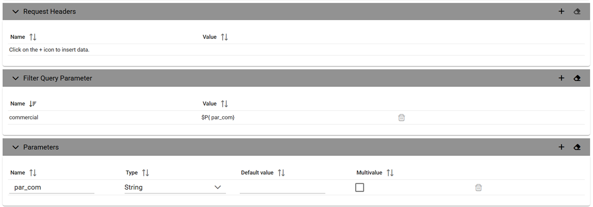
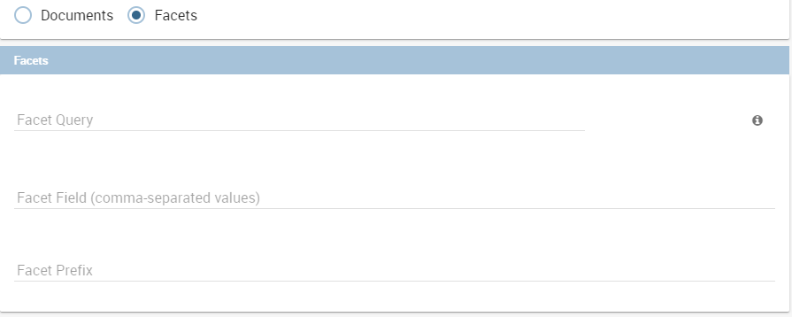

SolR Data Set
############

A dataset of type Solr, see the following figure, reads data from the popular Search Engine Solr. To define a **Solr Dataset** select the Solr type, then choose between Document or Facets type.

    Solr Dataset, Document type selected.

    The **Query** field is the Solr query using the Solr standard query syntax.
    The **Collection** field is the **core**, in Solr, the term core is used to refer to a single index and associated transaction log and configuration files (including the solrconfig.xml and Schema files, among others). Your Solr installation can have multiple cores if needed, which allows you to index data with different structures in the same server, and maintain more control over how your data is presented to different audiences. In SolrCloud mode you will be more familiar with the term collection. Behind the scenes a collection consists of one or more cores.

**Documents**

According to the Solr official documentation, Solr’s basic unit of information is a document, which is a set of data that describes something. A recipe document would contain the ingredients, the instructions, the preparation time, the cooking time, the tools needed, and so on. A document about a person, for example, might contain the person’s name, biography, favorite color, and shoe size. A document about a book could contain the title, author, year of publication, number of pages, and so on.

In the Solr universe, documents are composed of fields (these fields can be put into section **document field list**), which are more specific pieces of information. Shoe size could be a field. First name and last name could be fields.
If you have chosen the type "Documents", you can add the document fields to the list below called "Documents".

**Request header**, if there is the need, it is possible to customize the request header of the post http request, adding optional parameters.

  Solr Dataset, Optional fields for filtering parameters.

  Solr dataset can also use Profile Attributes.
  The syntax to include attributes into the dataset text is ``${attribute_name}``. Profile attributes can be single-value or multivalue.

The **filter query parameter** is the Solr fq parameter and defines a query that can be used to restrict the superset of documents that can be returned, without influencing score. It can be very useful for speeding up complex queries, since the queries specified with fq are cached independently of the main query.
These parameters can be used in combo with **document parameters** using the P{} notation like the example picture shows.

**Fields Mapping**

It is important to set field types correctly in order to use a Solr dataset without problems.
A field type defines the analysis that will occur on a field when documents are indexed or queries are sent to the index.

A field type definition can include four types of information:

    The name of the field type (mandatory).
    An implementation class name (mandatory). If the field type is a number and it has decimals it must be set as pdouble (not int or string!!).
    If the field type is TextField, a description of the field analysis for the field type.
    Field type properties - depending on the implementation class, some properties may be mandatory.

Example: <field name="REG_T_MP"    type="pdouble"   indexed="true" required="false" stored="true" multiValued="false"/>

**Faceting**

Faceting is the arrangement of search results into categories based on indexed terms.
If you choose Facets you can add the Facet Query.
This parameter allows you to specify an arbitrary query in the Lucene default syntax to generate a facet count.
The Facet Field is the facet.field parameter and identifies a field that should be treated as a facet. It iterates over each Term in the field and generate a facet count using that Term as the constraint. This parameter can be specified multiple times in a query to select multiple facet fields.
The Facet Prefix is the facet.prefix parameter limits the terms on which to facet to those starting with the given string prefix. This does not limit the query in any way, only the facets that would be returned in response to the query.

