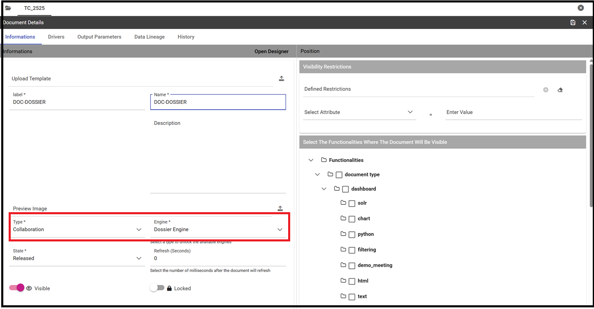
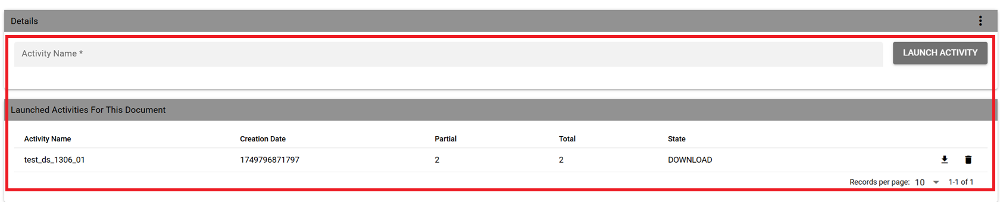
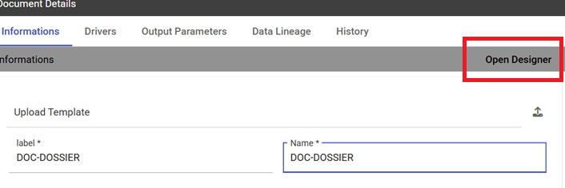
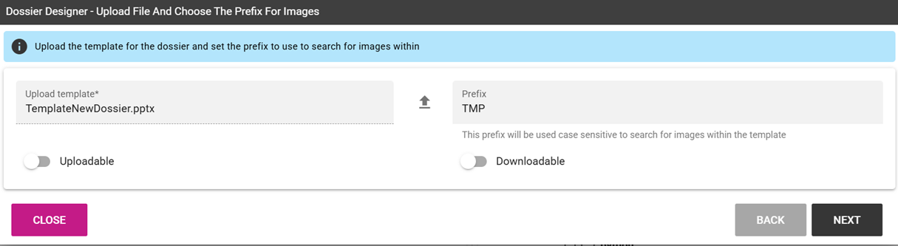
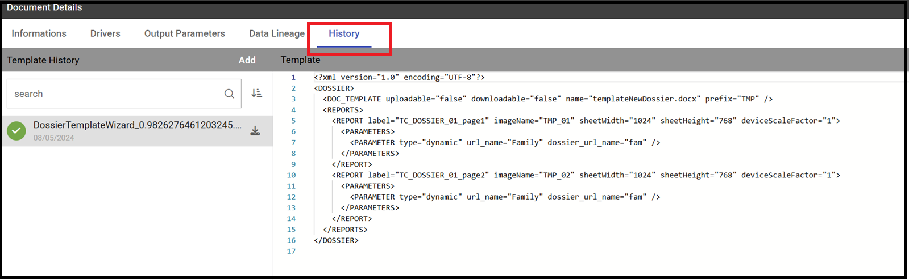

Create a Dossier
########################################################################################################################

A dossier document allows you to obtain a file processed starting from an input template. A typical example of using this feature is the creation of a file with variable content updated at each run. To do this, you need to create a dossier document with a well-configured XML template.

.. important::
       **Enterprise Edition**

       If you purchased Knowage EE, the following features are available only with the right license.

XML Template
------------------------------------------------------------------------------------------------------------------------

Tags and properties
~~~~~~~~~~~~~~~~~~~~~~~~~~~~~~~~~~~~~~~~~~~~~~~~~~~~~~~~~~~~~~~~~~~~~~~~~~~~~~~~~~~~~~~~~~~~~~~~~~~~~~~~~~~~~~~~~~~~~~~~

XML template is an XML file used to configure parameters needed to the elaboration. This file is uploaded during document creation and can be updated using the HISTORY tab visible in document edit mode.

In particular, tag allowed are:

-  **DOSSIER**: main tag used to define the dossier template;
-  **PPT_TEMPLATE**: contains properties related to the PPT template  (incompatible with DOC_TEMPLATE). You can specify:

  - *name*: the name of the template file name (supported file types are PPT, PPTX);

-  **DOC_TEMPLATE**: contains properties related to the DOC template (incompatible with PPT_TEMPLATE). You can specify:

  - *name*: the name of the template file name (supported file types are DOCX);
  - *downloadable*: true/false. Enable/disable the download of the template (optional);
  - *uploadable*: true/false. Enable/disable the upload of the template (optional);

-  **REPORT**: contains document's properties. You can specify:

  - *label*: the label of the document to be executed and that will substitute the image in the ppt or doc template;
  - *imageName*: the name of the image inside the docx document. If the document is multisheet, imageName value must be composed by the document label ending with the suffix "_sheet_<number>". For example, to use the screenshot of the first sheet, the value will be "documentLabel_sheet_0". This name can be set into title or description using the alternative text menu of the picture;
  - *sheetWidth*: the value of the width of the sheet (in pixels). This value will be used if sheetHeight is also set (optional);
  - *sheetHeight*: the value of the height of the sheet (in pixels). This value will be used if sheetWidth is also set (optional);
  - *deviceScaleFactor*: the value to use as the scaling factor to be applied when capturing the screenshot (optional);

-  **REPORTS**: encloses all REPORT tags;
-  **PARAMETER**: sets parameter for the document's execution if present. You can specify:

  -  *type*: static/dynamic. Defines the way the value is assigned to the parameter. With the dynamic type the user select at each execution the value through the analytical driver associated to the document; with the static type the value is passed once directly in the xml template and the user can't change it. The analytical driver used in the dossier must be the same as the one of the document to be executed;
  -  *url_name*: the url name of the analytical driver to be used. It must be the same as the one of the document to be executed;
  -  *url_name_description*: the description displayed in the driver value input panel for the analytical driver (mandatory if type="static");
  -  *dossier_url_name*: the url name of the analytical driver set into detail mode of the dossier;
  -  *value*: the value to be set into the driver (mandatory if type="static");

-  **PARAMETERS**: encloses all PARAMETER tags;
-  **PLACEHOLDER**: sets the placeholder. You can specify:

  -  *value*: the text to be replaced;

-  **PLACEHOLDERS**: encloses all PLACEHOLDER tags.

.. warning::

  This feature is compatible with docx created with Microsoft Word 2010 and later.

Image adding (PPT_TEMPLATE)
------------------------------------------------------------------------------------------------------------------------

Suppose you have to create a ppt/pptx file where to place the images relating to one or more reports. You have only to configure XML template defining some placeholders to be use for replacing and execute it. Below is shown an example of an XML template used for this purpose.

.. code-block:: xml
    :linenos:
    :caption: Example (a) of template for Dossier for Image replacement on docx file.

    <?xml version='1.0' encoding='utf-8'?>
    <DOSSIER>
    	<PPT_TEMPLATE name="PPT_TEMPLATE.pptx"/>
    	<REPORTS>
    		<REPORT label="Report-multivalue-parameter">
    			<PLACEHOLDERS>
    				<PLACEHOLDER value = "ph1"/>
    			<PLACEHOLDERS>
    			<PARAMETERS>
    				<PARAMETER type="static" dossier_url_name="state" url_name="state"
            url_name_description="State" value="Canada"/>
    			</PARAMETERS>
    		</REPORT>
    	</REPORTS>
    </DOSSIER>

The example above is using one placeholder and one static analytical driver.

.. warning::

    Please note that the file to be used as a template must be placed in ``TOMCAT_HOME/resources/<TENANT_NAME>/dossier`` path.

Image replacing (DOC_TEMPLATE)
------------------------------------------------------------------------------------------------------------------------

Suppose that you have to draw up a document where text is static but images related to need to be updated. With this functionality you will be able to use a docx file as a template and replace images inside it. More precisely, you can configure your XML and docx templates to allow Knowage to replace specific images with new ones obtained by the execution of specified documents.

Below is shown an example of an XML template used for this purpose.

.. code-block:: xml
    :linenos:
    :caption: Example (a) of template for Dossier for Image replacement on docx file.

    <?xml version='1.0' encoding='utf-8'?>
    <DOSSIER>
    	<DOC_TEMPLATE name="DOC_TEMPLATE.docx" downloadable="true" uploadable="true" />
    	<REPORTS>
    		<REPORT label="DOC_01" imageName="img_DOC_01" sheetWidth="1366" sheetHeight="650" deviceScaleFactor="1.5">
          <PARAMETERS>
    				<PARAMETER type="dynamic" dossier_url_name="family_dossier" url_name="family_document"/>
    				<PARAMETER type="dynamic" dossier_url_name="category_dossier" url_name="category_document"/>
          </PARAMETERS>
    		</REPORT>
    		<REPORT label="DOC_02" imageName="img_DOC_02" sheetWidth="1366" sheetHeight="650" deviceScaleFactor="1.5">
          <PARAMETERS>
    				<PARAMETER type="dynamic" dossier_url_name="family_dossier" url_name="family_document"/>
    				<PARAMETER type="dynamic" dossier_url_name="category_dossier" url_name="category_document"/>
          </PARAMETERS>
    		</REPORT>
    		<REPORT label="DOC_03" imageName="img_DOC_03" sheetWidth="1366" sheetHeight="650" deviceScaleFactor="1.5" />
    	</REPORTS>
    </DOSSIER>

Note that if the document used to replace an image does not have any parameter, the tag REPORT must be closed inline as you can see for the document with label "DOC_03" in the example above.

Also docx document must be modified to be compatible with the replacer.

In particular:
-  images in the document must be inserted by copying and pasting from the file system (or using the "insert image" feature);
-  imageName in the XML template must match the title (alternative text) of the image in the docx;
-  each image must have a unique name.

.. warning::

	To optimize dossier creation procedure, same document will be executed more than one time if and only if its parameters change. In that scenario sheetHeight, sheetWidth and deviceScaleFactor will be set for every execution. Moreover, if parameters don't change, document will be executed only one time and sheetHeight, sheetWidth and deviceScaleFactor values will stay the same as the first execution.

My first dossier
------------------------------------------------------------------------------------------------------------------------

You can create a dossier document by using the plus button and choosing "Generic Document". Proceed by filling in the necessary fields, selecting "Collaboration" as the type and "Dossier engine" as the engine and then choosing the XML template. If the documents to be executed have one or more analytical drivers, these drivers must be added to the dossier document from the DRIVER tab.

    Dossier document creation interface.

After saving the document, you can access the dossier activity page by clicking the play button.

    Dossier activity interface.

If one or more dynamic analytic drivers are set, the required inputs must be provided in the sliding menu that appears from the right. You will then go to the dossier activity page.

If upload/download are enabled, docx file template can be uploaded/downloaded using the three dot menu on the top right of the "Details" tab.

.. warning::

       This feature is available only for image replacing procedure.

To execute the document, enter a name for the activity and click *LAUNCH ACTIVITY*. A new task will be started in the STARTED state and a new row will be visible in the table below. At the end of the execution of the task, the processed file can be downloaded with the appropriate download icon.

Each line allows you to see useful information on the activity such as the values of the drivers used for the execution by clicking on the info icon, download the processed file by clicking on the download icon and remove itself by clicking on the trash icon.

Dossier Wizard
------------------------------------------------------------------------------------------------------------------------

Starting from Knowage 8.2 it is possible to configure the dossier template document and his xml template easily using the Dossier Wizard.

You can use this feature opening the wizard from an dossier document already saved or directly from the workspace.

Starting from a saved document
------------------------------------------------------------------------------------------------------------------------
Click the *Open Designer* link inside the dossier document.

   Document Designer.

The following wizard page appears requesting the document template (docx or pptx format) and 

    Dossier Wizard

As shown you user can select a new document template (docx or pptx format) and the image prefix. 
The Uploadable/Downloadable features can be enabled in order to allow the downloading and updating of the document template inside the dossier document.

    It is mandatory to select the images placeholder prefix.

    This page will show image placeholders found inside the template document, the icon shows that they should be managed.

In the next page if placeholders are found inside the template document, they are shown on the left side panel.
In the central-right panel user can click on + button and add a source document in order to link it to the image placeholder.

    After selecting the document, user can select the parameters (drivers or views) to be linked to the placeholder. In this example there are 2 drivers ("familia","categoria")

When user selects the document and drivers, they will be shown on the panel and can be configurated as follows.
Driver Link  Type can be of Dynamic, Static or Inherit type. Inherit type means that the parameter selected will be the same used in the source document selected.
We kindly suggest to use "Inherit" for simplifying configuration assets.

    User can select the Driver Type.

    Driver Link Inherit type.

On other hands user can select to link a VIEW from the source document to the image placeholder:

    User can select the view linked to the document.

If user wants to rollback and reset modification, he can click on "Reset placeholder" icon on the image placeholders panel.

    Reset placeholder feature.

After clicking on SAVE BUTTON, the xml template should be updated and visible on History-template panel:

    Updated dossier xml template.

Starting from the workspace
------------------------------------------------------------------------------------------------------------------------

Another way to use the Dossier Wizard is starting from the Workspace.

    Select "My Analysis" for starting a new Dossier document with Dossier Wizard.

        Click on + button and select "Dossier".

Note: End users can create dossier documents using views only. Drivers are not usable for end users.

        Example of document with no views associated.
