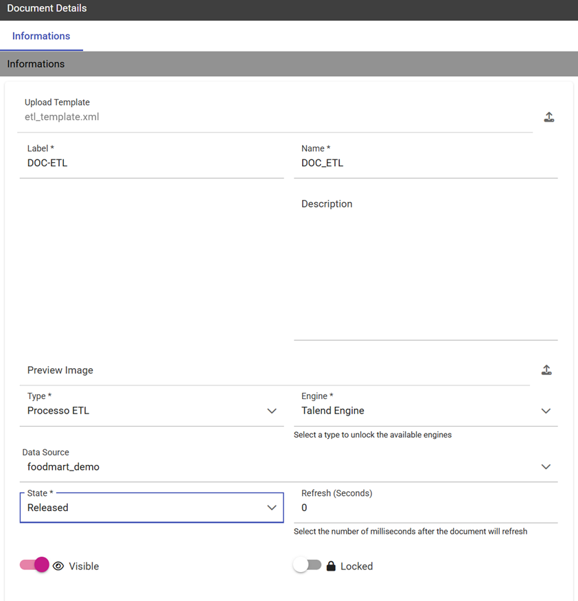

Create an ETL Process
#########

Knowage allow the upload of data from source systems according to a common ETL logic, as well as the monitoring of data flows continuously feeding the data warehouse. To this end, Knowage provides the ETL **Knowage Talend Engine**.

KnowageTalendEngine
~~~~~~~~~~~~~~~~~~~~~~~~

Knowage Talend Engine integrates the open source tool Talend Open Studio (TOS). Talend Open Studio (TOS) is a graphical designer for defining ETL flows. Each designed flow produces a self-alone Java or Perl package. TOS is based on Eclipse and offers a complete environment including test, debug and support for documentation.

The integration between Talend and Knowage is twofold. TOS includes Knowage as a possible execution target for its job, while Knowage implements the standard context interface for communicating with Talend. Jobs can be directly executed from Knowage web interface or possibly scheduled.

Furthermore, the analytical model for monitoring ETL flows can be successfully applied to the analysis of audit and monitoring data generated by a running job. Note that this is not a standard functionality of Knowage suite, but it can be easily realized within a project with Knowage. To create an ETL document, you should perform the following steps:

-  Job design (on Talend);
-  Job deploy;
-  Template building;
-  Analytical document building;
-  Job execution.

In the remainder of the section, we discuss in detail all steps by providing examples.

Job design
~~~~~~~~~~~~

The job is designed directly using Talend.

Designing an ETL job requires to select the proper components from Talend tool palette and connect them to obtain the logic of the ETL flow. Talend will map to appropriate metadata both the structure of any RDBMS and the structure of any possible flow (e.g., TXT, XLS, XML) acting as input or output in the designed ETL.

To design the ETL, several tools are available: from interaction with most RDBMS engines (both proprietary and open source) to support for different file formats; from logging and auditing features to support for several communication and transport protocols (FTP, POP, code, mail); from ETL process control management to data transformation functionalities.

Talend also supports data quality management. Furthermore, it enables the execution of external processes and can interact with other applications, e.g., open source CRM applications, OLAP and reporting tools.

The tMap tool allows the association of sources to targets according to defined rules. The main input is the source table in the data warehouse, while secondary (or lookup) inputs are dimensions to be linked to data. The output (target) is the data structure used for aggregation.

It is also possible to design parametric ETL jobs. We will see how to manage them in the next steps.

Job deploy
~~~~~~~~~~~~

Once you have designed the ETL job, you should deploy it on Knowage Server. First of all, configure connections properties to Knowage Server. Select **Preferences** > **Talend** > **Import/export** from within Talend. Then set connection options as described below.

.. _connectionsettings:
.. table:: Connection Settings.
    :widths: auto

    +-----------------------------------+-----------------------------------+
    |    Parameter                      | Value                             |
    +===================================+===================================+
    |    Engine name                    | KnowageTalendEngine               |
    +-----------------------------------+-----------------------------------+
    |    Short description              | Logical name that will be used by |
    |                                   | Talend                            |
    +-----------------------------------+-----------------------------------+
    |    Host                           | Host name or IP address of the    |
    |                                   | connection URL to Knowage         |
    +-----------------------------------+-----------------------------------+
    |    Port                           | Port of the connection URL to     |
    |                                   | Knowage                           |
    +-----------------------------------+-----------------------------------+
    |    Host                           | Host name or IP address of the    |
    |                                   | connection URL to Knowage         |
    +-----------------------------------+-----------------------------------+
    |    Password                       | Password of the user that will    |
    |                                   | perform the deploy                |
    +-----------------------------------+-----------------------------------+ 

Once you have set the connection, you can right click on a job and select **Deploy on Knowage**. This will produce the Java code implementing the ETL and make a copy of the corresponding jar file at ``\\resources\\talend\\RuntimeRepository\\java\\Talend`` project name of Knowage Server. It is possible to deploy multiple jobs at the same time. Exported code is consistent and self-standing. It may include libraries referenced by ETL operators and default values of job parameters, for each context defined in the job. On its side, Knowage manages Talend jobs from an internal repository at ``resources/talend/RuntimeRepository``, under the installation root folder.

Template building
~~~~~~~~~~~~~~~~~~

As with any other Knowage document, you need to define a template for the ETL document that you wish to create. The ETL template has a very simple structure, as shown in the example below:

.. code-block:: xml
         :linenos:
         :caption: ETL template.

          <etl>
          	<job 	project="Foodmart" 
			jobName="sales_by_month_country_product_familiy" 
			context="Default"
          		version="0.1"
          		language="java"
		/>
          </etl>

The tag job includes all the following configuration attributes:

-  project is the name of the Talend project.
-  jobName is the label assigned to the job in Talends repository.
-  context is the name of the context grouping all job parameters. Typically it is the standard context, denoted with the name **Default**.
-  version is the job version.
-  language is the chosen language for code generation. The two possible options are: Java and Perl.

Values in the template must be consistent with those defined in Talend, in order to ensure the proper execution of the ETL document on Knowage Server.

Creating the analytical document
~~~~~~~~~~~~~~~~~~~~~~~~~~~~~~~~

Once we have created the template, we can create a new analytical document following the standard procedure. Use the plus button and choose "Generic Document". Proceed by filling in the necessary fields, uploading the XML template we have just created and selecting “ETL Process” as the type and “Talend engine” as the engine. Select then the corrisponding data source and the document state.

    ETL document creation interface.

If the job has parameters, they should be associated to the corresponding analytical drivers, as usually. In other words, you have to create an analytical driver for each context variable defined in the Talend job.

Job execution
~~~~~~~~~~~~~~

A Talend job can be executed directly from the web interface of Knowage Server and of course from a Talend client.
To execute the job on Knowage, click on the play button near the document in the document browser, like with any other analytical document. The execution page will show a message to inform that the process was started.

    ETL document execution interface.

Job scheduling
~~~~~~~~~~~~~~~~

Most often it is useful to schedule the execution of ETL jobs instead of directly running them. You can rely on Knowage scheduling functionality to plan the execution of Talend jobs.
While defining a scheduled execution, you can set a notification option which will send an email to a set of recipients or a mailing list once the job has completed its execution. To enable this option, check the flag **Send Mail**.
