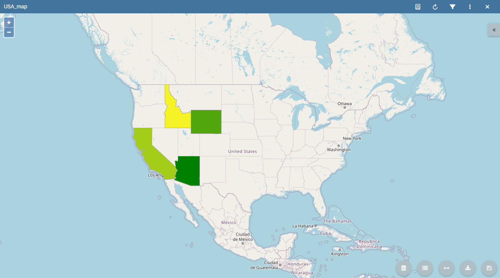

Create GIS document
##############

Location intelligence is based on the idea that geographical spaces are a particular analytical dimension in the BI domain. It is based on:

-  the geographical representation of data,
-  interaction with GIS systems,
-  spatial data,
-  spatial operators.

Location Intelligence usually guarantees:

-  an immediate perception of a phenomena distribution over a geographical area,
-  interactivity, 
-  multivariate analysis,
-  temporal snapshots.

Location Intelligence is becoming widely used, mostly thanks to the emergence of location services such as Google Maps. This domain is very easy to use for all kinds of users, usually analysts and operational profiles. By contrast, its management is not as easy, especially if it implies an internal management of the geographical data base.

Basic concepts
-------------------

The term Location Intelligence refers to all those processes, technologies, applications and practices capable to join spatial data with business data, in order to gain critical insights, to better support decisional processes and to optimize business activities.

At the technological level, this correlation is the result of the integration between the software systems that manage these two heterogeneous types of data: geographic information systems (GIS), which manage spatial data, and Business Intelligence systems (BI), which manage business data. This integration gives rise to new technological tools supporting decision-making processes, and the analysis on those business data that are directly or indirectly related to a geographic dimension.

Location Intelligence applications significantly improve the quality of users’ analysis based on a geographic dimension. Indeed, a Data Warehouse (DWH) almost always included such information. By representing the geographic distribution of one or more business measures on interactive thematic maps, users can quickly identify patterns, trends or critical areas, with an effectiveness that would be unfeasible using traditional analytical tools.

More on GIS and Spatial Data
-----------------------------------

Spatial Data
~~~~~~~~~~~~

The term *spatial data* refers to any kind of information that can be placed in a real or virtual geometric space. In particular, if the spatial data is located in a real geometric space — which is a geometric space that models the real space — it can be defined as *geo-referenced* data.

    A base layer in raster and vector format.

Spatial data are represented through graphical objects called maps. Maps are a portrayal of geographic information as a digital image file suitable for display on a computer screen.

According to the *Open Geospatial Consortium* (OGC) definition, a map is made of overlapping *layers*: a *base layer* in raster format (e.g. satellite photo) is integrated with other layers (*overlays*) in vector format. Each overlay is made of homogeneous spatial information, which models a same category of objects, called *features*.

A feature is called *geographic feature* when the constituting objects are abstractions of real-world physical objects and can be located univocally within a referenced coordinate system, according to their relative position.

    Overlapping layer.

A feature includes:

-  a set of attributes that describes its geometry (vector encoding). Geometric attributes must describe its relative shape and position in an unambiguous way, so that the feature can be properly drawn and located on the map, according to the other features of the layers.
-  a set of generic attributes related to the particular type of physical object to be modeled. Generic attributes are not defined: they vary according to the type of abstraction that users want to give to each real-world physical object.

    Examples of feature.

There is a wide range of standards that can be used for the vector encoding of spatial data (e.g. GeoJSON, GML, Shape File, etc.). Most geographic information systems can perform the needed conversions among various encodings.

GIS
~~~

Geographic Information Systems (GIS) provide a set of software tools designed to capture, store, extract, transform and display spatial data. Therefore, the term GIS refers to a set of technological components that manage the spatial data during its whole life cycle, starting from the capture of the data up to its representation and re-distribution.

From a logical point of view, the key functionalities of a GIS do not differ from those of a BI system. Both systems are characterized by some specific components supporting the effective storage of data, some others supporting their manipulation, their re-distribution or their visualization. On the other hand, the implementation of these functionalities deeply differs between GIS and BI systems, since they deal with two different types of data (alphanumeric and spatial data).

    Definition of GIS, BI, spatial data and business data.

Unlike the market of BI suites, the market of GIS is characterized by a wide spread of open standards, adopted by all main vendors, which regulate the interaction among the various components of the system at all architectural levels.

.. note::
         **Open Gesospatial Consortium (OGC)**

            The most important International organization for standardization in the GIS domain is the Open Geospatial Consortium (OGC), involving 370 commercial, governmental, non-profit and research organizations. Read more at `www.opengeospatial.org. <http://www.opengeospatial.org/>`__

As for the integration between GIS and BI systems, the OGC has defined two main standards supporting the re-distribution of the spatial data:

-  the *Web Map Service* (WMS). It describes the interface of services that allow to generate maps in a dynamic way, using the spatial data contained in a GIS.
-  the *Web Feature Service* (WFS). It describes the interface of services that allow to query a GIS, in order to get the geographic features in a format that allows their transformation and/or spatial analysis (e.g. GML, GeoJson, etc.).

.. note::
         **WMS and WFS standards for spatial data distribution**

            Full documentation about the WMS and WFS standards can be found at `www.opengeospatial.org/standards/wms <http://www.opengeospatial.org/standards/wms>`__ and `www.opengeospatial.org/standards/wfs. <http://www.opengeospatial.org/standards/wfs>`__
 
Knowage suite offers an engine supporting the Location Intelligence analytical area, the **GEOReport Engine**, generating thematic maps.

Analytical document execution
----------------------------------

Let’s have a look on the user interface of Knowage Location Intelligence features.

Figure below provide an example of a BI analysis carried out thanks to map. In our example, the colour intensity of each state shows proportionally increases according to the value of the indicator selected. States who have no record connected are not coloured at all.

    Example of GIS document. USA sales per store

Click on the arrow on the top right to open the Location Inteligence options panel. Here you can choose the **Map Type**, the indicators to be displayed on the map and you can enter filters.

    Arrow button (left), Location Inteligence options panel (right) .

The **Map Type** available are:

-  **Map Zone**: the different map zone are filled with different colour range according to the indicator values
-  **Map Point**: the indicator values are displayed by points with different radius. A bigger radius means a higher indicator’s value.
-  **Map Chart**: thanks to this visualization type you can compare more than one indicators simultaneously. Choose which indicators compare among the available ones. You have to mark them in the **indicator** panel area to visualize them. The charts appears on the map displaying the selected indicators’ values.

These three typologies of data visualization on map are compared below.

    Map Zone (left), Map Point (center) and Map Chart (right).

Now you can add extra layers on the default one. Switch to the **layer** tab of the Location Inteligence options panel.

Here click on the plus button near the **Layer** section and choose the layers you want to add. Mark them once added in the Location Intelligence area in the Layer box and the selected layer are displayed. 

.. _stepsforlayeradd:

    Steps for layer adding
    
In our example we upload some waypoints, you can see the results obtained in next figure.
   
.. _mapwithlayers:

    Map with two layers

Now let’s focus on **Configuration** tab of Location Inteligence panel option. Here you can set some extra configurations. Let’s have a look on them for each data visualization typology.

For the **Map Zone** you can set:

-  **Method**: the available ones are quantiles or equal intervals. If you choose quantiles data are classified into a certain number of classes with an equal number of units in each class. If you choose equal intervals the value are divided in ranges for each class, the classes are equal in size and their number can be set. The entire range of data values (max - min) is divided equally into classes however many classes have been chosen.
-  **N° of classes**: the number of intervals in which data are divided.
-  **Range colors**: you can choose the first and the last color of the range. For both of them you can use a color pixel by clicking on the coloured square. An example is provided below.

    Map Zone extra configurations

For the **Map Point** you can set:

-  **Color**: the color of the circle.
-  **Min/Max value**: the minimum and the maximum circles radius.

For the **Map Chart** you can set the color of each chart’s bar.

We can conclude our overview on GIS document describing the buttons located at the bottom right corner, you can see them underlined in the following figure. From the left to the right this bottons can be used for: se the preview of the linked dataset, have a look at the legend, compute a measure of an area of the map, do the .pdf export of the map and save the map.

.. _legendmeasurexport:

    From the left to the right: Legend, Measure and Export bottom.

Extra functionalities
~~~~~~~~~~~~~~~~~~~~~

Let’s come back to Location Layer main tab and focus on the **Select Mode** area. If cross navigation has been set you find two options: **Identify** and **Cross navigation**.

Selecting **Cross Navigation** the **Spatial Item** tab appears. In this tab you can configure your selection. To make your selection press CTRL key and choose the area on the map with the mouse. If you choose **near**, the features in the Km set are selected. If you choose **intersect**, the features which borders intersect your designed area. If you choose **inside**, only the features completely inside your area of selection are considered for the cross navigation.

When the selection is made, a box appears. In this box you find cross navigation information. The number of features selected and a button to perform the cross navigation with the active selection.

GEOReport Engine
-----------------------

The **GEOReport Engine** implements a *bridge integration* architecture.

Generally speaking, a bridge integration involves both the BI and the GIS systems, still keeping them completely separated. The integration between spatial data and business data is performed by a dedicated application that acts as a *bridge* between the GIS and the BI suite. This application extracts the spatial data from the GIS system and the business data from the BI suite, to answer the users’ requests. Afterwards, it joins them and provides the desired results.

In particular, the **GEOReport Engine** extracts spatial data from an external GIS system and join them dynamically with the business data extracted from the Data Warehouse, in order to produce a thematic map according to the user’s request. In other words, it acts as a *bridge* between the two systems, which can consequently be kept totally decoupled.

    Bridge integration architecture of the **GEOReport Engine**.

The thematic map is composed of different overlapping layers that can be uploaded from various GIS engines at the same time. Among them just one layer is used to produce the effective thematization of the map: this is called *target layer*.

You can manage your layers inside the **Layers Catalogue**.

Here you can upload the following layer types:

-  File;
-  WFS;
-  WMS;
-  TMS;
-  Google;
-  OSM.
   
Go to **Catalogs > Layers** in the Knowage menu, as shown below.

    Layers catalog menu item

Here there is the list of already created layers and you can reate a new one clicking on the dedicated plus icon. On the right side you are asked to fill few settings before saving the new layer, like a label, a name and a type. At the bottom part of layer configuration you can manage the layer visibility. Mark the role you want to give visibility previlegies on this layer. If none is marked, the layer is visibile to all role by default. The first settings are equals for all types of layers. Once you choose the layer type, instead, some fields may change according to the layer needs. For example if you choose **File** as type you have the possibility to chose your own .json file and upload it. After having done this, the path where your file is been uploaded is shown among the setting. If you choose **WFS** or **WMS** you are asked to insert a specific url. Below you can find an example of creation of a new layer of type file.

    Creating a new file layer

Once you have set all layer configuration you can switch to filter setting. Click on the tab you can find in the upper part of the screen, as the following figure shows.

    Filter tab

Here you can choose which filters will be active during visualization phase. Choose among the properties of your layer, the available ones are only the string type.

Now you need to have a well-configured dataset to work with the base layer. The dataset has to contain one column matching a property field as type and values otherwise you will not be able to correctly visualize your data on the map.

For example you can use a query dataset, connected to the foodmart data source, whose SQL query is shown in the following code.

.. code-block:: sql
      	 :caption: GeojSON file except.
         :linenos:
	 
         SELECT r.region_id,
            s.store_country,
            r.sales_state,
            r.sales_region,
            s.store_city,
            sum(f.store_sales) as store_sales,
            avg(f.unit_sales) as unit_sales,
            sum(f.store_cost) as store_cost
         FROM sales_fact_1998 f,
            store s,
            time_by_day t,
            sales_region r 
         WHERE s.store_id=f.store_id 
            AND f.time_id=t.time_id 
            AND s.region_id = r.region_id                  
            AND STORE_COUNTRY = 'USA' 
         GROUP BY region_id, s.store_country, r.sales_state, r.sales_region, s.store_city                                     

   
Create and save the dataset you want to use and go on preparing the document template.

Template building with GIS designer
----------------------------------------

GIS engine document template can now be built using GIS designer. Designer is available both for administrator users and for end users. The first can create a new GIS document in the document broswer section (for this part refer to **Template building with GIS designer for technical user** section) while an end user must use the workspace section to create a new document. The creation process for an end user and designer sections are described in the text below.

A GIS document can be created by a final user from workspace area of Knowage Server. Follow **My Workspace » My Analysis** and click on the “Plus” icon available at the top right corner of the page and launch a new **Geo-referenced analysis**.

    Start a new Geo-referenced analysis.

The designer is divided in four sections that will be described in detail in the following.

    GIS designer.

Designer sections
----------------------

Dataset & Layer
~~~~~~~~~~~~~~~

In the first section the user can choose a dataset for joining spatial data and business data and define the target layer. Click on **add dataset** to choose among the available datasets and on **add layer** to select a target layer. These buttons will open a popup with the list of all available datasets and layer catalogs, selecting one item from the list and clicking save the selected item will be chosen for template.

.. _listavailbcatalog:

    List of available layer catalogs.

Once the dataset and the layer have been selected the Dataset join and Indicators sections will be enabled. The user can also change the dataset and layer in a second moment through the buttons **change dataset** and **change layer**.

.. _targetlayerdef:

    Dataset and target layer definition.

It is also possible to create map without business data. When there is no dataset multiple layers can be selected, like figure below shows.

    Multiple selection of available layers.

Dataset join
~~~~~~~~~~~~

Dataset join section is for configuring joining spatial data and business data. This section is only available when the dataset is selected for the document. Clicking on **add join column** a new emptu row appears with two comboboxes with which the user has to select the dataset column and layer column to join. 

    Dataset join columns interface.

Indicators
~~~~~~~~~~

Measures definition is configurable by adding indicators. The interface is shown below. This section is available only when dataset is chosen for the document. In order to add a new indicator the user must click on **add indicator** and choose the measure field from selected dataset and a correspondig label that will be used on map. Label should be inserted as free text by editing corresponding table column.

.. _indicatorsinterface:

    Indicators interface.

Filters & Menu
~~~~~~~~~~~~~~

Through the **Menu** panel the user can enable or disable some available map functions and features, like the legend, the distance calculator and so on.

Using the filtering dedicated area you can define which dataset attributes can be used to filter the geometry. Each filter element is defined by a name (e.g. "store_country") and a label (e.g. "COUNTRY"). The first value is the name of the attribute as it is displayed among the dataset attribute fields. The second one is the label that will be displayed to the user. This section is only present when dataset is chosen for the document. Clicking on add filter creates empty pair.

.. _filtersinterfac:
.. figure:: media/image369.png

    Filters & Menu interface.

Edit map
~~~~~~~~

When all required fields are filled in the basic template can be saved. From workspace user is first asked to enter label and description of new created document as in the following figure. 
    

    Saving a new geo document for end user.

When the template is saved successfuly EDIT MAP button is enabled on the top right corner of the main toolbar. Clicking the edit map button will open created map. An example is given below. In edit mode you are able to save all custom setting made on map; all the available settings are explained in the previous section **Analytical document execution**.
   

    Map in edit mode with save template available.

Template building with GIS designer for technical user
----------------------------------------------------------

The administrator can create a new GIS document clicking on the plus button in the document broswer section and selecting "Gneric document". Choose a Label and a Name, **Location Intelligence** as Type and **GIS Engine** as Engine and the State. The selection of a dataset and the corresponding data source from which the data come from are optional.

Open then the designer clicking on the **Open Designer** button. When the designer is opened the interface for building a basic template is different depending on if the dataset is chosen for the document or not.

.. _gisdesigneraccestemplbuild:

    Gis document creation interface.

We have already described the Gis Designer in the previous section, when it is created by a final user. The difference relies only in how the designer is launched so we will not repeat the component part and recall to *Designer section* paragraph for getting details. 

Cross navigation definition
-----------------------------------

It is possible to enable cross navigation from a map document to other Knowage documents. This means that, for instance, clicking on the state of Texas will open a new datail documents with additional information relative to the selected state.

You need to define the output parameters as described in Section *Cross Navigation* of *Analytical Document* Chapter. The possible parameters that can be handled by the GIS documents are the attribute names of the geometries of layers.

Once you have created a new Cross Navigation in the Cross Navigation Definition menu in Tools section, it is possibile to navigate from the GIS document to a target document. There is still a little step to do to activate the cross navigation.

    Cross navigation option.

Open the **layer** tab of the Location Intelligence options panel and click on cross navigation select mode. Now the cross navigation is activated and if you click, for example, on one of the state it will compare the above popup.

   Cross navigation popup.

By clicking on the play button the target document will open.

