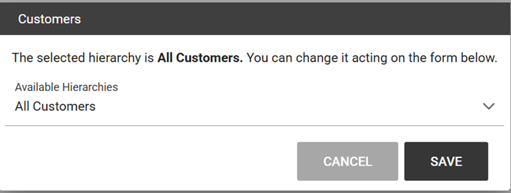
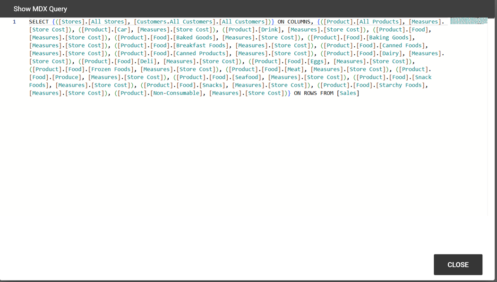
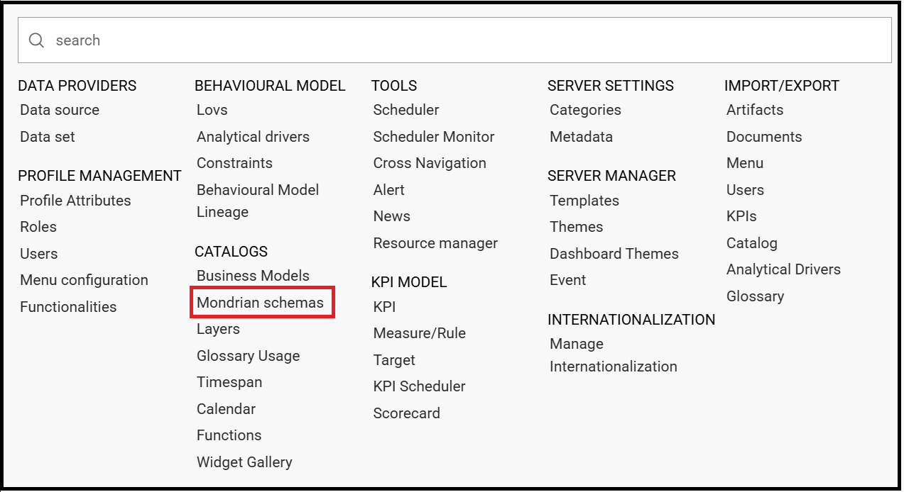
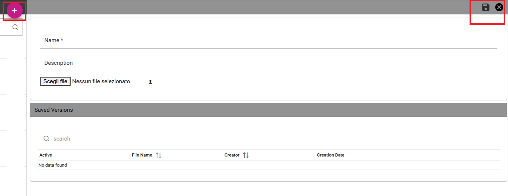
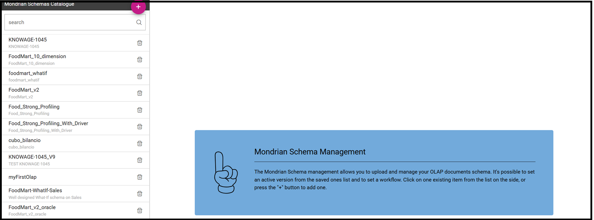
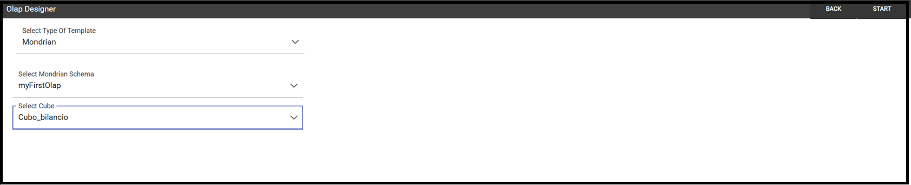
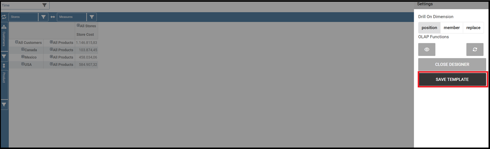

OLAP cubes
########################################################################################################################

OLAP cubes enable users to analyse multidimensional data interactively from multiple perspectives.
An OLAP consists of some basic analytical operations such as slice and dice, roll up, drill down and pivot.

Steps for building an OLAP cube
------------------------------------------------------------------------------------------------------------------------

Let's start by analyzing an OLAP document already created as shown below. 

      Exploring an existing OLAP document.

In the following we will describe the main components of the OLAP page.

Filter panel
~~~~~~~~~~~~~~~~~~~~~~~~~~~~~~~~~~~~~~~~~~~~~~~~~~~~~~~~~~~~~~~~~~~~~~~~~~~~~~~~~~~~~~~~~~~~~~~~~~~~~~~~~~~~~~~~~~~~~~~~

Once the document is executed, the central area of the window contains the table whose measures are aggregated on dimensions. At the top of this area, panels are available to configure filters on attributes. We see in the following figure that the filter panel is made up of **Filter cards**. Here you can find the cube dimensions and their hierarchies as defined in the OLAP schema by the developer.

    The filter panel.

Filter cards
~~~~~~~~~~~~~~~~~~~~~~~~~~~~~~~~~~~~~~~~~~~~~~~~~~~~~~~~~~~~~~~~~~~~~~~~~~~~~~~~~~~~~~~~~~~~~~~~~~~~~~~~~~~~~~~~~~~~~~~~

Filter cards can stay on the filter panel or be placed on the column axis. 
You can move them from the filter panel to the axis or viceversa by dragging and dropping them from one place to the other.

    The filter card inside the filter panel.

Filter cards are used to:

-  inform the user about available dimensions defined in the OLAP schema,
-  inform the user about dimension’s name,
-  perfom slices,
-  add the dimensions to the cube visualization,
-  place hierarchies in different axes,
-  filter visible members.

Considering the next figure, we can see that a filter card is made up of:

-  an icon for opening the hierachy selection dialog (a),
-  the dimension name (b),
-  a filter icon (when a filter is selected the icon is red) (c)+(d).

.. _featuresoffiltcard:

    Features of a filter card.

Axes panel
~~~~~~~~~~~~~~~~~~~~~~~~~~~~~~~~~~~~~~~~~~~~~~~~~~~~~~~~~~~~~~~~~~~~~~~~~~~~~~~~~~~~~~~~~~~~~~~~~~~~~~~~~~~~~~~~~~~~~~~~

In the panel axes you can:

-  drag and drop one or more dimensions,
-  organize the dimensions visualization,
-  swap axes.

Referring to the following figure, the axes panel consists of the following items:

-  columns axis (a),
-  row axis (b),
-  filter cards (c),
-  icon for swap axes (d),
-  icon for hierarchy order (e).

.. _axespanelfeat:

    Axes panel features.

Pivot table
~~~~~~~~~~~~~~~~~~~~~~~~~~~~~~~~~~~~~~~~~~~~~~~~~~~~~~~~~~~~~~~~~~~~~~~~~~~~~~~~~~~~~~~~~~~~~~~~~~~~~~~~~~~~~~~~~~~~~~~~

The Pivot table is the central part of the OLAP page. In figure below is shown an example. 

    Pivot table.

Pivot table is used to:

-  show data based on MDX query sent from the interface,
-  drill down/up hierarchies’ dimensions,
-  drill through,
-  show properties of a particular member,
-  sort data,
-  show calculated fields,
-  perform cross navigation to other documents.

Referring to next figure, Pivot table consists of:

-  dimensions involved in the analysis (a),
-  cells with data (b),
-  icons for drill down and drill up (c),
-  icons for sorting (only if enabled by the developer) (d),
-  links for cross navigation (only if enabled and configured by the developer) (e).

.. _pivottablefeat:
.. figure:: media/image142a.png

    Pivot table features.

Side bar
~~~~~~~~~~~~~~~~~~~~~~~~~~~~~~~~~~~~~~~~~~~~~~~~~~~~~~~~~~~~~~~~~~~~~~~~~~~~~~~~~~~~~~~~~~~~~~~~~~~~~~~~~~~~~~~~~~~~~~~~

You can open the side bar by clicking on the icon positioned on the top right side of the page (see next figure). Side bar will be shown on the right side (see *Side bar* figure).

.. _openthesidebar:

    Open the side bar.

Side bar is used to:

-  choose between different data representations,
-  choose between different drill types,
-  call dialogs and functionalities that effect the pivot table.

.. _sidebar:

    Side bar.

The side bar shows the **Settings**. This area let you customize the Olap layout. As highlighted in the figure below, the Menu is divided in three subsections:

-  drill options (a),
-  OLAP functions (b),
-  table functions (c), 
-  what if (if it is a what-if document).

.. _sidebarmenu:

    Side bar Menu.

We start introducing the interface and leave the description on how they works to the next *Functionalities* paragraph. In particular, referring to next figure, drill types consists of:

-  position,
-  member,
-  replace,
-  drill through.

.. _drilltypes:

    Drill types.

Meanwhile, referring to the following figure, the OLAP functions consist of:

-  show MDX Query (a),
-  reload model (b),
-  enable cross navigation (if enabled and configured by the developer) (c).

.. _olapfunctions:
.. figure:: media/image147a.png

    OLAP functions.

Referring to figure below, table functions consist of:

-  show parent members (a),
-  hide spans (b),
-  sorting settings (c),
-  show properties (d),
-  suppress empty rows/columns (e),
-  save customized view (f).

.. _tablefunctions1:

    Table functions.

Referring to next figure, if the document is a what-if the what if section consists of:

-  lock/unlock model (a),
-  save as new version (b), 
-  undo (c),
-  delete versions (d),
-  output wizard (e), 
-  select an algotithm (f).

.. _tablefunctions2:

    What if.

Functionalities
------------------------------------------------------------------------------------------------------------------------

Placing hierarchies on axes
~~~~~~~~~~~~~~~~~~~~~~~~~~~~~~~~~~~~~~~~~~~~~~~~~~~~~~~~~~~~~~~~~~~~~~~~~~~~~~~~~~~~~~~~~~~~~~~~~~~~~~~~~~~~~~~~~~~~~~~~

As we already told, the user can easily move a dimension from the filter bar to the axis or viceversa dragging and dropping it to the desired place.

Let us suppose we want to move a dimension from the filter panel to the columns axis. The steps are summarized in figure below

    Move a hierarchy to the columns axis.

Vice versa, to move back the dimension from the columns axis to the filter panel the user must simply drag and drop the dimension from one place to the other as in the following figure.

    Move a dimension from the columns axis to the filter panel.

Similarly, a dimension can be moved from the filter panel to the rows axis simply dragging and dropping it from one place to the other.

Swaping axes
~~~~~~~~~~~~~~~~~~~~~~~~~~~~~~~~~~~~~~~~~~~~~~~~~~~~~~~~~~~~~~~~~~~~~~~~~~~~~~~~~~~~~~~~~~~~~~~~~~~~~~~~~~~~~~~~~~~~~~~~

To swap axes the user should click on the icon |image151|. The user will get the outcome showed in figure below.

    Swap axes.

Selecting different hierarchies on dimension
~~~~~~~~~~~~~~~~~~~~~~~~~~~~~~~~~~~~~~~~~~~~~~~~~~~~~~~~~~~~~~~~~~~~~~~~~~~~~~~~~~~~~~~~~~~~~~~~~~~~~~~~~~~~~~~~~~~~~~~~

If an OLAP schema is defined, the user can choose different hierarchies of the same dimension. The icon for opening the dialog is positioned on the left of the filter card (if the dimension has more than one hierarchy). Select the hierarchies icon underlined below.

    Hierarchies icon.

A pop up will be displayed. The following figure shows its characteristics. Here it is possible to change the hierachy through the combo-box and then save.

.. _hierarchiesdialogpopup:

    Hierarchies dialog pop up.

After selecting the hierarchy and saving user’s choice, that hierarchy will be used by the pivot table.

If the user re-opens the dialog window, he/she sees the selected hieararchies and has the chance to change it if needed to, as shown below.

    Changing the hierarchies.

We give an example of the output when the hierarchy “All Customers” is selected in first next figure and hierarchy “Customers by segment” in the second next figure.

.. _timehierarchieshowsdays:

     All Customers hierachy: the table shows customers by state.

.. _timeweeklyhierarchyshowsweek:

    Customers by segment hierachy: table shows customers by segment.

Slicing
~~~~~~~~~~~~~~~~~~~~~~~~~~~~~~~~~~~~~~~~~~~~~~~~~~~~~~~~~~~~~~~~~~~~~~~~~~~~~~~~~~~~~~~~~~~~~~~~~~~~~~~~~~~~~~~~~~~~~~~~

The slicing operation consists in the analysis of a subset of a multi-dimensional array corresponding to a single value for one or more members of the dimensions. In order to perform this operation you need to drag and drop the dimension of interest in the axis panel.  Then clicking on the filter icon choose the new single focus and apply it. Once concluded these steps the cube will show only the selected level of the dimension, while the others have been sliced out.

The following figure shows the slicer option panel where the user can see which items is selected and used in the pivot table.

.. _dialogforslicerchoosing:

    Dialog for slicer choosing.

In order to unlock the whole member tree and to define a new slicing you have to click on the add button. As you can see in the following figure, here it is possible to navigate the member tree, search for a specific value in the member tree, clear all the selections and apply a new one.

.. _dialogforslicerchoosing:

    Define a new slicing.

In particular, it is possible to search for a member value in two ways:

1. by browsing the member tree;

.. figure:: media/image162.png

   Browsing the member tree.

2. by typing member’s name or it’s part in the input field. The research will be possible if the user enters at least three letters;

   Using the research box.

The check on the checkbox of the selected values and click on the apply button to save the selection. After that, the users choice will affect the pivot table, example is given in the figure below.

   Results for slicing operation.

Filtering
~~~~~~~~~~~~~~~~~~~~~~~~~~~~~~~~~~~~~~~~~~~~~~~~~~~~~~~~~~~~~~~~~~~~~~~~~~~~~~~~~~~~~~~~~~~~~~~~~~~~~~~~~~~~~~~~~~~~~~~~

To filter dimension members in a pivot table, the user should click on the funnel icon located on the right side of dimension’s filter card placed in the filter area.

The procedure to search for a member using the filter dialog has no meaningful differences with the one described for the slicer chooser dialog. The pop up interface is the one showed below. After selecting a member, the user should click on the apply button in order to filter the values in the pivot. The pivot table will then display the changements. Otherwise click on the cancel button to discard changes.

    Filter dialog.

When a filter is applied on a card the filter button becomes red, as shown in the picture below.

    Filter icon when a filter is applied.

Drill down and drill up
~~~~~~~~~~~~~~~~~~~~~~~~~~~~~~~~~~~~~~~~~~~~~~~~~~~~~~~~~~~~~~~~~~~~~~~~~~~~~~~~~~~~~~~~~~~~~~~~~~~~~~~~~~~~~~~~~~~~~~~~

User can choose between different drill types by clicking on one of the three buttons in the "Drill On Dimensions" section of the side bar. There are three drill types. In the following we give some details on them.

1. **Position**: this is the default drill type. Clicking on a drill down/drill up command will expand/collapse a pivot table with child members of a member. See below.

     “Position” drill down.

2. **Member**: if the user wants to perform drill operation not only on one member per time but on all members of the same name and level at the same time it is needed to select member drill type. See below.

    “Member” drill down.

3. **Replace**: this option lets the user replace the parent member with his child member during drill down operation. To drill up the user should click on the arrow icon next to the dimension name on which to perform operation. See figure below.

    “Replace” drill down.

Drill through
~~~~~~~~~~~~~~~~~~~~~~~~~~~~~~~~~~~~~~~~~~~~~~~~~~~~~~~~~~~~~~~~~~~~~~~~~~~~~~~~~~~~~~~~~~~~~~~~~~~~~~~~~~~~~~~~~~~~~~~~

To perform drill through operation the user needs to click on the corresponding button in the side bar. Then clicking on the magnifying glass button in one of the pivot cell a dialog will open with results (this pop up could take some time to open).

    Drill thorugh option.

In particular, referring to the next figure, drill though dialog consists of:

-   a hierarchy menu,
-   a table of values,
-   a maximum rows drop down list,
-   an apply button,
-   an export button,
-   a cancel button,
-   a clear all button.

.. _drillthoroughwindow:

    Drill thorugh window.

Here the user can choose the level of detail with which data will be displayed thorough the hierachy menu. The steps to follow are:

1. click on a hierarchy in hierarchy menu,

2. check the checkbox of the level,

.. _checkboxlevel:

    Checkbox of the level.

3. click on the “Apply” button.

The user can also select the maximum rows to load by choosing one of the options in the drop down list. Finally, loaded data can be exported in csv format by clicking on the “Export” button.

Refreshing model
~~~~~~~~~~~~~~~~~~~~~~~~~~~~~~~~~~~~~~~~~~~~~~~~~~~~~~~~~~~~~~~~~~~~~~~~~~~~~~~~~~~~~~~~~~~~~~~~~~~~~~~~~~~~~~~~~~~~~~~~

To refresh a loaded model the user needs to click on the “Refresh” button available in the side bar panel. This action will clear the cash, load pivot table and the rest of data again.

Showing MDX
~~~~~~~~~~~~~~~~~~~~~~~~~~~~~~~~~~~~~~~~~~~~~~~~~~~~~~~~~~~~~~~~~~~~~~~~~~~~~~~~~~~~~~~~~~~~~~~~~~~~~~~~~~~~~~~~~~~~~~~~

To show current mdx query user should click on show mdx button in the side bar. Figure below shows an example.

     Showing MDX query example.

Showing parent members
~~~~~~~~~~~~~~~~~~~~~~~~~~~~~~~~~~~~~~~~~~~~~~~~~~~~~~~~~~~~~~~~~~~~~~~~~~~~~~~~~~~~~~~~~~~~~~~~~~~~~~~~~~~~~~~~~~~~~~~~

If a user wants to see additional information about members shown in the pivot table (for example: member’s hierarchy, level or parent member) he should click on show parent members button in the side bar panel. The result will be visible in the pivot table. An example is shown in the following two figures.

    Pivot table without the parent members mode.

    Pivot table after the parent members selection.

Hiding/showing spans
~~~~~~~~~~~~~~~~~~~~~~~~~~~~~~~~~~~~~~~~~~~~~~~~~~~~~~~~~~~~~~~~~~~~~~~~~~~~~~~~~~~~~~~~~~~~~~~~~~~~~~~~~~~~~~~~~~~~~~~~

To hide or show spans the user should click on show/hide spans button in the side bar. The result will be visible in pivot table as in figure below.

    Hide/show spans.

Showing properties
~~~~~~~~~~~~~~~~~~~~~~~~~~~~~~~~~~~~~~~~~~~~~~~~~~~~~~~~~~~~~~~~~~~~~~~~~~~~~~~~~~~~~~~~~~~~~~~~~~~~~~~~~~~~~~~~~~~~~~~~

In OLAP schema the XML member properties, if configured, is represented as part of pivot table where property values are placed in rows and columns. To get these values, the user needs to click on show      properties button in the side bar. Results will be shown in the pivot table;

    Show properties.

Suppressing empty colunms/rows
~~~~~~~~~~~~~~~~~~~~~~~~~~~~~~~~~~~~~~~~~~~~~~~~~~~~~~~~~~~~~~~~~~~~~~~~~~~~~~~~~~~~~~~~~~~~~~~~~~~~~~~~~~~~~~~~~~~~~~~~

To hide the empty rows and/or colums, if any, from pivot table the user can click on the “Suppress empty rows/colums” button in the side bar panel. An example is given in Figure below.

    Suppressing empty colunms/rows.

Sorting
~~~~~~~~~~~~~~~~~~~~~~~~~~~~~~~~~~~~~~~~~~~~~~~~~~~~~~~~~~~~~~~~~~~~~~~~~~~~~~~~~~~~~~~~~~~~~~~~~~~~~~~~~~~~~~~~~~~~~~~~

To enable member ordering the user must click on the “Sorting settings” button in the side bar panel. The command for sorting will appear next to the member’s name in the pivot table, as shown below. 

    Member sorting.

To sort members the user needs to click on the sorting command (two opposite arrows) available next to each member of the pivot table. Note that the sorting criteria is descending at first execution and it represented by a red down arrow. If the user clicks again on the sorting icon, criteria will change to ascending and the icon becomes an upper green arrow. To remove the sorting, the user just have to click on the icon again. 

To change sorting mode user should click on sorting settings button in the side bar. 
   

    Sorting settings window.

The available types of sorting are:

-  no sorting (it is the default); 
-  basic, it is the standard ascending or descending order according to the column values where the ordering is done;
-  breaking, it means that the hierarchy will be broken;
-  count, only the top or last members will be shown in the pivot table; the user can change the number of members shown (by default first or last 10) using the number input field that appears clicking on this type of sorting.

Creation of an OLAP document
------------------------------------------------------------------------------------------------------------------------

Multidimensional analysis allows the hierarchical inquiry of numerical measures over predefined dimensions. In Cockpit we explained how the user can monitor data on different detail levels and from different perspectives. Here we want to go into details of how a technical user can create an OLAP document. We recall that the main characteristics of OLAP documents are:

-  the need for a specific data structure (logical or physical);
-  analysis based on dimensions, hierarchies and measures;
-  interactive analysis;
-  freedom to re-orient analysis;
-  different levels of data analysis, through synthetic and detailed views;
-  drill-down, slice and dice, drill-through operations.

Considering these items, we will describe the steps to develop an OLAP document.

About the engine
~~~~~~~~~~~~~~~~~~~~~~~~~~~~~~~~~~~~~~~~~~~~~~~~~~~~~~~~~~~~~~~~~~~~~~~~~~~~~~~~~~~~~~~~~~~~~~~~~~~~~~~~~~~~~~~~~~~~~~~~

Knowage performs OLAP documents by relying on the **OLAP engine**. This engine integrates Mondrian OLAP server and two different cube navigation clients to provide multi-dimensional analysis. In general, Mondrian is a Relational Online Analytical Processing (ROLAP) tool that provides the back-end support for the engine. OLAP structures, such as cubes, dimensions and attributes, are mapped directly onto tables and columns of the data warehouse. This way, Mondrian builds an OLAP cube in cache that can be accessed by client applications. The Knowage OLAP engine provides the front-end tool to interact with Mondrian servers and shows the results via the typical OLAP functionalities, like drill down, slicing and dicing on a multi-dimensional table. Furthermore, it can also interact with XMLA servers. This frontend translates user’s navigation actions into MDX queries on the multi-dimensional cube, and show query results on the table he is navigating.

Development of an OLAP document
~~~~~~~~~~~~~~~~~~~~~~~~~~~~~~~~~~~~~~~~~~~~~~~~~~~~~~~~~~~~~~~~~~~~~~~~~~~~~~~~~~~~~~~~~~~~~~~~~~~~~~~~~~~~~~~~~~~~~~~~

The creation of an OLAP analytical document requires the following steps:

- schema modelling;
- catalogue configuration; 
- OLAP cube template building;
- analytical document creation.

Schema modelling
^^^^^^^^^^^^^^^^^^^^^^^^^^^^^^^^^^^^^^^^^^^^^^^^^^^^^^^^^^^^^^^^^^^^^^^^^^^^^^^^^^^^^^^^^^^^^^^^^^^^^^^^^^^^^^^^^^^^^^^^

The very first step for a multi-dimensional analysis is to identify essential information describing the process/event under analysis and to consider how it is stored and organized in the database. On the basis of these two elements, a mapping process should be performed to create the multi-dimensional model.

.. hint::
     
     **From the relational to the multi-dimensional model**

        The logical structure of the database has an impact on the mapping approach to be adopted when creating the multidimensional             model, as well as on query performances.

If the structure of the relational schema complies with multi-dimensional logics, it will be easier to map the entities of the physical model onto the metadata used in Mondrian schemas. Otherwise, if the structure is highly normalized and scarcely dimensional, the mapping process will probably require to force and approximate the model to obtain a multi-dimensional model. As said above, Mondrian is a ROLAP tool. As such, it maps OLAP structures, such as cubes, dimensions and attributes directly on tables and columns of a relational data base via XMLbased files, called Mondrian schemas. Mondrian schemas are treated by Knowage as resources and organized into catalogues. Hereafter, an example of Mondrian schema:

.. code-block:: xml
   :linenos:
   :caption: Mondrian schema example
    
        <?xml version="1.0"?>                                   
         <Schema name="FoodMart">     
               <!-- Shared dimensions -->   
               <Dimension name="Customers"> 

                  <Hierarchy hasAll="true" allMemberName="All Customers"             
                             primaryKey=" customer_id">  

                      <Table name="customer"/>                                           
                      <Level name="Country" column="country" uniqueMembers="true"/>      
                      <Level name="State Province" column="state_province"               
                             uniqueMembers="true"/>                                             
                      <Level name="City" column="city" uniqueMembers="false"/>           

                  </Hierarchy> ...                                                   

               </Dimension> ...                                                      

               <!-- Cubes -->                                                        
               <Cube name="Sales">                                                   

                  <Table name="sales_fact_1998"/>                                    

                  <DimensionUsage name="Customers" source="Customers"                
                                  foreignKey="customer_id" /> ...                                                             

                  <!-- Private dimensions -->                                        

                  <Dimension name="Promotion Media" foreignKey="promotion_id">       

                      <Hierarchy hasAll="true" allMemberName="All Media"                 
                                 primaryKey="promotion_id"> 
                          <Table name="promotion"/>          
                          <Level name="Media Type" column="media_type" uniqueMembers="true"/>   
                      </Hierarchy>                                                       

                  </Dimension> ...                                                   

                  <!-- basic measures-->                                             

                  <Measure name="Unit Sales" column="unit_sales" aggregator="sum"    
                           formatString="#,###.00"/>                                                       

                  <Measure name="Store Cost" column="store_cost" aggregator="sum"    
                           formatString= "#,###.00"/>                                         

                  <Measure name="Store Sales" column="store_sales" aggregator="sum"  
                           formatString="#,###.00"/>                                          
                  ...                                                                

                  <!-- derived measures-->                                           

                  <CalculatedMember name="Profit" dimension="Measures">              
                      <Formula>        
                           [Measures].[Store Sales] - [Measures].[Store Cost]  
                      </Formula>                                                         
                      <CalculatedMemberProperty name="format_string" value="$#,##0.00"/> 
                  </CalculatedMember>                                                

               </Cube> 
            ...      
        </Schema> 

Each mapping file contains one schema only, as well as multiple dimensions and cubes. Cubes include multiple dimensions and measures. Dimensions include multiple hierarchies and levels. Measures can be either primitive, i.e., bound to single columns of the fact table, or calculated, i.e., derived from calculation formulas that are defined in the schema. The schema also contains links between the elements of the OLAP model and the entities of the physical model: for example, <table> sets a link between a cube and its dimensions, while the attributes primaryKey and foreignKey reference integrity constraints of the star schema.

.. note::
      **Mondrian**
         
         For a detailed explanation of Mondrian schemas, please refer to the documentation available at the official project webpage: http://mondrian.pentaho.com/documentation.
         
         
Engine catalogue configuration
+++++++++++++++++++++++++++++++

To reference an OLAP cube, first insert the corresponding Mondrian schema into the catalogue of schemas managed by the engine. In order to do this, go to **Catalogs > Mondrian schemas** in the Knowage menu, as shown below. 

    Mondrian schemas menu item.

Here you can find the list of already created mondrian schemas and by clicking the *Plus* icon you can define a new one uploading your XML schema file. A new window will open where you have to choose a **Name**, an optional **Description** and to upload your XML file, as you can see in figure below. 

    Creating a new mondrian schema.

When creating a new OLAP template, you will choose among the available cubes defined in the registered schemas.

OLAP template building
^^^^^^^^^^^^^^^^^^^^^^^^^^^^^^^^^^^^^^^^^^^^^^^^^^^^^^^^^^^^^^^^^^^^^^^^^^^^^^^^^^^^^^^^^^^^^^^^^^^^^^^^^^^^^^^^^^^^^^^^

Once the cube has been created, you need to build a template which maps the cube to the analytical document. To accomplish this goal the user can manually edit the template or use the guided Knowage designer (look at the "OLAP Designer" section for this functionality). The template is an XML file telling Knowage OLAP engine how to navigate the OLAP cube and has a structure like the one represented in next code:

.. _mappingtemplateexample:
.. code-block:: xml
   :linenos:
   :caption: Mapping template example
    
     <?xml version="1.0" encoding="UTF-8"?> 
     <olap>                                 
        <!-- schema configuration -->       
        <cube reference="FoodMart"/>       

        <MDXMondrianQuery>                                    
            SELECT {[Measures].[Unit Sales]} ON COLUMNS           
            , {[Region].[All Regions]} ON ROWS                    
            FROM [Sales]                                          
            WHERE [Product].[All Products].[Drink]                
        </MDXMondrianQuery>        

        <!-- query configuration -->        
        <MDXquery>  
            SELECT {[Measures].[Unit Sales]} ON COLUMNS           
            , {[Region].[All Regions]} ON ROWS                    
            FROM [Sales]                                          
            WHERE [Product].[All Products].[${family}]            
            <parameter name="family" as="family"/>                
        </MDXquery>                                           

        <!-- toolbar configuration -->                        
        <TOOLBAR>                                             
            <BUTTON_MDX visible="true" menu="false" />            
            <BUTTON_FATHER_MEMBERS visible="true" menu="false"/>  
            <BUTTON_HIDE_SPANS visible="true" menu="false"/>      
            <BUTTON_SHOW_PROPERTIES visible="true" menu="false"/> 
            <BUTTON_HIDE_EMPTY visible="true" menu="false" />     
            <BUTTON_FLUSH_CACHE visible="true" menu="false" />         
        </TOOLBAR>                                            
                                      
     </olap>                                                  

An explanation of different sections of Mapping template example follows.

-  The CUBE section sets the Mondrian schema. It should reference the exact name of the schema, as registered in the catalogue on the Server.
-  The MDXMondrianQuery section contains the original MDX query defining the starting view (columns and rows) of the OLAP document.
-  The MDX section contains a variation of the original MDX query, as used by the Knowage Engine. This version includes parameters (if any). The name of the parameter will allow Knowage to link the analytical driver associated to the document via the parameter (on the Server).
-  The TOOLBAR section is used to configure visibility options for the side bar in the OLAP document. The exact meaning and functionalities of each toolbar button has been explained in "Functionalities" section. A more complete list of the available options is shown in Menu configurable options in the Knowage designer.

.. code-block:: xml
   :linenos:
   :caption: Menu configurable options
    
        <BUTTON_DRILL_THROUGH visible="true"/>
        <BUTTON_MDX visible="true"/>
        <BUTTON_FATHER_MEMBERS visible="true"/>
        <BUTTON_HIDE_SPANS visible="true"/>
        <BUTTON_SORTING_SETTINGS visible="true"/>
        <BUTTON_SHOW_PROPERTIES visible="true"/>
        <BUTTON_HIDE_EMPTY visible="true"/>
        <BUTTON_FLUSH_CACHE visible="true"/>
        <!-- toolbar configuration for what-if documents: --> 
        <BUTTON_SAVE_NEW visible="true"/>
        <BUTTON_UNDO visible="true"/>
        <BUTTON_VERSION_MANAGER visible="true"/>
        <BUTTON_EXPORT_OUTPUT visible="false"/>
        <BUTTON_SAVE_SUBOBJECT clicked="false" visible="true"/>
        <BUTTON_EDITABLE_EXCEL_EXPORT clicked="false" visible="true"/>
        <BUTTON_ALGORITHMS clicked="false" visible="true"/>
  

Creating the analytical document
^^^^^^^^^^^^^^^^^^^^^^^^^^^^^^^^^^^^^^^^^^^^^^^^^^^^^^^^^^^^^^^^^^^^^^^^^^^^^^^^^^^^^^^^^^^^^^^^^^^^^^^^^^^^^^^^^^^^^^^^

Once you have the template ready you can create the OLAP document on Knowage Server.

To create a new OLAP document, click on the plus button in the **Document Broswer** area and then choose “Generic document”. Filling in the mandatory fields: select a Label and a Name, select **On-Line Analytical Processing** as Type and **OLAP Engine** as Engine, add the Data Source from which the data comes from and the State of the document. Finally, upload the XML template developed in the previous section and click on save. 

.. _olapdocserver:

    Creating an OLAP document.

You will see the document in the functionality (folder) you selected.

OLAP Designer
~~~~~~~~~~~~~~~~~~~~~~~~~~~~~~~~~~~~~~~~~~~~~~~~~~~~~~~~~~~~~~~~~~~~~~~~~~~~~~~~~~~~~~~~~~~~~~~~~~~~~~~~~~~~~~~~~~~~~~~~

Knowage Server is also endowed of an efficient OLAP designer which avoid the user to edit manually the XML-based template that we discussed on in Development of an OLAP document. We will therefore describe here all features of this functionality. 

The user needs to have a functioning Modrian schema to start the work with. As we have already seen in the previous sections, select **Mondrian Schemas** to check the available Mondrian schemas on server. It is mandatory that the chosen Mondrian schema has no parameters applied.

.. warning::
      **Mondrian schema for OLAP designer**
         
         If you want to use the designer the Mondrian schema must not be filtered thorough any parameter or profile attribute.

The catalog with the list of all the *Mondrian Schemas* opens as shown below .

    Mondrian Schema Catalog.

From the **Document Browser**, click on the *Plus* icon at the top right corner of the page and choose *Generic document*. 
Fill in the mandatory information such as *Name* and *Label*, select *On-Line Analytical Processing* as Type of document and *OLAP Engine* as Engine. Add the data source and the state. 
Remember *to save* before clicking the **Open Designer** link.

At this point choose Mondrian as *Template*, the *Mondrian Schema* and finally the *cube*. See below. 

.. _olapcoreconfig:

    OLAP core configuration.

Click the *Start* link. The image below shows the outcome. 

.. _definingolaptempl:

    Defining OLAP template.

Aaccording to the requirements set which fields ar axis or filter cards. Please refer to the *Functionalities* chapter for the terminology.  

.. _definingolaptempl2:

    Defining OLAP template.

The *Setting* panel contains:

    - Drilling functionalities as *Position, Member, Replace*
    - OLAP functions as *Preview, Button visibility*

Please refer to the *Functionalities* chapter to recall the effects of the different drills: the one selected in the template will be the default used in the OLAP document. 

To display the *MDX query* click the *Preview* button.

    Preview in OLAP.

To set the visibity on the buttons click the *Configure Button Visibility* as shown below.
Through the buttons wizard you can decide which permissions are granted to the end-user.

    Visibility on buttons.

The image below shows an example with another OLAP function: *Cross Navigation*.

    Enabling the cross navigation - 1

As shown above, by clicking the icon highlighted in the image, you can enable a cross navigation.

    Enabling the cross navigation - 2

Clicking on the “Add” button at the top right corner.

Note that the parameter name will be used to configure the (external) cross navigation. In fact, to properly set the cross navigation the user must access the “Cross Navigation” functionalities available in Knowage Server. Here, referring to *Cross Navigation* section of *Analytical document* chapter, you will use the parameter just set as output parameter.

    Cross navigation definition.

Once the configuration is completed click the *Save Template** button and then the *Close designer* button to exit and return to the Document browser.

Profiled access
^^^^^^^^^^^^^^^^^^^^^^^^^^^^^^^^^^^^^^^^^^^^^^^^^^^^^^^^^^^^^^^^^^^^^^^^^^^^^^^^^^^^^^^^^^^^^^^^^^^^^^^^^^^^^^^^^^^^^^^^

As for any other analytical document, Knowage provides filtered access to data via its behavioural model. The behavioural model is a very important concept in Knowage. For a full understanding of its meaning and functionalities, please refer to *Data security and access management* section.

Knowage offers the possibility to regulate data visibility based on user profiles. Data visibility can be profiled at the level of the OLAP cube, namely the cube itself is filtered and all queries over that cube share the same data visibility criteria.

To set the filter, which is based on the attribute (or attributes) in the user’s profile, the tecnical user has to type the Mondrian schema. We report Cube level profilation example as a reference guide. Note that data profiling is performed on the cube directly since the filter acts on the data retrieval logics of the Mondrian Server. So the user can only see the data that have been got back by the server according to the filter.

.. code-block:: xml
   :linenos:
   :caption: Cube level profilation example.
    
        <?xml version="1.0"?>                                                 
        <Schema name="FoodMartProfiled"> 
        ....                                 
         <Cube name="Sales_profiled"> <Table name="sales_fact_1998"/> 
         ...      
           <!-- profiled dimension -->                                        
           <Dimension name="Product" foreignKey="product_id">                 
            <Hierarchy hasAll="true" allMemberName="All Products" primaryKey="product_id">                                   
                <View alias="Product">                                             
                  <SQL dialect="generic">                                            
                    SELECT pc.product_family as product_family, p.product_id as        
                    product_id,                                                        
                    p.product_name as product_name,                                    
                    p.brand_name as brand_name, pc.product_subcategory as              
                    product_subcategory, pc.product_category as product_category,      
                    pc.product_department as product_department                        
                    FROM product as p                                                  
                    JOIN product_class as pc ON p.product_class_id = pc.               
                    product_class_id                                                   
                    WHERE and pc.product_family = '${family}' 
                  </SQL>                   
                </View>                                                            

                <Level name="Product Family" column="product_family"               
                       uniqueMembers="false" />                                                                 
                <Level name="Product Department" column="product_department"       
                       uniqueMembers="false"/>                                                          
                <Level name="Product Category" column="product_category"           
                      uniqueMembers=" false"/>                                           
                <Level name="Product Subcategory" column="product_subcategory"     
                       uniqueMembers="false"/>                                            
                <Level name="Brand Name" column="brand_name"                       
                       uniqueMembers="false"/>                                            
                <Level name="Product Name" column="product_name"                   
                       uniqueMembers="true"/>                                             
            </Hierarchy>                                                       
           </Dimension>                                                       
         </Cube> 
         ...                                       
        </Schema> 

In the above example, the filter is implemented within the SQL query that defines the dimension using the usual syntax **pr.product_family = '${family}'**.                         

The value of the “family” user profile attribute will replace the ${family} placeholder in the dimension definition.

You can filter more than one dimensions/cubes and use more profile attributes. The engine substitutes into the query the exact value of the attribute; in case of a multi value attribute to insert in an SQL-IN clause you will have to give the attribute a value like ’value1’, ’value2’ and insert into the query a condition like **and pc.product_family IN (${family})**.

Once the OLAP document has been created using the template designer the user can insert parameters to profile the document. To set parameters the user has to download the Mondrian schema and edit it; modify the dimension(s) (that will update according to the value parameter(s)) inserting an SQL query which presents the parametric filtering clause.

.. hint::
    **Filter through the interface**

       Note that for the OLAP instance, it has not proper sense to talk about “general” parameters. In this case we only deal with profile attributes while all the filtering issue is performed through the interface, using the filter panel.

Cross Navigation
~~~~~~~~~~~~~~~~~~~~~~~~~~~~~~~~~~~~~~~~~~~~~~~~~~~~~~~~~~~~~~~~~~~~~~~~~~~~~~~~~~~~~~~~~~~~~~~~~~~~~~~~~~~~~~~~~~~~~~~~

The cross navigation must be implemented at template level but also at analytical document level. The latter has been already wildly described in *Cross Navigation* section. In the following we will see the first case. Observe that both procedures are mandatory.

For OLAP documents it is possible to enable the cross navigation on members or on cells and we will give more details on these two cases in the following.

Generally speaking, the user must modify the template file using the designer to configure the cross navigation in order to declaire the output parameters of the document. We remember that the output parameters definition is discussed in *Cross Navigation* section of *Analytical document* chapter of this manual. 

Cross navigation on members
^^^^^^^^^^^^^^^^^^^^^^^^^^^^^^^^^^^^^^^^^^^^^^^^^^^^^^^^^^^^^^^^^^^^^^^^^^^^^^^^^^^^^^^^^^^^^^^^^^^^^^^^^^^^^^^^^^^^^^^^

To activate the cross navigation on a member means that the user can click on a member of a dimension to send its value and visualize a target document. The first type of navigation can be set by directly editing the OLAP query template or by using the Knowage designer, as described in previous *OLAP designer* section. In the first case you need to add a section called “clickable” inside the MDX query tag. In particular:

-  the attribute value is equal to the hierarchy level containing the member(s) that shall be clickable;
-  the element represents the parameter that will be passed to the destination document. The name attribute is the URL of the parameter that will be passed to the target document. The value 0 represents the currently selected member, as a convention: this value will be assigned to the parameter whose URL is null.

Figure below gives an example. Note that you can recognize that the cross navigation is activated when elements are shown blue highlighted and underlined.

    Cross navigation on member.

If you open the template file you will read instructions similar to the ones reported in Syntax used to set cross navigation.

.. code-block:: xml
    :linenos:
    :caption: Syntax used to set cross navigation.
    
     <MDXquery> 
       select {[Measures].[Unit Sales]} ON COLUMNS,               
       {([Region].[All Regions], [Product].[All Products])} ON ROWS from     
       [Sales_V]                                                             
       <clickable name="family" type="From Member" uniqueName="[Product].[Product Family]" >                  
          <clickParameter name="family" value="{0}"/>                           
       </clickable>                                                          
     </MDXquery>                                                           

Cross navigation from a cell of the pivot table
^^^^^^^^^^^^^^^^^^^^^^^^^^^^^^^^^^^^^^^^^^^^^^^^^^^^^^^^^^^^^^^^^^^^^^^^^^^^^^^^^^^^^^^^^^^^^^^^^^^^^^^^^^^^^^^^^^^^^^^^

This case is similar to the cross navigation on members except that in this case values of all dimensions can be passed to the target document. In other words, the whole dimensional context of a cell can be passed. Now let us suppose the user wishes to click on a cell and pass to the target document the value of the level family of product dimension and year of time dimension. It should creates two parameters: one for family where dimension is product, hierarchy is product, level is product family and one for year parameter where dimension in type, hierarchy is time and level is year. Let see what happens when user clicks on a cell. Depending on the selected cell, the analytical driver family of the target document will have a different value: it will be the name of the context member (of the selected cell) of the “Product” dimension, i.e. the [Product] hierarchy, at [Product].[ProductFamily] level. Look at the following Table for some examples:

.. table:: Context member on product dimension
        :widths: auto

        +-----------------------------------------------------------------+-----------------------------------------------------+
        |    Context member on Product dimension                          | "Family" analytical driver value                    |
        +=================================================================+=====================================================+
        |    [Product].[All Products]                                     | [no value: it will be prompted to  the user]        |
        +-----------------------------------------------------------------+-----------------------------------------------------+
        |    [Product].[All Products].[Food]                              | Food                                                |
        +-----------------------------------------------------------------+-----------------------------------------------------+
        |    [Product].[All Products].[Drink]                             | Drink                                               |
        +-----------------------------------------------------------------+-----------------------------------------------------+
        |    [Product].[All Products].[Non-Consumable]                    | Non-Consumable                                      |
        +-----------------------------------------------------------------+-----------------------------------------------------+
        |    [Product].[All Products].[Food].[Snacks]                     | Food                                                |
        +-----------------------------------------------------------------+-----------------------------------------------------+
        |    [Product].[All Products].[Food].[Snacks].[Candy]             | Food                                                |
        +-----------------------------------------------------------------+-----------------------------------------------------+
 

Let us have a look at the template. Syntax used to set cross navigation shows how to use the cross navigation tag:

.. code-block:: xml
    :linenos:
    :caption: Syntax used to set cross navigation.
    
        <CROSS_NAVIGATION>                                                    
            <PARAMETERS>                                                       
                <PARAMETER name="family" dimension="Product" hierarchy="[Product]" level="[Product].[Product Family]" /> 
                <PARAMETER name="year" dimension="Time" hierarchy="[Time]" level="[Time].[Year]" />
            </PARAMETERS>                                                      
        </CROSS_NAVIGATION>                                                   

In order to activate cross navigation on cells the user must click on the correponding button in the side bar, then a green arrow will be desplayed in each cells to show that cross navigation is enabled. User can click on that icon to start cross navigation from a cell.

    Cross navigation on cells.

