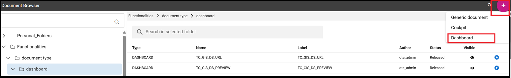

Create a New Dashboard
========================================================================================================================

The graphical interface for creating the new dashboard looks slightly different from the one used for the old cockpit.
New features have been added, such as new charts and new widgets

The below pictures respectively show the chart gallery with the availability of new charts and new widgets enriched with 
the presence of the new *Pivot* widget and the *Map widget* .

.. figure:: media/chart_gallery.png

   Chart gallery example

.. figure:: media/new_widgets.png

   Widgets types

   A dashboard document can be created:

            -	by final users from the Workspace
            -	by admin users from the document browser area

In both cases the user should click on the plus icon available in the right top corner and choose the Dashboard item menu as shown below.

   Creating a dashboard from the menu

The functionalities for inserting a new data set and a new widget are immediately available on the page shown. 

.. table:: Dashboard functionalities.
   :widths: auto

   +----------------------------------+-----------------------+-----------------------+
   |    Icon                          | Name                  | Function              |
   +==================================+=======================+=======================+
   | .. figure:: media/image004.png   | **Add new dataset**   | Opens the list of     |
   |                                  |                       | datasets to choose    |
   +----------------------------------+-----------------------+-----------------------+
   | .. figure:: media/image005.png | **Add new widget**    | Opens the widget      |
   |                                  |                       | gallery from the sheet|
   +----------------------------------+-----------------------+-----------------------+
   | .. figure:: media/image006.png   | **Add new widget**    | Opens the widget      |
   |                                  |                       | gallery from the bar  |
   +----------------------------------+-----------------------+-----------------------+
   | .. figure:: media/image007.png   | **Data set Mgmt**     | Opens the dataset mgmt|
   |                                  |                       | window from the bar   |
   +----------------------------------+-----------------------+-----------------------+
   | .. figure:: media/image008.png   | **Save dashboard**    | Saves the dashboard   |
   |                                  |                       |                       |
   +----------------------------------+-----------------------+-----------------------+

Widgets Types
------------------------------------------------------------------------------------------------------------------------
As seen above, the addition of a widget can be done either through the icon that is displayed when the dashboard is created or 
from the appropriate button appearing in the upper right bar of the page. 
In both cases, a palette containing the entire range of available widgets will be shown. 
Let's see them in detail, one by one. Simply click on the desired one. 

Text widget
~~~~~~~~~~~~~~~~~~~~~~~~~~~~~~~~~~~~~~~~~~~~~~~~~~~~~~~~~~~~~~~~~~~~~~~~~~~~~~~~~~~~~~~~~~~~~~~~~~~~~~~~~~~~~~~~~~~~~~~~
By clicking on the **Text Widget** icon you can add text to your dashboard. As shown below, the widget editor opens showing two sections,
*Data* and *Settings*.

.. figure:: media/image009.png

.. table:: Text widget sections.
   :widths: auto

   +----------------------------------+-----------------------------------------------+
   |  Section Name                    | Components                                    |
   +==================================+===============================================+
   | **Data**                         |                                               |
   |                                  |                                               |
   +----------------------------------+-----------------------------------------------+
   | **Settings**                     |                                               |
   |                                  |                                               |
   +----------------------------------+-----------------------------------------------+

Image widget
~~~~~~~~~~~~~~~~~~~~~~~~~~~~~~~~~~~~~~~~~~~~~~~~~~~~~~~~~~~~~~~~~~~~~~~~~~~~~~~~~~~~~~~~~~~~~~~~~~~~~~~~~~~~~~~~~~~~~~~~

Chart widget
~~~~~~~~~~~~~~~~~~~~~~~~~~~~~~~~~~~~~~~~~~~~~~~~~~~~~~~~~~~~~~~~~~~~~~~~~~~~~~~~~~~~~~~~~~~~~~~~~~~~~~~~~~~~~~~~~~~~~~~~

Html widget
~~~~~~~~~~~~~~~~~~~~~~~~~~~~~~~~~~~~~~~~~~~~~~~~~~~~~~~~~~~~~~~~~~~~~~~~~~~~~~~~~~~~~~~~~~~~~~~~~~~~~~~~~~~~~~~~~~~~~~~~

Table widget
~~~~~~~~~~~~~~~~~~~~~~~~~~~~~~~~~~~~~~~~~~~~~~~~~~~~~~~~~~~~~~~~~~~~~~~~~~~~~~~~~~~~~~~~~~~~~~~~~~~~~~~~~~~~~~~~~~~~~~~~

Pivot widget
~~~~~~~~~~~~~~~~~~~~~~~~~~~~~~~~~~~~~~~~~~~~~~~~~~~~~~~~~~~~~~~~~~~~~~~~~~~~~~~~~~~~~~~~~~~~~~~~~~~~~~~~~~~~~~~~~~~~~~~~

Map widget
~~~~~~~~~~~~~~~~~~~~~~~~~~~~~~~~~~~~~~~~~~~~~~~~~~~~~~~~~~~~~~~~~~~~~~~~~~~~~~~~~~~~~~~~~~~~~~~~~~~~~~~~~~~~~~~~~~~~~~~~

Active selections widget
~~~~~~~~~~~~~~~~~~~~~~~~~~~~~~~~~~~~~~~~~~~~~~~~~~~~~~~~~~~~~~~~~~~~~~~~~~~~~~~~~~~~~~~~~~~~~~~~~~~~~~~~~~~~~~~~~~~~~~~~

Selector widget
~~~~~~~~~~~~~~~~~~~~~~~~~~~~~~~~~~~~~~~~~~~~~~~~~~~~~~~~~~~~~~~~~~~~~~~~~~~~~~~~~~~~~~~~~~~~~~~~~~~~~~~~~~~~~~~~~~~~~~~~

Custom chart widget
~~~~~~~~~~~~~~~~~~~~~~~~~~~~~~~~~~~~~~~~~~~~~~~~~~~~~~~~~~~~~~~~~~~~~~~~~~~~~~~~~~~~~~~~~~~~~~~~~~~~~~~~~~~~~~~~~~~~~~~~

Discovery widget
~~~~~~~~~~~~~~~~~~~~~~~~~~~~~~~~~~~~~~~~~~~~~~~~~~~~~~~~~~~~~~~~~~~~~~~~~~~~~~~~~~~~~~~~~~~~~~~~~~~~~~~~~~~~~~~~~~~~~~~~

Python widget
~~~~~~~~~~~~~~~~~~~~~~~~~~~~~~~~~~~~~~~~~~~~~~~~~~~~~~~~~~~~~~~~~~~~~~~~~~~~~~~~~~~~~~~~~~~~~~~~~~~~~~~~~~~~~~~~~~~~~~~~

Widget Settings
------------------------------------------------------------------------------------------------------------------------

Cache/Frequency

Custom Header
------------------------------------------------------------------------------------------------------------------------

Theaming
------------------------------------------------------------------------------------------------------------------------