Create a New Dashboard
========================================================================================================================

The graphical interface for creating the new dashboard looks slightly different from the one used for the previous cockpit.
New features have been added, such as new charts and new widgets

The below pictures respectively show the chart gallery with the availability of new charts (some of them are highlighted in yellow) and new widgets enriched with 
the presence of the *Pivot* and *Map* widgets.

   Chart gallery example

Given the wide range of graphs, a dedicated search function allows looking for the desired chart. 
Simply enter the type of graph to draw and press the search icon.

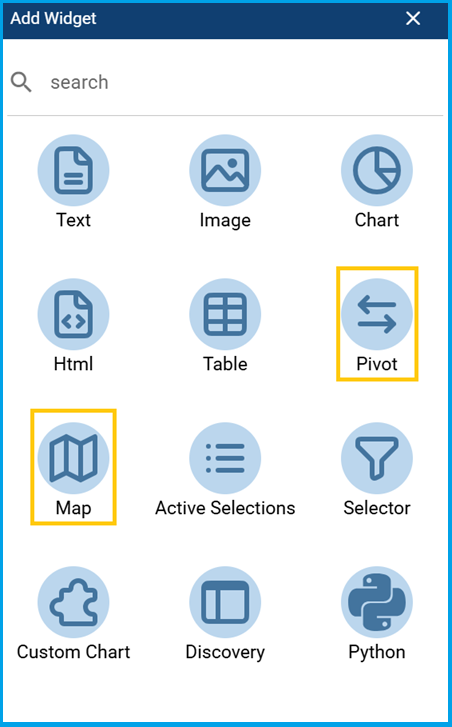

   Widgets types

   A dashboard document can be created:

            -	by final users from the Workspace
            -	by admin users from the document browser area

To create a dashboard the user should click the *plus* icon available in the right top corner and select *Dashboard* from the menu as shown below.

.. figure:: media/new_dashboard.png

   Creating a dashboard from the menu

The functionalities for inserting a dataset and a widget are immediately available in the sheet of the new dashboard. 
Below the list of the available functionalities.

   +----------------------------------+-----------------------+-----------------------+
   |    Icon                          | Name                  | Function              |
   +==================================+=======================+=======================+
   | .. figure:: media/image004.png   | **Add new dataset**   | Opens the list of     |
   |                                  |                       | datasets to choose    |
   +----------------------------------+-----------------------+-----------------------+
   | .. figure:: media/image005.png   | **Add new widget**    | Opens the widget      |
   |                                  |                       | gallery from the sheet|
   +----------------------------------+-----------------------+-----------------------+
   | .. figure:: media/image006.png   | **Add new widget**    | Opens the widget      |
   |                                  |                       | gallery from the bar  |
   +----------------------------------+-----------------------+-----------------------+
   | .. figure:: media/image007.png   | **Data set Mgmt**     | Opens the dataset mgmt|
   |                                  |                       | window from the bar   |
   +----------------------------------+-----------------------+-----------------------+
   | .. figure:: media/image008.png   | **Save dashboard**    | Saves the dashboard   |
   |                                  |                       |                       |
   +----------------------------------+-----------------------+-----------------------+

   The below image shows an example of dashboard.

   .. figure:: media/dashboard.png

Widgets Types
------------------------------------------------------------------------------------------------------------------------
As seen in the above table, the addition of a widget can be done either through the icon displayed from the sheet of a dashboard or 
from the appropriate button appearing in the upper right bar. 
When clicking a palette containing the entire range of available widgets will be shown. Simply click the desired one for popping up the widget editor.
A widget's editor normally has two sections:

   - *Data*, to associate datasets to the dashboard (this section is not available i.e. for the *Image* and *Map* widgets)
   - *Settings*, containing a list of properties varying from one widget to another

The below table shows an example of how the *Data* and the *Settings* sections appear for a *Text* widget. In case of i.e. an *Image* 
widget, the *Settings* section will contain the *Gallery* property that does not belong to the *Text* widget.

   +--------------------+------------------------------------------------------------------------------+
   |  Section Name      | Description                                                                  |
   +====================+==============================================================================+
   | Data               | In this section the user can:                                                |
   |                    |   - select the dataset to work with                                         |
   |                    |   - select the columns to show (use the *Arrow* to insert all columns)       |
   |                    |   - specify a *Sorting Column* and an *Ascending/Descending* order           |
   |                    |   - change the aggregate function for measure columns                        |
   |                    |   - add a calculated field by clicking the *Add Column* button               |
   +--------------------+------------------------------------------------------------------------------+
   | Settings           | To manage widget properties such as:                                         |
   |                    |   - Configuration                                                            |
   |                    |   - Editor                                                                   |
   |                    |   - Style                                                                    |
   |                    |   - Interactions                                                             |
   |                    |   - Help                                                                     |
   |                    |   - Responsive                                                               |
   +--------------------+------------------------------------------------------------------------------+

Below a brief description of the usefulness of some of the properties listed in the *Settings* section.

   - *Configuration*, to manage date format, annotations, the text message when no data is retrieved
   - *Visualization*, to pin columns, to set visibility conditions on columns, to show columns as text or icon, to show totals
   - *Legend*, to show aliases for measures 
   - *Tooltips*, to apply visualizazion styles to the hover text
   - *Style*, to define visualization styles such as font size, font family, background
   - *X-axis*, to manage properties related to the X axis as title, position, rotation, etc
   - *Y-axis*, to manage properties related to the Y axis as title, position, rotation, etc 
   - *Colors*, to manage the palette of colors
   - *Interactions*, to manage cross navigations, links, drill-downs, etc 
   - *Series*, to manage format styles related to the values of the serie(s)  
   - *Responsive*, to manage the wisualization of your widgets on different devices such as tablets, mobiles, small and large devices
   - *Help*, to add additional explanation for a specific widget i.e. by means of an icon opening a pop up that shows some information

.. important::

       After changing whatever property of the Settings section remember always to press *Save* to apply changes to the widget.
       When all properties have been set up a further *Save* action will be necessary to permanently save the widget (dashboard) in Knowage.

Below an example of *Help* applied on a widget.

.. figure:: media/image117.png

Text widget
~~~~~~~~~~~~~~~~~~~~~~~~~~~~~~~~~~~~~~~~~~~~~~~~~~~~~~~~~~~~~~~~~~~~~~~~~~~~~~~~~~~~~~~~~~~~~~~~~~~~~~~~~~~~~~~~~~~~~~~~
By clicking the **Text Widget** icon you can add text to your dashboard. The widget editor opens showing the two sections 
formerly introduced.
Using the *Data* section it is possible to associate dataset values to the text to show real time values at each execution.
You can drag a single column into the *Selected Columns* area or just all of them by using the arrow next to the *Add Column* button.

.. figure:: media/image009.png

   Text Widget Data Editor

   Text Widget Settings Editor

The *Editor* property allows typing the desired text.
From the *[] placeholder* menu the item *Columns Data* makes available the dataset column(s) previously selected as shown in the below image.

.. figure:: media/image011.png

  Inserting a dataset column in the text editor

Image widget
~~~~~~~~~~~~~~~~~~~~~~~~~~~~~~~~~~~~~~~~~~~~~~~~~~~~~~~~~~~~~~~~~~~~~~~~~~~~~~~~~~~~~~~~~~~~~~~~~~~~~~~~~~~~~~~~~~~~~~~~
By clicking on the **Image Widget** icon you can add an image to the dashboard. You can both pick up a previous image from the *Gallery* or
upload a new one by clicking on the *Upload* button as show in the below image.

.. figure:: media/image012.png

    Inserting an image

The *Style* setting allows to handle the properties styles for the image such as *Title, Background, Borders, Padding and Shadows*.

.. figure:: media/image013.png

    Image styles

Chart widget
~~~~~~~~~~~~~~~~~~~~~~~~~~~~~~~~~~~~~~~~~~~~~~~~~~~~~~~~~~~~~~~~~~~~~~~~~~~~~~~~~~~~~~~~~~~~~~~~~~~~~~~~~~~~~~~~~~~~~~~~
As previously mentioned the new dashboard comes with an enriched gallery of charts. 
That means that in addition to those charts used for creating the old cockpit:

   - Bar
   - Line
   - Pie
   - Sunburst
   - Wordcloud
   - Treemap
   - Parallel
   - Radar
   - Scatter
   - Heatmap
   - Chord
   - Gauge
   - Bubble

new ones are now available:

   - Activity Gauge
   - Dumbbell
   - Funnel
   - Packed Bubble
   - Pictorial
   - Sankey
   - Scatter Jitter
   - Stream
   - Waterfall

Below the general steps to be followed to insert a chart.
After selecting the dataset and clicking the *Add widget* icon the chart gallery opens to pick up the desired chart to draw.
Once a chart has been selected The *Data* section opens. Here it is possible to drag and drop your column(s) into:
   - the *Dimension(s)* area, for measures
   - the *Values* area, for attributes.

Afterwards the user can keep on with the set up of the properties contained in the *Settings* section. This section could be different from
one widget to another.
The below image refers to a *Funnel* chart where the definition of both the measure(s) and the sttribute(s) is needed.

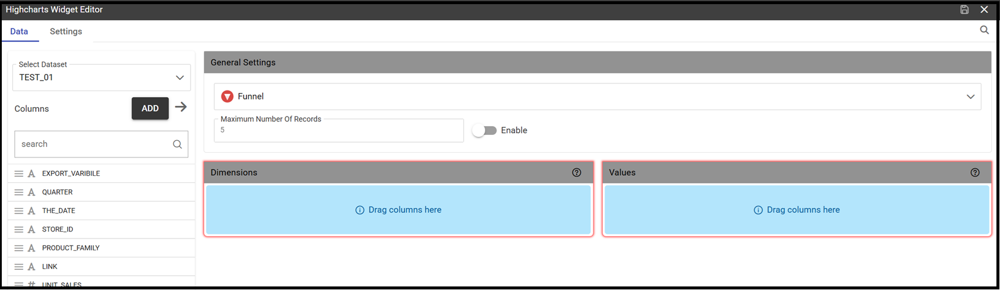

Not all charts need both information as if you refer to an *Activity Gauge* you only need to define the measure. See image below.

.. figure:: media/image015.png

One important peculiarity to highlight is the possibility to change the type of chart once a selection has already been done.
The drop down menu with your choice will still make available all the other charts as options to choose and in case the chart can be changed. 
See below picture.

.. figure:: media/image016.png

Once the chart has been inserted in the sheet of the dashboard, a three dots icon in the lower left part of the widget displays a menu with the list of all the possible actions to perform.
See below image.

.. figure:: media/image028.png

Menu on a chart

The chart can be resized just drugging the little corner in the lower right part of the chart.

Another functionality really useful is the *preview* of the graph just using the magnifying glass 
located at the upper right corner for each property of the *Settings* section. This means that saving the graph is not necessary to see how it 
looks like as changes can be seen as they are applied.
See below image.

Preview functionality for a chart

A chart can simply be moved in a dashboard just dragging it inside the whole sheet. 
This functionality is available for all widgets.
See below image.

   Moving a widget along the dashboard

 When hoving the two vertical dotted lines a little hand appears to move the widget.  

 **Bar**
The *Bar* chart allows a method of displaying data with categories represented by rectangles (or groups) horizontally oriented.

An example below.

.. figure:: media/image060.png

Bar chart example

 **Column**
The *Column* chart is like a *Bar* chart with vertical orientation.
How to define measures and attributes is shown below

.. figure:: media/image057.png

   Column chart - measures and attributes

The above image shows the *Maximum number of records* property enabled and set to 3. In this case only three bars are shown.

.. figure:: media/image058.png

   Column chart example

**Line**
The *Line* chart uses points connected by line segments from left to right to show how data changes.
An example below.

   
 Line chart example

**Pie**

A *pie* chart helps organize and show data in a circular form as a percentage of a whole.

   Pie chart example

**Sunburst**

The *sunburst* chart is a graph with a radial layout which depicts the hierarchical structure of data displaying a set of concentric rings. 
The circle in the center represents the root node, with the hierarchy moving outward from the center. The slices in the external rings represent the 
children of the slice in the inner circle which means they lie within the angular sweep of the inner circle. 
The area of each slice corresponds to the value of the node. Even if sunburst charts are not efficient space-wise, 
they enable users to represent *hierarchies* in a more immediate and fascinating way.

To create a sunburst chart select at least two attributes describing the hierarchy and just one measure representing the width of the 
slices. An example of dataset for the sunburst chart is shown below.

Sunburst chart - defining attributes and measure

.. _exampleofdatsetsunburst:
.. table:: Example of dataset for the sunburst chart.
   :widths: auto
   
   +----------------------+----------------+------+
   |    CATEGORY          | SUBCATEGORY    | UNIT |
   +======================+================+======+
   |    Baking Goods      | Cooking Oil    | 349  |
   +----------------------+----------------+------+
   |    Baking Goods      | Sauces         | 109  |
   +----------------------+----------------+------+
   |    Baking Goods      | Spices         | 290  |
   +----------------------+----------------+------+
   |    Baking Goods      | Sugar          | 205  |
   +----------------------+----------------+------+
   |    Bathroom Products | Conditioner    | 64   |
   +----------------------+----------------+------+
   |    Bathroom Products | Mouthwash      | 159  |
   +----------------------+----------------+------+
   |    Bathroom Products | Shampoo        | 254  |
   +----------------------+----------------+------+
   |    Bathroom Products | Toilet Brushes | 92   |
   +----------------------+----------------+------+
   |    Bathroom Products | Toothbrushes   | 94   |
   +----------------------+----------------+------+

The below image shows an example of a sunburst chart using the dataset previously described.

.. figure:: media/image1101112.png

    From left to right: (a) Sunburst. (b) Sunburst category.(c) Sunburst subcategory.

**Wordcloud**

The *Wordcloud* chart allows you to quickly see which words appear more frequently in a bunch of text.
Size and colors of the words depend on a specified weight of the measure.

To create the Workcloud chart exactly one attribute and one measure are needed.
The below example highlights what happens if two attributes are dragged and dropped in the specific area. In this case an error is shown.

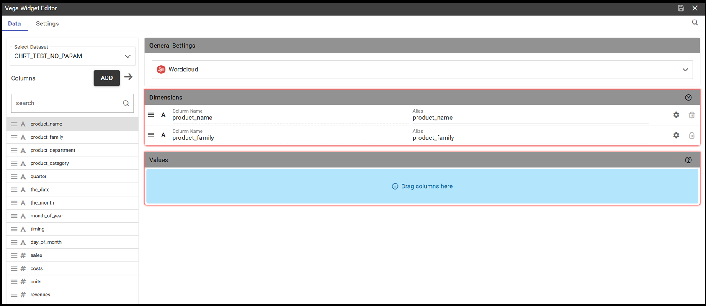

   Workcloud chart - attributes and measures

   Workcloud chart example

**Chord**
 A *Chord* chart shows the relationship between two entities though your data. Data flows from one entity (start category) to a second entity (final category)

 .. figure:: media/image068.png

   Chord chart - attributes and measures
 
 .. figure:: media/image069.png

   Chord chart example

**Parallel**

The *Parallel* chart is a way to visualize high-dimensional geometry and multivarious data. The axes of a multidimensional space are represented by parallel lines, usually equally spaced-out, and a point of the space is represented by a broken line with vertices on the parallel axes. The position of the vertex on an axis correspond to the coordinate of the point in that axis.

To create a parallel chart select a dataset with at least one attribute and two columns with numerical values. You can find an interesting example of dataset in the next table where we display some of its rows.

.. _exampleofdatsetparallel:
.. table:: Example of a dataset for a parallel chart.
   :widths: auto
   
   +--------+--------------+-------------+--------------+-------------+-----------------+
   |    ID  | sepal_length | sepal_width | petal_length | petal_width | class           |
   +========+==============+=============+==============+=============+=================+
   |    36  |    5.0       |    3.2      |    1.2       |    0.2      | Iris-setosa     |
   +--------+--------------+-------------+--------------+-------------+-----------------+
   |    37  |    5.5       |    3.5      |    1.3       |    0.2      | Iris-setosa     |
   +--------+--------------+-------------+--------------+-------------+-----------------+
   |    38  |    4.9       |    3.1      |    1.5       |    0.1      | Iris-setosa     |
   +--------+--------------+-------------+--------------+-------------+-----------------+
   |    39  |    4.4       |    3.0      |    1.3       |    0.2      | Iris-setosa     |
   +--------+--------------+-------------+--------------+-------------+-----------------+
   |    40  |    5.1       |    3.4      |    1.5       |    0.2      | Iris-setosa     |
   +--------+--------------+-------------+--------------+-------------+-----------------+
   |    41  |    5.0       |    3.5      |    1.3       |    0.3      | Iris-setosa     |
   +--------+--------------+-------------+--------------+-------------+-----------------+
   |    42  |    4.5       |    2.3      |    1.3       |    0.3      | Iris-setosa     |
   +--------+--------------+-------------+--------------+-------------+-----------------+
   |    43  |    4.4       |    3.2      |    1.3       |    0.2      | Iris-setosa     |
   +--------+--------------+-------------+--------------+-------------+-----------------+
   |    44  |    5.0       |    3.5      |    1.6       |    0.6      | Iris-setosa     |
   +--------+--------------+-------------+--------------+-------------+-----------------+
   |    45  |    5.1       |    3.8      |    1.9       |    0.4      | Iris-setosa     |
   +--------+--------------+-------------+--------------+-------------+-----------------+
   |    66  |    6.7       |    3.1      |    4.4       |    1.4      | Iris-versicolor |
   +--------+--------------+-------------+--------------+-------------+-----------------+
   |    67  |    5.6       |    3.0      |    4.5       |    1.5      | Iris-versicolor |
   +--------+--------------+-------------+--------------+-------------+-----------------+
   |    68  |    5.8       |    2.7      |    4.1       |    1.0      | Iris-versicolor |
   +--------+--------------+-------------+--------------+-------------+-----------------+
   |    69  |    6.2       |    2.2      |    4.5       |    1.5      | Iris-versicolor |
   +--------+--------------+-------------+--------------+-------------+-----------------+
   |    70  |    5.6       |    2.5      |    3.9       |    1.1      | Iris-versicolor |
   +--------+--------------+-------------+--------------+-------------+-----------------+
   |    71  |    5.9       |    3.2      |    4.8       |    1.8      | Iris-versicolor |
   +--------+--------------+-------------+--------------+-------------+-----------------+
   |    101 |    6.3       |    3.3      |    6.0       |    2.5      | Iris-virginica  |
   +--------+--------------+-------------+--------------+-------------+-----------------+
   |    102 |    5.8       |    2.7      |    5.1       |    1.9      | Iris-virginica  |
   +--------+--------------+-------------+--------------+-------------+-----------------+
   |    103 |    7.1       |    3.0      |    5.9       |    2.1      | Iris-virginica  |
   +--------+--------------+-------------+--------------+-------------+-----------------+
   |    104 |    6.3       |    2.9      |    5.6       |    1.8      | Iris-virginica  |
   +--------+--------------+-------------+--------------+-------------+-----------------+
   |    105 |    6.5       |    3.0      |    5.8       |    2.2      | Iris-virginica  |
   +--------+--------------+-------------+--------------+-------------+-----------------+
   |    106 |    7.6       |    3.0      |    6.6       |    2.1      | Iris-virginica  |
   +--------+--------------+-------------+--------------+-------------+-----------------+
   |    107 |    4.9       |    2.5      |    4.5       |    1.7      | Iris-virginica  |
   +--------+--------------+-------------+--------------+-------------+-----------------+
   |    108 |    7.3       |    2.9      |    6.3       |    1.8      | Iris-virginica  |
   +--------+--------------+-------------+--------------+-------------+-----------------+
    
In this example three different classes of iris are studied. Combining the values of some sepal and petal width or lenght, 
it is possible to find out which class we are looking at. One side of the below image (part a) shows a parallel chart related to the previous dataset. 
The second side of the image (part b) shows thanks to selection, that all iris with petal length between 2,5 and 5.2 cm and petal width 0,9 and 1,5 cm belong to the iris-versicolor class.

    From left to right: (a) Parallel. (b) Parallel chart selection.

    To create this chart two attributes and one measure are needed.

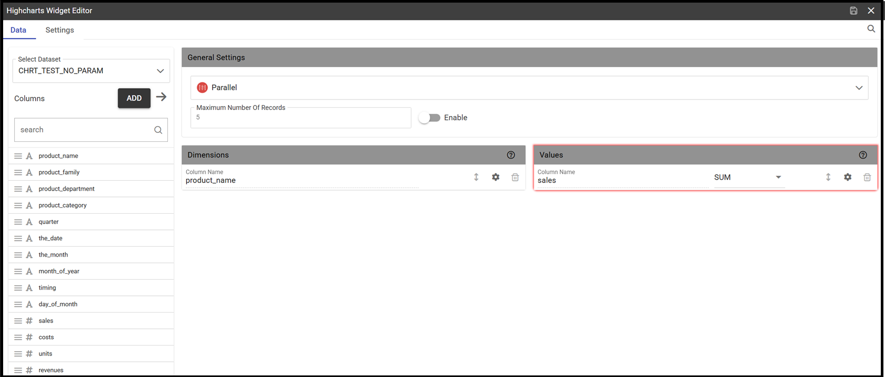
Parallel chart - measures and attributes

**Heatmap**
A *Heatmap* is a two-dimensional representation of data whose values are represented by colors.
Heatmap chart uses a chromatic Cartesian coordinate system to represent a measure trend trough two categories.

Heatmap chart - measures and attributes

.. figure:: media/image071.png
Heatmap chart example

**Radar**

A *Radar* chart is a two-dimensional chart showing more series of values over a varied number of variables having its own axis.
All axes are joined in the center of the graph.

To plot this graph at least one attribute and one measure are needed.

Radar chart - defining attributes and measures

Radar chart example

**Treemap**

The *Treemap* is a graphical representation of hierarchical data displayed as nested rectangles.
Each branch of the tree is given by a rectangle, which is tiled with smaller rectangles representing sub-branches. 
The area of the rectangles is proportional to a measure specified by a numerical attribute. The treemap is usefull to display a 
large amount of hierarchical data in a small space.
By clicking the *Add widget* button pick up *Chart* and then the *Treemap* from the gallery.
Once a dataset has been selected at least two attributes into the X-axis panel and one measure are needed. Press *Save* to apply the changes. 
See below image.

   Treemap chart - attributes and measures

The order of the attributes in the X-axis panel should reflect the order of the attributes in the hierarchy starting from the root to the top.

In Figure below an example of a Treemap chart

.. figure:: media/image11415.PNG

    From left to right: (a) Treemap. (b) Treemap sub-branches.

Bar, column, line, pie, radar and treemap charts allow the *drill-down* functionality.

**Activity Gauge**

The *Activity Gauge* uses circular-shaped bars to compare multiple categories against the target.
After clicking the *Add widget* button or icon pick up *Chart* and then the *Activity Gauge* chart from the gallery.

.. figure:: media/image017.png

   Activity Gauge example

Below you can see how to set the aliases. From the drop down menu you can choose the column(s) previously selected as measures and rename them.

   Setting Alias example
 The below image shows how changes are applied after renaming the measures.

.. figure:: media/image019.png

   Setting Series example

If you want to set properties for the Tooltip just click Tooltip and set Bold and Backgroud color as shown in the below image

   Setting Tooltip example

It is possible to change the position of the Legend just setting Left/Middle/Right. In the above picture the legend is set to appear in the middle.
Some othe properties you can manage are: Bold, Font size and family, Borders, Background.

**Bubble**

The *Bubble* chart is useful in case of three series. The size of the bubble depends on the third dimension.
After clicking the *Add widget* button pick up Chart and then the Bubble chart from the gallery.

.. figure:: media/image021.png

   Bubble chart - dragging and dropping measures and attributes

You can set some properties for the series. It is possible to define them for all series or just for one.
As shown in the below image in the last case just press the *plus* icon and the drop down menu will show you the list of 
columns.

.. figure:: media/image022.png

   Bubble chart - setting series

An example of bubble chart is shown below, bubbles color has been set through the *Color* property inside Settings section.

.. figure:: media/image023.png

   Bubble chart example

**Dumbell**

A *Dumbbell* chart uses circles and lines to show changes over time.
After pressing the *Add Widget* button or icon pick up Chart and then the *Dumbell* chart from the gallery.
To define the chart you need one attribute and two measures to define the series. See the below image.

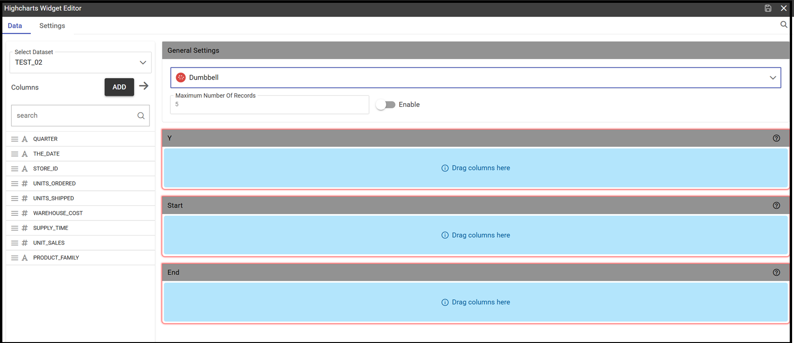

Dumbell chart example - defining measures and atributes

Once inserted your attributes and measures you can manage the settings of the start of your *Series* as shown below.

.. figure:: media/image025.png

  Dumbell chart - settings serie

  Dumbell chart - renaming measures

  Dumbell chart example

**Funnel**

This kind of chart provides a visual representation of how data progresses through different stages of a process starting 
from a broad head and ending in a narrow neck.
By clicking the *Add widget* pick up Chart and then *Funnel* from the gallery.
Once a dataset has been selected, click the *Add Widget* icon of your sheet or on the equivalent icon of the menu bar.
Select *Funnel* as chart, choose just one measure and one attribute and then press *Save* to get the graph visualized.
See below image.

Funnel chart example

**Packed Bubble**

A *Packed Bubble* is similar to a Bubble Chart where bubbles are tightly packed rather than spread over a grid of X and Y-Axis.
Once a dataset has been selected, click the *Add Widget* icon of your sheet or on the equivalent icon of the menu bar.
Select Chart and then *Funnel* as chart, choose just one measure and two attributes. The first attribute is used for grouping and the second one for labels. 
Then press *Save* to get the graph visualized.
See below image.

Packed bubble chart example

**Pictorial**

A *Pictorial* chart represents different stages of data using a bulb.
Once a dataset has been selected, click the *Add Widget* icon of your sheet or the icon of the menu bar.
Select Chart and then *Pictorial* as chart, choose just one measure to define the Serie and one attribute for the category.
See below image

 .. figure:: media/image032_1.png

Pictorial chart example

This kind of chart lets the upload of an SVG image that can transform the look and feel of your pictorial chart.
See below image.

 .. figure:: media/image032_2.png

Pictorial chart with SVG example

The following image shows where the SVG property can be found.

 .. figure:: media/image032_3.png

SVG property

**Sankey**

A *Sankey* chart is useful to highlight the flow of data from one value to another.
By clicking on the *Add widget* button press Chart and then *Sankey*.
The gallery offers two kinds of charts: *Sankey* and *Sankey Inverted*. The last chart is just the inverted represention of the normal Sankey.
Once selected the dataset, you need to choose two attributes representing the *from* and the *to* categories of the flow and a measure.

 .. figure:: media/image033.png

Sankey chart example

**Scatter**

A *Scatter* chart is like a cloud where two variables from a data set are plotted on a Cartesian space by using dots.
By clicking on the *Add widget* button press Chart and then *Scatter*.
After selecting the dataset to define this chart you need to pick up two *numerical* values representing the measure and the category.
See below image

 .. figure:: media/image034.png

   Scatter chart - defining series and categories

**Scatter Jitter**

 This chart is wseful when there are so many points piled up that data reading data turns out to be very tricky thus each point will be slightly 
 offset horizontally to reduce overlap and to allow reading.

 

   Scatter jitter - defining attribute and measure

   Scatter jitter chart example

**Streamgraph**

A *Streamgraph* represents a variation of the area chart where areas are plotted around a central axis and not a fixed one. This shapes the
graph with no corners but with rounded edges giving the impression of a flow.
By clicking on the *Add widget* button press Chart and then *Streamgraph*. You need to choose one attribute for the X-axis, one attribute as category
and one measure as shown below.

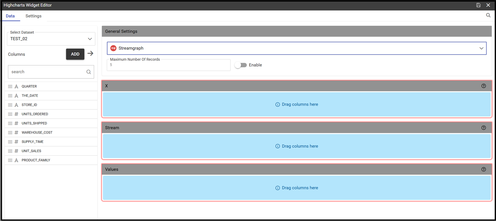

   Streamgraph chart - defining series and categories

.. figure:: media/image036.png

   Streamgraph chart example

**Waterfall**

A *Waterfall* chart can be useful to understand how data is affected by positive or negative values. It' s like a bar chart where in the middle of two normal bars 
there are suspended bars as the beguinning of the bar is represented by the end of the previous bar.
By clicking on the *Add widget* button press Chart and then *Waterfall*.
Select yor dataset and then you will be asked to enter just one attribute as category and one measure as a serie as shown below.

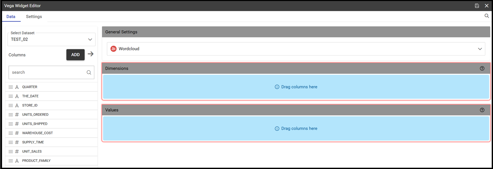

   Waterfall - defining measures and attributes

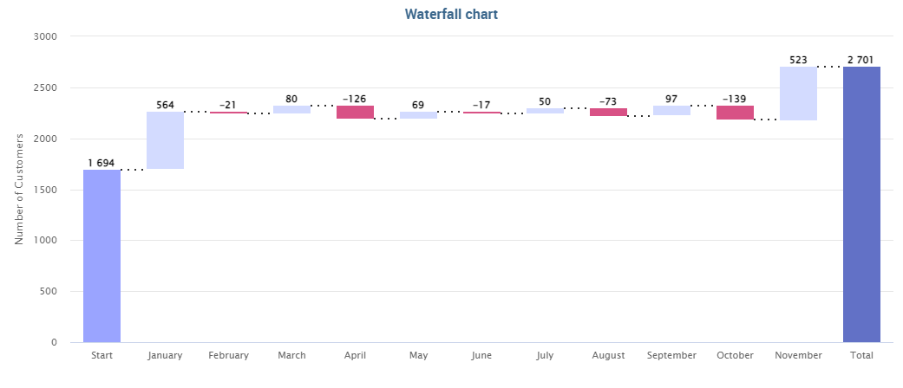

   Waterfall chart example

Html widget
~~~~~~~~~~~~~~~~~~~~~~~~~~~~~~~~~~~~~~~~~~~~~~~~~~~~~~~~~~~~~~~~~~~~~~~~~~~~~~~~~~~~~~~~~~~~~~~~~~~~~~~~~~~~~~~~~~~~~~~~
The HTML widget allows to add customized HTML and CSS code to implement very flexible and customized dynamic elements. 
This widget supports all HTML5 standard tags and CSS3 properties.
By clicking the *Add widget* button or icon and then *HTML* you can insert the HTML widget.

For security reasons no custom Javascript code can be added to html tags. Every tag considered dangerous will be deleted 
after saving the document.

.. important::

        A CSS property will be extended to all the classes in the cockpit with the same name; to apply the property 
        only to the current widget use the id prefix shown in the info panel of the CSS editor

.. figure:: media/image048.png
HTML widget editor

**Available Tags**

*kn-column*

``[kn-column='COLUMN-NAME' row='COLUMN-ROW-NUMBER' aggregation='COLUMN-AGGREGATION' precision='COLUMN-DECIMALS']``

The ``kn-column`` tag is the main dynamic HTML Widget tool, it allows to select a column name from the selected dataset and to display its values. The value of the kn-column attribute should be the name of the column value you want to read in execution.

The **row** attribute is optional and is a number type attribute. This attribute can let you retrieve a specific row according to the position in the dataset. If no row is selected the first row column value will be shown.

The **aggregation** attribute is optional and is a string type attribute. If inserted the value shown will be the aggregation of all column rows values. The available aggregations are: AVG, MIN, MAX, SUM, COUNT_DISTINCT, COUNT, DISTINCT COUNT.

The **precision** attribute is optional and is a number type attribute. If added and if the result value is a number, the decimal precision will be forced to the selected one.

*kn-parameter*

``[kn-parameter='PARAMETER-NAME']``

The kn-parameter tag is the tool to show a dataset parameter inside the widget execution. The value of the kn-parameter attribute should be the name of the parameter to display.

*kn-calc*

``[kn-calc=(CODE-TO-EVALUATE) precision='VALUE-PRECISION']``

The ``kn-calc`` tag is the tool to calculate expressions between different values on widget execution. Everything inside the brackets will be evaluated after the other tags substitution, so will be possible to use other tags inside.

The **precision** attribute is optional and is a number type attribute. If added and if the result value is a number, the decimal precision will be forced to the selected one.

*kn-repeat*

``
 ... REPEATED-CONTENT ... 
``

The ``kn-repeat`` attribute is available to every HTML5 tag, and is a tool to repeat the element for every row of the selected dataset.

This attribute is naturally linked to ``kn-column`` tag. If inside a ``kn-column`` tag without a row attribute is present, the ``kn-repeat`` will show the column value for every row of the dataset.

Inside a ``kn-repeat`` is possible to use the specific tag ``[kn-repeat-index]``, that will print the index of the repeated column row.

The **limit** attribute is optional and is a number type attribute. If added the number of row repeated will be limited to the selected number. If no limit is provided just the first row will be returned. If you want to get all records, you can set it to -1, but be careful because big datasets can take a while to load completely.

*kn-if*

``
 ... 
``

The ``kn-if`` attribute is available to every HTML5 tag and is a way to conditionally show or hide an element based on some other value. The attribute content will be evaluated after the other tags substitution, so it will be possible to use other tags inside. If the evaluation returns true the tag will be shown, otherwise it will be deleted from the execution.

*kn-cross*

``
 ... 
``

The ``kn-cross`` attribute is available to every HTML5 tag and is a way to make the element interactive on click. This attribute makes the element clickable to open the cross navigation specified in the widget settings. If there is no cross navigation set this tag will not work.

*kn-preview*

``
 ... 
``

The ``kn-preview`` attribute is available to every HTML5 tag and is a way to make the element interactive on click. This attribute makes the element clickable to open the dataset preview dialog. The attribute value will be the *dataset label* of the dataset that you want to open. If a dataset is not specified the cockpit will use the one set for the widget. If no dataset has been set and the attribute has no value this tag will not work.

*kn-selection*

``
 ... 
``

The ``kn-selection-column`` attribute is available to every HTML5 tag and is a way to make the element interactive on click. This attributes makes the element clickable to set the chosen column and value as a selection filter in the cockpit. The default will use as a selection the first row value of the column.

The **kn-selection-value** attribute is optional and will let you specify a specific value as a column selection filter.

*kn-variable*

``[kn-variable='VARIABLE-NAME' key='VARIABLE-KEY']``

The ``kn-variable`` tag is the tool to read the runtime value of one of the defined variables. It will change depending on the current value and can be used inside ``kn-if`` and ``kn-calc``.

The **key** attribute is optional and will select a specific key from the variable object if the variable is "Dataset" type, returning a specific value instead of a complete dataset.

.. warning::
    **Banned Tags**
    To avoid Cross-site scripting and other vulnerabilities, some tags are *not allowed* and will automatically be removed by the system when saving the dashboard:

    -  ``<button></button>``
    -  ``<object></object>``
    -  ````

If you need to simulate a button behaviour use a div (or another allowed tag) and replicate the css style as shown below:

.. code-block:: html
   :linenos:

   
Buttonlike div

.. code-block:: css
   :linenos:

   .customButton {
        border: 1px solid #ccc;
        background-color: #ededed;
        cursor: pointer;
    }
    .customButton:hover {
        background-color: #d8d8d8;
    }

.. warning::
    **Whitelist**
    
    Base paths to external resources (images, videos, anchors, CSS files and inline frames) must be declared within ``TOMCAT_HOME/resources/services-whitelist.xml`` XML file inside Knowage Server, otherwise these links will be removed by the system. 
    This whitelist file contains safe and trusted websites, to restrict end users of providing unsafe links or unwanted web material. Knowage Server administrator can create or edit it (directly on the file system) to add trusted web sites. Here below you can see an example of ``services-whitelist.xml`` file; as you can see, its structure is quite easy: ``baseurl`` attributes refer to external services, ``relativepath`` must be used for Knowage Server internal resources instead:

.. code-block:: xml
   :linenos:

   <?xml version="1.0" encoding="UTF-8"?>
   <WHITELIST>
      <service baseurl="https://www.youtube.com" />
      <service baseurl="https://player.vimeo.com" />
      <service baseurl="https://vimeo.com" />
      <service baseurl="https://media.giphy.com" />
      <service baseurl="https://giphy.com" />
      <service baseurl="https://flic.kr" />
      <service relativepath="/knowage/themes/" />
      <service relativepath="/knowage/icons/" />
      <service relativepath="/knowage/restful-services/1.0/images/" />
   </WHITELIST>

Table widget
~~~~~~~~~~~~~~~~~~~~~~~~~~~~~~~~~~~~~~~~~~~~~~~~~~~~~~~~~~~~~~~~~~~~~~~~~~~~~~~~~~~~~~~~~~~~~~~~~~~~~~~~~~~~~~~~~~~~~~~~
By clicking on the *Add widget* button or icon and then on *Table* it is possible to add a *Table* widget to the dashboard.
After selecting the dataset, drag and drop the columns to show.
You can active Pagination just switching on the sliding button and then specify the number of items to be visualized per page.
To handle each column settings just click on the setting icon before the trash. You will be able to set aliases, the aggregation function
and filters on that column.

    Table widget editor

To manage styles and other functionalities for columns just move to the *Settings* section.
The below image shows how to pin colums in a table. Pinned columns are columns that are fixed to the left or to the right of the table.
The *plus* icon will add a new line where the column to be pinned has to be picked up from the *Columns* drop down menu. The field *Pinned* has toset to *Left* or *Right*.

  .. figure:: media/image098.png

    Pinning a column

    A pinned column example

 The below image shows how to apply *Conditional Styles* to a specific column of the table.
 If a given condition for a measure occurs it is possible to set properties as font size, font Family, background, etc.
 In case variables and parameters have been defined for the dashboard just make your choice from the *Value Type* menu to enter the related value.

 .. figure:: media/image050.png

   Table widget - conditional styles

The value of a specific column can also be represented by using an *icon*.
See below image.

 .. figure:: media/image100.png

   Table widget - choosing the icon to visualize

However, it is important to have previously specified that column as being represented as an icon otherwise choices will not be applied.

 .. figure:: media/image101.png

   Table widget - set visualization type as icon

 .. figure:: media/image102.png

   Table widget example with icons as values 

*Visibility* conditions can also be applied for a column. Just click the *Visualization* property as shown below.

 .. figure:: media/image051.png

   Table widget - visibility conditions

The below example shows how ordering a column.

 .. figure:: media/image103.png

   Table widget - ordering a column

Pivot widget
~~~~~~~~~~~~~~~~~~~~~~~~~~~~~~~~~~~~~~~~~~~~~~~~~~~~~~~~~~~~~~~~~~~~~~~~~~~~~~~~~~~~~~~~~~~~~~~~~~~~~~~~~~~~~~~~~~~~~~~~
By clicking the *Add widget* button or icon and then *Pivot* it is possible to add a *Pivot* widget to the dashboard.
With this widget the user can decide wich field of a dataset could be represented as a *column* and wich one as a *row*.
The below image shows an example of a *Pivot* widget. Changes to the layout can be made by handling the *Style* properties defined 
in the *Settings* section of the widget.

 .. figure:: media/image083.png

   Pivot widget example

After selecting the dataset, you can drag and drop fields to define columns, rows and measures of the pivot table.

    .. figure:: media/image089.png

   Pivot widget - defining colums, rows and measures

By clicking on the icon highlighted in the below image a *Field chooser* appears.
Here you can handle some properties as ordering just by clicking the arrow appearing on the right side of each field or you can simply exchange the attributes
previosly selected to show in your pivot table.

       .. figure:: media/image090.png

   Pivot widget - Field chooser

Filters on values can be applied just by clicking the funnel icon.

       .. figure:: media/image091.png

   Pivot widget - applying filters

By default all fields are visualized as text. In case you need a specific measure to be represented i.e. as an icon you just need 
to click the *plus icon*, select a measure column from the drop down menu and the *visualization* type.

       .. figure:: media/image092.png

   Pivot widget - displaying measures as text or icon

Conditional styles can also be applied to a measure so that when resulting i.e. greater that a specific value the color can be a different one.
For all those columns to be represented as an icon, it is important to handle this property to specify the range of values ​​for which the measure will appear as an icon. 
Outside the specified range(s) the measure will appear as text.

       .. figure:: media/image093.png

   Pivot widget - applying styles to fields

       .. figure:: media/image094.png

   Pivot widget after applying styles to fields

Map widget
~~~~~~~~~~~~~~~~~~~~~~~~~~~~~~~~~~~~~~~~~~~~~~~~~~~~~~~~~~~~~~~~~~~~~~~~~~~~~~~~~~~~~~~~~~~~~~~~~~~~~~~~~~~~~~~~~~~~~~~~
By clicking the *Add widget* button or icon and then *Map* it is possible to add a *Map* widget to the dashboard.
The Map Widget is useful when a user needs to visualize data related to a geographic position. The widget supports multiple layers, one for every dataset added to widget and one data field for every layer.

.. figure:: media/image055.png

    Map widget example.

Unlike the most of the widgets that have a *Data* section for data configuration here we find the *Layer* section where the user can add and remove layers, 
set the format of a spatial attribute to use and specify the attributes to display on the map and on the detail popup.

The below image shows a map widget with two layers where each dataset is related to one layer.

    .. figure:: media/image104_n.png

        Map widget - choosing a dataset for a layer.

In the *Layer* Metadata section, the user can set the spatial attribute of the dataset that will be used to display markers on the map. 
Currently, the following spatial attribute types are supported:

-  String format: where the value specify two decimal numbers representing latitude and longitude separated by a space;
-  JSON: where the value is a text string in `GeoJSON <https://en.wikipedia.org/wiki/GeoJSON>`_ format;
-  WKT: where the value is a text string in `Well-known Text <https://en.wikipedia.org/wiki/Well-known_text_representation_of_geometry>`_ format;

        Layer metadata section

.. important::
         **Geographic coordinates format**
         For every type defined above the user has to specify the format of the geographic coordinate that is wether latitude comes first or vice versa.

        Geographic coordinates
For every layer, there are different ways to display data on the map: markers, balloons, pies, clusters, heatmaps, choroplet and geography.

The *plus* icon to the left of the *trash* allows the addition of new information for further layers as shown below.

        Data visualization for layers

When representing data as markers the user can choose between *Icon, Image and Web Image* markers. The below image shows an example where an icon has been chosen.
The image highlights both the picker for choosing icons and the icon selected that in this case corresponds to the *anchor* icon.

        Marker represented as icon

Below an example of how a map can look like depending on how data is visualized.
The below example shows a map with markers.

        Data visualization types on a map

Below, we will see an example of a map created by using a topojson file and choroplet as the visualization type.
The topojson file was initially used to create a layer under the *CATALOGS>Layers* menu item and will be added as a layer to the map widget.
Once added, it is enough to set the visualization criteria as shown in the figure below.

        Example of map settings

The goal is to show the unit sales for each region when hovered over with the mouse. To do this, you will need to enable a *Tooltip* by choosing 
the layer and property to display.

        Defining a tooltip

As a result of the former configuration you will see a map as shown below.

.. figure:: media/set_map_03.png

        Example of a map with tooltip

Instead of a tooltip it can also be used a dialog box.

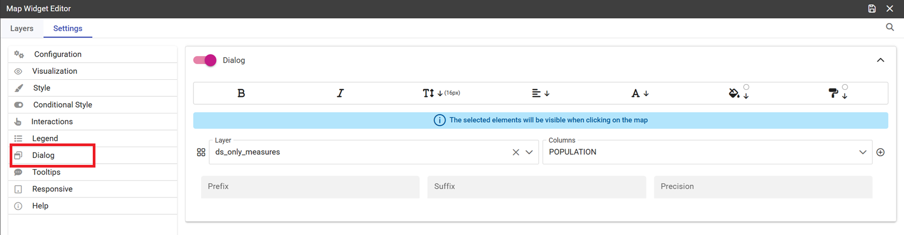

        Defining a dialog for a map

It is also possible to use a combination made of a dataset and a topojson file, thus use two layers with an attribute used as a kind of join.

        Example of settings for a map using two layers

Active selections widget
~~~~~~~~~~~~~~~~~~~~~~~~~~~~~~~~~~~~~~~~~~~~~~~~~~~~~~~~~~~~~~~~~~~~~~~~~~~~~~~~~~~~~~~~~~~~~~~~~~~~~~~~~~~~~~~~~~~~~~~~
By clicking the *Add widget* button or icon and then *Active Selections* it is possible to add a *Active Selections* widget to the dashboard.
This chart shows the list of current selections applied on a widget. An icon on the right upper corner of the dashboard will 
be visible and clickable to open the list. On each item of the list a *trash* icon is available for the deletion of that selection.

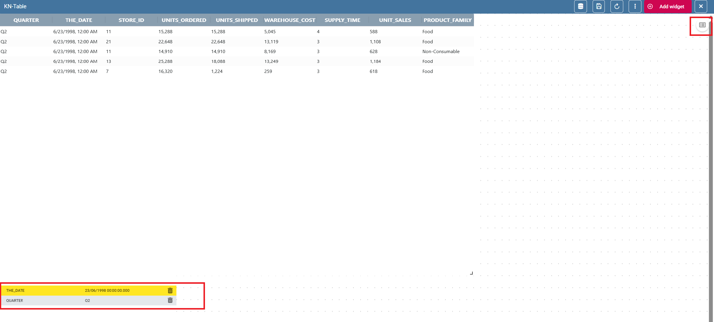

   Active selections widget
 
 To get the result shown in the above image just go to the *Settings* and select the *Style* property

 .. figure:: media/image053.png

   Active selections widget - Style property

 Be aware that a selection can be locked. In this case it will be not possible to delete that selection until unlocked. This can only be done by admin users.
 This forces the final user to run the dashboard with that selection that will not be removed as locked by the admin user.

Selector widget
~~~~~~~~~~~~~~~~~~~~~~~~~~~~~~~~~~~~~~~~~~~~~~~~~~~~~~~~~~~~~~~~~~~~~~~~~~~~~~~~~~~~~~~~~~~~~~~~~~~~~~~~~~~~~~~~~~~~~~~~
By clicking on the *Add widget* button or icon and then *Selector* it is possible to add a *Selector* widget to the dashboard.
The *Selector* widget allows a dataset filtering by means of a combobox, radio button or checkboxes.
After choosing the column to use as a filter just move to the *Setting* section and then *Configuration*. See below image.

   Active selections widget

Custom chart widget
~~~~~~~~~~~~~~~~~~~~~~~~~~~~~~~~~~~~~~~~~~~~~~~~~~~~~~~~~~~~~~~~~~~~~~~~~~~~~~~~~~~~~~~~~~~~~~~~~~~~~~~~~~~~~~~~~~~~~~~~
By clicking the *Add widget* button or icon and then *Custom Chart*  it is possible to add a *Custom Chart* widget to the dashboard.

The Custom Chart allows the user to directly embed HTML, CSS and JS code using a supported external chart library and integrating with Knowage data and interactions using custom API.

.. important::
         **Chart libraries**

         Former versions of Knowage EE supported the inclusion of other libraries adding the CDN script tag in the html Editor by means of the
         kn-import tag:
         
         .. code-block:: html
            :linenos:

            <kn-import src="yourCDNurl"></kn-import>

         Now you can insert the library link from the *Libraries* section of the Editor panel as shown below.

   Libraries section

This widget will only be available if the *Create custom chart widget* option is enabled for a specific user role.

Trough the  **Editor** panel alloit is also possible to insert custom code for CSS and HTML.

.. figure:: media/image079.png

   Custom chart editor

The CSS component allows to type in CSS classes that will be used by the HTML code of the widget. It's also possible to use `@import` command if the referred url is inside the whitelist.

The HTML component allows to insert HTML tags in order to create a structure to host the custom chart and additional structural informations.

The JavaScript component is the code section, and allows to insert the custom chart code, custom Javascript code and the API usage.

The keyword **datastore** allows using APIs. Datastore is an object that contains the curren data; 
Through a variety of methods it is possible to iterate over the results and get all values. See below:

**getDataArray**

|   returns: *data array*
|   params: *custom user function*
|   example:

.. code-block:: javaScript
    :linenos:

    datastore.getDataArray(function(record){
        return {
        name: record.city,
        y: record.num_children_at_home
        }
    })

|   result:

.. code-block:: javaScript
   :linenos:

	[
		{
			name:'New York',
			y: 5
		},
		{
			name:'Boston',
			y: 3
		}
	]

**getRecords**

|   returns: array of objects; each object has nameOfDsColumn: value
|   params: no params
|   example:

.. code-block:: javaScript
   :linenos:

    datastore.getRecords()

|   result:

.. code-block:: javaScript
   :linenos:

	[
		{
			city:'New York',
			total_children: 5,
			country: 'USA'
		},
		{
			name:'Boston',
			total_children: 3,
			country: 'USA'

		}
	]

**getColumn**

|   returns: array of *unique* values for one dataset column
|   params: dataset's column name
|   example:

.. code-block:: javaScript
    :linenos:

    datastore.getColumn('country')

|   result:

.. code-block:: javaScript
	:linenos:

	['USA','Mexico','Canada']

**getSeriesAndData**

|   returns: array of series with data for each series
|   params: serie/measure name, custom user function
|   example:

.. code-block:: javaScript
    :linenos:

    datastore.getSeriesAndData('PRODUCT_FAMILY',function(record){
        return {
            y: record.UNIT_SALES,
            name: record.QUARTER
        }
    })

|   result:

.. code-block:: javaScript
	:linenos:

	[
		{
			name:'Drink',
			data: [
				{
					y: 5000,
					name: 'Q1'
				},
				{
					y: 7000,
					name: 'Q2'

				}
			]
		},
		{
			name:'Food',
			data: [
				{
					y: 6000,
					name: 'Q1'
				},
				{
					y: 4000,
					name: 'Q2'

				},
				{
					y: 3000,
					name: 'Q3'

				}
			]
		}
	]

**sort** - angular sort service (sorting is executed on the client side)

|   returns: datastore sorted by dataset's column/s
|   params: dataset's column name
|   optional: sort type object {column:'asc/desc'}
|   example1:

.. code-block:: javaScript
    :linenos:

    datastore.sort('STORE_ID') //by default, it is asc
    OR:
    datastore.sort({'STORE_ID':'asc'})

**filter** - angular filter service (filtering is executed on the client side)

|   returns: datastore filtered by some value for dataset's column/s
|   params: object that contains dataset's columns names for properties -> value to be filtered, an optional boolean to enable the strict comparison (false as default)
|   example:

.. code-block:: javaScript
    :linenos:

    datastore.filter({'QUARTER':'Q1','STORE_ID':'1'}, true)

**hierarchy**

|   returns: hierarchy object with its functions and tree
|   params: object that contains property levels -> array of dataset's columns names
|   optional: same object with optional property measures -> object that contains dataset's columns names for properites -> aggregation function (sum, min, max)
|   example:

.. code-block:: javaScript
    :linenos:

    var hierarchy = datastore.hierarchy({'levels':['QUARTER','PRODUCT_FAMILY'],'measures': {'UNIT_SALES':'SUM'}})

|   result:

.. code-block:: javaScript
	:linenos:

	[
		{
			"name": "Q1",
			"children": [
				{
					"name": "Non-Consumable",
					"children": [],
					"UNIT_SALES": 7.4571
				},
				{
					"name": "Food",
					"children": [],
					"UNIT_SALES": 12
				}
			],
			"UNIT_SALES": 19.4571
		},
		{
			"name": "Q2",
			"children": [
				{
					"name": "Non-Consumable",
					"children": [],
					"UNIT_SALES": 9.9429
				},
				{
					"name": "Food",
					"children": [],
					"UNIT_SALES": 7.2
				}
			],
			"UNIT_SALES": 17.1429
		}
	]

**getChild**

|   returns: node of hierarchy (node is Node object)
|   params: index of child in hierarchy
|   example:

.. code-block:: javaScript
    :linenos:

    hierarchy.getChild(0)

|   result:

.. code-block:: javaScript
	:linenos:

	{
		"name": "Q1",
		"children": [
			{
				"name": "Non-Consumable",
				"children": [],
				"UNIT_SALES": 7.4571
			},
			{
				"name": "Food",
				"children": [],
				"UNIT_SALES": 12
			}
		],
		"UNIT_SALES": 19.4571
	}

**getLevel**

|   returns: array of nodes of hierarchy on specific level
|   params: index of level in hierarchy
|   example:

.. code-block:: javaScript
    :linenos:

    hierarchy.getLevel(0)

|   result:

.. code-block:: javaScript
	:linenos:

	[
		{
			"name": "Q1",
			"children": [
				{
					"name": "Non-Consumable",
					"children": [],
					"UNIT_SALES": 7.4571
				},
				{
					"name": "Food",
					"children": [],
					"UNIT_SALES": 12
				}
			],
			"UNIT_SALES": 19.4571
		},
		{
			"name": "Q2",
			"children": [
				{
					"name": "Non-Consumable",
					"children": [],
					"UNIT_SALES": 9.9429
				},
				{
					"name": "Food",
					"children": [],
					"UNIT_SALES": 7.2
				}
			],
			"UNIT_SALES": 17.1429
		}
	]

*node* is an instance of Node object. It has convenient functions to explore the node:

.. code-block:: javaScript
    :linenos:

    var node = hierarchy.getChild(0)

|   result:

.. code-block:: javaScript
	:linenos:

	{
		"name": "Q1",
		"children": [
			{
				"name": "Non-Consumable",
				"children": [],
				"UNIT_SALES": 7.4571
			},
			{
				"name": "Food",
				"children": [],
				"UNIT_SALES": 12
			}
		],
		"UNIT_SALES": 19.4571
	}

**getValue**

|   returns: a measure's value for a specific hierarchy's child(node)
|   params: dataset's measures's name
|   example:

.. code-block:: javaScript
    :linenos:

    node.getValue('UNIT_SALES')

|   result: 19.4571

**getChild**

|   returns: a specific node's child
|   params: index of nodes's child
|   example:

.. code-block:: javaScript
    :linenos:

    node.getChild(0)

|   result:

.. code-block:: javaScript
	:linenos:

	{
		"name": "Non-Consumable",
		"children": [],
		"UNIT_SALES": 7.4571
	}

**getParent**

|   returns: a node parent of specific child
|   params: no params
|   example:

.. code-block:: javaScript
    :linenos:

    node.getChild(0).getParent()

|   result:

.. code-block:: javaScript
	:linenos:

	{
		"name": "Q1",
		"children": [
			{
				"name": "Non-Consumable",
				"children": [],
				"sales": 7.4571
			},
			{
				"name": "Food",
				"children": [],
				"sales": 12
			}
		],
		"sales": 19.4571
	}

**getChildren**

|   returns: an array of node's children
|   params: no params
|   example:

.. code-block:: javaScript
    :linenos:

    node.getChildren()

|   result:

.. code-block:: javaScript
	:linenos:

	[
		{
			"name": "Non-Consumable",
			"children": [],
			"sales": 7.4571
		},
		{
			"name": "Food",
			"children": [],
			"sales": 12
		}
	]

**getSiblings**

|   returns: an array of node siblings to a specific child
|   params: no params
|   example:

.. code-block:: javaScript
    :linenos:

    node.getChild(0).getSiblings()

|   result:

.. code-block:: javaScript
	:linenos:

	[
		{
			"name": "Non-Consumable",
			"children": [],
			"sales": 7.4571
		},
		{
			"name": "Food",
			"children": [],
			"sales": 12
		}
	]

**variables**

|   returns: a key/value object with all the declared variables and values
|   params: no params
|   example:

.. code-block:: javaScript
    :linenos:

    var myvariables = datastore.variables;

|   result:

.. code-block:: javaScript
   :linenos:

    {
        variableCity: 'New York',
        variableNum: 100
    }
	

**profile**

|   returns: a key/value object with all the declared profile attributes for the user
|   params: no params
|   example:

.. code-block:: javaScript
   :linenos:

    var user = datastore.profile;

|   result:

.. code-block:: javaScript
   :linenos:

    {
        name: 'My Name',
        tenant: 'Knowage',
        customProfileAttribute: 'Test value',
        role: 'user'
    }
	

**selections**

|   returns: an array with all the selections done; each selection has informations about the dataset where the selection has been done, the column e the value passed through the selection
|   params: no params
|   example:

.. code-block:: javaScript
   :linenos:

    var activeSelection = datastore.selections;

|   result:

.. code-block:: javaScript
	:linenos:

	[
		{
			"ds": "FOODMART_SALES",
			"column": "PRODUCT_FAMILY",
			"value": "Food"
		},
		{
			"ds": "FOODMART_COST",
			"column": "QUARTER",
			"value": "Q1"
		}
	]

**parameters**

|   returns: a key/value object with all the parameters associated to the dashboard
|   params: no params
|   example:

.. code-block:: javaScript
   :linenos:

    var myParameters = datastore.parameters;

|   result:

.. code-block:: javaScript
   :linenos:

    {
        "par_family": "Non-Consumable",
        "par_number": 10
    }

Interaction with the other widgets is also possible just by using the **clickManager**:

.. code-block:: javaScript
   :linenos:

    datastore.clickManager(columnName, columnValue);

This method can be added everywhere the code manages a click event and will notify Knowage about the interaction.
The default case (if no cross-navigation or preview-navigation is set) will throw a selection filter with the dataset column name and column value set in the method.
Any enabling of cross-navigations or previews will have priority on the selection and will trigger the specified interaction. The dynamic values used will be the ones set in the method arguments.

.. warning::
    **Whitelist**

    For security reasons no dangerous Javascript code can be added to html tags. Every tag considered dangerous will be deleted on save by the system.
    Base paths to external resources (images, videos, anchors, CSS files and inline frames) must be declared within ``TOMCAT_HOME/resources/services-whitelist.xml`` XML file inside Knowage Server, otherwise those external links will be removed by the system. This whitelist file contains safe and trusted websites, to restrict end users of providing unsafe links or unwanted web material. Knowage Server administrator can create or edit it (directly on the file system) to add trusted web sites. Here below you can see an example of ``services-whitelist.xml`` file; as you can see, its structure is quite easy: ``baseurl`` attributes refer to external services, ``relativepath`` must be used for Knowage Server internal resources instead:

    .. code-block:: xml
       :linenos:

        <?xml version="1.0" encoding="UTF-8"?>
        <WHITELIST>
            <service baseurl="https://www.youtube.com" />
            <service baseurl="https://player.vimeo.com" />
            <service baseurl="https://vimeo.com" />
            <service baseurl="https://media.giphy.com" />
            <service baseurl="https://giphy.com" />
            <service baseurl="https://flic.kr" />
            <service relativepath="/knowage/themes/" />
            <service relativepath="/knowage/icons/" />
            <service relativepath="/knowage/restful-services/1.0/images/" />
        </WHITELIST>

Discovery widget
~~~~~~~~~~~~~~~~~~~~~~~~~~~~~~~~~~~~~~~~~~~~~~~~~~~~~~~~~~~~~~~~~~~~~~~~~~~~~~~~~~~~~~~~~~~~~~~~~~~~~~~~~~~~~~~~~~~~~~~~
By clicking on the *Add widget* button or icon and then *Discovery* it is possible to add a *Discovery* widget to the dashboard.
The Discovery widget is used to easily use and navigate into a SOLR dataset by using facets aggregation and by showing the results in a tabular representation . 
It is possible to choose the fields that should be shown as the result. 
The result to be visualized can also be configured to show a limited set of fields and facets. Facets are shown on the left side of the table and data 
can be filtered just clicking on a specific value inside one of them.
The search bar can also be set up from the configuration settings.
The below image shows an example of dicovery widget.

   Discovery widget example

Facets properties can be handled by enabling the related option i.e. selecting which faces to visualize.
See below images.
To throw the filtering on the table the property *Enable Selection* has to be enabled.

Other properties to handle are:

   - *Closed by default*, if enabled the facets will be visible as closed groups by default.

   - *Facets column width*, this setting allows to choose the dimension of the facets column in px, rem or percentage values.

   - *Facets max number*, this setting allows to choose the maximum number of facets visible for every field.

   Discovery widget - Facets

A related table shows the selection(s) made on facets.

   Selected facets

The below image shows how to enable the search bar by specifing on which fields to run the search and whether it is a static search or just run through an analytical driver.

   Discovery widget - search bar

   Discovery widget - Types of search

Python widget
~~~~~~~~~~~~~~~~~~~~~~~~~~~~~~~~~~~~~~~~~~~~~~~~~~~~~~~~~~~~~~~~~~~~~~~~~~~~~~~~~~~~~~~~~~~~~~~~~~~~~~~~~~~~~~~~~~~~~~~~
By clicking the *Add widget* button or icon and then on *Python* it is possible to add a *Python* widget to the dashboard.
The editor widget allows embedding a Python script. Before writing the code it is necessary to specify 

   1 - the type of the output produced by the script:
         - Image or
         - HTML
   2 - the name of the file where to save the output of the script. 
   
   See below image

   Python widget editor

The below image shows an example of a *Python* script.

   .. figure:: media/image112.png

   Python script example

Dataset columns and/or parameters can also be added to the script as shown below.

   .. figure:: media/image113.png

   Adding parameters or columns to a Python script

Inside the Python scripts analytical drivers can be also accessed by using the usual placeholder syntax $P{}.

Additionaly more environments where to run scripts can be created. The below image shows how to handle all the evironments previously defined. 
To support this kind of choice a list of available libraries is displayed for each selected environment.

   .. figure:: media/image114.png

   Python environments

Cross Navigation
------------------------------------------------------------------------------------------------------------------------
The cross navigation allows navigation from one document to another.
You will find the cross navigation functionality in the *Settings* section of a widget. Just click on *Interactions* as shown below.

.. figure:: media/image039.png

   Searching cross navigation

Activate the functionality just switching on the slidind button and select the name of the cross navigation previously defined.

.. figure:: media/image040.png

   Activating cross navigation

Select, Link, Preview
------------------------------------------------------------------------------------------------------------------------
The *Interaction* property contains some otherfunctionalities such as:
   - Selection: if deactivated i.e. the chart is not clickable
   - Link, to open a specific URL when clicking i.e. on a chart
   - Preview, to download a file when clicking i.e. on a chart

Only one option can be activated at the same time. To activate the option just switch on the corresponding sliding button.

Drill-down
------------------------------------------------------------------------------------------------------------------------
Drill down leads the user from a more general view of the data to a more specific view just by clicking the mouse.
This functionality is also listed under the *Interactions* property of the *Settings* section.

The following example shows how drill-down works.

The selected categories are four and called: ``product_family``, ``product_department``, ``product_category`` and ``product_subcategory``. 
Once we open the document, we get as shown below:

    Drillable Bar Chart

When selecting ``shelf_depth`` measure of the Food category one gets (see next figure):

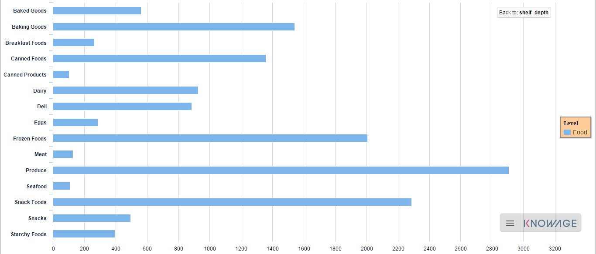

    Drillable Bar Chart: first drill

Once again, we can select ``Frozen food`` subcategory and drill to a second sub-level as shown below:

.. figure:: media/image129.png

    Drillable Bar Chart: second drill

And so on to the fourth subcategory. Selecting the “Back to: ...” icon available at the right corner of the graphic, the user can get back to 
the previous level. This efficient feature allows a deep insight of the analysis that leads to important conclusions.

Manage Cache/Frequency
------------------------------------------------------------------------------------------------------------------------
To manage the cache and frequency of your data you need to select the dataset form the list of the available ones 
and switching on the sliding button for the *Cache* option as shown in the below image.

   Managing cache and frequency

You can also index columns.

.. figure:: media/image047.png

   Managing indexes on columns

Add a Calculated Field
------------------------------------------------------------------------------------------------------------------------
Steps to add a calculated field:
 - select a dataset 
 - click on the *Add Columns* button as shown in the below image.
 - follow the instructions appearing in the pop up (assign a name, a function,..)
 - close the pop-up by clicking *Apply*. The button remains graid off until validation is done.

 .. figure:: media/image045.png

   Adding a calculated field

 Once the new field has been added you will see the new column appearing toghether with the ones of your dataset.
 By using the icon highlighted in the below image you can reopen the details pop-up.

 .. figure:: media/image045.png

   Reopen details of a calculated field

Widget Theame
------------------------------------------------------------------------------------------------------------------------

This is a functionality introduced on the new *Dashboard* available in the *Settings* section just clicking on *Style*.
See below image.

   Widget Theame

The below image shows an example of two different themes applied to the corresponding table widgets.

.. figure:: media/image043.png

   Widget Theame example

The available themes have to be previously defined by an *admin user*.

Filters and ordering on fields
------------------------------------------------------------------------------------------------------------------------

The below two images shows how to enable the filtering functionality on a specific field of a dataset.
You need to click the gear icon and switch on the *Enable filter* to choose the *comperison operator* with a specific value.

   Activating filters - 1

.. figure:: media/image096.png

   Activating filters - 2

 From the same editor it is also possible to set the ordering on a field as shown below.

  Ordering on a field

Variables
------------------------------------------------------------------------------------------------------------------------
To create variables just click on the three dots menu of the bar, select *General* and then *Variables* as shown below.

   Creating a variable - step 1

Select *Variables* from the menu and click on the *Plus* icon

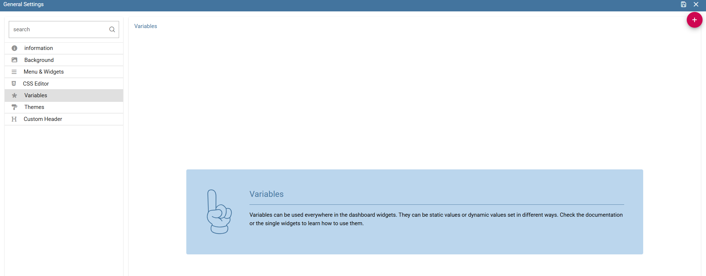

Creating a variable - step 2

 Type in the variable name, the type and *Save*  

 .. figure:: media/image076.png

   Creating a variable - step 3

 Types of variables:

   - Static: a static number or string
   - Dataset: the value of a selected dataset column
   - Profile: a set of profile attributes available (ie. the username)
   - Driver: the value of a selected analytical driver
   - Execution time: Simple Time or Time with seconds
   - Execution date: date of execution of the dashboard with format options such as short date, medium date or full date and time
   - Locale: values coming from the local settings
   - Active selections: active selection on a specific column of the dataset

Associations
------------------------------------------------------------------------------------------------------------------------
To create an association at least two datasets have to be selected.

 .. figure:: media/image080.png

   Defining an association -step 1

Once the datasets have been selected, two attributes have to be choosen to establish the association.

 .. figure:: media/image081.png

   Defining an association -step 2

The below image shows the associaton created between the fields of the two datasets. You need to save. 
It is possible to delete the association just clicking on the trash icon appearing on the right side of the association name.

 .. figure:: media/image081.png

   Defining an association -step 3

Add a Custom Header
------------------------------------------------------------------------------------------------------------------------
In case of more sheets inside a dashboard there may be a need to have the same header for all sheets.
By enabling the header it can be made available for all sheets just in one shot. 
To create a *custom header* click the three dots item of the menu bar and select *Custom Header* as shown below.

   Custom Header

The image used for the header can be selected from the Gallery if available and the *Editor* allows typing custom CSS/HTML if necessary.

Multisheet
------------------------------------------------------------------------------------------------------------------------
The dashboard engine allows to manage contents in multiple sheets. 
Each sheet can contain different analysis with different datasets.
Just click on the *Plus* icon and rename the new sheet.

   Multisheet functionality

Export dashboard
------------------------------------------------------------------------------------------------------------------------
The below image shows how to export the contents of a dashboard by using the *Export* functionality available in the menu.
From the three dots, select *Export* and then one of the three options: PDF, XLSX, PNG.

   Export functionality

Dashboard Template
------------------------------------------------------------------------------------------------------------------------

.. important::
         This functionality is only available for technical users.

The template of a dashboard is available editing the analytical document from the *Document browsers* and downloading it from the *History* tab.

   Dashboard template