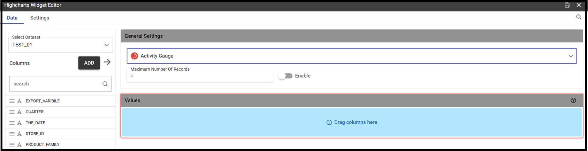

Create a New Dashboard
========================================================================================================================

The graphical interface for creating the new dashboard looks slightly different from the one used for the old cockpit.
New features have been added, such as new charts and new widgets

The below pictures respectively show the chart gallery with the availability of new charts and new widgets enriched with 
the presence of the new *Pivot* widget and the *Map widget* .

.. figure:: media/chart_gallery.png

   Chart gallery example

.. figure:: media/image003.png

   Widgets types

   A dashboard document can be created:

            -	by final users from the Workspace (1)
            -	by admin users from the document browser area

.. important::
         **Enterprise Edition only**

         (1) Allowance for final users only with KnowageBD and KnowageSI licences. Using the KnowagePM license, 
          only a technical user can create a Dashboard document.

In both cases the user should click on the plus icon available in the right top corner and choose the Dashboard item menu as shown below.

.. figure:: media/new_dashboard.png

   Creating a dashboard from the menu

The functionalities for inserting a new data set and a new widget are immediately available on the page shown. 

.. table:: Dashboard functionalities.
   :widths: auto

   +----------------------------------+-----------------------+-----------------------+
   |    Icon                          | Name                  | Function              |
   +==================================+=======================+=======================+
   | .. figure:: media/image004.png   | **Add new dataset**   | Opens the list of     |
   |                                  |                       | datasets to choose    |
   +----------------------------------+-----------------------+-----------------------+
   | .. figure:: media/image005.png   | **Add new widget**    | Opens the widget      |
   |                                  |                       | gallery from the sheet|
   +----------------------------------+-----------------------+-----------------------+
   | .. figure:: media/image006.png   | **Add new widget**    | Opens the widget      |
   |                                  |                       | gallery from the bar  |
   +----------------------------------+-----------------------+-----------------------+
   | .. figure:: media/image007.png   | **Data set Mgmt**     | Opens the dataset mgmt|
   |                                  |                       | window from the bar   |
   +----------------------------------+-----------------------+-----------------------+
   | .. figure:: media/image008.png   | **Save dashboard**    | Saves the dashboard   |
   |                                  |                       |                       |
   +----------------------------------+-----------------------+-----------------------+

Widgets Types
------------------------------------------------------------------------------------------------------------------------
As seen above, the addition of a widget can be done either through the icon that is displayed when the dashboard is created or 
from the appropriate button appearing in the upper right bar of the page. 
In both cases, a palette containing the entire range of available widgets will be shown. 
Let's see them in detail, one by one. Simply click on the desired one. 
When clicking the editor for that widget appears.
A widget's editor normally has two sections, one for the data management (not available for the *Image* widget) and the other containing the list properties that can vary
from one widget to another.
The below table shows a further explanation. In particular properties summed up are relevant to *Text* widget. So that, in the case of an *Image* 
widget among its settings we will find the *Gallery* property which does not belong to the *Text* widget.
All relevant settings will be furtherly described for each widget.

   +--------------------+------------------------------------------------------------------------------+
   |  Section Name      | Description                                                                  |
   +====================+==============================================================================+
   | Data               | In this section the user can:                                                |
   |                    |   - select the data set to work with                                         |
   |                    |   - select the columns to show (use the *Arrow* to insert all columns)       |
   |                    |   - specify a *Sorting Column* and an *Ascending/Descending* order           |
   |                    |   - change the aggregate function for measure columns                        |
   |                    |   - add a calculated field by clicking on the *Add Column* button            |
   +--------------------+------------------------------------------------------------------------------+
   | Settings           | To manage widget properties such as:                                         |
   |                    |   - Configuration                                                            |
   |                    |   - Editor                                                                   |
   |                    |   - Style                                                                    |
   |                    |   - Interactions                                                             |
   |                    |   - Help                                                                     |
   |                    |   - Responsive                                                               |
   +--------------------+------------------------------------------------------------------------------+

Text widget
~~~~~~~~~~~~~~~~~~~~~~~~~~~~~~~~~~~~~~~~~~~~~~~~~~~~~~~~~~~~~~~~~~~~~~~~~~~~~~~~~~~~~~~~~~~~~~~~~~~~~~~~~~~~~~~~~~~~~~~~
By clicking on the **Text Widget** icon you can add text to your dashboard. As shown below, the widget editor opens showing the two sections 
formerly introduced.
Using the *Data* section it is possible to associate dataset values to the text and read it real time at each execution.
You can drag a single column into the *Selected Columns* area or just all of them by using the arrow next to the *Add Column* button.

.. figure:: media/image009.png

 For each

   Text Widget Data Editor

.. figure:: media/image010.png

   Text Widget Settings Editor

Select the *Editor* property and type in the desired text.
Select the *[] placeholder* menu item and then *Columns Data* to find the dataset column(s) previously selected as shown in the below image.

.. figure:: media/image011.png

  Inserting a dataset column in the text editor

Image widget
~~~~~~~~~~~~~~~~~~~~~~~~~~~~~~~~~~~~~~~~~~~~~~~~~~~~~~~~~~~~~~~~~~~~~~~~~~~~~~~~~~~~~~~~~~~~~~~~~~~~~~~~~~~~~~~~~~~~~~~~
By clicking on the **Image Widget** icon you can add an image to the dashboard. You can both pick up a previous image from the *Gallery* or
upload a new one by clicking on the *Upload* button as show in the below image.

.. figure:: media/image012.png

    Inserting an image

The *Style* setting will let you handle the properties styles for the image such as *Title, Background, Borders, Padding and Shadows*.

.. figure:: media/image013.png

    Image styles

As you can see, inside the list of settings you will find a new one called *Widget Themes*. For more explanation on this setting please 
refer to the dedicated section.

Chart widget
~~~~~~~~~~~~~~~~~~~~~~~~~~~~~~~~~~~~~~~~~~~~~~~~~~~~~~~~~~~~~~~~~~~~~~~~~~~~~~~~~~~~~~~~~~~~~~~~~~~~~~~~~~~~~~~~~~~~~~~~
As previously mentioned the new dashboard comes with an enriched chart gallery. In fact, new ones have been added to those previously available. 
Among these we find:

   - Activity Gauge
   - Bubble
   - Dumbbell
   - Funnel
   - Packed Bubble
   - Pictorial
   - Sankey
   - Scatter
   - Stream
   - Waterfall

As a first step select the dataset and then by clicking on the *Add widget* icon you will be asked to pick up the chart from the gallery.
At this point just drag and drop your column(s) into the *Dimension(s)* area (for measures) and then into the *Values* area (for attributes).
After dragging your dimension(s) and attribute(s), you will see that the information contained in the *Settings* section could be different 
from one chart to another.
The below image refers to a *Funnel* chart where you need to define both the measure(s) and the sttribute(s).

.. figure:: media/image014.png

Not all charts need both information as if you refer to an *Activity Gauge* you only need to define the measure. See image below.

One important peculiarity to highlight is the possibility to change the type of chart once a selection has already been done.
The drop down menu with your choice will show all the available options for the graphs and in case can be changed. See below picture.

.. figure:: media/image016.png

**Activity Gauge**

The *Activity Gauge* uses circular-shaped bars to compare multiple categories against the target.
After pressing the *Add widget* button pick up the Activity Gauge chart from the gallery.

.. figure:: media/image017.png

   Activity Gauge example

**Bubble**
The *Bubble* chart is useful in case of three series. The size of the bubble depends on the third dimension.
After pressing the *Add widget* button pick up the Bubble chart from the gallery.

**Dumbbell**
A *Dumbbell* chart uses circles and lines to show changes over time.
After pressing the *Dumbbell* button pick up the Bubble chart from the gallery.

**Funnel**
This kind of chart provides a visual representation of how data progresses through different stages of a process starting 
from a broad head and ending in a narrow neck.

**Packed Bubble**
A *Packed Bubble* is similar to a Bubble Chart where bubbles are tightly packed rather than spread over a grid of X and Y-Axis.

**Pictorial**
A *Pictorial* chart represents data using icons, symbols, or images.

**Sankey**
A *Sankey* chart is useful to highlight the flow of data from one value to another

**Scatter**
A *Scatter* chart is like a cloud where two variables from a data set are plotted on a Cartesian space by using dots.

**Streamgraph**
A *Streamgraph* represents a variation of the area chart where areas are plotted around a central axis and not a fixed one. This shapes the
graph with no corners but with rounded edges giving the impression of a flow.

**Waterfall**
A *Waterfall* chart can be useful to understand how data is affected by positive or negative values. It' s like a bar chart where in the middle of two normal bars 
there are suspended bars as the beguinning of the bar is represented by the end of the previous bar.

Html widget
~~~~~~~~~~~~~~~~~~~~~~~~~~~~~~~~~~~~~~~~~~~~~~~~~~~~~~~~~~~~~~~~~~~~~~~~~~~~~~~~~~~~~~~~~~~~~~~~~~~~~~~~~~~~~~~~~~~~~~~~
The HTML widget allows to add customized HTML and CSS code to implement very flexible and customized dynamic elements to the cockpit. 
This widget supports all HTML5 standard tags and CSS3 properties.

Table widget
~~~~~~~~~~~~~~~~~~~~~~~~~~~~~~~~~~~~~~~~~~~~~~~~~~~~~~~~~~~~~~~~~~~~~~~~~~~~~~~~~~~~~~~~~~~~~~~~~~~~~~~~~~~~~~~~~~~~~~~~

Pivot widget
~~~~~~~~~~~~~~~~~~~~~~~~~~~~~~~~~~~~~~~~~~~~~~~~~~~~~~~~~~~~~~~~~~~~~~~~~~~~~~~~~~~~~~~~~~~~~~~~~~~~~~~~~~~~~~~~~~~~~~~~

Map widget
~~~~~~~~~~~~~~~~~~~~~~~~~~~~~~~~~~~~~~~~~~~~~~~~~~~~~~~~~~~~~~~~~~~~~~~~~~~~~~~~~~~~~~~~~~~~~~~~~~~~~~~~~~~~~~~~~~~~~~~~

Active selections widget
~~~~~~~~~~~~~~~~~~~~~~~~~~~~~~~~~~~~~~~~~~~~~~~~~~~~~~~~~~~~~~~~~~~~~~~~~~~~~~~~~~~~~~~~~~~~~~~~~~~~~~~~~~~~~~~~~~~~~~~~

Selector widget
~~~~~~~~~~~~~~~~~~~~~~~~~~~~~~~~~~~~~~~~~~~~~~~~~~~~~~~~~~~~~~~~~~~~~~~~~~~~~~~~~~~~~~~~~~~~~~~~~~~~~~~~~~~~~~~~~~~~~~~~

Custom chart widget
~~~~~~~~~~~~~~~~~~~~~~~~~~~~~~~~~~~~~~~~~~~~~~~~~~~~~~~~~~~~~~~~~~~~~~~~~~~~~~~~~~~~~~~~~~~~~~~~~~~~~~~~~~~~~~~~~~~~~~~~

Discovery widget
~~~~~~~~~~~~~~~~~~~~~~~~~~~~~~~~~~~~~~~~~~~~~~~~~~~~~~~~~~~~~~~~~~~~~~~~~~~~~~~~~~~~~~~~~~~~~~~~~~~~~~~~~~~~~~~~~~~~~~~~

Python widget
~~~~~~~~~~~~~~~~~~~~~~~~~~~~~~~~~~~~~~~~~~~~~~~~~~~~~~~~~~~~~~~~~~~~~~~~~~~~~~~~~~~~~~~~~~~~~~~~~~~~~~~~~~~~~~~~~~~~~~~~

Manage Cache/Frequency
------------------------------------------------------------------------------------------------------------------------

Add a Custom Header
------------------------------------------------------------------------------------------------------------------------

Add a Calculated Field
------------------------------------------------------------------------------------------------------------------------

Theaming
------------------------------------------------------------------------------------------------------------------------

Widget Theame
------------------------------------------------------------------------------------------------------------------------