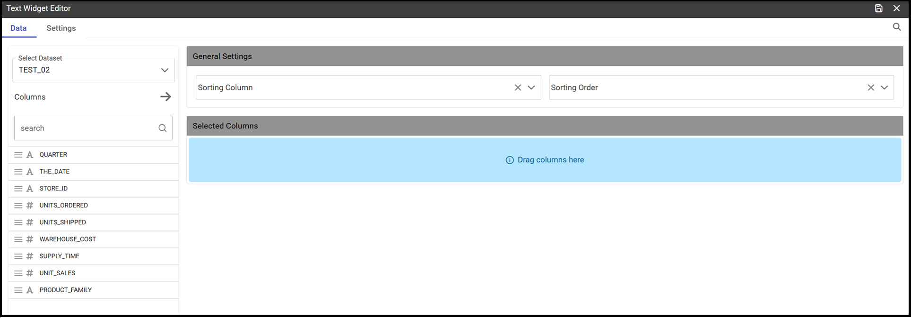
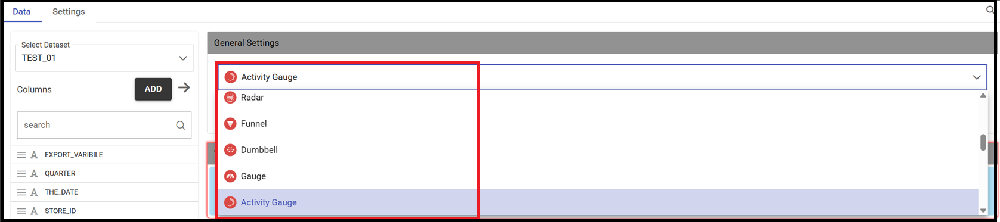
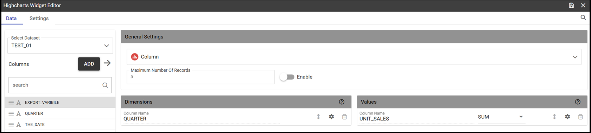
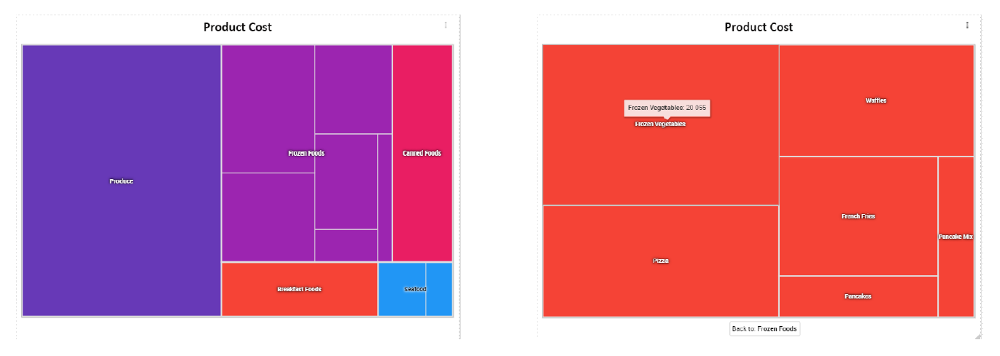
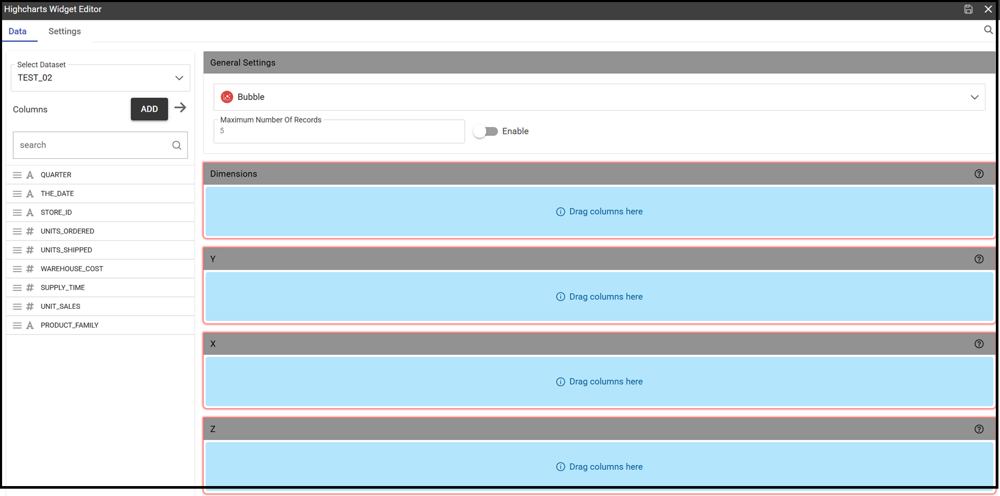

Create a New Dashboard
========================================================================================================================

The graphical interface for creating the new dashboard looks slightly different from the one used for the old cockpit.
New features have been added, such as new charts and new widgets

The below pictures respectively show the chart gallery with the availability of new charts and new widgets enriched with 
the presence of the new *Pivot* widget and the *Map widget* .

   Chart gallery example

Given the wide range of graphs, you can search for the desired one using the dedicated search function. 
Simply enter the type of graph you want to draw and press the search icon.

   Widgets types

   A dashboard document can be created:

            -	by final users from the Workspace (1)
            -	by admin users from the document browser area

.. important::
         **Enterprise Edition only**

         (1) Allowance for final users only with KnowageBD and KnowageSI licences. Using the KnowagePM license, 
          only a technical user can create a Dashboard document.

In both cases the user should click on the plus icon available in the right top corner and choose the Dashboard item menu as shown below.

.. figure:: media/new_dashboard.png

   Creating a dashboard from the menu

The functionalities for inserting a new data set and a new widget are immediately available on the page shown. 

.. table:: Dashboard functionalities.
   :widths: auto

   +----------------------------------+-----------------------+-----------------------+
   |    Icon                          | Name                  | Function              |
   +==================================+=======================+=======================+
   | .. figure:: media/image004.png   | **Add new dataset**   | Opens the list of     |
   |                                  |                       | datasets to choose    |
   +----------------------------------+-----------------------+-----------------------+
   | .. figure:: media/image005.png   | **Add new widget**    | Opens the widget      |
   |                                  |                       | gallery from the sheet|
   +----------------------------------+-----------------------+-----------------------+
   | .. figure:: media/image006.png   | **Add new widget**    | Opens the widget      |
   |                                  |                       | gallery from the bar  |
   +----------------------------------+-----------------------+-----------------------+
   | .. figure:: media/image007.png   | **Data set Mgmt**     | Opens the dataset mgmt|
   |                                  |                       | window from the bar   |
   +----------------------------------+-----------------------+-----------------------+
   | .. figure:: media/image008.png   | **Save dashboard**    | Saves the dashboard   |
   |                                  |                       |                       |
   +----------------------------------+-----------------------+-----------------------+

Widgets Types
------------------------------------------------------------------------------------------------------------------------
As seen above, the addition of a widget can be done either through the icon that is displayed when the dashboard is created or 
from the appropriate button appearing in the upper right bar of the page. 
In both cases, a palette containing the entire range of available widgets will be shown. 
Let's see them in detail, one by one. Simply click on the desired one. 
When clicking the editor for that widget appears.
A widget's editor normally has two sections, one for the data management (not available for the *Image* widget) and the other containing the list properties that can vary
from one widget to another.
The below table shows a further explanation. In particular properties summed up are relevant to *Text* widget. So that, in the case of an *Image* 
widget among its settings we will find the *Gallery* property which does not belong to the *Text* widget.
All relevant settings will be furtherly described for each widget.

   +--------------------+------------------------------------------------------------------------------+
   |  Section Name      | Description                                                                  |
   +====================+==============================================================================+
   | Data               | In this section the user can:                                                |
   |                    |   - select the data set to work with                                         |
   |                    |   - select the columns to show (use the *Arrow* to insert all columns)       |
   |                    |   - specify a *Sorting Column* and an *Ascending/Descending* order           |
   |                    |   - change the aggregate function for measure columns                        |
   |                    |   - add a calculated field by clicking on the *Add Column* button            |
   +--------------------+------------------------------------------------------------------------------+
   | Settings           | To manage widget properties such as:                                         |
   |                    |   - Configuration                                                            |
   |                    |   - Editor                                                                   |
   |                    |   - Style                                                                    |
   |                    |   - Interactions                                                             |
   |                    |   - Help                                                                     |
   |                    |   - Responsive                                                               |
   +--------------------+------------------------------------------------------------------------------+

INSERIRE TABELLA CON DESCRIZIONE DI TUTTI O QUASI I SETTINGS

Text widget
~~~~~~~~~~~~~~~~~~~~~~~~~~~~~~~~~~~~~~~~~~~~~~~~~~~~~~~~~~~~~~~~~~~~~~~~~~~~~~~~~~~~~~~~~~~~~~~~~~~~~~~~~~~~~~~~~~~~~~~~
By clicking on the **Text Widget** icon you can add text to your dashboard. As shown below, the widget editor opens showing the two sections 
formerly introduced.
Using the *Data* section it is possible to associate dataset values to the text and read it real time at each execution.
You can drag a single column into the *Selected Columns* area or just all of them by using the arrow next to the *Add Column* button.

   Text Widget Data Editor

.. figure:: media/image010.png

   Text Widget Settings Editor

Select the *Editor* property and type in the desired text.
Select the *[] placeholder* menu item and then *Columns Data* to find the dataset column(s) previously selected as shown in the below image.

  Inserting a dataset column in the text editor

Image widget
~~~~~~~~~~~~~~~~~~~~~~~~~~~~~~~~~~~~~~~~~~~~~~~~~~~~~~~~~~~~~~~~~~~~~~~~~~~~~~~~~~~~~~~~~~~~~~~~~~~~~~~~~~~~~~~~~~~~~~~~
By clicking on the **Image Widget** icon you can add an image to the dashboard. You can both pick up a previous image from the *Gallery* or
upload a new one by clicking on the *Upload* button as show in the below image.

.. figure:: media/image012.png

    Inserting an image

The *Style* setting will let you handle the properties styles for the image such as *Title, Background, Borders, Padding and Shadows*.

    Image styles

As you can see, inside the list of settings you will find a new one called *Widget Themes*. For more explanation on this setting please 
refer to the dedicated section.

Chart widget
~~~~~~~~~~~~~~~~~~~~~~~~~~~~~~~~~~~~~~~~~~~~~~~~~~~~~~~~~~~~~~~~~~~~~~~~~~~~~~~~~~~~~~~~~~~~~~~~~~~~~~~~~~~~~~~~~~~~~~~~
As previously mentioned the new dashboard comes with an enriched chart gallery. 
So, in addition to the charts available for creating the old cockpit:
   - Bar
   - Line
   - Pie
   - Sunburst
   - Wordcloud
   - Treemap
   - Parallel
   - Radar
   - Scatter
   - Heatmap
   - Chord
   - Gauge
   - Bubble

we can find the following ones:

   - Activity Gauge
   - **Bubble**
   - Dumbbell
   - Funnel
   - Packed Bubble
   - Pictorial
   - Sankey
   - **Scatter**
   - Stream
   - Waterfall

As a first step select the dataset and then by clicking on the *Add widget* icon you will be asked to pick up the chart from the gallery.
At this point just drag and drop your column(s) into the *Dimension(s)* area (for measures) and then into the *Values* area (for attributes).
After dragging your dimension(s) and attribute(s), you will see that the information contained in the *Settings* section could be different 
from one chart to another.
The below image refers to a *Funnel* chart where you need to define both the measure(s) and the sttribute(s).

.. figure:: media/image014.png

Not all charts need both information as if you refer to an *Activity Gauge* you only need to define the measure. See image below.

.. figure:: media/image015.png

One important peculiarity to highlight is the possibility to change the type of chart once a selection has already been done.
The drop down menu with your choice will show all the available options for the graphs and in case can be changed. See below picture.

Once the chart has been inserted in your sheet, a three dots icon displays a menu with the list of possible actions.
See below image.

Menu on a chart

You can resize the chart just drugging the little corner in the right bottom of the chart.

Another peculiarity is that the user can immediatly have a preview of the graph just using the magnifying glass.
located at the upper right corner for each property of the *Settings* section. This means that you don't necessarily have to save the graph 
as a first step to see how it looks like but you can see changes as they are applied.
See below image.

.. figure:: media/image031.png

Preview functionality for a chart

Furthermore after inserting a chart you can simply move it inside the dashboard just dragging it inside the whole sheet. 
This functionality is available for a whatever widget you need to use.
See below image.

.. figure:: media/image042.png

   Moving a widget along the dashboard

 Just go with the mouse over the two vertical dotted lines and little hand appears to move your widget.  

Let's start introducing some of the most common used charts.

 **Bar**
The *Bar chart* allows a method of displaying data with categories represented by rectangles (or groups) horizontally oriented.

An example below.

Bar chart example

 **Column**
The *Column chart* is like a *Bar* chart with vertical orientation.
How to define measures and attributes is shown below

   Column chart - measures and attributes

The above image shows the *Maximum number of records* property enabled and set to 3. In this case only three bars are shown.

   Column chart example

**Line**
The *Column chart* uses points connected by line segments from left to right to show how data changes.
An example below.

.. figure:: media/image059.png

**Pie**

**Treemap**
The treemap is a graphical representation of hierarchical data, which is displayed as nested rectangles.
Each branch of the tree is given by a rectangle, which is tiled with smaller rectangles representing sub-branches. 
The area of the rectangles is proportional to a measure specified by a numerical attribute. The treemap is usefull to display a 
large amount of hierarchical data in a small space.
By clicking the *Add widget* button pick up *Chart* and then the *Treemap* chart from the gallery.
Once you have selected the dataset, choose at least two attributes into the X-axis panel and one measure and press *Save*. 
See below image.

.. figure:: media/image061.png

   Treemap chart - attributes and measures

The order of the attributes in the X-axis panel must reflects the order of the attributes in the hierarchy starting from the root to the top.

In Figure below an example of a Treemap chart

    From left to right: (a) Treemap. (b) Treemap sub-branches.

Bar, column, line, pie and treemap charts allow the *drill-down* functionality.
Drill down leads the user from a more general view of the data to a more specific view just by clicking the mouse.

Let's have an example 
INSERIRE ESEMPIO DEL cockpit

**Activity Gauge**

The *Activity Gauge* uses circular-shaped bars to compare multiple categories against the target.
After clicking the *Add widget* button or icon pick up *Chart* and then the *Activity Gauge* chart from the gallery.

   Activity Gauge example

Below you can see how to set the aliases. From the drop down menu you can choose the column(s) previously selected as measures and rename them.

.. figure:: media/image018.png

   Setting Alias example
 Once renamed changed are applied and you can see it in the below image. Remember always to press *Save*

   Setting Series example
If you want to set properties for the Tooltip just click on Tooltip and set Bold and Backgroud color as shown in the below image

.. figure:: media/image020.png

   Setting Tooltip example

It is possible to change the position of the Legend just setting Left/Middle/Right. In the above picture the legend is set to appear in the middle.
Some othe properties you can manage are: Bold, Font size and family, Borders, Background.

**Bubble**

The *Bubble* chart is useful in case of three series. The size of the bubble depends on the third dimension.
After clicking the *Add widget* button pick up Chart and then the Bubble chart from the gallery.

   Bubble chart - dragging and dropping measures and attributes

You can set some properties for the series. It is possible to define them for all series or just for one.
As shown in the below image in the last case just press the *plus* icon and the drop down menu will show you the list of 
columns.

   Bubble chart - setting series

An example of bubble chart is shown below, bubbles color has been set through the Color property inside Settings section.

   Bubble chart example

**Dumbell**

A *Dumbbell* chart uses circles and lines to show changes over time.
After pressing the *Add Widget* button pick up Cahrt and then the *Dumbell* chart from the gallery.
To define the chart you need one attribute and two measures to define the series. See the below image.

.. figure:: media/image024.png

Dumbell chart example - defining measures and atributes

Once created you can handle the settings of the start Serie as shown below.

.. figure:: media/image025.png

  Dumbell chart - settings serie

.. figure:: media/image026.png

  Dumbell chart - renaming measures

.. figure:: media/image027.png

  Dumbell chart example

**Funnel**

This kind of chart provides a visual representation of how data progresses through different stages of a process starting 
from a broad head and ending in a narrow neck.
By clicking the *Add widget* pick up Chart and then *Funnel* from the gallery.
Once a dataset has been selected, click on the *Add Widget* icon of your sheet or on the equivalent icon of the menu bar.
Select *Funnel* as chart, choose just one measure and one attribute and then press *Save* to get the graph visualized.
See below image.

.. figure:: media/image029.png

Funnel chart example

**Packed Bubble**

A *Packed Bubble* is similar to a Bubble Chart where bubbles are tightly packed rather than spread over a grid of X and Y-Axis.
Once a dataset has been selected, click on the *Add Widget* icon of your sheet or on the equivalent icon of the menu bar.
Select Chart and then *Funnel* as chart, choose just one measure and two attributes. The first attribute is used for grouping and the second one for labels. 
Then press *Save* to get the graph visualized.
See below image.

.. figure:: media/image030.png

Packed bubble chart example

**Pictorial**

A *Pictorial* chart represents different satges of data using a bulb.
Once a dataset has been selected, click on the *Add Widget* icon of your sheet or on the equivalent icon of the menu bar.
Select Chart and then *Pictorial* as chart, choose just one measure to define the Serie and one attribute for the category.
See below image

 .. figure:: media/image032.png

Pictorial chart example

**Sankey**

A *Sankey* chart is useful to highlight the flow of data from one value to another.
By clicking on the *Add widget* button press Chart and then *Sankey*.
The gallery offers two kinds of charts: *Sankey* and *Sankey Inverted*. The last chart is just the inverted represention of the normal Sankey.
Once selected the dataset, you need to choose two attributes representing the *from* and the *to* categories of the flow and a measure.

 .. figure:: media/image033.png

Sankey chart example

**Scatter**

A *Scatter* chart is like a cloud where two variables from a data set are plotted on a Cartesian space by using dots.
By clicking on the *Add widget* button press Chart and then *Scatter*.
After selecting the dataset to define this chart you need to pick up two *numerical* values representing the measure and the category.
See below image

 .. figure:: media/image034.png

   Scatter chart - defining series and categories

**Streamgraph**

A *Streamgraph* represents a variation of the area chart where areas are plotted around a central axis and not a fixed one. This shapes the
graph with no corners but with rounded edges giving the impression of a flow.
By clicking on the *Add widget* button press Chart and then *Streamgraph*. You need to choose one attribute for the X-axis, one attribute as category
and one measure as shown below.

.. figure:: media/image035.png

   Streamgraph chart - defining series and categories

.. figure:: media/image036.png

   Streamgraph chart example

**Waterfall**

A *Waterfall* chart can be useful to understand how data is affected by positive or negative values. It' s like a bar chart where in the middle of two normal bars 
there are suspended bars as the beguinning of the bar is represented by the end of the previous bar.
By clicking on the *Add widget* button press Chart and then *Waterfall*.
Select yor dataset and then you will be asked to enter just one attribute as category and one measure as a serie as shown below.

.. figure:: media/image037.png

   Waterfall - defining measures and attributes

.. figure:: media/image038.png

   Waterfall chart example

Html widget
~~~~~~~~~~~~~~~~~~~~~~~~~~~~~~~~~~~~~~~~~~~~~~~~~~~~~~~~~~~~~~~~~~~~~~~~~~~~~~~~~~~~~~~~~~~~~~~~~~~~~~~~~~~~~~~~~~~~~~~~
The HTML widget allows to add customized HTML and CSS code to implement very flexible and customized dynamic elements. 
This widget supports all HTML5 standard tags and CSS3 properties.
By clicking on the *Add widget* button or icon and then *HTML* you can insert the HTML widget.

For security reasons no custom Javascript code can be added to html tags. Every tag considered dangerous will be deleted 
after saving the document.

.. important::

        A CSS property will be extended to all the classes in the cockpit with the same name; to apply the property 
        only to the current widget use the id prefix shown in the info panel of the CSS editor

HTML widget editor

**Available Tags**

*kn-column*

``[kn-column='COLUMN-NAME' row='COLUMN-ROW-NUMBER' aggregation='COLUMN-AGGREGATION' precision='COLUMN-DECIMALS']``

The ``kn-column`` tag is the main dynamic HTML Widget tool, it allows to select a column name from the selected dataset and to display its values. The value of the kn-column attribute should be the name of the column value you want to read in execution.

The **row** attribute is optional and is a number type attribute. This attribute can let you retrieve a specific row according to the position in the dataset. If no row is selected the first row column value will be shown.

The **aggregation** attribute is optional and is a string type attribute. If inserted the value shown will be the aggregation of all column rows values. The available aggregations are: AVG, MIN, MAX, SUM, COUNT_DISTINCT, COUNT, DISTINCT COUNT.

The **precision** attribute is optional and is a number type attribute. If added and if the result value is a number, the decimal precision will be forced to the selected one.

*kn-parameter*

``[kn-parameter='PARAMETER-NAME']``

The kn-parameter tag is the tool to show a dataset parameter inside the widget execution. The value of the kn-parameter attribute should be the name of the parameter to display.

*kn-calc*

``[kn-calc=(CODE-TO-EVALUATE) precision='VALUE-PRECISION']``

The ``kn-calc`` tag is the tool to calculate expressions between different values on widget execution. Everything inside the brackets will be evaluated after the other tags substitution, so will be possible to use other tags inside.

The **precision** attribute is optional and is a number type attribute. If added and if the result value is a number, the decimal precision will be forced to the selected one.

*kn-repeat*

``
 ... REPEATED-CONTENT ... 
``

The ``kn-repeat`` attribute is available to every HTML5 tag, and is a tool to repeat the element for every row of the selected dataset.

This attribute is naturally linked to ``kn-column`` tag. If inside a ``kn-column`` tag without a row attribute is present, the ``kn-repeat`` will show the column value for every row of the dataset.

Inside a ``kn-repeat`` is possible to use the specific tag ``[kn-repeat-index]``, that will print the index of the repeated column row.

The **limit** attribute is optional and is a number type attribute. If added the number of row repeated will be limited to the selected number. If no limit is provided just the first row will be returned. If you want to get all records, you can set it to -1, but be careful because big datasets can take a while to load completely.

*kn-if*

``
 ... 
``

The ``kn-if`` attribute is available to every HTML5 tag and is a way to conditionally show or hide an element based on some other value. The attribute content will be evaluated after the other tags substitution, so it will be possible to use other tags inside. If the evaluation returns true the tag will be shown, otherwise it will be deleted from the execution.

*kn-cross*

``
 ... 
``

The ``kn-cross`` attribute is available to every HTML5 tag and is a way to make the element interactive on click. This attribute makes the element clickable to open the cross navigation specified in the widget settings. If there is no cross navigation set this tag will not work.

*kn-preview*

``
 ... 
``

The ``kn-preview`` attribute is available to every HTML5 tag and is a way to make the element interactive on click. This attribute makes the element clickable to open the dataset preview dialog. The attribute value will be the *dataset label* of the dataset that you want to open. If a dataset is not specified the cockpit will use the one set for the widget. If no dataset has been set and the attribute has no value this tag will not work.

*kn-selection*

``
 ... 
``

The ``kn-selection-column`` attribute is available to every HTML5 tag and is a way to make the element interactive on click. This attributes makes the element clickable to set the chosen column and value as a selection filter in the cockpit. The default will use as a selection the first row value of the column.

The **kn-selection-value** attribute is optional and will let you specify a specific value as a column selection filter.

*kn-variable*

``[kn-variable='VARIABLE-NAME' key='VARIABLE-KEY']``

The ``kn-variable`` tag is the tool to read the runtime value of one of the defined variables. It will change depending on the current value and can be used inside ``kn-if`` and ``kn-calc``.

The **key** attribute is optional and will select a specific key from the variable object if the variable is "Dataset" type, returning a specific value instead of a complete dataset.

.. warning::
    **Banned Tags**
    In order to avoid Cross-site scripting and other vulnerabilities, some tags are *not allowed* and will automatically be removed by the system when saving the cockpit:

    -  ``<button></button>``
    -  ``<object></object>``
    -  ````

If you need to simulate a button behaviour use a div (or another allowed tag) and replicate the css style like in the following example:

.. code-block:: html
   :linenos:

   
Buttonlike div

.. code-block:: css
   :linenos:

   .customButton {
        border: 1px solid #ccc;
        background-color: #ededed;
        cursor: pointer;
    }
    .customButton:hover {
        background-color: #d8d8d8;
    }

.. warning::
    **Whitelist**
    
    Base paths to external resources (images, videos, anchors, CSS files and inline frames) must be declared within ``TOMCAT_HOME/resources/services-whitelist.xml`` XML file inside Knowage Server, otherwise these links will be removed by the system. 
    This whitelist file contains safe and trusted websites, to restrict end users of providing unsafe links or unwanted web material. Knowage Server administrator can create or edit it (directly on the file system) to add trusted web sites. Here below you can see an example of ``services-whitelist.xml`` file; as you can see, its structure is quite easy: ``baseurl`` attributes refer to external services, ``relativepath`` must be used for Knowage Server internal resources instead:

.. code-block:: xml
   :linenos:

   <?xml version="1.0" encoding="UTF-8"?>
   <WHITELIST>
      <service baseurl="https://www.youtube.com" />
      <service baseurl="https://player.vimeo.com" />
      <service baseurl="https://vimeo.com" />
      <service baseurl="https://media.giphy.com" />
      <service baseurl="https://giphy.com" />
      <service baseurl="https://flic.kr" />
      <service relativepath="/knowage/themes/" />
      <service relativepath="/knowage/icons/" />
      <service relativepath="/knowage/restful-services/1.0/images/" />
   </WHITELIST>

Table widget
~~~~~~~~~~~~~~~~~~~~~~~~~~~~~~~~~~~~~~~~~~~~~~~~~~~~~~~~~~~~~~~~~~~~~~~~~~~~~~~~~~~~~~~~~~~~~~~~~~~~~~~~~~~~~~~~~~~~~~~~
By clicking on the *Add widget* button or icon and then on *Table* it is possible to add a *Table* widget to the dashboard.
After selecting the dataset, drag and drop the columns to show.
You can active Pagination just switching on the sliding button and then specify the number of items to be visualized in the page.
To handle each column settings just click on the seting icon before the trash. You will be able to set aliases, the aggragation function
and filters on that column.

.. figure:: media/image049.png

   Table widget editor

 To manage styles and other functionalities for columns just move to the *Settings* section.
 The below image shows how to apply *Conditional Styles* to a specific column of the table.
 If a given condition for a measure occurs it is possible to set properties as font size, font Family, background, etc.
 In case variables and parameters have been defined for the dashboard just make your choice from the *Value Type* menu to enter the related value.

 .. figure:: media/image050.png

   Table widget - conditional styles

*Visibility* conditions can also be set for column. Just click the *Visualization* property as shown below.

 .. figure:: media/image051.png

   Table widget - visibility conditions

Pivot widget
~~~~~~~~~~~~~~~~~~~~~~~~~~~~~~~~~~~~~~~~~~~~~~~~~~~~~~~~~~~~~~~~~~~~~~~~~~~~~~~~~~~~~~~~~~~~~~~~~~~~~~~~~~~~~~~~~~~~~~~~
By clicking on the *Add widget* button or icon and then on *Pivot* it is possible to add a *Pivot* widget to the dashboard.

Map widget
~~~~~~~~~~~~~~~~~~~~~~~~~~~~~~~~~~~~~~~~~~~~~~~~~~~~~~~~~~~~~~~~~~~~~~~~~~~~~~~~~~~~~~~~~~~~~~~~~~~~~~~~~~~~~~~~~~~~~~~~
By clicking on the *Add widget* button or icon and then on *Map* it is possible to add a *Map* widget to the dashboard.
The Map Widget is useful when a user needs to visualize data related to a geographic position. The widget supports multiple layers, one for every dataset added to widget configuration, and one data field for every layer: the user can switch on-the-fly between all data available on the layer.

    Map widget.

In Map Widget configuration a user can add and remove layers, set the format of the spatial attribute to use and specify the attributes to display on map and on the detail popup:

    .. figure:: media/image056.png

        Map widget configuration.

Map widgets also support the addition of calculated fields.

Active selections widget
~~~~~~~~~~~~~~~~~~~~~~~~~~~~~~~~~~~~~~~~~~~~~~~~~~~~~~~~~~~~~~~~~~~~~~~~~~~~~~~~~~~~~~~~~~~~~~~~~~~~~~~~~~~~~~~~~~~~~~~~
By clicking on the *Add widget* button or icon and then on *Active Selections* it is possible to add a *Active Selections* widget to the dashboard.
This way the user can view the list of curren selections applied on a widget. An icon on the right upper corner of the dashboard will 
be visible and by clicking on it the list of current selections will be visible. On each item of this list a *trash* icon lets the
deletion of that selection.

.. figure:: media/image052.png

   Active selections widget
 
 To get the result shown in the above image just go to the *Settings* and select the *Style* property

 .. figure:: media/image053.png

   Be aware that a selection can be locked. In this case it will be not possible to delete the selection until unlocked.

Selector widget
~~~~~~~~~~~~~~~~~~~~~~~~~~~~~~~~~~~~~~~~~~~~~~~~~~~~~~~~~~~~~~~~~~~~~~~~~~~~~~~~~~~~~~~~~~~~~~~~~~~~~~~~~~~~~~~~~~~~~~~~
By clicking on the *Add widget* button or icon and then on *Selector* it is possible to add a *Selector* widget to the dashboard.
The *Selector* widget allows a dataset filtering by means of a combobox, radio button or checkboxes.
After choosing the column to use as a filter just move to the *Setting* section and then *Configuration*. See below image.

.. figure:: media/image054.png

   Active selections widget

Custom chart widget
~~~~~~~~~~~~~~~~~~~~~~~~~~~~~~~~~~~~~~~~~~~~~~~~~~~~~~~~~~~~~~~~~~~~~~~~~~~~~~~~~~~~~~~~~~~~~~~~~~~~~~~~~~~~~~~~~~~~~~~~
By clicking on the *Add widget* button or icon and then on *Custom Chart* it is possible to add a *Custom Chart* widget to the dashboard.

Discovery widget
~~~~~~~~~~~~~~~~~~~~~~~~~~~~~~~~~~~~~~~~~~~~~~~~~~~~~~~~~~~~~~~~~~~~~~~~~~~~~~~~~~~~~~~~~~~~~~~~~~~~~~~~~~~~~~~~~~~~~~~~
By clicking on the *Add widget* button or icon and then on *Discovery* it is possible to add a *Discovery* widget to the dashboard.
The Discovery Widget is used to easily use and navigate into a Solr Dataset by using facets aggregation and a table results. 
In order to make searches, aggregations using facets and so on, after selecting the Solr dataset it is possible to choose the fields 
that should be shown as the result. 
The table result can also be configured to show a limited set of fields, as shown in the widget configuration.

Python widget
~~~~~~~~~~~~~~~~~~~~~~~~~~~~~~~~~~~~~~~~~~~~~~~~~~~~~~~~~~~~~~~~~~~~~~~~~~~~~~~~~~~~~~~~~~~~~~~~~~~~~~~~~~~~~~~~~~~~~~~~
By clicking on the *Add widget* button or icon and then on *Python* it is possible to add a *Python* widget to the dashboard.

Cross Navigation
------------------------------------------------------------------------------------------------------------------------
The cross navigation lets you navigate from one document to another.
You will find the cross navigation functionality in the *Settings* section of chart. Just click on *Interactions* as shown below.

.. figure:: media/image039.png
   Searching the cross navigation functionality

Activate the functionality just switching on the slidind button and select the name of the cross navigation previously defined.

   Activating cross navigation

Select, Link and Preview
------------------------------------------------------------------------------------------------------------------------
As shown in the above images for the cross navigation together with the cross navigation functionalities some others can be defined on a chart.
Functionalities that can be activated just switching on the corresponding sliding button are:
   - Selection: if deactivated the chart is not clickable
   - Link, to open a specific URL when clicking on a chart
   - Preview, to download a file when clicking on a chart

Only one option can be activated at the same time.

Manage Cache/Frequency
------------------------------------------------------------------------------------------------------------------------
To manage the cache and frequency of your data you need to select the dataset form the list of the available ones 
and switching on the sliding button for the *Cache* option as shown in the below image.

.. figure:: media/image046.png

   Managing cache and frequency

You can also index columns.

   Managing indexes on columns

Add a Custom Header
------------------------------------------------------------------------------------------------------------------------
In case of more sheets inside a dashboard there is the requirement to have the same header.
You can create the header and making it available for all sheets just in one shot. 

Add a Calculated Field
------------------------------------------------------------------------------------------------------------------------
Steps to add a calculated field:
 - a dataset has been selected
 - click on the *Add Columns* button as shown in the below image.
 - follow the instructions appearing in the pop up (assign a name, a function,..)
 - close the pop-up by clicking on *Apply*. The button remains graid off until validation is done.

 .. figure:: media/image045.png

   Adding a calculated field

 Once the new field has been added you will see the new column added to the ones of your dataset.
 By using the icon highlighted in the below image you can reopen the details pop-up.

 .. figure:: media/image045.png

   Reopend details of a calculated field

Widget Theame
------------------------------------------------------------------------------------------------------------------------

This is a functionality introduced on the new *Dashboard* available in the *Settings* section just clicking on *Style*.
See below image.

.. figure:: media/image041.png
   Activating cross navigation

The below image shows an example of two different themes applied to the corresponding table widgets.

.. figure:: media/image043.png
   Activating cross navigation

The available themes have to be previously defined by an *admin user*.