Create a KPI
########################################################################################################################

KPI stands for Key Performance Indicator. It denotes a set of metrics, usually derived from simple measures, allowing managers to take a snapshot on the key aspects of their business. The main features of KPIs are listed below:

-  summary indicators,
-  complex calculations,
-  thresholds supporting results evaluation,
-  reference target goals,
-  easy to use but requiring more specific skills to design it,
-  association with alarms,
-  not necessarily used for real-time analysis,
-  may refer to a specific time frame.

For these reasons, KPIs are always defined by expert analysts and then used to analyze performances through synthetic views that select and outline only meaningful information.

Knowage allows the configuration of a KPI document thanks to a specific **KPI engine**. The critical value (or values) can be computed and visualized through the functionalities available in the ’KPI model’ section of Knowage menu area (see the next figure).

KPI development
------------------------------------------------------------------------------------------------------------------------

We introduce the KPI tool by splitting the topic in steps. We briefly sum up here the arguments that we will cover in the following sections in order to have a general overview of the KPI implemetation.

-  **Measure definition**: it is necessary to define first the measures and attributes, eventually with parameters, to compute the critical value of interest.
-  **KPI definition**: here you compute the requested value through a formula using the measures and attributes set in previuos step and  configure thresholds.
-  **Target**: it is possible to monitor the value of one or more KPIs comparing it to an additional fixed value.
-  **Schedulation**: you can schedule the execution of one or more KPIs, eventually filtered by conditions.
-  **Document creation**: finally, you develop the KPI document.

Therefore, we go into further details.

**Measure definition.** The first step is to create a new measure or rule. Select **Measure/Rule** from the contextual menu of the main page, as shown below.

.. _measureruledefmenu:
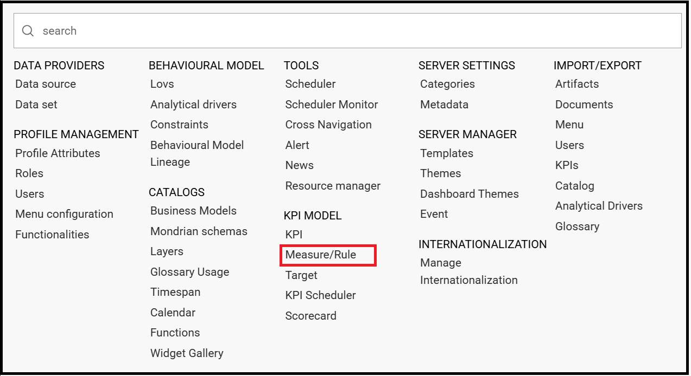

    Measure/Rule menu item.

Click the *Plus* icon to set a new measure/rule. A query editor page opens. Note that after the selection of a the data source bypressing simultaneously the CTRL key and the space bar opens a contextual menu containing the available datasource columns and the database keywords. Refer to the following figure to have an example.

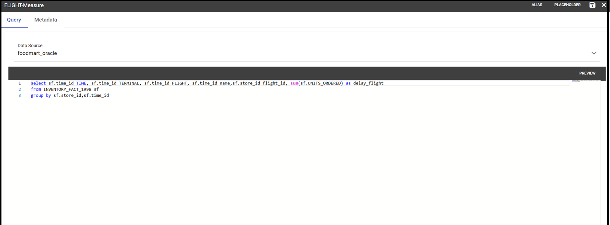

    Editing the query when defining a KPI.

Each rule is based on a query to which you can add placeholders. A placeholder represents a filter that you can add to your rule and that can be useful for profiling tasks. It is possible to assign value to a placeholder while configuring the schedulation of the KPI (this procedure will be further examined in “Document creation” paragraph). The syntax to use in queries for setting a placeholder is columnName=@placeholderName, as the example in figure below shows.

    Setting placeholder in query definition.

Generally the rule of a query can return one or more measures and possibly an attribute as the example above also shows.

The **Preview** button allows you to check the query execution and have a look on a part of the result set.

.. figure:: media/image124_b.png

    Preview functionality.

A typology (measure, attribute and temporal attribute) and a category can be assigned to each fields returned by the query using the **Metadata** tab as highlighted in the next figure. The typology is required to associate a type to each field returned by the query. In particular, if the field is a temporal one, it is mandatory to specify to which level you want it to be considered, that is if it corresponds to a day, a month, a year, a century or a millennium. For measures and attribute it is possible to assign also a category to easily look them up in a second moment.

.. _metadatasettings:
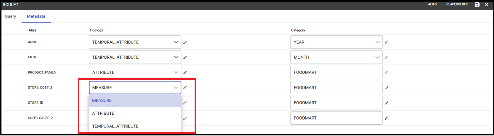

    Metadata settings.

We say in advance that, it is important to distinguish these metedata categories from the required field “Category” that occurs while saving the KPI definition.

In fact, the category assigned when saving the KPI definition will be added (if it doesn’t exist) in the “KPI categories“ list, used to profile KPIs on roles (see Figure below).

.. _kpicategory:
.. figure:: media/image126.png
    
    KPI category.

.. warning::
      **Do not confuse metadata category with the KPI category**
         
         The category defined in the metadata tab of the "Measure definition" functionally are not the same categories selected in the tab area of the "Roles management" functionality (see the figure above). The first are used to classify the metadata while the second are needed for the profiling issue.

As we told, a proper categorization exists for the aggregations of type temporal. In fact, when associating “temporal attribute” as metadata typology, the technical user must indicate the temporal level of the data in the category section: day, month, year or others. You can see an example in the following figure. Note that the field set as temporal type must contains numbers (therefore string types are not allowed). For example, if one wants to set a field as “month”, such a field must contain {01,02,03,...,12} that will be considered as {January, February, March,...,December}.

.. _hierarchyleveltempattrib:
.. figure:: media/image127.png

    Level for temporal attributes.

Let’s now examine extra features available on the right top corner. There you can find the following tab:

-  **Alias**: you can see the aliases defined in other rules; note that only the aliases of those colums saved as attribute are stored and shown. 
This is useful in order to avoid aliases already in use when defining a new rule. Indeed an alias can not be saved twice even if contained in different rules.

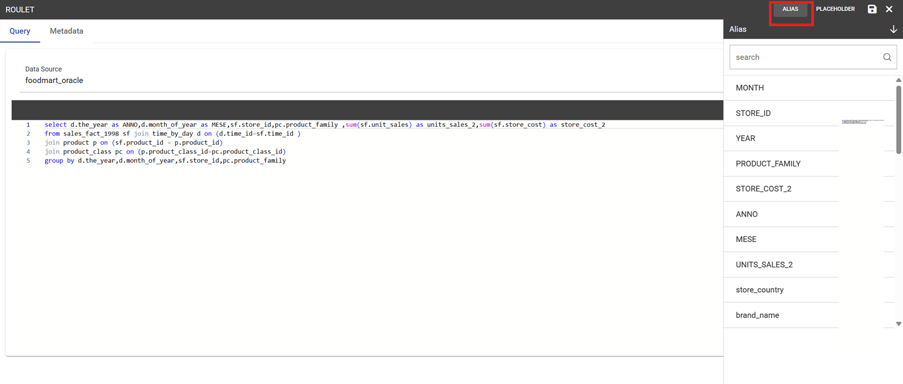

    Checking aliases.

-  **Placeholder**: here you can check the existing placeholders. These are set in the query you’re editing or in other ones.

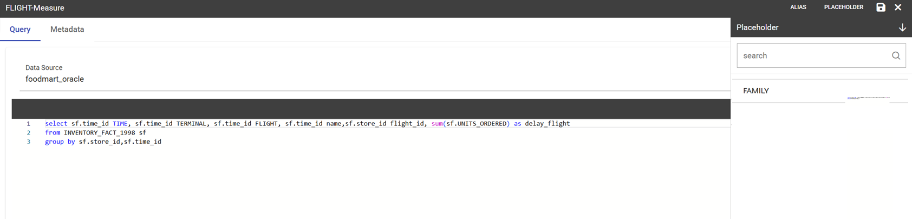

    Setting placeholders in a query.
   
-  **Save**: to save the query and other settings just configured.
-  **Close**: to exit the rule configuration window.

**KPI definition.** Select the **KPI** item from the contextual menu of the main page of Knowage, as shown in figure below. Click on the “Plus” icon to configure a new KPI.

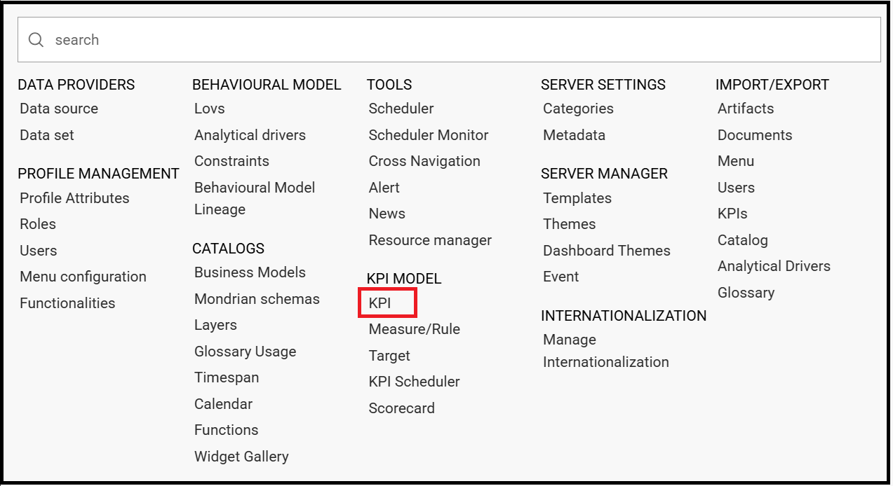

    Configuring a new KPI.

The window opens a first tag, entitled **Formula** (see figure below), where to type in the formula to enable calculations. 
Press CTRL key and space bar simultaneously to access all measures defined throug the definition of the rules. In case of *No Suggestions* you will need to type in the name manually.
  
Once typed in the name of the measure(s), you need to choose the aggregation function to apply to just by clicking on the name. See figure below.

    Available functions.

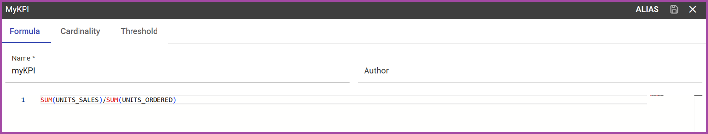

   Example of a KPI formula.

After completing the insertion of the formula move to the next tab *Cardinality*

The *Cardinality* tab allows you to define the granularity level (namely the grouping level) for the attributes of the defined measures.

Referring to the example below, selecting (with a check) all the measures for the attribute product_name the KPI measures are computed for each value of the product_name; otherwise no grouping will be done.

    Cardinality settings example.

Limit values can be set using the Threshold tab (Figure below). It is mandatory to set at least one threshold otherwise the KPI cannot be saved. You can choose a threshold already defined clicking on “Threshold” list or create a new one.

    Setting thresholds.

To insert a new threshold it is mandatory to insert a name and assign a type, while the description is optional. Clicking on **Add new threshold item** a new item appears. It is necessary to define the **Label**, **Minimum** and **Maximum** values. It is possible to choose whether to include the minimum and maximum values in the value slot or not. The **Severity** is used to link colors to their meaning and make the thresholds readable by other technical users. Note that the color can be defined through the RGB code, the hexadecimal code or choosing it from the panel.
   
.. warning::
      **"Standard" colors for thresholds**
         
         Well call **standard colors** for thresholds the ones listed below (in terms of hexadecimals):
            - green: #00FF00,
            - yellow: #FFF000,
            - red: #FF0000.

Finally the user must save the KPI definition clicking on the “Save” button, available at the right top corner of the page. Once the user clicks on the “Save” button, the “Add KPI associations” wizard opens, as you can see from next figure. Here, it is mandatory to set the KPI category so that only users whose roles have the permissions to this specific category can access the KPI. Remember that it is possible to assign permissions over KPI when defining roles using the “Roles management” functionality. Furthermore, the user can check or uncheck the **Enable Versioning** button if he/she wishes to keep track of the rules/measures/targets that generate the KPI response at each KPI execution.

.. _savekpidefcategory:

    Save the KPI definition and set category.

**Target.** This step is not mandatory. Enter the **Target** menu item as shown below.

    Target Definition menu item.

By clicking the *Plus* icon a new target can be added.

The define a new target you need to type in a name, a validity start date/end date and the association to at least one target.
 The association with a target can be done by clicking the item **Add KPI association** and selecting the KPI of interest. Once the association is set, the “Value” box gets editable and you can insert the value you wish to send to the selected KPI. An example is given in figure below. 

.. _kpitargetassoc:

    KPI target association.

In the KPI visualization phase, a red bold thick will be displayed on the indicated value (see next figure).

.. _targetmarkkpiscale:
.. figure:: media/image143.png

    Target mark in KPI scale of values.

**Schedulation.** Once the KPI has been defined, there is the need to schedule it before proceeding with the creation of an analytical document. For this purpose, click on the **KPI Scheduler** from the contextual menu that you can see below.

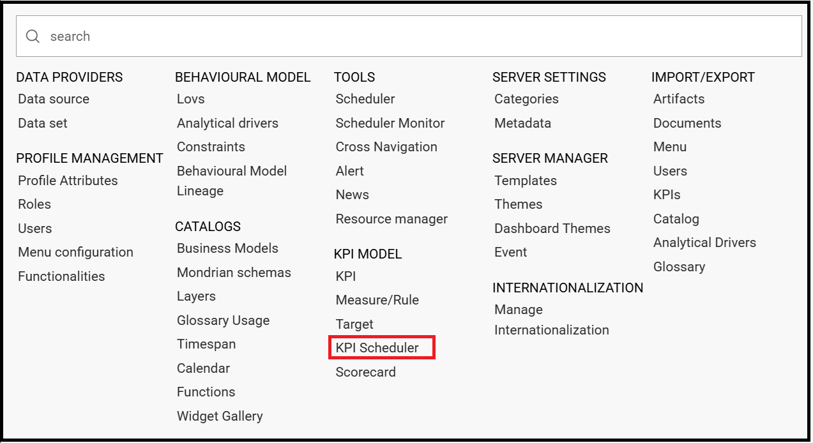

    KPI Scheduler menu item.

Click the *Plus* icon to create a new scheduling.

-  **KPI**: it is possible to associate one or more KPI with a scheduling by clicking the “Add KPI Association”.
 
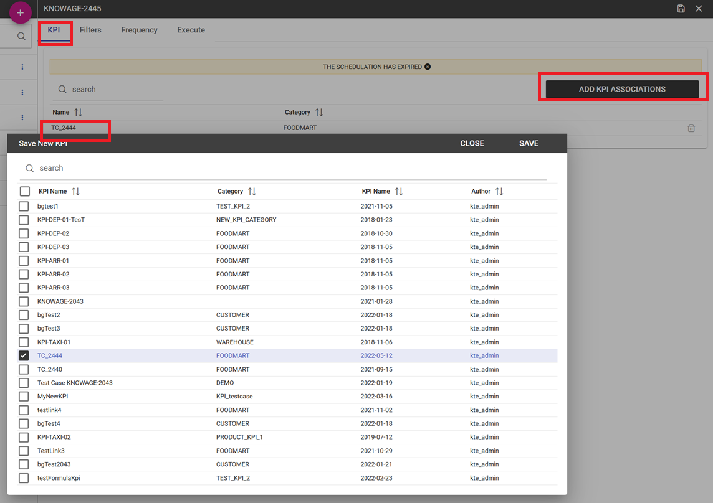

    KPI tab window.
 
-  **Filters**: here you assign values to the filters (if configured) associated to the corresponding rule. Note that it is possibile to assign values to the filters through a LOV, a fixed list of values or a temporal function. In case the LOV option is chosen, remember that the LOV must return one unique value. This choice can be useful for profiling tasks.

.. figure:: media/image146.png

    Filters options.

-  **Frequency**: here is the place where the schedulation time interval (start and end date) can be set together with its frequency.

.. figure:: media/image147.png

     Frequency tab window.

-  **Execute**: here you can select the execution type. The available options distinguish between the storing and the removal of old logged data. In fact, selecting **Insert and update** the scheduler compute the current (accordingly to the frequency choice) KPI values and store them in proper tables without deleting the old measurements and all error log text files are available right beneath. While selecting **Delete and insert** the previous data are deleted.

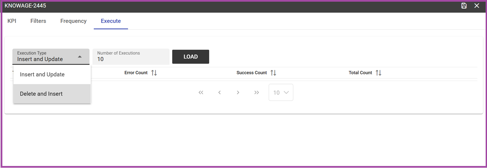

    Execute tab window.

Once the information of the new scheduling has been completed click the *Save* icon and assign a name.

    Saving of a KPI Scheduling

Creating a KPI document
------------------------------------------------------------------------------------------------------------------------

After the schedulation has been set it is possible to visualize the results. 
At this point you need to create a new generic document of type KPI that uses the KPI engine (see figure below). 
Type in the mandatory information and save by clicking the specific icon at the top right corner.

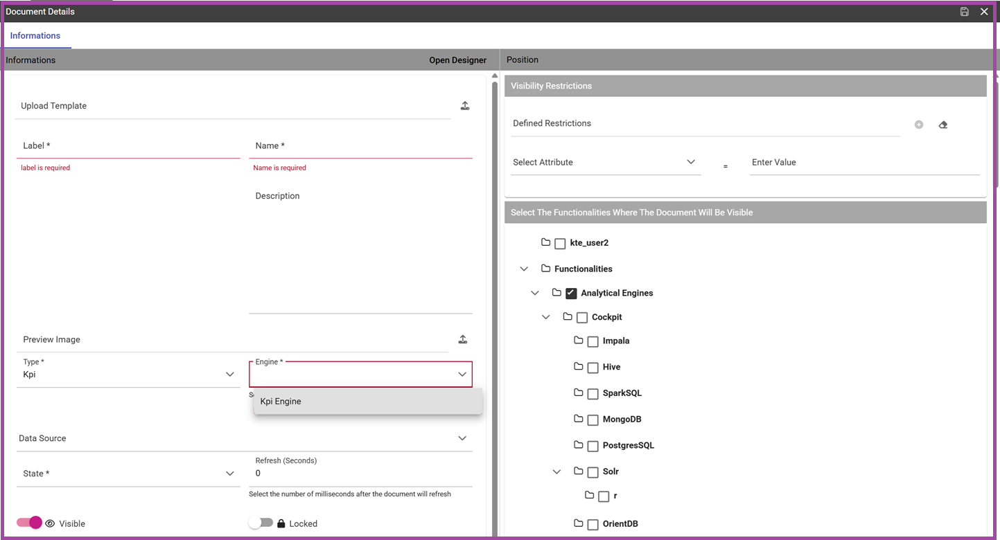

    Overview of the KPI case.

After saving the document click on **Open designer** link to develop the template. Here you can choose between KPI and Scorecard (refer to Scorecard Chapter for details on the Scorecard option). In the KPI case it is possible to choose between the two following type of document.

-  **List**: with this option it is possible to add several KPI that will be shown in the same page with a default visualization.
-  **Widget**: with this option it is always possible to add several KPI that will be shown in the same page but in this case you will also be asked to select its visualization: Speedometer or KPI Card; then you have to add the minimum value and the maximum value that the KPI can assume and if you want to add a prefix or a suffix (for example the unit of measure of the value) to the showed value.

Then you must add the KPI association using the KPI List area of the interface. As you can see in figure below you can select the KPI after clicking on the **ADD KPI ASSOCIATION** link. The latter opens a wizard that allows to select one or more KPIs. Once chosen, you need to specify all empty fields of the form, like “View as”. minimum and maximum value for the range and so on (refer to figure below). Note that the “View as” field is were you can decide if the widget will be a Speedometer or a KPI Card.

    Setting the KPI associations using the dedicated area.
   
Moreover, you can set the other properties of the KPI document using the **Options** and the **Style** areas at the bottom of the page.

In particular, it is possible to select the time granularity used by the KPI engine to improve the performances. For this purpose, in the “Options” area (following figure) the user is invited to indicate the level of aggregation choosing among “day”, “week”, “month”, “quarter”, “year”.

    Choosing the time granularity.

Finally in the “Style” area the user can customize the size of the widget, the font, the color and size of texts.

Then save and run the document.

In case the document contains KPIs involving grouping functions upon some attributes, it is possible to filter the data returned on those attributes. 
To easily retrieve the attributes on which measures are grouped, it is sufficient to check the fields listed in the *Cardinality* tab of the KPI definition.

Then to use them to filter the document, first add the proper analytical drivers. Refer to **Analytical Document** section to get more information about how to associate an analytical driver to a document (and therefore to a KPI document). It is mandatory that the URL of the analytical driver *must* coincide with the *attribute aliases* on which you have defined the grouping.

In the following figures you can find examples on two types of KPIs you can design: a Speedometer and a KPI Card.

.. _kpispeedometer:

    KPI Speedometer.

.. _kpicard:

    KPI Card.

