How to build a QBE
##########

This detailed user guide is dedicated to the Qbe (Query By Example), a Free Inquiry instrument which empowers users with easy and free access to information via graphical interfaces.

Free Inquiry indicates the modus operandi of analysts and operational users that are usually seeking for business analysis that are not limited to pre-arranged lists of results. This method requires a medium level of complexity as an adequate knowledge of data management and a structured organization of work are required.

QbE is a tool that allows you to develop your free inquiry through an entirely graphical modality. Moreover, you can execute the query, check the results, export them and save the query for further use.

The material will be divided in two main sections. The first is dedicated to build queries in the Knowage Server environment, supposing the availability of a business model to analyse. In the second part, we will provide the user with the principal steps to build a proper business model through the Qbe designer, available in Knowage Meta.

My first Query By Example
--------------------------

**QbE** allows you to query (a subset of) a database through a high-level representation of the entities and relations. 
Qbe main features are:

-  rich end user GUI;
-  selection of attributes and setting of filters;
-  no knowledge of data structures;
-  semantic knowledge of data;
-  management of results free;
-  support of export capabilities;
-  repeatable execution of inquiries.

Building a QbE query does not require any technical knowledge, but data domain knowledge: technical aspects, such as creating filters, aggregation and ordering criteria, are managed by a user-friendly graphical interface.

Let’s suppose that an administrator has built a business model and, consequently, released it on Knowage Server. This allows the user to access the model, query the available entities and save the results as a dataset, for further usage in different Knowage documents, such as cockpits.

In the following we will discuss each step in detail, showing the basic and advanced functionalities of the **QbE Editor**.

Query design and execution
~~~~~~~~~~~~~~~~~~~~~~~~~~~~~~

To open the QbE editor, access the **Models** section, available in the end user **Workspace**. Then, simply click on the model icon to reach the QbE graphical interface.

In this paragraph we show how to build a simple query with the QbE editor.

    QbE editor.

The above figure shows the **Query designer**. In next sections we will explain in detail all the components related to the **Query Designer**, the **Datamart Schema** tab, the query editor and the hidden tab dedicated to the management of queries, subqueries and parameters catalogue.

Datamart Schema
^^^^^^^^^^^^^^^^

Starting from the left side:
	The upper Panel shows the searchable logical schema and the list of entities that can be queried to generate the query. Entities are represented in a tree structure, with user-defined names. Fields can be added to the query (right side) by clicking on them.
	The lower Panel shows the list of created subqueries in a tree structure where the children are the fields of a subquery

Types of entities are: *facts*, represented by a cube symbol.(i.e., the Sales entity), *dimensions*, represented by a four-arrows symbol (i.e., the Product entity), *geographical dimension*, represented by *earth* icon.

Each single entity contains a title, a list of attributes or measures and relationships with other entities. Relations are available clicking on the *i* icon of a single entity. In particular, by exploding the content of an entity (i.e. Sales), you may encounter the following elements:

- **measure**: refers to fields related to numeric data (e.g. UNIT SALES);
- **attribute**: refers to fields that can be associated to a category (e.g. PRODUCT ID);
- **relation**: refers to relationships or connections between two entities (e.g. relationship between the sales and the product dimension).

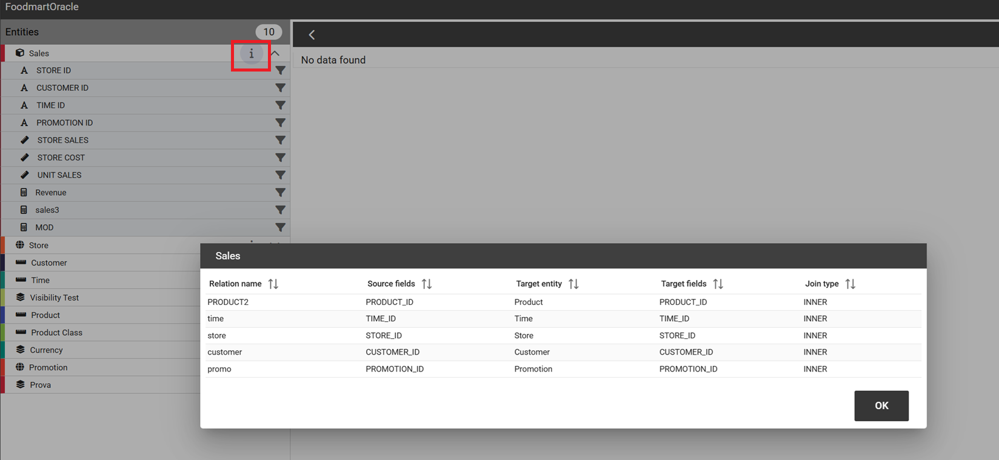

	Relations of an entity.

There are two available views: Smart and Advanced. When the QbE is opened, by default the user will see the Smart view. To add a field of a specific entity to the query,just click on it and no other user interaction will be necessary to display the results.

.. figure:: media/smart_8.1.png

	Smart view.

The user can display the Advanced view by switching off the Smart view option displayed on the top right corner. The user can continue adding fields to the query but without seeing result. A specific icon has to be clicked to run the query.

.. figure:: media/advanceView_8.1.png

	Advanced view

The structure of the panel containing the fields of the query as well as the functionalities, changes depending which view is displayed.
For example, to remove a field from the query editor, just click on the *X* icon available for each column in the Smart view or click on the  **delete** item of the three dots menu available inthe Advanced view.
In any case, the Smart view, shows a table structure where each column of the table corresponds to a field of the query and contains:

- a **gear** icon providing functionalities like *Show field, Rename Alias,Group*
- a **deleting** icon
- a **filter** icon

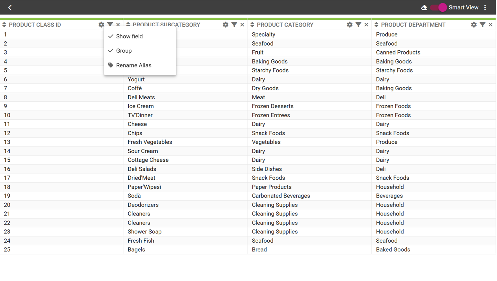

    Smart view functionalities.

The Advanced view shows a set of rows where any row contains the **Entity name**, the **Field name**, the **Alias** plus some other functionalities:

- **Alias**: define aliases for fields
- **Aggregation**: define the aggregation function (e.g., **SUM**, **AVERAGE**, …) on non-grouped items;
- **Order**: define a sorting criteria: click on the arrow to select an ascending or descending criteria;
- **Group**: in case of aggregations, define the attribute that you want to group on (due to the SQL syntax, these attributes appear in the GROUP BY clause);
- **Show**: indicate whether a column shall be visible in the result or not (hidden attributes are used and returned by the generated query, but are not shown in the result table);
- **In use**: indicate whether a column shall be used in the select clause of the query or not
- **Filter**: to add a filter criteria;

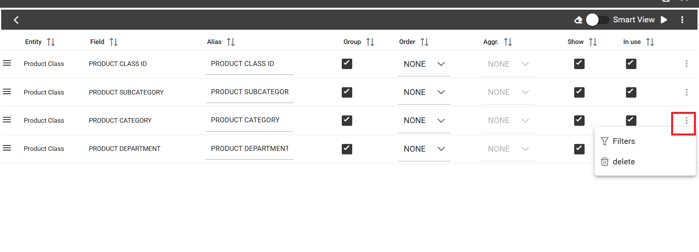

    Advanced view functionalities.

The below image shows how to change the alias for a specific field from the Advanced view. Just click on the cell containing the alias name to be able to edit it.

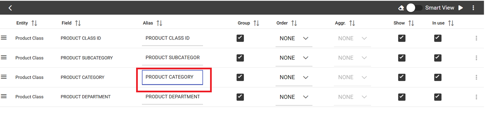

	Change alias example.

To change the alias of a field in the Smart view, just click on the **gear** icon and select *Rename Alias*
Pay attention to grouping options: if you want to define an aggregation function on a field (like, for instance, the **COUNT** of the sold items), you shall tick the Group checkbox for all the other fields added in the query editor, without an aggregation function defined, otherwise you will get an SQL exception. The possible grouping functions are shown in the following figure.

.. figure:: media/image214.png

    Aggregation functions.

When you drag attributes belonging to entities that are linked through a relationship path, the QbE automatically resolves relationships between attributes (implicit join).

Moreover, multiple relationships may occur among entities. A typical example concerns dates. Suppose you have two relationships between the **Order** fact table and the **Time** dimension table: the first links the order_date column of the first table to the *time_id* column of the latter table, while the second relationship joins the *shipping_date* column to the *time_id column*.

In this case, when dragging fields from both the **Order** entity and the **Time** entity you may want to specify which relationship joins the two tables: for instance, you may want to know the total number of orders according to the ordering month, the shipping month or for both. In all these situations, you can set the relationship to be used by clicking the **Join Definitions** option of the three dots menu at the top right corner of the panel. A pop up window opens where you can change the path to be used. Please refer to Multiple relationships section for all the details regarding the ambiguity on relationships.

The below table summarizes some of the toolbar functionalities.

.. table::  Toolbar options
      :widths: auto

      +-----------------------------------+-----------------------------------+
      |    functionality                  | Description                       |
      +===================================+===================================+
      |    **Join Definitions**           | Displays relationships between    |
      |                                   | query entities                    |
      +-----------------------------------+-----------------------------------+
      |    **SQL**                        | Shows SQL generated by the        |
      |                                   | graphical interface               |
      +-----------------------------------+-----------------------------------+
      |    **Discard Repetitions**        | Remove duplicated rows from       |
      |                                   | results, if any                   |
      +-----------------------------------+-----------------------------------+
      |    **Parameters**                 | Add parameters                    |
      |                                   |                                   |
      +-----------------------------------+-----------------------------------+
      |    **Calculated field**           | Add calculated fields only for    |
      |                                   | Advanced view                     |
      +-----------------------------------+-----------------------------------+
      |    **Three dots panel menu**      | Open menu options                 |
      |                                   |                                   |
      +-----------------------------------+-----------------------------------+
      |    **Eye**                        | Show/hide hidden fields           |
      |                                   |                                   |
      +-----------------------------------+-----------------------------------+
      |    **Smart View option**          | Switch between the Smart and      |
      |                                   | the Advanced views                |
      +-----------------------------------+-----------------------------------+
      |    **Play icon**                  | Preview query results for the     |
      |                                   | Advanced view                     |
      +-----------------------------------+-----------------------------------+
      |    **Three dots field menu**      | Contains functionalities like     |
      |                                   |Delete, Filters, Havings (only for |                               |
      |                                   | the Advanced view                 |
      +-----------------------------------+-----------------------------------+

Calculated fields management
^^^^^^^^^^^^^^^^^^^^^^^^^^^^^^^^

You can also add calculated fields to a query. This functionality is only available in the Advanced view through the  item  **Calculated field** ot the three dots menu.

To build a calculated field, you shall define a:

- **Column Name**;
- **Type**: string, number or date;
- **Column Type**: measure or attribute;
- **Formula**: drag and drop the fields included on the left and build the formula using the available functions.

The image below shows the wizard.

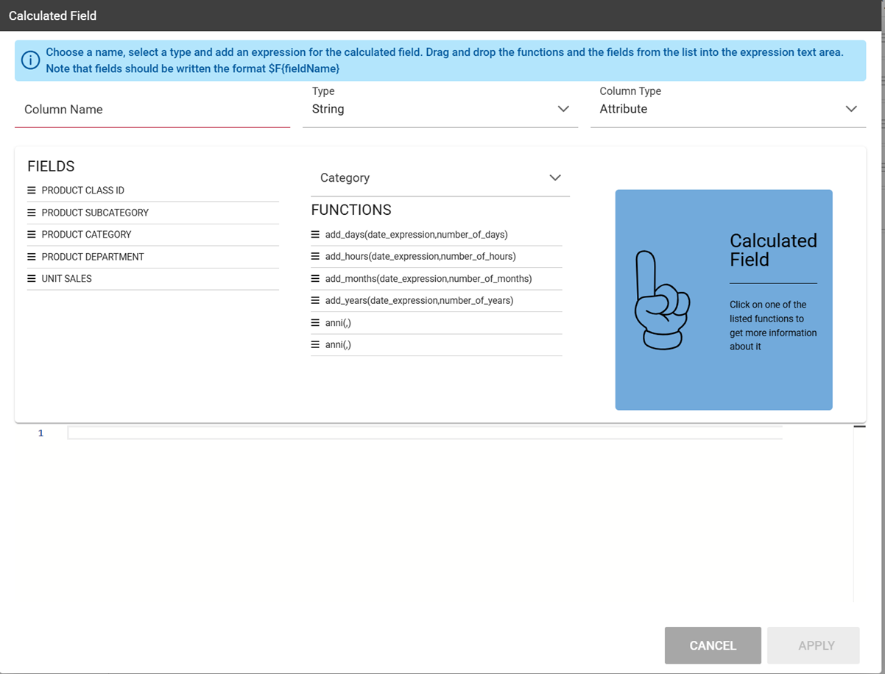

    Calculated field wizard.

Filters
^^^^^^^^

The **Filters** panel allows you to define a filter criteria, a WHERE clause to add to the query.
Filters are expressions of type:

                                      **Left operand + Operator + Right operand.**

How to add a filter:                                                                                                                                                                                                                  
- in the Smart view, clicking on **Funnel icon**                                                                                                                                   
- in the Advanced view, selecting **Filters** from the *three dots* field menu

In both cases a pop up opens and click on the **+** icon to add your filter.

To remove the filter just click on **eraser** icon as shown in the below image.

The Filters panel contains the following components:

-  **Field, Condition, Target**, these components allow you to define filters according to the syntax defined above.
-  **Target type**, defines the types of right operand: *Manual set value, Value of the field, Another entity, Parameter, Subquery*;

Above, an example of filter with *Target type* set to **Manual set value**: the **Target** will contain the value to be used as the right operand.

.. figure:: media/manualTarget.png

	Manual *Target type*

**Manual set value** can be also used choosing **Between**, **Not between** as *Condition*. In this case, a Low and High Limit is needed for *Target* values.
When the user chooses **Value of the field** as *Target type*, a lookup function is automatically activated on the field values, to facilitate the selection of values to be used as the right operand. 
To use a range of values as a right operand, the *Condition* should be to **In** or **Not in**. 

    Filter lookup for right operand selection.

The option **Another entity** allows the selection of a field from another entity, to be used as a right operand.

.. figure:: media/anotherEntity.png

**Subquery** and **Parameter** will be treated in detail later.

.. important::
         **Enterprise Edition only**

         Filtering data on fields with type of Date/Time/Timestamp through Calendar/Time functions is only available for the Enterprise Edition.

If you have the SI license file, you could filter your data with fields type of date/time/timestamp using Calendar/Time/Calendar + Time options.
This depends on which data type your field is: the data type is assigned when creating the metamodel.

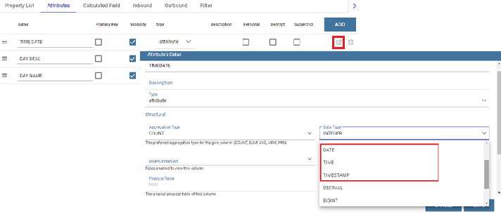

	Creation of a Metamodel.

	Filters on date fields.

.. figure:: media/time.png

	Filters on time fields.

	Filters on timestamp fields.

The following table summarizes the possible types of filters in the QbE. The use of subqueries in filters will be explained later in the *Advanced QbE functionalities* paragraph.

.. table:: Possible combinations of filters in the QbE.
      :widths: auto

      +-------------+-------------+-------------+-------------+-------------+
      | Filter type | Left        | Operator    | Right       | Example     |
      |             | operand     |             | operand     |             |
      +=============+=============+=============+=============+=============+
      |    Basic    | Entity.attr | Any         | value       | Prod.family |
      |             | ibute       |             |             | = 'Food'    |
      |             |             |             |             |             |
      |             |             |             |             |             |
      +-------------+-------------+-------------+-------------+-------------+
      |    Basic    | Entity.attr | Any         | Entity.attr | Sales.sales |
      |             | ibute       |             | ibute       | >           |
      |             |             |             |             | Sales.cost  |
      +-------------+-------------+-------------+-------------+-------------+
      |  Parametric | Entity.attr | Any         | [parameter] | Prod.family |
      |             | ibute       |             |             | = [p_family]|
      |             |             |             |             |             |
      |             |             |             |             |             |
      +-------------+-------------+-------------+-------------+-------------+
      |    Dynamic  | Entity.attr | Any         | prompt      | Prod.family |
      |             | ibute       |             |             | = ?         |
      +-------------+-------------+-------------+-------------+-------------+
      |    Value    | Entity.attr | In          | subquery    | Sales.custo |
      |    list     | ibute       |             |             | mer         |
      |    from     |             | /not in     |             | in subquery |
      |    subquery |             |             |             |             |
      +-------------+-------------+-------------+-------------+-------------+
      |    Single   | subquery    | < = >       | value       | Subquery >  |
      |    value    |             |             |             | 0           |
      |    from     |             |             |             |             |
      |    subquery |             |             |             |             |
      +-------------+-------------+-------------+-------------+-------------+

When filtering a date attribute or a time attribute it is possible to apply a timespan to ease the insertion of values. Following the images below, we can see that the Timespan button appears when filterting, for instance, a date attribute. We recall that is it possible to configure a new timespan using the dedicated Knowage functionality that we described in the administrator guide.

.. figure:: media/imageTS005.png

	Filtering date attribute: use a timespan.

After selecting a timespan and clicking on apply, the user has to insert the start and end date values.

	Filtering date attribute: apply a timespan.

Save now to filter data accordingly.

Query Preview
^^^^^^^^^^^^^^^

The Smart automatically shows the preview of you query.
The Advanced view contains a **Play** icon located in the top right corner of the panel, that opens a window with the results of the query. 
Just close the window to go back to the **Designer**.

.. figure:: media/preview.png

	Preview wizard.

In case of starting the QbE editor directly from a model **My Data** > **Models**,you can also save your query as a new dataset by clicking on the **Save** icon located in the top right corner of the page; the dataset would be reachable later from **My Data**> **Dataset**. Please note that this operation saves the *definition* of your query and not the snapshot of the query result. This means that every time you re-execute the saved dataset, a query on the database is performed to recover the updated data.

When saving your query as dataset, a pop up opens asking you to fill in some information, split in three tabs:

-  **Details**, in this tab you set basic information for your dataset like its **Label**, **Name**, **Description**, **Catgory** and **Scope**.
-  **Persistence**, you can persist your dataset, i.e., to write it on the default database. Making a dataset persistent may be useful in case dataset calculation takes a considerable amount of time. Instead of recalculating the dataset each time the documents using it are executed, the dataset is calculated once and then retrieved from a table to improve performance. You can also decide to schedule the persistence operation: this means that the data stored will be updated according to the frequency defined in the **scheduling** options.
-  **Metadata**, contains the metadata associated to the fields involved in your query.

	Save qbe dataset.

Advanced QbE functionalities
~~~~~~~~~~~~~~~~~~~~~~~~~~~~~~

In this section we focus on advanced features, which can be comfortably managed by more expert users.

Spatial fields usage
^^^^^^^^^^^^^^^^^^^^^^^

.. important::
         **Enterprise Edition only**

         Spatial dimension is only available for Enterprise Edition with LI licence.

The Qbe engine supports *spatial* queries through a set of operators (that return true or false) or a set of functions (that usually return a measure). This feature is only available for the Location Intelligence (LI) license and when data is stored in Oracle 12c databases. It is also fundamental that the Business Model has to be tagged as *geographical* model. You can refer to Meta Web Section to have details on how to set the geographical option using Knowage Meta.

In a BM with geographical dimensions enabled (by a technical user), the dimensions which has spatial fields are marked with the compass icon |earthIcon|. Expanding the spatial dimension the list of fields is shown and there is no way to distinguish between geographical and non geographical attributes. Therefore the user has to be already aware of which fields have geometrical properties.

.. |earthIcon| image:: media/earthIcon.png
   :width: 30

    QbE spatial dimensions.

Also for a geographical dimension is possible to add fields to the query, including *Calculated* fields. This functionality is the same as shown before, as the three dots menu of the Advanced view contains the **Calculated field** option. Note that a wizard opens: you can use this editor to insert a new field obtained through a finite sequence of operation on the selected fields. In this case, the wizard offers a set of spatial functions that can be used in your formula.

.. _calculfldwizardspt:
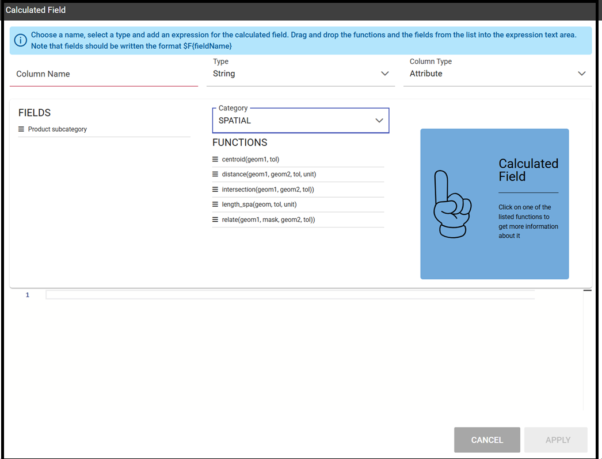

    Calculated field wizard with spatial filters.

Remember to select *SPATIAL* from the Category menu list to see all the spatial functions. Drag and drop the fields and your function(s) to the text editor and refer to the Oracle function description for a proper use.

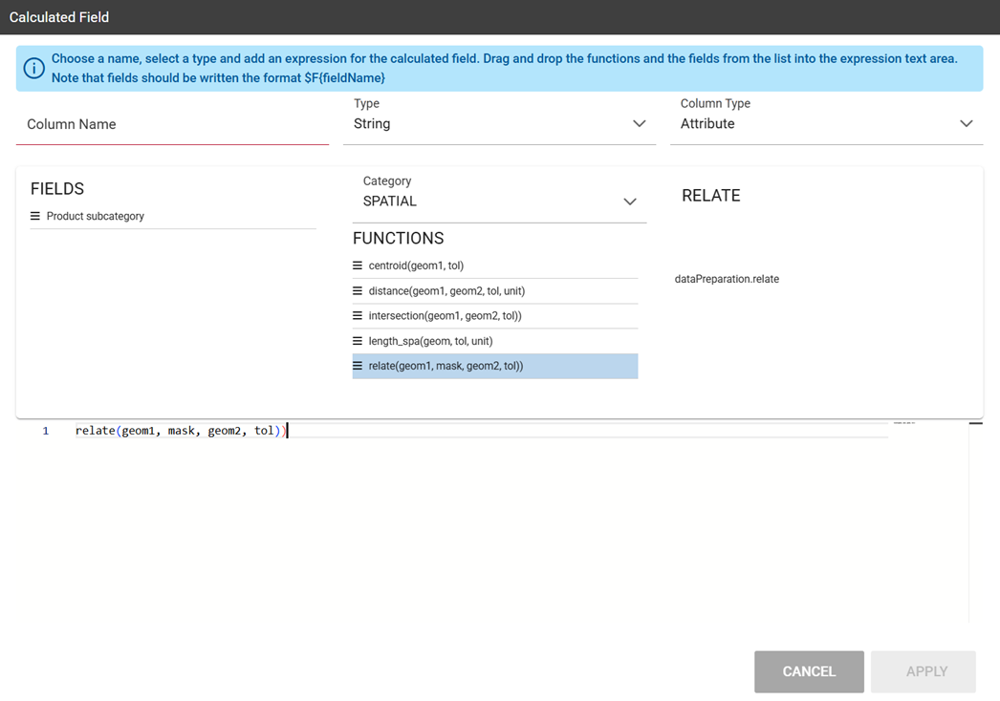

    Spatial functions.

In addition to the *SPATIAL* functions, the **Category** field provides some more options:

-  AGGREGATION functions,
-  STRING functions,
-  TIME functions,
-  SQL functions,
-  CUSTOM functions (if previously developed).

Subqueries
++++++++++

The **QbE Engine** also supports the definition and usage of SQL subqueries to use within a filter in association to the **In/Not in** operator, as shown in the figure below. To create a subquery, click on **+** icon, on the right of **Derived entities**. 
.

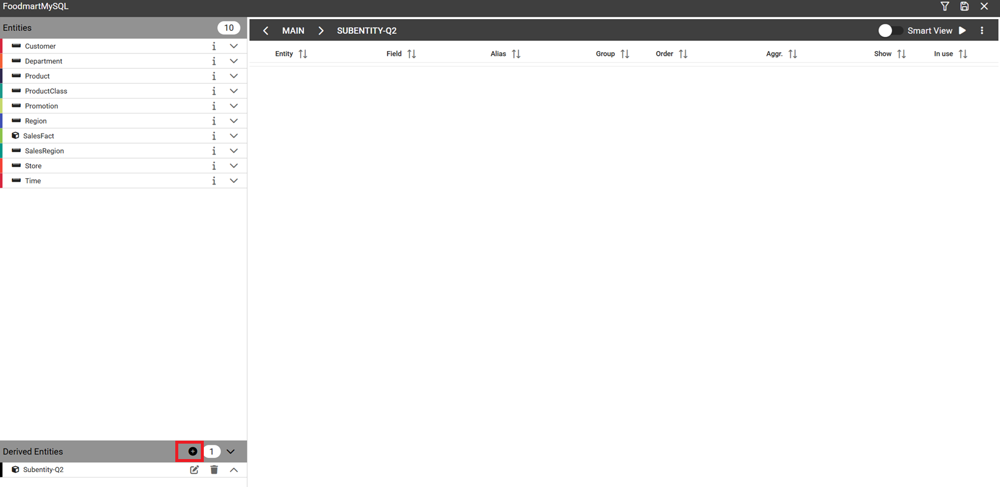

	QbE subquery view.

You can easily add fields and return to the main query clicking on **MAIN** link in the query editor toolbar.

To use the subquery inside the main query, simply choose **Subquery** from *Target type* and set the *Condition* to (**IN** or **NOT IN**).

    QbE query: Use of a subquery in a filter.

Parameters
++++++++++

The **QbE Engine** also supports the definition and usage of parameters that can be used to filter data using the QbE filter. To create a new parameter to be used as a filter inside the main query, click on **Parameters** from the three dots menu of the main query toolbar.

.. |parameter| image:: media/parameter.png
   :width: 30

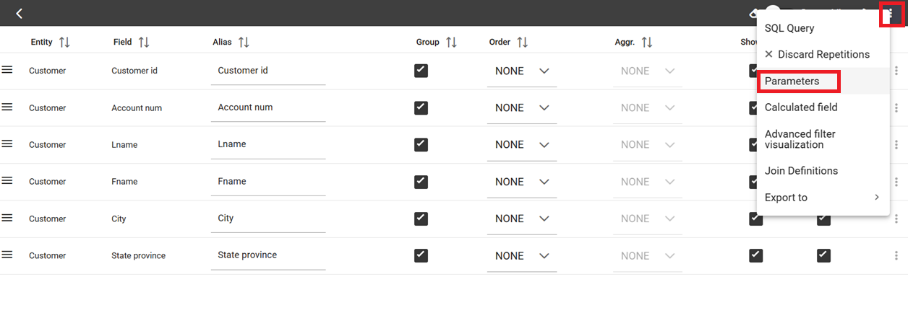

	QBE parameter view.

To use the parameter inside the main query, simply choose **Parameter** from Target type and choose parameter name from the **Target** list.

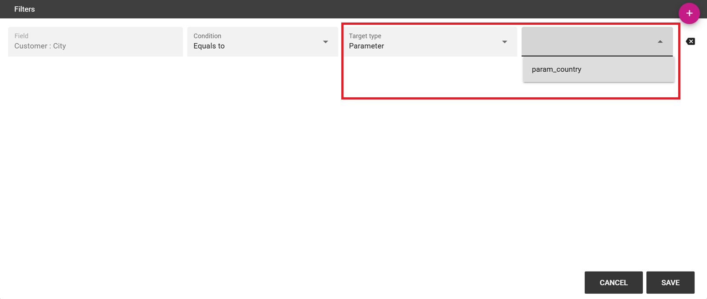

	QbE query: use of a parameter in a filter.