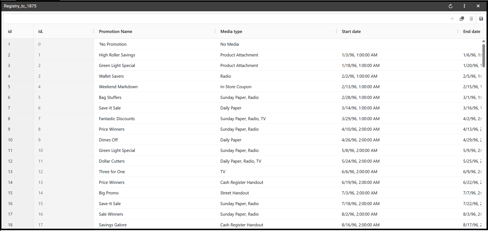
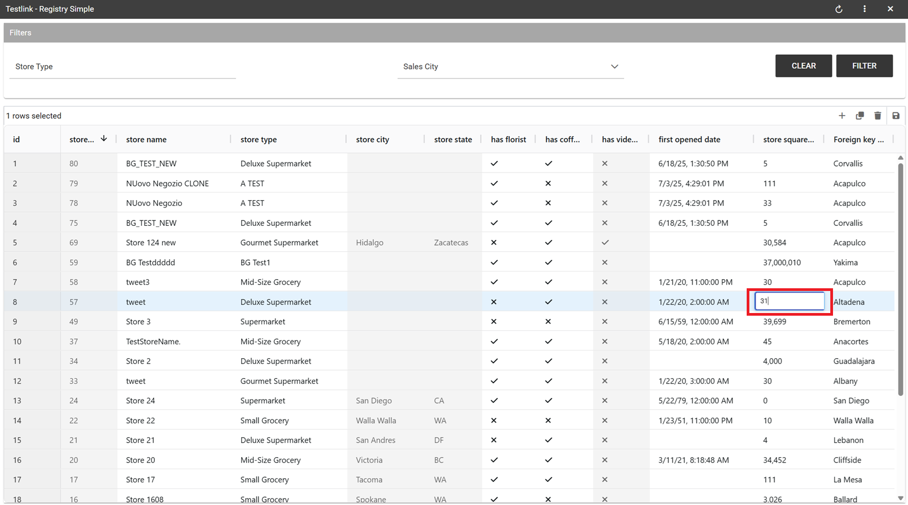
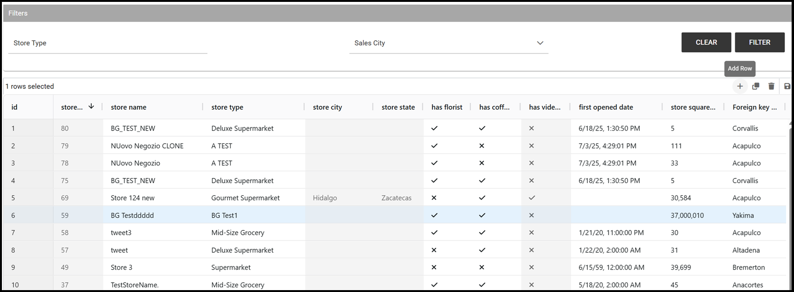
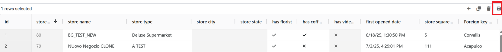
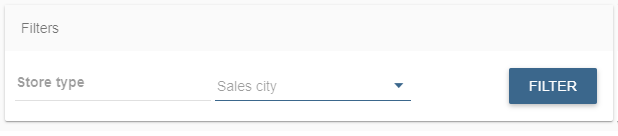
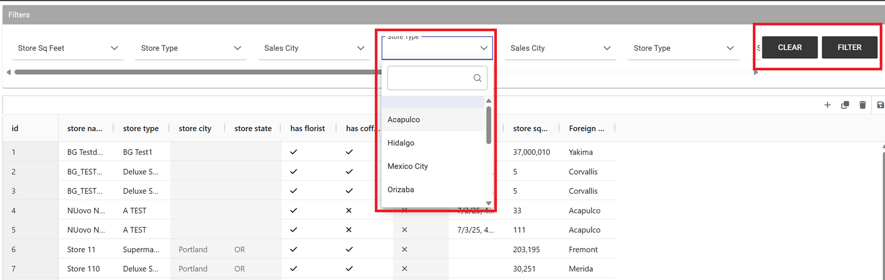
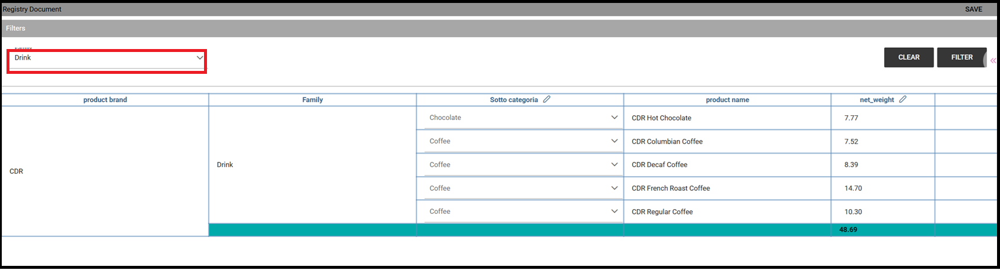

Create a new Registry
########################################################################################################################

A *Registry* document allows users to write, delete and modify the items of a datamart. 
Knowage allows users to implement a registry document through the **Qbe Engine**. 
In this case, the graphical interface is different from the Qbe one. Below an exmple of a registry document.
In the next chapters we will see how to navigate a Registry document (see *Registry features* paragraph for more details) and how to create a new one (see *Registry development* paragraph for more details).

    Example of a Registry document.

Registry features
------------------------------------------------------------------------------------------------------------------------

The execution of a Registry document opens a plain table: the records are shown in rows and they can be browsed using the pagination available at the bottom of the window. We underline that it is possible to edit each item of the table if inside template that column is set to be editable. Just click on a cell you may wish to rearrange and type a string or a numeric value accordingly. Some examples are highlighted below.

    Editing table cells in a registry.

You can add new rows from scratch selecting the *Add row* icon as shown in the image below. 
Just type in in each cell the corresponding value depending on the type: string, number or date. The *Add row* functionality will be available if the template configuration contains the following: <CONFIGURATION name="enableAddRecords" value="true"/>

    Adding a new row to a registry.

You can delete one or more rows using the *Trash* icon |image338|. The *Trash* button will only be available if the template configuration contains the following: <CONFIGURATION name="enableDeleteRecords" value="true"/>

Changes are applied to the datamart by clicking the *Save* icon |image339| as shown below.

.. _functionalitybar:

    Functionality bar.

Furthermore you can use filters, if implemented, available in the Functionality bar. Click on the “Filter” icon |image340| to run the functionality. Otherwise, click on the “Cancel” icon to clear the boxes off.

Note that, since records are displayed in a plain table, it is available a combobox (see figure below) which allows the user to visualize all fields related to the record of the previous cell and then change from one to another to get all data.

    Select one field from a combobox.

Pivot Registry characteristics
~~~~~~~~~~~~~~~~~~~~~~~~~~~~~~~~~~~~~~~~~~~~~~~~~~~~~~~~~~~~~~~~~~~~~~~~~~~~~~~~~~~~~~~~~~~~~~~~~~~~~~~~~~~~~~~~~~~~~~~~

It is possible to implement also a Pivot Registry document. The graphical features are very similar to the ones exposed in *Registry development* paragraph. An example is given below.

.. _examplejpivotregdoc:

    Example of Pivot Registry document.

In this case the table shows columns organized in a hierarchical way and a grouping function is implemented. From the left to the right the columns contain fields at different detail levels. The last column in our example in the figure above contains numeric data. Such a field is grouped at the “country” level. The grouping level depends on the configurations made on template building.

In the Pivot instance it is not allowed to add, modify or cancel rows. Furthermore, it is not permitted to edit cells which contain string items while the numeric ones are still changeable. If implemented, filters are still available.

Registry development
------------------------------------------------------------------------------------------------------------------------

To create a Registry document there must be available a datamart schema on Knowage Server. Then you must edit an XML template. The latter is very similar to the one produced under the Qbe development but in this case you must add an appropriate tag. Indeed, if the template file has the **<REGISTRY>** tag the engine shows data in registry modality; namely it shows a table whose rows are manageable by end users by adding, editing or deleting them.

Here we exhibit a possible syntax for a Registry document.

.. _exampletemplatebuild:
.. code-block:: xml
    :linenos:
    :caption: Example (a) of template for Registry.

    <?xml version="1.0" encoding="windows-1250"?>
    <QBE>
		<DATAMART name="RegFoodmartModel" />
		<REGISTRY>
			<ENTITY name="it.eng.knowage.meta.regfoodmartmodel.Product">
				<FILTERS>
					<FILTER title="Class" field="product_subcategory" presentation="COMBO" />
					<FILTER title= "Product name" field="product_name" presentation="COMBO" />
				</FILTERS>
				<COLUMNS>
					<COLUMN field="product_id" unsigned="true" visible="false" editable="false" format="####" />
					<COLUMN field="product_name" title="Product name" size="200"
                        editor= "MANUAL" sorter="ASC"/>
					<COLUMN field="product_subcategory" title="Class" size="200"
                        subEntity="rel_product_class_id_in_product_class" foreignKey="rel_product_class_id_in_product_class" />
					<COLUMN field="SKU" title="SKU" size="200" editor="MANUAL" />
					<COLUMN field="gross_weight" title="Gross weight" size="200" editor="MANUAL" />
					<COLUMN field="net_weight" title="Net weight" size="200" editor="MANUAL" />
				</COLUMNS>
				<CONFIGURATIONS>
					<CONFIGURATION name="enableDeleteRecords" value="true"/>
					<CONFIGURATION name="enableAddRecords" value="true"/>
					<CONFIGURATION name="isPkAutoLoad" value="true"/>
				</CONFIGURATIONS>
			</ENTITY>
		</REGISTRY>
	</QBE>

In particular, we give some details for each tag and main attributes.

-  **ENTITY**: the entity name as in the model. It must be the fully-qualified name of the class representing your registry in the model;
-  **FILTERS**: possibility to define filters by specifying the title, the field (among shown columns) and the type among COMBO, MANUAL or DRIVER: in this last case user has also to specify the analytical driver that take this filter’s value;
-  **COLUMNS**: columns list specifying:

   -  **field name**: the reference to the field identifier into the model;
   -  **title**: the title of the column shown (optional);
   -  **visible**: the visibility of the column (optional, default true);
   -  **editable**: the editability of the column (optional, default true);
   -  **color and format for numbers**: optional;
   -  **size**: the width of the column (optional);
   -  **editor**: the editor. Default type is free-text for simple column (not FK values), but for date is possible to show the picker through the type PICKER. The format option specifies the format date;
   -  **subEntity**: if the column is a reference key, the user can specify the subentity referred and the foreign key name. This value must be equals to the name of the relationship object created in the model. The field shown will be of the entity referred and will be shown as COMBO if editable;
   -  **foreignKey**: if the subEntity property is set, foreignKey property must be set with the name of the foreign key (to lower case);
   -  **dependsFrom**: if the column content is logically correlated to other registry’s column, it is possible to specify this logic through this parameter. DependsFrom identifies the field name on which it depends (Optional);
   -  **dependsFromEntity**: usable only with dependsFrom parameter. It defines a different entity to resolve the correlation (optional);
   -  **orderBy**: is used in case of foreign key. The combo box is ordered by the column here indicated, by default is the column extracted (optional);
   -  **infoColumn**: if true ignore the column when inserting or updating the record (optional);
   -  **defaultValue**: defines the default value for the field; if the user does not set any value for this field during insertion, this value will be set automatically (optional, not allowed if subEntity or foreignKey property is set). For date fields, the correct pattern is "yyyy-MM-dd'T'HH:mm:ss.xxx'Z'".

We stress that it is mandatory to point at one datamart table using a column with a numeric key. The code line is highlighted in figure below. While, if not elsewhere specified, a descriptive column will be displayed by default.

.. code-block:: xml
    :linenos:
    :caption: Pointing at a numerical column.

    <COLUMNS>
      <COLUMN field="store_id" visible="false" editable="false" />
      ...
    </COLUMNS>

Still referring to the code above, we underline that the “product_subcategory” field is used as a subcategory. It belongs in fact to another table. In this case it is enough to add the attributes: subEntity="rel_product_class_id_in_product_class"  foreignKey="rel_product_class_id_in_product_class".

Filters
~~~~~~~~~~~~~~~~~~~~~~~~~~~~~~~~~~~~~~~~~~~~~~~~~~~~~~~~~~~~~~~~~~~~~~~~~~~~~~~~~~~~~~~~~~~~~~~~~~~~~~~~~~~~~~~~~~~~~~~~

.. code-block:: xml
    :linenos:
    :caption: Filter definition example.

    <FILTERS>
  		<FILTER title="Store type" field="store_type" presentation="MANUAL" />
  		<FILTER title="Sales city" field="sales_city" presentation="COMBO" />
  		<FILTER title="Sales first_opened_date" field="first_opened_date" static="true" visible="true" filterValue="29/05/2020 02:00:00.0" />
    </FILTERS>

Filter definition allows to set different properties:
   -  **title**: the title of the filter;
   -  **field**: the reference to the field identifier into the model;
   -  **presentation**: COMBO/DRIVER/MANUAL (optional if static="true");
   -  **visible**: the visibility of the filter (optional, default false);
   -  **static**: true/false. Set this property if you want to limit filter value to a specific value (optional);
   -  **filterValue**: the specific value you want to set for the filter (mandatory if static="true"). For date fields, the correct pattern is " %d/%m/%Y %h:%i:%s".

Analytical driver
~~~~~~~~~~~~~~~~~~~~~~~~~~~~~~~~~~~~~~~~~~~~~~~~~~~~~~~~~~~~~~~~~~~~~~~~~~~~~~~~~~~~~~~~~~~~~~~~~~~~~~~~~~~~~~~~~~~~~~~~
Registry filtering by analytical driver is possible using DRIVER value for presentation property in filter TAG. Registry template must contains FILTERS tag. Below an example of configuration for a driver named "UNIT_SALES_AD" insisting on the column "UNIT_SALES".

.. code-block:: xml
   :linenos:
   :caption: Pointing at a numerical column.

   <FILTERS>
      <FILTER title="UNIT_SALES_AD_title" field="UNIT_SALES" presentation="DRIVER" driverName="UNIT_SALES_AD" />
   </FILTERS>

Profile attributes
~~~~~~~~~~~~~~~~~~~~~~~~~~~~~~~~~~~~~~~~~~~~~~~~~~~~~~~~~~~~~~~~~~~~~~~~~~~~~~~~~~~~~~~~~~~~~~~~~~~~~~~~~~~~~~~~~~~~~~~~

Another way to filter registry content is using profile attributes. If you want to use profile attributes to filter values you have to follow these steps:

- Create a profile attribute (if necessary) from the Manage Profile Attributes menu
- Associate the profile attribute with the column during model creation

This way, your data will be filtered by this attribute (if not empty) both when viewing data and when inserting or updating records.

Multivalue
__________

If your profile attribute is a multivalue one, you have to:

-  set *IN* clause as *"Profile attribute Filter Type"* during model's creation
-  set profile attribute values respecting this format *'value1','value2',...,'valueN'* or *{,{value1,value2,...,valueN}}*.

In this way, profile attribute value will be treated as a list of values and filter will be applied with this criteria.

Pivot Registry instance
~~~~~~~~~~~~~~~~~~~~~~~~~~~~~~~~~~~~~~~~~~~~~~~~~~~~~~~~~~~~~~~~~~~~~~~~~~~~~~~~~~~~~~~~~~~~~~~~~~~~~~~~~~~~~~~~~~~~~~~~

The Registry instance allows to develop also a pivot table. See the last figure (above) to have an idea while the syntax example is given in the next code:

.. code-block:: xml
    :linenos:
    :caption: Example (b) of template code for Registry.

	<QBE>
		<DATAMART name="foodmart" />
		<REGISTRY pagination = "false" summaryColor="#00AAAA">
			<ENTITY name="it.eng.knowage.meta.foodmart.Store">
				<FILTERS>
					<FILTER title="Store Type" field="store_type" presentation="COMBO" />
				</FILTERS>
				<COLUMNS>
					<COLUMN field="store_id" visible="false" editable ="false" />
					<COLUMN field="store_country" title="store country" visible="true"
                           type="merge" editable ="false" sorter ="ASC" summaryFunction="sum" />
					<COLUMN field="store_state" title="store state" visible="true"
                           type=" merge" editable ="false" sorter ="ASC" />
					<COLUMN field="store_city" title="store city" visible="true"
                           type="merge" editable ="false" sorter ="ASC" />
					<COLUMN field="store_type" title="store type" type="merge" sorter="ASC" />
					<COLUMN field="store_number" title="Number" size="150"
                           editable="true" format="########" color="#f9f9f8" type="measure"/>
				</COLUMNS>
				<CONFIGURATIONS>
					<CONFIGURATION name="enableDeleteRecords" value="true"/>
					<CONFIGURATION name="enableAddRecords" value="true"/>
				</CONFIGURATIONS>
			</ENTITY>
		</REGISTRY>
	</QBE>

Note that to activate the Pivot modality it is important to add the attribute type="merge" and have at least one numeric field. Furthermore the selected column fields must be hierarchically structured.

Logging & auditing
------------------------------------------------------------------------------------------------------------------------

The Registry engine is logging changes performed by users when interacting with Registry documents (insertions/updates/deletions of entries).

By default, the engine is logging messages such as

.. code-block:: bash
   :linenos:

   01 feb 2021 11:40:49,750: User <name of the user> is performing operation <INSERTION/UPDATE/DELETION> on entity <name of the entity> from model <model name> for record: old one is ..., new one is ..., number of changes is ...

into the ``TOMCAT_HOME/logs/knowageQbeEngineAudit.log`` file.

In case you want those information to be stored into a database table (for analytical and visualization purposes), you have to create it and then to configure the engine logging system accordingly, following the below example based on MySQL.

Let's create a table:

.. code-block:: sql
   :linenos:

   CREATE TABLE `LOG_REGISTRY` (
      `AUDIT_ID` INT NOT NULL AUTO_INCREMENT,
      `AUDIT_DATETIME` DATETIME NULL,
      `AUDIT_OPERATION` VARCHAR(45) NULL,
      `AUDIT_USER` VARCHAR(100) NULL,
      `AUDIT_CHANGES_NO` INT NULL,
      `ENTITY_NAME` VARCHAR(100) NULL,
      `MODEL_NAME` VARCHAR(100) NULL,
      `ATTRIBUTES_OLD` TEXT NULL,
      `ATTRIBUTES_NEW` TEXT NULL,
      PRIMARY KEY (`AUDIT_ID`));

then edit ``TOMCAT_HOME/webapps/knowageqbeengine/WEB-INF/classes/log4j.properties`` and add:

.. code-block:: jproperties
   :linenos:
   
   # Define the SQL appender
   log4j.appender.sql=it.eng.spagobi.utilities.logging.Log4jJNDIAppender
   # JNDI connection to be used
   log4j.appender.sql.jndi=java:comp/env/jdbc/knowage
   # Set the SQL statement to be executed.
   log4j.appender.sql.sql=INSERT INTO LOG_REGISTRY (AUDIT_DATETIME,AUDIT_OPERATION,AUDIT_USER,AUDIT_CHANGES_NO,ENTITY_NAME,MODEL_NAME,ATTRIBUTES_OLD,ATTRIBUTES_NEW) VALUES (now(),'%X{operation}','%X{userId}',%X{variations},'%X{entityName}','%X{modelName}','%X{oldRecord}','%X{newRecord}')
   # Define the xml layout for file appender
   log4j.appender.sql.layout=org.apache.log4j.PatternLayout

   log4j.logger.it.eng.qbe.datasource.jpa.audit.JPAPersistenceManagerAuditLogger=INFO, FILE_AUDIT
   log4j.additivity.it.eng.qbe.datasource.jpa.audit.JPAPersistenceManagerAuditLogger=false

pay attention to the JNDI name (in case you created the table within Knowage metadata database, then ``java:comp/env/jdbc/knowage`` is fine) then restart Knowage server: this way, when user is interacting with a registry document, the ``LOG_REGISTRY`` (as per the SQL script above) table will contain:

- ``AUDIT_DATETIME``: the date and time when the operation was performed
- ``AUDIT_OPERATION``: one of the following values: INSERTION/UPDATE/DELETION
- ``AUDIT_USER``: the user who performed the operation
- ``AUDIT_CHANGES_NO``: number of attributes that were actually changed in case of an UPDATE, null otherwise
- ``ENTITY_NAME``: name of the modified entity type
- ``MODEL_NAME``: name of the business model
- ``ATTRIBUTES_OLD``: previous attributes state in case of an UPDATE or DELETION
- ``ATTRIBUTES_NEW``: new attributes state in case of an INSERTION or UPDATE

Auditing with table's technical columns
------------------------------------------------------------------------------------------------------------------------

Another simple audit mechanism is available, that enables also final users to:

- discover the user who inserted a record and when;
- discover the last user who modified a record and when;
- discover the user who logically deleted (*) a record and when;
- logically delete a record.

(*) Logical deletion means that the records is flagged as "deleted", but it is still physically stored within the database table.

These information (except the logically deletion column) are set automatically by KNOWAGE when user interacts with the registry document, and then saved inside the same table the registry document is built upon. A suitable table has to contain some technical columns to be used specifically for auditing purposes: for example, consider the following table:

.. code-block:: sql
   :linenos:

   CREATE TABLE store_with_audit (
     store_id int NOT NULL,
     store_name varchar(100) DEFAULT NULL,
     ... other stores related columns ...
     user_in varchar(100) DEFAULT NULL,
     user_up varchar(100) DEFAULT NULL,
     user_de varchar(100) DEFAULT NULL,
     time_in datetime DEFAULT NULL,
     time_up datetime DEFAULT NULL,
     time_de datetime DEFAULT NULL,
     deleted tinyint(1) DEFAULT NULL
   )

The last columns are meant to contain:

- ``user_in``: the user who inserted the record;
- ``time_in``: insertion timestamp;
- ``user_up``: the last user who modified the record;
- ``time_up``: last modification timestamp;
- ``user_de``: the user who logically deleted the record;
- ``time_de``: logical deletion timestamp;
- ``deleted``: boolean flag to represent if the record is logically deleted or not.

Of course this is a simple audit management system, it cannot track all the records history: for example, only the last modification information is kept.

A valid template for this registry looks like:

.. code-block:: xml
    :linenos:
    :caption: Example (b) of template code for Registry.

    <COLUMN field="user_in" visible="true" editable="false" title="User insert" audit="USER_INSERT"	/>
    <COLUMN field="user_up" visible="true" editable="false" title="User update" audit="USER_UPDATE"	/>
    <COLUMN field="user_de" visible="true" editable="false" title="User delete" audit="USER_DELETE"	/>
    <COLUMN field="time_in" visible="true" editable="false" title="Time insert" audit="TIME_INSERT"	/>
    <COLUMN field="time_up" visible="true" editable="false" title="Time update" audit="TIME_UPDATE"	/>
    <COLUMN field="time_de" visible="true" editable="false" title="Time delete" audit="TIME_DELETE"	/>
    <COLUMN field="deleted" visible="true" editable="true"  title="Is deleted?" audit="IS_DELETED"	/>

As you can see, the audit columns must have the "audit" attribute with one of the following admissible values (no other values are permitted):
USER_INSERT, USER_UPDATE, USER_DELETE, TIME_INSERT, TIME_UPDATE, TIME_DELETE, IS_DELETED

Some notes:

- the audit columns are not mandatory: you can have a subset of those (for example you can have only insertion columns, or only deletion columns) or even none;
- a record can be logically deleted but also reactivated: when a record is being reactivated, deletion user and time are reset to null;
- all audit columns (except the "deleted" column) must be readonly; setting them as visible and editable is not permitted, since they are managed by KNOWAGE;
- all audit columns can be set to be not visible; of course, setting the "deleted" column to be invisible does not make much sense, since it means that nobody will be able to exploit it and to logically delete records;
- when cloning a record, audit columns are NOT cloned;
- physical deletion is permitted, you can enable it in case you need.

