Create a Birt report
##########

Reports represent the most popular type of business analysis. Indeed, they allow the visualization of data in a structured way and accordingly to predefined formats. The main characteristics of a report are:

-  combination of numerical data (tables, lists, cross tables), charts and images;
-  static and pixel-perfect layout;
-  multi-page and multi-format output (PDF, HTML, DOC, etc.);
-  organization of data by groups and sections;
-  universal usage (summary, detail, analytical or operational);
-  being suitable for off-line production and distribution (scheduled execution);
-  ease of use.

For these reasons reports usually have a pervasive level of usage: they are used by developers to perform both synthetic and detailed analysis, having a particularly low level of difficulty.

BIRT, acronim for **Business Intelligence and Reporting Tools**, is an open source technology platform used to create data visualizations and reports. In Figure below you can see an example of BIRT report.

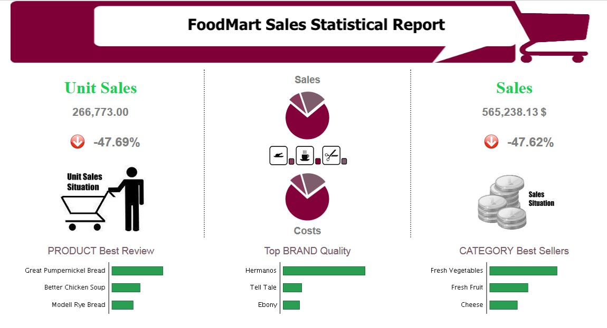

    Example of a BIRT report.

Developing a BIRT report
---------------------------

Firt of all you have to download the Birt report designer from here 'Download Eclipse'_

.. _Download Eclipse: https://download.eclipse.org/birt/downloads/drops/R-R1-4_4_2-201502171805/birt-report-designer-all-in-one-4_4_2-20150217.zip

Here you can find some information about how install and use Birt report designer: 'How  install and use birt'_

.. _How  install and use birt:  https://eclipse.github.io/birt-website/docs/installation

After that you can use the designer to create a new report.

1) create a new **Report Project**

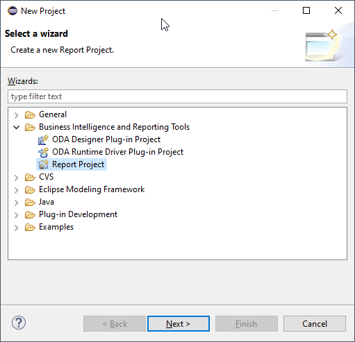

    Create a new Report Project.

2) create a new **Report**

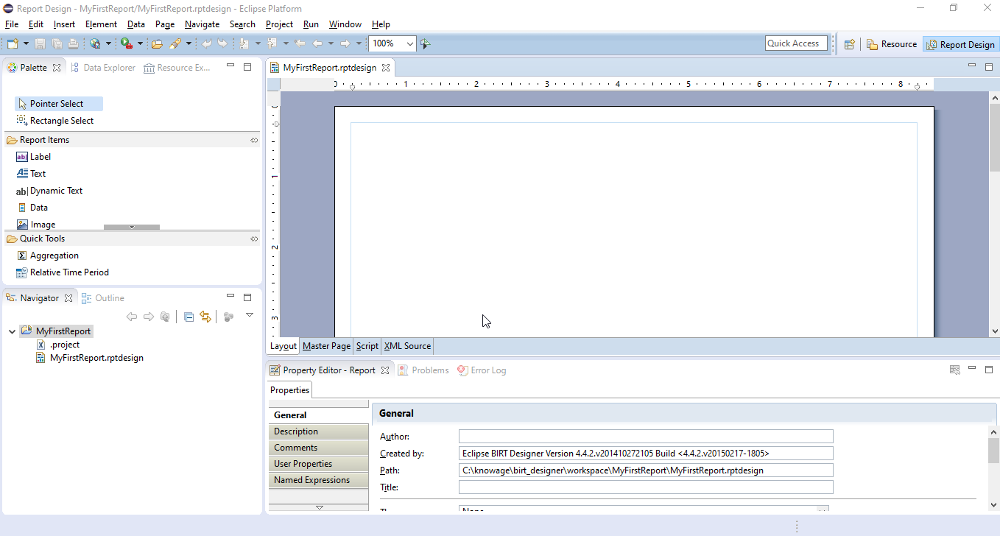

    Create a new Report.

3) Configure che data source, create the data set and design the report

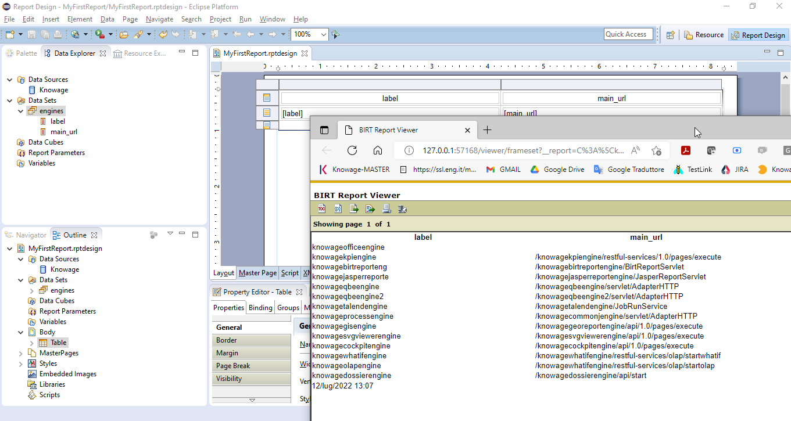

    Design the report

Using the preiew function you can test the report.

Once the document is designed, it is stored as a local file, marked out with an icon and a specific file extension:

-  **.rptdesign:** document template for reports that use the BIRT engine.

4) Deploy on KNOWAGE server
using the KNOWAGE document browser you can install the report in the Server and test it.

In this specific example, we will show how to create a report with an internal dataset. 
First of all, in case of an internal dataset, define a **JDBC Data Source**.

Right click on the **Data Source** item and select the corresponding data source. A pop up editor will open, prompting you the connection settings:

-  **Driver class**
-  **Database URL**
-  **Username** and **password**

Note that these configuration parameters will be used by the birt designer to connect to the database and let the report to be executed locally. Make sure that the database set in the Server share the same schema of that defined in the designer.

Since you are setting a local reference to a database inside the report, remember to set an additional information: this will enable Knowage Server to correctly execute the report, by connecting to the data source referenced within the server and not inside the report. 
Basically you need to tell the server to override the data source configuration. Therefore, add a parameter to the report, called **connectionName**, right-clicking on the "Report Parameters" menu item and selecting "New Parameter". Fill in the form as suggested below.

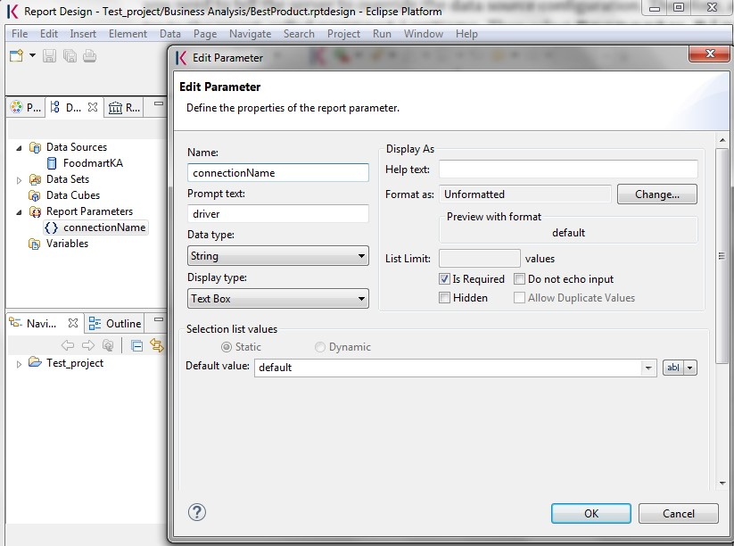

    Adding connectionName Parameter.

Then go to **Property Binding** in the Data Source editor and set the property JNDI URL to the value of the connectionName parameter, as shown below.

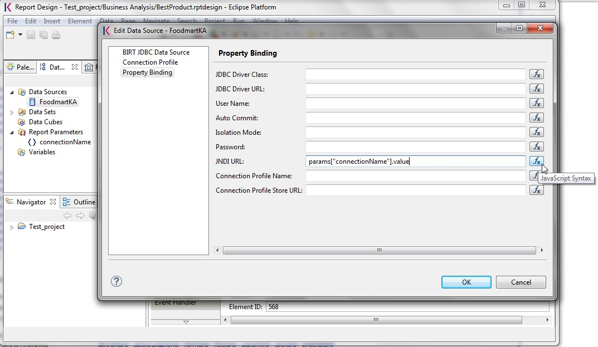

    Setting the connectionName parameter in the Data Source editor 

.. warning::
   
    **JNDI URL**

      Do not forget to define the connectionName parameter in your BIRT report and set the JNDI URL accordingly. Without these                 settings your BIRT report may be unable to access data once it is deployed on the server. In addition, if database and connection       properties change, you need to change the connection properties only in Knowage server.
   
Once the data source has been configured, you can proceed with the creation of a dataset. Therefore, right-click on the **Data Set** item and select **New Data Set**. In the next window, select the data source, the type of query and give a name to the dataset, as exhibited below. The scope of this name is limited to your report, because we are defining an internal dataset.

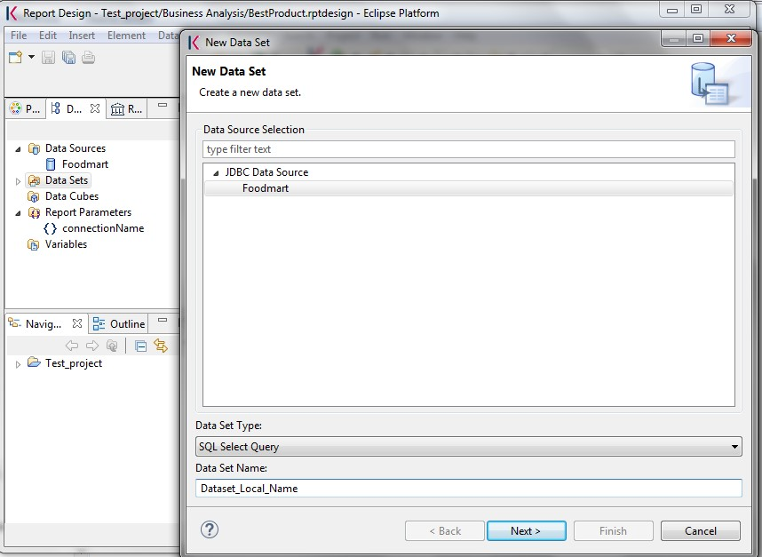

    Dataset definition.

Now you can define your dataset by writing the SQL query in the editor and testing the results (see :numref:`datasetedtwithprw`). At any time, you can modify the dataset by clicking on it, which will re-open the query editor.

Let us design a very simple report, which contains a table showing the data from the defined dataset. The easiest way to create a table from a dataset is to drag & drop the dataset from the tree menu into the editor area.

The most generic way, which applies to all graphical elements, consists in switching to the **Palette** menu on the left panel, keeping the designer in the central panel. Drag and drop the table into the editor area. Consider that this can be done with all other elements listed in the Palette. At this point, you can edit the table (as well as any other graphical element on the report) using the **Property Editor** tab below the editor area.

While developing a report, it is particularly useful to test it regularly. To this end, click on the **Preview** tab below the editor area. To revert back to the editor, just click on the **Layout** tab. In the **Master Page** tab, you can set the dimensions and layout of the report; the **Script** tab supports advanced scripting functionalities; finally, the **XML Source** tab shows the editable source code of your report.

While developing a report, it is particularly useful to test it regularly. To this end, click on the Preview tab below the editor area. To revert back to the editor, just click on the Layout tab. In the Master Page tab, you can set the dimensions and layout of the report; the Script tab supports advanced scripting functionalities; finally, the XML Source tab shows the editable source code of your report.

.. _datasetedtwithprw:
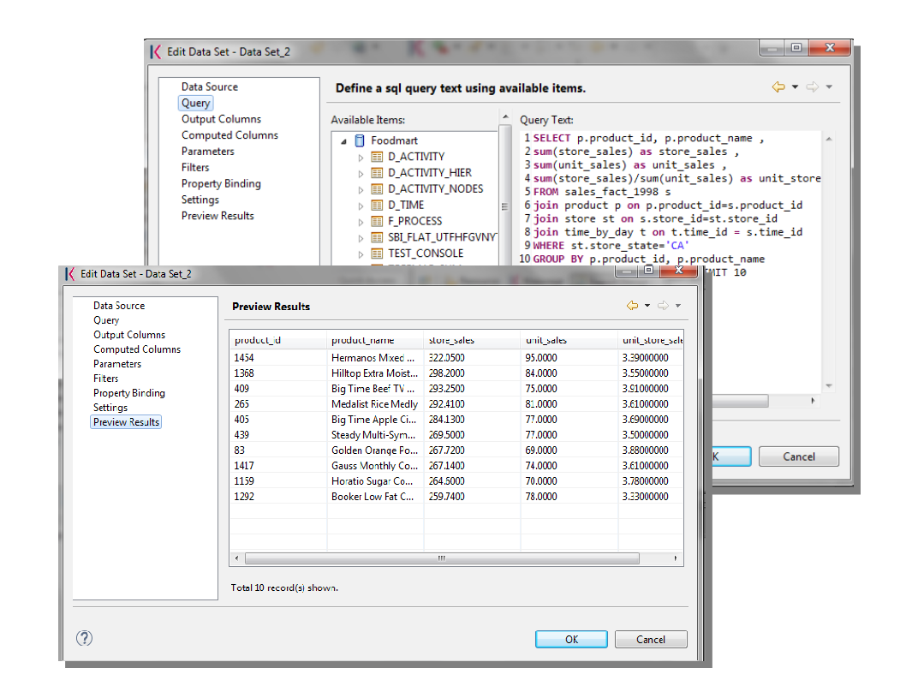

    Dataset editor, with preview.

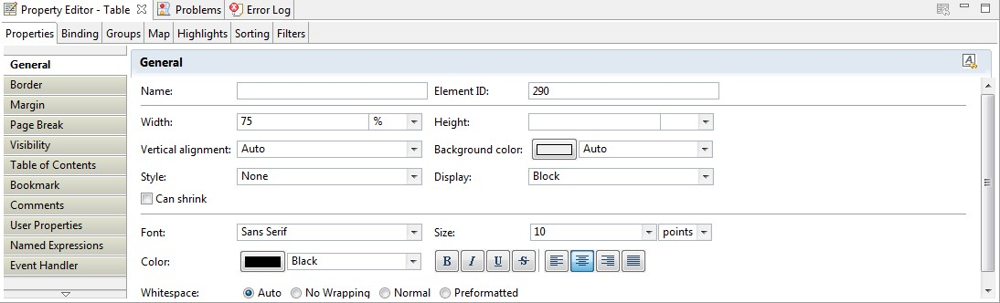

    BIRT Property Editor.

Once your report is done, you can deploy it on Knowage Server.

.. note::
     **Deploy on Knowage Server**
         
         To deploy the report you have to upload the template file directly in the document detail page.

The BIRT report designer allows the creation of complex reports, with different graphical elements such as cross tabs, charts, images and different text areas. In this section we do not provide any details on graphical development but we focus on specific aspects of Knowage BIRT Report Engine.

.. note::
     **BIRT Designer**
         
         For a detailed explanation of report design, pleas refer to BIRT documentation at www.eclipse.org/birt/.

Adding parameters to reports
~~~~~~~~~~~~~~~~~~~~~~~~~~~~

Most times reports show data analysis that depend on variable parameters, such as time, place, type. Birt designer allows to add parameters to a report and link them to analytical drivers defined in Knowage Server.

To use these parameters, you first need to add them to your report. Right-click on **Report Parameters** in the tree panel and select **New Parameter**. Here you can set the data type and choose a name for your parameter.

.. warning::
   
    **Parameters URI**

      Be careful when assigning a name to a parameter inside a report. This name must correspond to the parameters URI when you               deploy the document on Knowage Server.

Once you have defined all parameters, open the (or create a new) dataset. Parameters are identified by a question mark **?** . For each **?** that you insert in your query, you must set the corresponding link in the **Parameters** tab: this will allow parameters substitution at report execution time.

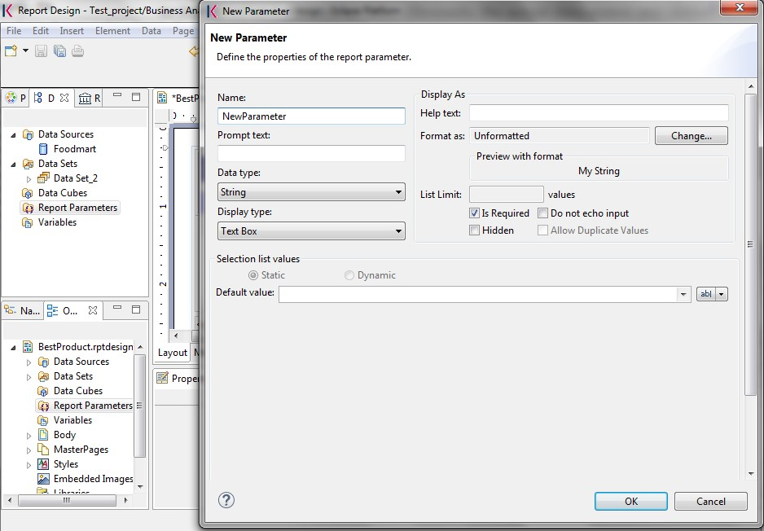

    Creation of a new parameter in a BIRT report.

Note that you must set a link for each question mark as shown below, even if the same parameter occurs multiple times in the same query.

.. _insrtprmintodtsetdef:
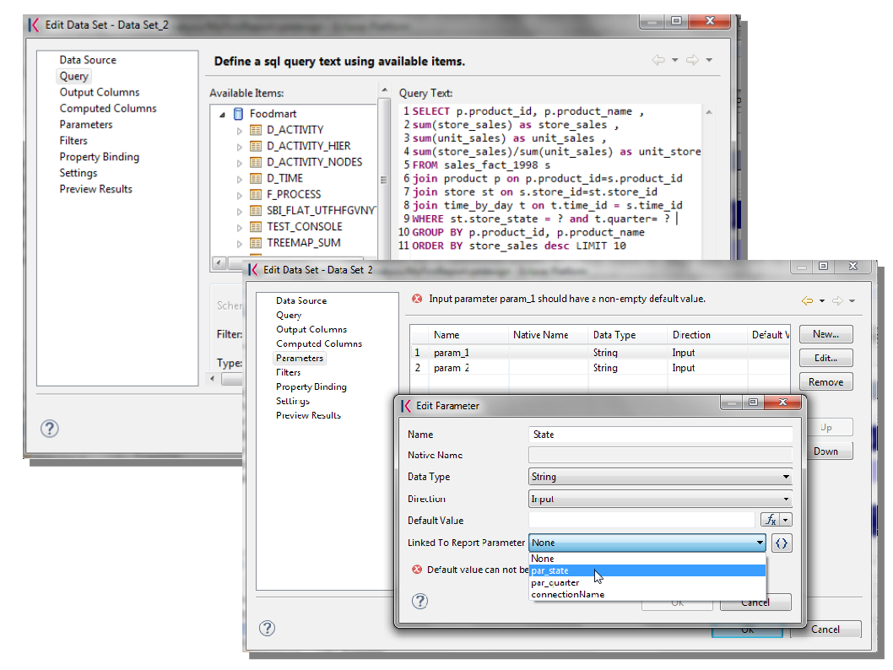

    Insert parameters into the dataset definition.
    
.. warning:: 
       
     **Transfer reports from Birt designer to Server and vice versa**
       
       Any valid BIRT template  can be directly uploaded in Knowage Server using the web interface for document management.

Parameters can also be used within some graphical elements, such as dynamic text, with the following syntax:

.. code-block:: javascript
        :linenos:
        :caption: Parameters syntax
   
            params[name_of_parameter].value

Cross Navigation for BIRT Reports
----------------------------------

A powerful feature of Knowage analytical documents is cross-navigation, i.e., the ability to navigate documents in a browser-like fashion following logical data flows. Although crossnavigation is uniformly provided on all documents executed in Knowage Server, each type of document has its own modality to set the link pointing to another document.

Notice that the pointer can reference any Knowage document, regardless of the source document. For example, a BIRT report can point to another birt report, to a dashboard, a geo or any other analytical document.

It is obviously possible to associate more than one cross navigation to a single document. 
It means that by clicking on different elements of the same document the user can be directed to different documents.

To allow the cross-navigation in a BIRT report, you need to add a hyperlink to the element you want to be clickable using the **Properties** tab of the designer. 
Most report elements can host a hyperlink. For example, let us add a hyperlink to a cell in the table.

Click on the table cell and select the **Hyperlink** item in the **Properties** tab. By clicking on Edit, the hyperlink editor will open and show three input fields:

-  **Location:** write here the URI,
-  **Target:** select Self,
-  **Tool Tip.** write the text you wish to appear on the link, as showed in the following Figure below.

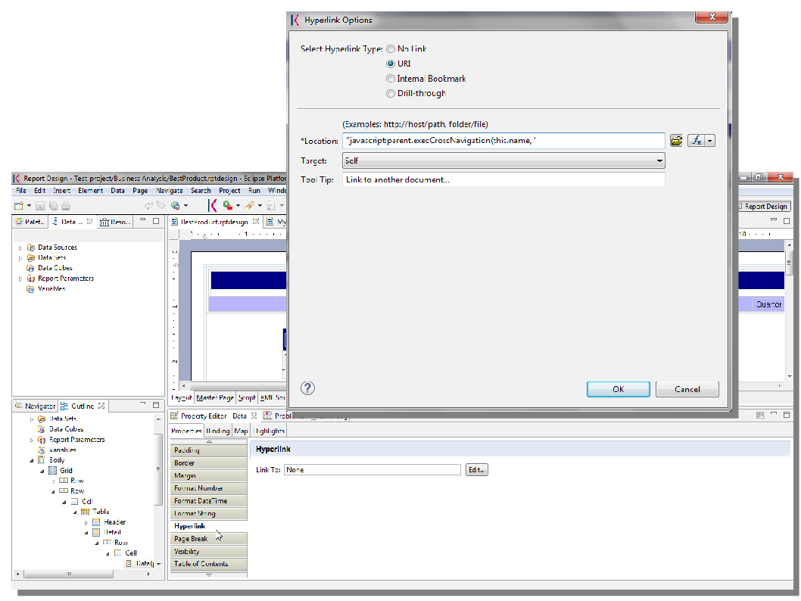

    Hyperlink editor.

To edit the Location, click on the right drop down button and select the JavaScript syntax. This will open BIRT JavaScript editor. Here you must write down the javascript function "javascript:parent.execExternalCrossNavigation" passing JSON arguments like ParName: string, null and string.

In Cross Navigation syntax we give an idea of how the syntax should be like:

.. _crossnavsyntax:
.. code-block:: javascript
      :linenos:
      :caption: Cross Navigation syntax.
   
       "javascript:parent.execExternalCrossNavigation("+         
       "{OUT_PAR:'"+params["par_period"].value+"'"+               
       ",OUT_STRING:'"+string_text+"'"+ 
       ",OUT_NUM:"+numberX+     
       ",OUT_ManualSTRING:'foo'"+    
       ",OUT_ARRAY:['A','B','5']}"+ 
       ",null,"+       
       "'Cross_Navigation_Name');"       

.. warning::
    
    **Type the right cross navigation name**

       It is important to underline that the "Cross_Navigation_Name" of Cross Navigation syntax is the cross navigation name                    related to the document and set using the "Cross Navigation Definition" feature we described in *Analytical Document* Chapter, *Cross Navigation* Section. 
       
It will be necessary to type the right cross navigation name related to the document as defined using the "Tool" settings of Knowage      server and to define those parameters (OUT_PAR, OUT_STRING, etc.) as output parameters in the deployed document on the Server            (see *Analytical Document* Chapter, *Cross Navigation* Section).

Note that the syntax of the string is fixed, while you need to assign values to the parameters that will be passed to the destination document. The JavaScript editor helps you to insert dataset column bindings, as shown in Figure below, and report parameters automatically.

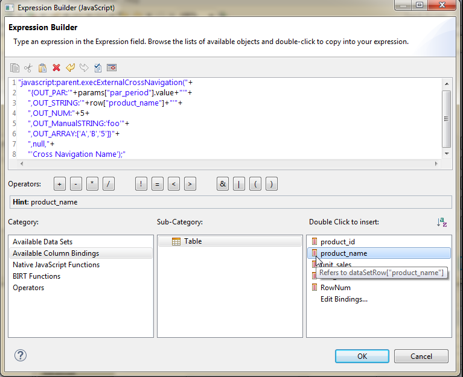

     Column bindings.

To manage multi-value parameters is enough to list all values between brackets separating them with commas, as reported in the code above. More specifically, the array must contain values of the same type. For example:

.. code-block:: javascript
   :linenos:
   
    OUT_SeveralNames:['Michael','Paul','Sophia'] 

or

.. code-block:: javascript
   :linenos:
   
    OUT_SeveralNames:[5,9,31938]

Finally, it is possible to set a sort of "multi"-cross navigation if for example the exit document is related to more than one document through the Cross Navigation Definition. Let suppose that the source document goes to a target document and the name of the navigation is "CrossNav1" and simultaneously the source document goes to a second target document and the name of the navigation is "CrossNav2". If in the JavaScript function of *Cross Navigation syntax* code the "Cross_Navigation_Name" is left empty as in the code below, when the user clicks on the object for which the navigation has been enabled a pop up opens asking for the user to choose between the "CrossNav1" navigation or the "CrossNav2" one. This procedure allows the user to have a more than one possible navigation starting from the same object.
   
.. _crossnavsyntax2:
.. code-block:: javascript
   :linenos:
   :caption: Cross Navigation syntax
   
       "javascript:parent.execExternalCrossNavigation("+                       
       "{OUT_PAR:'"+params["par_period"].value+"'"+                             
       ",OUT_STRING:'"+string_text+"'"+  
       ",OUT_NUM:"+numberX+ 
       ",OUT_ManualSTRING:'foo'"+ 
       ",OUT_ARRAY:['A','B','5']}"+    
       ",null,"+    
       "'');"
 
