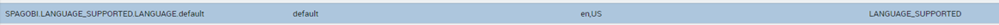

Localization Management
############

Knowage allows to change the *localization* in order to use different languages. We can distinguish two main categories:

-  **System labels**: the labels of the Knowage Graphical User Interface
-  **User labels**: labels created by the user in documents or objects created

The user can change the language to use in Knowage by doing the following:

.. figure:: media/image001_8.1.png

    How to change language in Knowage.

System labels
------------

User labels
------------

BIRT labels
------------
Select the report and set the resource file bundle name in the resources tab of the Property Editor; the default message bundle is *messages*.
The name of the properties file is *messages_* plus the current locale, e.g. for English USA language: *messages_en_US.properties*

.. figure:: media/image002_8.1.png

    BIRT Property Editor - Resources

    BIRT Property Editor - Localization

