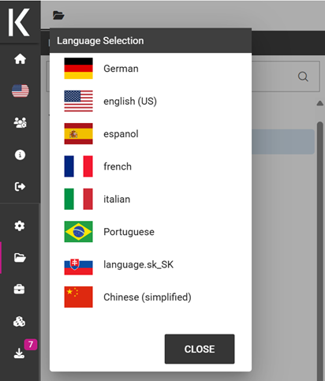
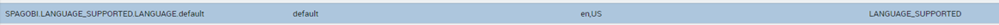
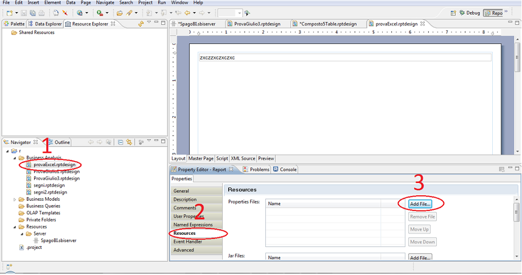
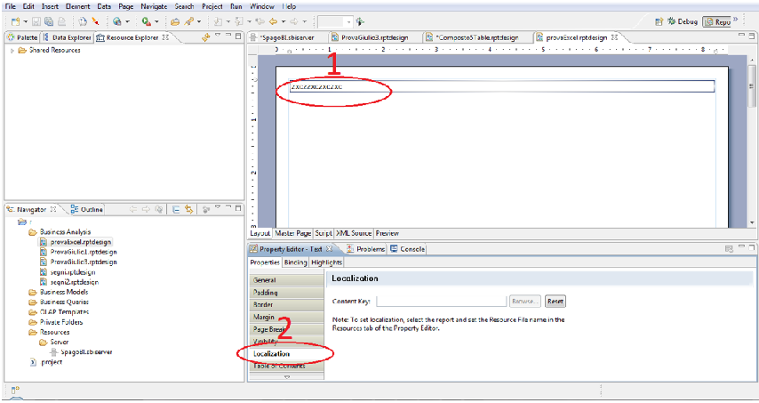

Localization Management
############

Knowage allows to change the *localization* in order to use different languages. We can distinguish two main categories:

-  **System labels**: the labels of the Knowage Graphical User Interface
-  **User labels**: labels created by the user in documents or objects created

The user can change the language to use in Knowage by doing the following:

    How to change language in Knowage.

System labels
------------
It is also possible to change the default language to use the first time the user logs in; to do this the admin needs to:

-  Open the menu and select under Server Settings, Configuration Management
-  Change the property SPAGOBI.LANGUAGE_SUPPORTED.LANGUAGE.default and insert the locale under the column *valueCheck* using the format languageCode, nationalVariety (e.g.: en,US)

The currently supported languages for system labels are:
-  Italian
-  English
-  French
-  Spanish

    Change default language.

It is also possible to translate objects created by the user like:

-  Analytical Driver name shown in the Parameter Panel
-  Name and description of an analytical document
-  Name of a menu entry
-  Name of a dataset shown in the Workspace
-  Name of a business model shown in the Workspace
-  Name of a federation shown in the Workspace
-  Name of a functionality (folder) in the document browser
-  Name of a cross navigation when requested to a final user
-  Inside a dashboard: Title of columns in a table widget and crosstab, title, subtitle, no data message, axis and legend title in the charts

User labels
------------
To set *User labels*:

-  Check the available languages under the Domains configuration in the Admin menu (see the entry with domain code LANG). The ValueCd must have the ISO code of the language (three letters).
-  Inside the knowage metadata database the table SBI_I18N_MESSAGES contains the labels translations.
        -  LANGUAGE_CD: must be the ID of the language from the SBI_DOMAINS table
        -  LABEL: is the label name to be used as placeholder, must begin with i18n
        -  MESSAGE: contains the translated string in that particular language that corresponds to that label
        -  ORGANIZATION: the tenant name

BIRT labels
------------
Select the report and set the resource file bundle name in the resources tab of the Property Editor; the default message bundle is *messages*.
The name of the properties file is *messages_* plus the current locale, e.g. for English USA language: *messages_en_US.properties*

    BIRT Property Editor - Resources

The messages file has a syntax like this for each label, *message_code = internationalised message*
For example: title_code = title of the document

To localize a message in a field within a report template, the user needs to define the code filling the Text key field by clicking on the Localization voice under the field properties tab.

    BIRT Property Editor - Localization

