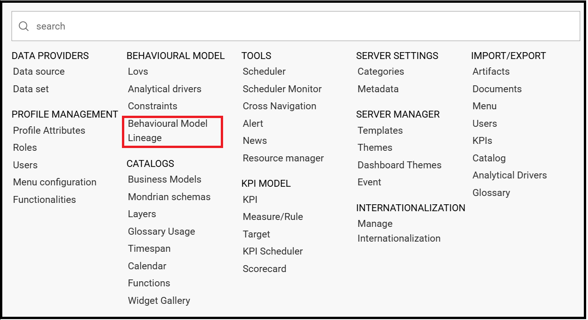
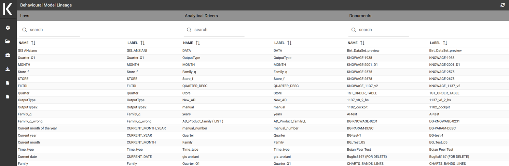

Behavioural Model Lineage
########################################################################################################################

It is possible to show a summary of the links between the LOVs, the analytical driver and the documents by selecting **Behavioural Model** > **Behavioural Model Lineage**.

    Behavioural Model Lineage.

The entire list of available LOVs, analytical driver and documents appears, as shown in figure below.

    List of LOVs, analytical driver and documents.

By selecting one LOV or Analytical Driver or Documents the other will refresh showing only the elements associated with the selection done. To come back to the original situation click the refresh button on the top right corner.
