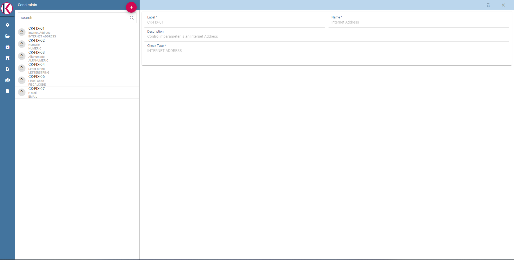

Creating a validation rule
########################################################################################################################

Knowage supports the validation of the document’s input parameters via validation rules. Validation rules can be defined in  **Behavioural model** > **Constraints Management**. A validation rule checks parameter values as given by LOVs to verify that they comply with the defined constraints.

    Contraints Management.

Knowage default checks are:

- **Alfanumeric**: it checks if the parameter is alfanumeric;
- **Numeric**: it checks if the parameter is numeric;
- **Letter String**: it checks if the parameter is a letter string;
- **E-Mail**: it checks if the parameter is an e-mail;
- **Fiscal Code**: it checks if the parameter has the correct syntax of a fiscal code;
- **Internet Address**: it checks if the parameter is an internet address.

.. |image46| image:: media/image45.png
   :width: 30

If the administrator needs to create additional validation rules, he can click on |image46| to open the rule creation interface. Here he  can define a customized validation rule using the available check options:

- **Date**: here you can set a customized format type of date;
- **Regular Expression**: to set a regular expression validation rule;
- **Max/Min Length**: it lets you set the maximum and/or minimum character parameters length;
- **Range**: to set a range the parameters value has to satisfy;
- **Decimal**: to set a maximal decimal places for the parameters.

