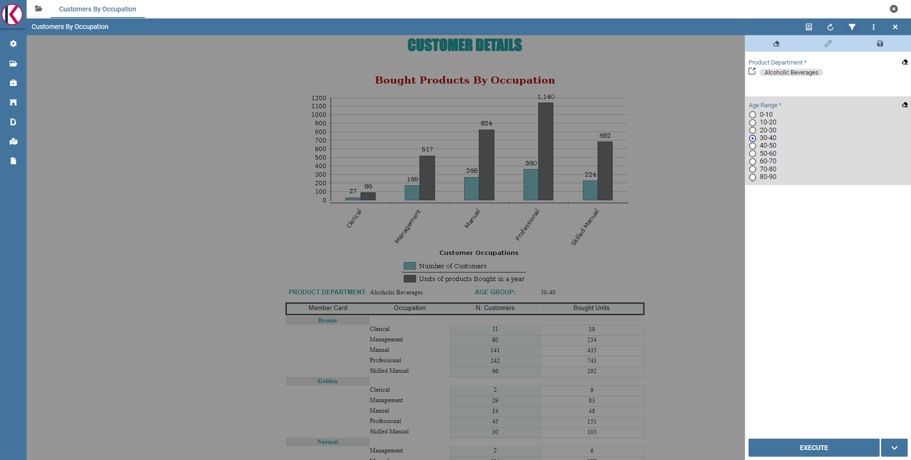

Analitycal Driver
########################################################################################################################

An analytical driver (hereafter simply driver) models a concept or a piece of data frequently used as a distinguishing criterion on the global data context. A driver highlights the concepts guiding the analysis, providing a unique representation of them and describing how they are shown and checked according to the end users’ roles. When connected to analytical documents, a driver produces an explicit or implicit parameter used to filter data.

.. _parametrreportbehav:

    Parametric Report.

The Figure above represents a report with two parameters:

- the Department, a mandatory field, displayed as a lookup and with possible values: Alcoholic Beverages, Baked Goods, Baking Goods and so on;
- the Age Range, a mandatory field, displayed as list of values and with possible values 0-10, 10-20 and so on.

All these aspects are regulated by the analytical driver behind each parameter. In particular, each driver provides many *use modes*, defining:

- Who is involved in a specific use mode, in terms of a list of end user roles, considering that a role can be associated to a single use mode only.
- What data he can access and how they are presented to the end user for his potential selection. This information is provided by the so  called *List of Value (LOV)*.
- How to check the validity of the chosen values. This information is provided by the so called *Check*.

In other terms, each use mode refers to an initial visualization method and content (LOV), to one or more validation rules (check) and to one or more end user roles (roles). The logic of a driver is represented in Figure below.

.. figure:: media/image40.png

    Analytical driver schema.

Let’s consider the following example. We need to represent the concept of “product family”. Since this is a common driver and discriminator for the enterprise analysis, an analytical driver will be coded, with all its behavioural rules, such as:

- if the user is a call center operator or a user that provides internal support, he can manually write the product family he wants to select. This value will be formally verified (it must be a text) and checked on the product family registry.
- if the user is a product brand director or an operative secretary, he can choose the value from a preloaded list of all the product   families belonging to his brand. For this reason, the value does not need any check.

.. figure:: media/image41.png

    Analytical driver schema - Example.

Once defined, a driver can be related to many documents, driving their behaviour and filters in a common way. This way, a user who runs different documents that use the same drivers always receives the same parameter form, applying the same filters over shown data. In fact, when an authenticated user (with its roles and profile) runs an analytical document, its technical metadata are read, mainly in terms of document template and related drivers. Based on them, a customized page for the parameters input is produced, according to the driver logic for the end user role. The selected values are then validated and the final output comes to the user. Next figure shows this process.

Thanks to analytical drivers, a single document is able to cover the analytical demands of various categories of users, with noticeable advantages in terms of:

-  reduction of the number of documents to be developed and maintained,
-  consistency in the request for parameters,
-  complexity reduction in the development of documents, thanks to the separation between security matters and massive development,
-  simple maintenance of the security (visibility over data) over time, despite the increase of developed documents or added engines.

In the next paragraphs we explain how to create a new analytical driver together with its basic components.

.. _overallprocess:
.. figure:: media/image42.png

    Overall process.

