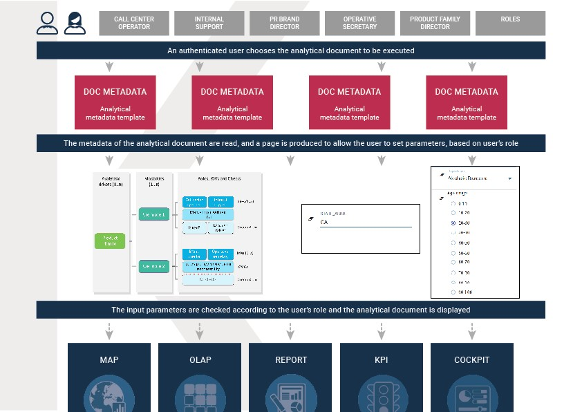
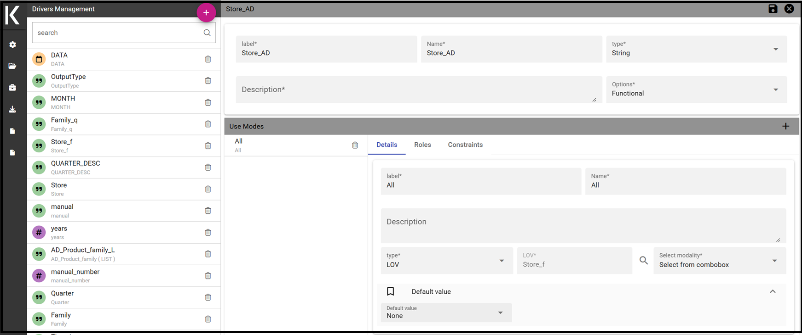
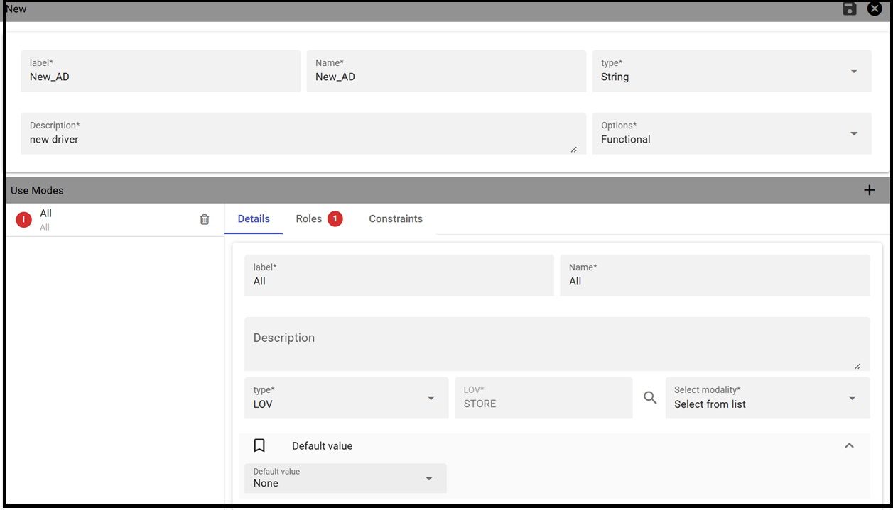
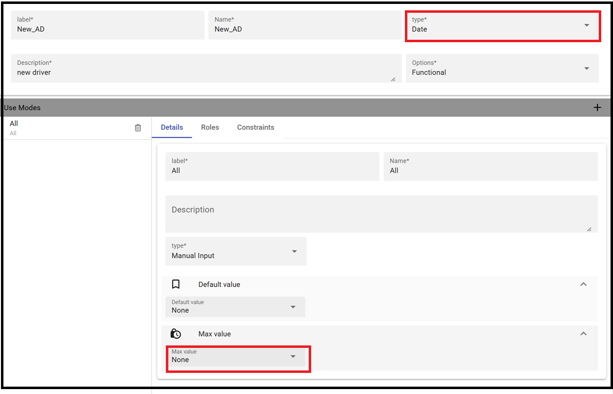
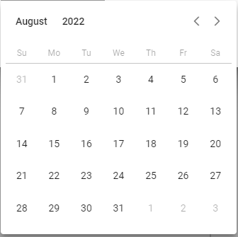

Analytical Driver
########################################################################################################################

An analytical driver (hereafter simply driver or AD) models a concept or a piece of data frequently used as a distinguishing criterion on the global data context. A driver highlights the concepts guiding the analysis, providing a unique representation of them and describing how they are shown and checked according to the end users’ roles. When connected to analytical documents, a driver produces an explicit or implicit parameter used to filter data.

.. _parametrreportbehav:

    Parametric Report.

The Figure above represents a report with two parameters:

- the Department, a mandatory field, displayed as a lookup and with possible values: Alcoholic Beverages, Baked Goods, Baking Goods and so on;
- the Age Range, a mandatory field, displayed as list of values and with possible values 0-10, 10-20 and so on.

All these aspects are regulated by the analytical driver behind each parameter. 
In particular, each driver provides many *use modes*, defining:

- Who is involved in a specific use mode, in terms of a list of end user roles, considering that a role can be associated to a single use mode only.
- What data he can access and how they are presented to the end user for his potential selection. This information is provided by the so  called *List of Value (LOV)*.
- How to check the validity of the chosen values. This information is provided by the so called *Check*.

In other terms, each use mode refers to an initial visualization method and content (LOV), to one or more validation rules (check) and to one or more end user roles (roles). The logic of a driver is represented in Figure below.

    Analytical driver schema.

Let’s consider the following example. We need to represent the concept of “product family”. Since this is a common driver and discriminator for the enterprise analysis, an analytical driver will be coded, with all its behavioural rules, such as:

- if the user is a call center operator or a user that provides internal support, he can manually write the product family he wants to select. This value will be formally verified (it must be a text) and checked on the product family registry.
- if the user is a product brand director or an operative secretary, he can choose the value from a preloaded list of all the product   families belonging to his brand. For this reason, the value does not need any check.

.. figure:: media/image41.png

    Analytical driver schema - Example.

Once defined, a driver can be related to many documents, driving their behaviour and filters in a common way. This way, a user who runs different documents that use the same drivers always receives the same parameter form, applying the same filters over shown data. In fact, when an authenticated user (with its roles and profile) runs an analytical document, its technical metadata are read, mainly in terms of document template and related drivers. Based on them, a customized page for the parameters input is produced, according to the driver logic for the end user role. The selected values are then validated and the final output comes to the user. Next figure shows this process.

Thanks to analytical drivers, a single document is able to cover the analytical demands of various categories of users, with noticeable advantages in terms of:

-  reduction of the number of documents to be developed and maintained,
-  consistency in the request for parameters,
-  complexity reduction in the development of documents, thanks to the separation between security matters and massive development,
-  simple maintenance of the security (visibility over data) over time, despite the increase of developed documents or added engines.

In the next paragraphs we explain how to create a new analytical driver together with its basic components.

.. _overallprocess:

    Overall process.

Creating an analytical driver
~~~~~~~~~~~~~~~~~~~~~~~~~~~~~~~~~~~~~~~~~~~~~~~~~~~~~~~~~~~~~~~~~~~~~~~~~~~~~~~~~~~~~~~~~~~~~~~~~~~~~~~~~~~~~~~~~~~~~~~~

As explained at the beginning of this section, analytical drivers use information about users, their roles and profiles to filter data returned by their associated LOVs. Users, roles and profiles must have been already defined in the project context so that they are available to the driver.

.. _analyticaldrivermanagbehav:

    Analytical Driver Management.

To create a driver, select Behavioural Model > Analytical Drivers Management from the menu. Here, you will see the entire   list of available drivers. For each driver, the list shows unique label, description and type. To explore details the user must just   select one menu item from the list and they will appear in the half right side, as shown in the figure above. Otherwise to delete one analytical driver the user must use the *Trash* icon available at the end of each row of the list. Notice that you cannot delete a driver if a document is currently using it.

To create a new driver, click the *Plus* icon at the top right corner. The driver creation interface will open. At first execution only the upper part of the window is visible, as shown in the figure below. 
The upper part is the **Detail** section, where you can set the label, name and description. Choose the type between Date, String or Number depending on the type of expected data. Select Functional or Temporal if the driver is used by an end user or a scheduler, respectively. A click on the save botton, enabled as soon as the form is filled in, will save the driver and let the section below appear.

.. _drivercrationbehav:
.. figure:: media/image53_b.png

    Creating a new Driver.

In the Analytical Driver Use Mode Details section, one or more LOVs are linked to the current driver, as well as roles and checks are assigned via the so-called *use modes*.

To associate LOVs to the driver, switch to the “Analytical Driver Use Mode Details” tab. Here the user must set label and name of that specific use mode, the kind of input among **LOV input**, **Manual input** and **Map input**, as shown in below.

    Details tab of an AD

The first type allows the user to pick values from a previously defined LOV. When selecting this option the interface spread out the configuration panel where the user is asked to select a LOV from the list and a **Modality**. The latter defines how values are displayed and selectable when executing the document. In fact the user can choose among:

- **Select from list**: all admissible values will be displayed directly within the drivers panel;
- **Select from popup window**: user will be able to select between admissible values by a lookup table displayed within a popup window;
- **Select from tree**: conceived for hierarchical LOVs, lets the users navigate the values in a hierarchical way;
- **Select from combobox**: the driver will look like a drop down menu.

The second kind of input expects the user to type manually the value. Otherwise the third opens a map from which the user must select one or more regions accordingly to the layer property. When selecting this option the interface spread out the configuration panel where the user is asked to choose a layer and the layer property. More details are supplied in next sections for this kind of input.

The user can also add default values (namely values that will be passed to the document at its first execution) using the dedicated area. Here it is possible to pick default values from another LOV or to pick the first or the latter value of the current LOV (if the LOV input type was selected).

In case of Manual Input Date the user can specify a maximum value driven by a LOV:

    Example of a Detail tab of an AD with a maximum value.

During execution of a document, the date picker will be limited by that value:

    Date picker with a maximum value specified.

.. note::
     **Analytical driver of type Manual Input Date with a default value and/or max value**

     In the case you want to use an analytical driver of type Manual Input Date with a particular date as default value and/or a maximum value, you have to use a particular syntax for the LOVs query. See the note *Create a LOV for the default value of an analytical driver of type Manual Input Date* in the section *Creating a List Of Value* for more details.

.. note::
     **Analytical driver with hierarchical LOV and default LOV**

     In the case you want to use an analytical driver with a hierarchical LOV and a default LOV the latter need to be hierarchical too. For more details see *Create a LOV for the default value of an analytical driver with a hierarchical LOV* note in the section *Creating a List Of Value*.

At the bottom of the page the user must associate roles to the “use mode”. This action is mandatory. The user connects the user’s roles that he/she wants to be allowed to see a certain list of values or certain regions or be able to type values at his/her convenience.

Therefore, since an admin user can decide to separate values according to the other users’ roles, the analytical driver definition allows to configure different use mode. We can also set validation checks if needed. Then it is sufficient to save each use mode and click on **new use mode** to set a new one. We repeat the same procedure for all the use modes. Each use mode is represented in a separate tab. We will go deeper into this at the end of the section.

All the selections can be multi-valued, but note that this option has to be set directly on the document detail during analytical driver
association.

    The Roles tab of an AD.

After completing the mandatory information requested in the tabs Detail and Roles it will be possible to save the new Analytical Driver.

Analytical driver’s use modes
~~~~~~~~~~~~~~~~~~~~~~~~~~~~~~~~~~~~~~~~~~~~~~~~~~~~~~~~~~~~~~~~~~~~~~~~~~~~~~~~~~~~~~~~~~~~~~~~~~~~~~~~~~~~~~~~~~~~~~~~

Sometimes the same analytical driver (i.e., the same concept, like the concept of product brand) should display different values according to the user that is executing it.

Suppose you have a report on sales and costs like the one in the first figure of this chapter and you want to add to it the possibility to filter also on product brands. If you load the report as the general manager, you should choose between all the possible product brands in the corresponding parameter. If instead you load it as, for instance, the food manager, then you should be able to filter only on product brands related to the Food family.

In order to do this, let us focus again on the definition of the LOV and check that the already defined use mode ``All Brands`` is associated to the correct role ``general_manager``. Here you can add a second tab, called for instance ``Profiled_Brands``, and associate it to the role ``product_manager``. This is because the food manager user has ``product_manager`` role with profile attribute ``pr_family = Food``.

Finally, we choose the second LOV created, the one returning only those brands that belong to a specific family (see the code example in section Parametrizing LOVs). The family is selected by checking the value of the family attribute in the user profile.

Notice that here you can also choose a different type of display mode for the LOV. In other terms, different use modes correspond not only to different LOVs, but also to (possibly) different display mode (pop-up windows, combobox, ...). For instance, you can select a combobox display mode for the All Brands use mode and the pop up window display mode for the Profiled_Brands use mode.

Once you have saved the LOV, just log out from Knowage and log in with a different user role, i.e. as a general manager, food manager and drink manager. Executing your report on sales and costs you can now notice the differences on the values and on the display mode of the Product Brand parameters according to the different users. Notice that, for food manager and drink manager, the parameters are always displayed as a pop-up window, while for the general manager also the display mode of the parameter varies.

    Behavioural Model Schema.