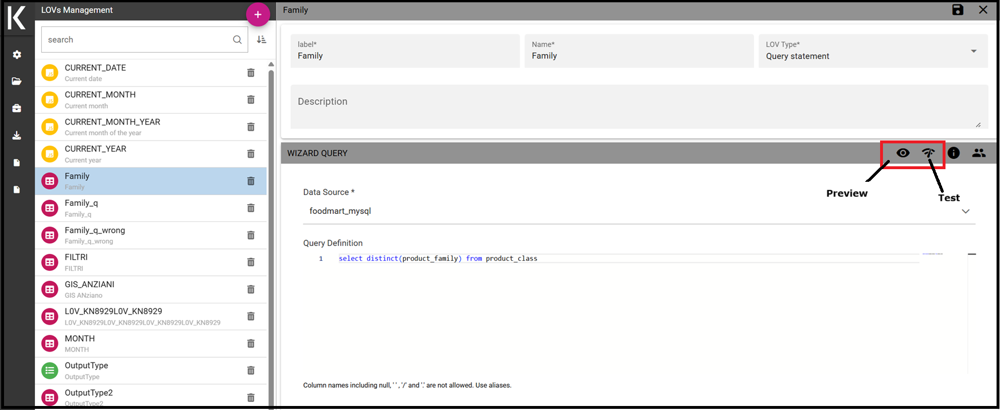
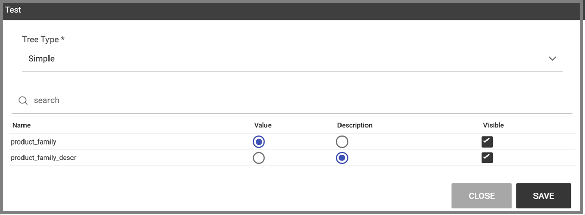

List Of Value
########################################################################################################################

A *List Of Value* (LOV), is a collection of data organized in attribute-value fashion. For example, the LOV in LOV example retrieves id, name and food family for a product.

.. code-block:: bash
   :caption: LOV example
   :linenos:

    {195, High Top Almonds, Food};
    {522, Tell Tale Walnuts, Food};
    {844, Very Good Soda, Drink};

There may be multiple attributes in a LOV, but only one of them is the core value that is actually used in the analytical driver. Other  values have a descriptive function: they can be used to provide a human readable description of the LOV, as well as to store information used, for example, to correlate analytical drivers. In our example, the core value is the customer’s id, while the others are additional data describing the customer. 

    LOVs functionality from Knowage menu.

Knowage allows to create different types of LOV:

-  **Query**: SQL query to retrieve values from the database;
-  **Script**: Groovy or JavaScript to dynamically return values;
-  **List of fixed values**: Values are defined statically at LOV creation time;
-  **Java objects**: External object invoked by name that returns the list of values;
- **Dataset**: Dataset already defined in Knowage Server that is used to retrieve values. Note that the dataset must not contain parameters, while profile attributes are allowed.

.. _lovlistbehav:

    List of LOV.

To create and manage LOVs, select **Behavioural Model** > **Lovs Management** from the administration menu. The entire list of available   LOVs appears, as shown in figure above. 
For each LOV, the list shows the label, description and type; to see the details of a LOV the user  must simply select it and they will appear in the right half of the page. On the contrary, to delete one dataset click on the *Trash* icon available at the end of the row. Notice that you cannot delete a LOV if a driver is currently using it.

.. |image37| image:: media/image44.png
   :width: 30

To create a new LOV, click the * Plus* icon at the top right corner of the page. 
The LOV creation interface will open, where you   can set label, name and description, choose the LOV type and define its values accordingly.

.. |image38| image:: media/image45.png
   :width: 30

    Creating a LOV.

Once completed the form, click on **Preview** icon to see the results of your query and then on the **Test** icon.
Notice that you cannot save the LOV without testing  it, since this allows to detect errors before the LOV is actually used in a driver and associated to a document. 
By testing the LOV, you will be able to define which column is the actual value of the LOV, i.e. which value will be passed to the analytical driver using this LOV. 
Only *one* column can be the value attribute and only *one* column can be chosen as Descriptive attribute, while the others can be visible. The two figures below exhibit an example. Columns that are not visible can be used for correlating drivers.

.. _previewandteslov1:

    Preview and Test of the LOV.

.. _previewandteslov2:

    Test of the LOV.

.. note::
     **Correlating analytical drivers**

     Drivers can be correlated so that the value of the first driver is used as a parameter to select values in the second. Read more at *Analytical document* chapter.

We stress that the visibility of specific fields serve to improved human readability when applying filters to documents handled by third users. Moreover it is possible to choose (refer to next figure) between **simple**, **tree** and **tree with selectable internal nodes** typology of LOV. The last two are hierarchical and let the user visualize the parameters together with their logical tree structure.

.. _hierarchicallvdef:

    Hierarchical LOV definition.

.. note::
     **Create a LOV for the default value of an analytical driver of type Manual Input Date**

     This note is useful when using an analytical driver of type Date with an input of type Manual. In the case you want to use a particular date as default value for that driver, you have to use this syntax for the LOV: select '2017-09-10#yyyy-MM-dd' as fixed_date. Instead of the fixed date 2017-09-10 you can also use as default date the today date for example; in this case you can use a query of this type: select concat(to_date(now()) ,'#yyyy-MM-dd') as today. The most important thing is to concat to the default date you want to use the string #yyyy-MM-dd.

.. note::
    **Create a LOV for the default value of an analytical driver with a hierarchical LOV**

    In case you want to add a default value to an analytical driver with an input of type hierarchical LOV you need to use another hierarchical LOV with the default values desired. If the analytical driver LOV is of type *Tree* then the default LOV need to be of type *Tree* too. The LOV need to have values for the leaf level only. Otherwise, if the analytical driver LOV is of type *Tree selectable inner nodes* the default LOV need to be of the same type. The default LOV may have values for one of the level used in the hierarchical LOV. For example, suppose you have an analytical driver with a hierarchical LOV having levels Product Family > Product Category > Product Department. If the hierarchical LOV is of type *Tree* then in the deafult LOV you need to insert one or more values for the level Product Department. Your default LOV have one level, the Product Department. In case the LOV is of type *Tree selectable inner nodes* you can choose one of the three levels. Your default LOV have one level between Product Family, Product Category or Product Department.

Parametrizing LOVs
~~~~~~~~~~~~~~~~~~~~~~~~~~~~~~~~~~~~~~~~~~~~~~~~~~~~~~~~~~~~~~~~~~~~~~~~~~~~~~~~~~~~~~~~~~~~~~~~~~~~~~~~~~~~~~~~~~~~~~~~

Suppose that you need to retrieve a list of values representing all brand names of your products. Then you can use a Query LOV like in  Query LOV example:

.. code-block:: sql
         :caption: Query LOV example
         :linenos:

          SELECT DISTINCT PRODUCT_FAMILY, BRAND_NAME
          FROM PRODUCT

This is suitable for end users like the general manager who need to see all brands for every product family. Suppose now that another end user is, for example, the food manager. He should not see every brand name, but only those related to the Food product family. This could be done using user’s profile attributes.

In particular, all query except the ``List of fixed values`` type can be parameterized using profile attributes. This means that, at LOV execution time, the value of the attribute in the user’s profile is assigned to a placeholder in the LOV query/script. Suppose that, in our example, the food manager user has the profile attribute ``pr_family`` equal to ``Food``. You can write this second Query LOV using the placeholder with the standard syntax ``${profile_attribute_name}``, as shown in Parametric query.

.. code-block:: sql
         :caption: Parametric query
         :linenos:

           SELECT DISTINCT PRODUCT_FAMILY, BRAND_NAME
           FROM PRODUCT
           WHERE C.PRODUCT_FAMILY = '${pr_family}'

Then, at LOV execution time, for the user food manager the query becomes as shown in Runtime placeholder substitute and hence the corresponding LOV will return only the brand names related to the Food product family.

.. code-block:: sql
         :caption: Runtime placeholder substitute
         :linenos:

          SELECT DISTINCT PRODUCT_FAMILY, BRAND_NAME
          FROM PRODUCT
          WHERE C.PRODUCT_FAMILY = 'Food'

This means that if you are the food manager and your user has the profile attribute ``pr_family=Food``, then you will see only the brand related to the food family as a result of this LOV; while if you are the drink manager and your user has consequently the profile   attribute pr_family=Drink, you will see only the brand related to drink family products.

.. note::
     **Standard profile attributes**

     There are some standard profile attributes always available that don't' need to be defined for each user. These profile attributes are:

     - *user_id* contains the user id of the logged in user
     - *user_roles* contains the current user's roles, joined as a SQL IN clause fashion, for example: 'general_management','human_resources_management'
     - *TENANT_ID* contains the tenant to which the user belongs

Note that an information button and a profile attribute button are available to guide user in writing the code properly, using the   syntax correctly and typing the right profile attribute name.

    Assistance in retrieving syntax and profile attributes.

