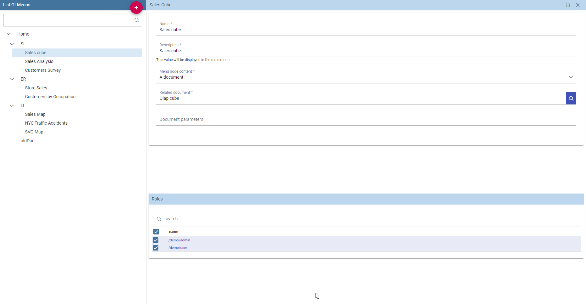
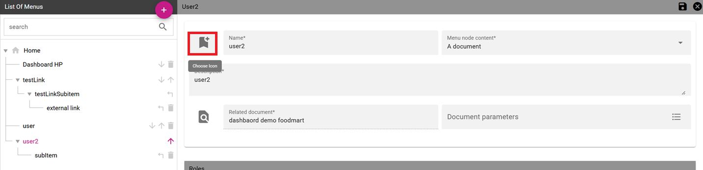
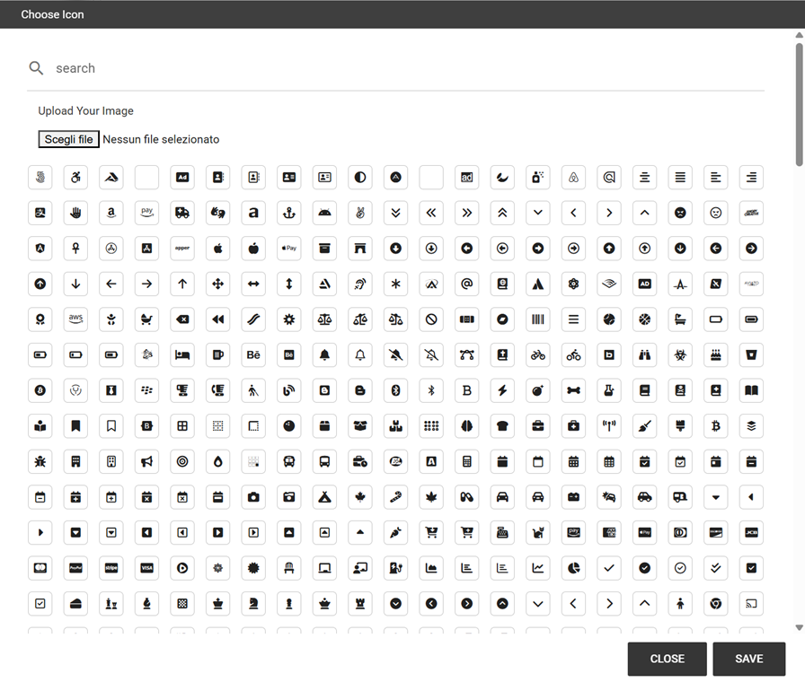
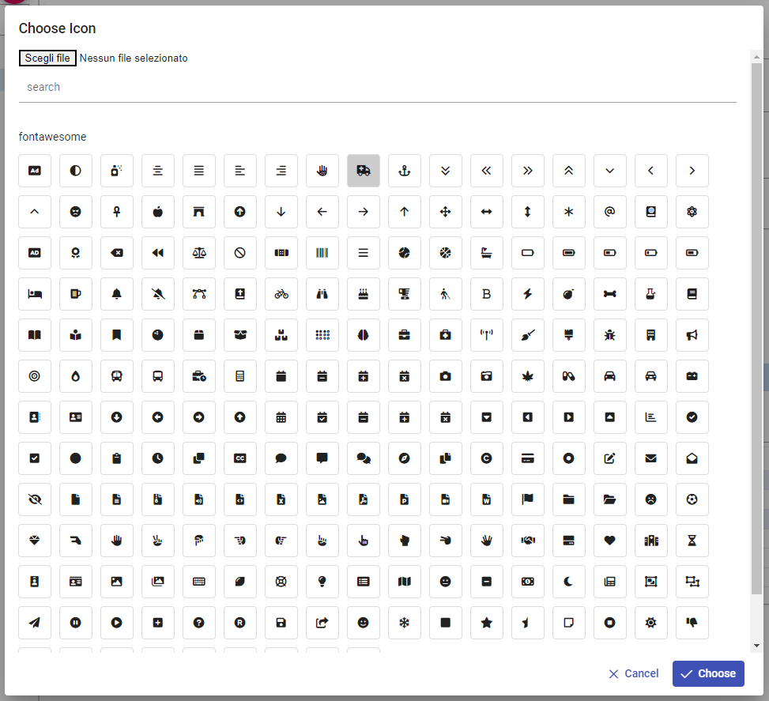
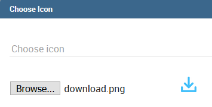
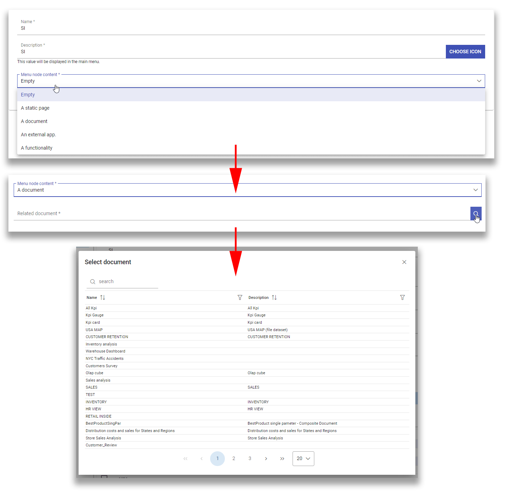
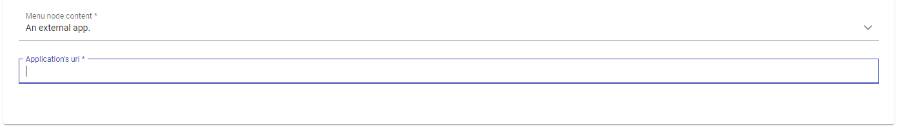

Menu management
#############

Menu configuration
-------------------

Knowage allows the definition of a menu for the end user. This menu will be displayed in the left bar of Knowage homepage, under the Knowage icon. It is possible to associate to each node a static page, a document, a functionality (as a folder) or nothing (empty node). Every node can be associated to different roles. This menu structure can be created and modified exclusively by the administrator in the **Tools** area. To access the Menu configuration area, go to **Profile Management** > **Menu Configuration** from the Main Menu.

It sufficient to click on the “Plus” of the Menu Configuration page to add a new folder to the **Menu Tree**. When selecting one node of the tree and clicking on the “Plus” icon, the user can add a new folder as a child of the former one.

   Menu tree actions.

In general you can:

-  define a name: the name is a mandatory field and has to be unique;
-  define a description: the description is a mandatory field and it is displayed in the main menu;
-  choose an icon to associate to the menu and to be shown in the main menu;
-  define the content of the menu item;
-  choose the roles eligible to see that particular menu item. Only users associated with the selected roles will see this menu item.

Observe that when one inserts a menu item as a child, this will inherit the general details of a menu node.

Setting menu icon
~~~~~~~~~~~~~~~~~

Creating a menu, you can choose an icon to be shown in the main menu. **This feature is available only for first level menu**.

   Menu choose icon feature

To associate an icon to the menu, click on "*CHOOSE ICON*" and then you can:

-  choose icon from the predefined icons included in Knowage;
-  upload a new file containing a custom icon (*File type allowed are .ico, .svg, .png and the maximum size allowed is 50 KB*).

To remove the menu icon, click on the trash basket.

Dialog shown in figure below allows you to select an icon or click on "Browse..." to choose the image on your pc and upload it. After choose is completed, click on "*CHOOSE*" button to apply the changes. If no errors occurred, you'll come back to menu configuration and see the icon you choose. If you want to filter predefined icons, you can start writing in the text field on the top of the dialog.

   Menu choose icon dialog

If you decide to choose a predefined icon, select it click on "CHOOSE" to apply the changes.

   Menu choose selected icon

If you decide to upload a new image, click on "*Browse...*" and select your file. After that, the icon will be displayed as in the image below. Click on "*CHOOSE*" and apply the changes.

   Menu choose uploaded icon

There are four types of menu item content: empty, document, static page and functionality.

   **Empty** (left) and **document** (right) content type.

The **empty** content type corresponds to a blank page, and it is typically chosen for father nodes.

The **document** content type runs directly a document. For this type you have to choose a related document through the
lookup button and define the list of parameters in the standard URL (i.e.: ``par1=val1&par2=val2&...``). You can also choose to hide the toolbar or the slider panel.

The **static page** content type shows a static HTML page. In this case, the administrator must define the static page that he wants to load. The HTML page combo is loaded with all HTML pages found in a folder called **static-menu** that must be located under the path defined in the system variable called ``knowage_resource_path``.

Finally, the **external application** content type, see Figure below, runs a URL address.

   External application content type.

