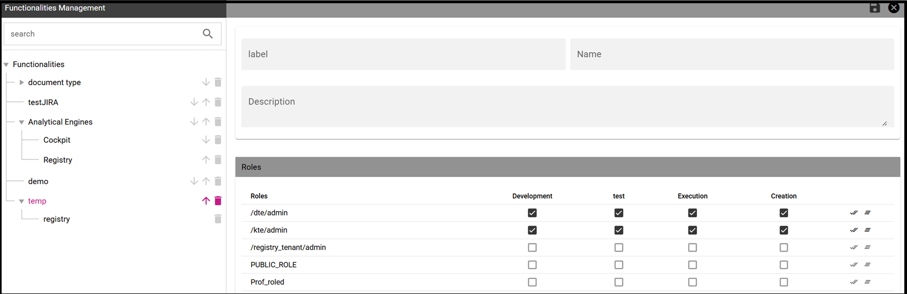

Repository Management
########################################################################################################################

Repository structure and rights
------------------------------------------------------------------------------------------------------------------------

Knowage adopts a virtual folder structure to organize analytical documents in hierarchies and folders. This structure is called the Functionalities tree and is accessible via **Profile Management** > **Functionalities management**.

There are two main reasons for organizing documents into folders and hierarchies: to facilitate their search and accessibility, and to effectively manage visibility on documents according to user roles.

By default *permissions are set at folder level*. This guarantees that a user can not see anything outside that folder (unless he has permissions on other folders as well). It is also possible to further restrict the visibility scope of a user by associating rights to specific values of the profile attributes.

Besides visibility limitations inherited by the containing folders, the developer can add further restrictions to a single document.

To create a new folder, select **Profile Management** > **Functionalities Management**. The functionality tree is shown. Clicking on an item you can select one of the following options:

-  Insert: to add a new child to the tree. Select this to create a new folder and go to the next step.
-  Detail: to see details of an item.
-  Erase: to delete an item. This option is available only if the folder does not have any children nodes in the tree.
-  Move up: to move the item up into the hierarchy.
-  Move down: to move the item down into the hierarchy.

Once you select **Insert**, the functionality details opens.

.. _createnewfolder:

   Create a new folder and assign permissions.

Enter a label and name for the new folder (functionality). In the table, assign permissions to roles.
There are four types of permission:

-  **Development**: to create, edit and delete analytical documents;
-  **Test**: to execute the document and modify its status from test to released;
-  **Execution**: to execute the document;
-  **Creation**: to create ad-hoc reporting documents like worksheets and cockpits (for the end user).

To assign permissions to roles, check the related boxes. Each user with that role will have permissions on that folder, except in case of specific restrictions on the single document.

      .. warning::
         **Permission Inheritance**
            A subfolder inherits the permissions assigned to the parent folder. While it is possible to further restrict inherited permissions, the opposite is not allowed: rights cannot be extended going down the hierarchy.
