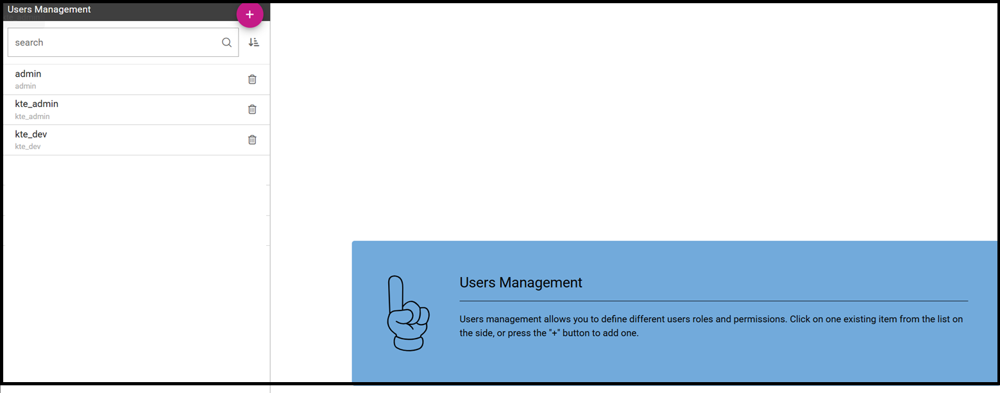

User profile and roles
########################################################################################################################

Knowage users are defined by:

- identities,
- roles,
- profiles.

The *identity* of a user consists of a set of data used to identify that user, i.e., a username and a password, as well as a human readable full name.

The *profile* of a user consists of a set of properties called attributes, describing general information about the user, e.g., age and gender, but also domain-specific properties, such as the organizational unit to which he belongs. Some attributes, such as name and email, are defined by default in Knowage. Others can be added by the model administrator, as explained in the following sections.

The *role* of a user represents a categorization of a group of users. These roles may correspond to specific positions in the company, e.g., “general manager” or a “sales director”, or to a position with respect to the BI project, e.g., “data administrator” and “BI developer”. Different users may have the same role, as well as the same user may have multiple roles.

You will not have grants to create new roles or users, but you are asked to match them during document profilation phases. In the following we are going to describe the elements needed for adding parameters. This elements involves profilation too. To conclude we will see how to manage accessibility while creating a document.

.. _knowageroletype:
.. table:: Knowage Role Types.
    :widths: auto

    +-----------------------+-----------------------+-----------------------+
    |    Role Type          | Description           | Standard User         |
    +=======================+=======================+=======================+
    |    ADMIN              | General               | biadmin               |
    |                       | administrator.        |                       |
    |                       |                       |                       |
    |                       | Manages all Knowage   |                       |
    |                       | functionalities.      |                       |
    +-----------------------+-----------------------+-----------------------+
    |    MODEL_ADMIN        | Model administrator.  | bimodel               |
    |                       |                       |                       |
    |                       | Manages the           |                       |
    |                       | Behavioural Model and |                       |
    |                       | its associated        |                       |
    |                       | functionalities.      |                       |
    +-----------------------+-----------------------+-----------------------+
    |    DEV_ROLE           | Developer.            | bidev                 |
    |                       |                       |                       |
    |                       | Creates and modifies  |                       |
    |                       | datasets and          |                       |
    |                       | documents.            |                       |
    +-----------------------+-----------------------+-----------------------+
    |    TEST_ROLE          | Test user.            | bitest                |
    |                       |                       |                       |
    |                       | Tests analytical      |                       |
    |                       | documents.            |                       |
    +-----------------------+-----------------------+-----------------------+
    |    USER               | End user.             | biuser                |
    |                       |                       |                       |
    |                       | Executes documents    |                       |
    |                       | visible to him and    |                       |
    |                       | creates ad-hoc        |                       |
    |                       | reporting analysis.   |                       |
    +-----------------------+-----------------------+-----------------------+

Knowage allows you to create several roles, according to your project needs. However, all roles must belong to a specific *role type*. A role type is a higher-level categorization used by Knowage, in order to map roles for the different features of the suite.

Pre-defined roles are summarized in the Table 5.1. The first four roles are technical roles, while the last one, the user, is the actual end user. Each role type has a default user associated to it. Other users can be created and associated to a role type.

When a user logs in into Knowage, his profile is automatically loaded. The full name is visible by clicking on the info button at the bottom left corner of the page.

Authentication can be handled internally by Knowage or delegated to an external Single Sign On (SSO) system.

   .. hint::
      **Authentication Management**:
         The choice of handling authentication internally or delegating it to an external SSO system typically depends on the presence of an authentication system already in place. If this is the case, Knowage can seamlessly integrate with the existing authentication infrastructure.

Once the user has logged in, his role is loaded. Roles are managed internally. In case the user is associated with multiple roles, he will be asked to choose one.

Alternatively, from the Knowage Administrator menu, he can select a default role that will be kept valid until he logs out.

   User roles in Knowage.

Steps to follow in the definition of a behavioural model:

-  Create profile attributes;
-  Create roles;
-  Create users and associate profile attribute values and roles to them.

Knowage supports the management of user profiles and roles through the **Profile Management** menu section. This menu is only visible to Knowage administrator and to the model administrator, since users and roles management is a critical operation that requires an appropriate level of responsibility.

The **Profile Management** menu section contains three sub-menu items:

-  **Profile Attributes**: to define new profile attributes and manage the existing ones.

-  **Roles**: to create new roles and manage permissions for each role.

-  **Users**: to create users, manage their identities, assign values to their profile attributes and associate them with roles.

In the following, we show how the model administrator can define user profiles and roles using these functionalities. Remember that Knowage profile management can also be integrated with external profiling systems.

Clicking on **Profile Attributes**, the list of currently defined attributes is shown. To add a new attribute, click on the **Plus icon**: a new row is added to the list, where you can insert the Name, the Description and the Data type. To delete an attribute, select the corresponding row and click on the **Delete** icon.

Attributes defined in this section will be available to all user profiles. It is not mandatory to assign a value to each attribute for each user, since profile attributes without values will not be considered in the definition of the user profile.

In addition to the profile attributes created by administrator, by default Knowage provides the following profile attributes:

-   **user_id**: set with the user unique identifier;

-   **user_roles**: set with user roles selected from the ROLES tab in Users Management menu;

-   **TENANT_ID**: set with the tenant unique identifier;

-   **user_session_roles**: set like *user_roles* attribute, if no default role is set. Set with default role selected, otherwise.

-   **language**: set with the language selected by the user

The image below, shows a new *Profile attribute* named *Country* manually fed. The alternative option to feed the attribute is by means of a Lov, from where a value is going to be picked up when assigning the attribute to a user. Multivalue option in this case is not enabled, so only one value is inserted.

   Profile attributes Management.

Once the attributes are defined, the model administrator can define roles, using the **Roles** functionality. The role management tool is two-sided: on the left you can see the list of already defined roles. At the beginning of a project, only default roles are visible. To add a new role, click the **Plus** icon and move to the right panel. To delete a role, simply click on the **Delete** icon available for that role once saved.

   .. hint::
      **Role Management**:
         The behavioural model should be built taking into account the specificity of each organization and the needs of the BI project.    Therefore, it is a good practice to define specific roles for the BI project and avoid using Knowage technical roles only.

The right panel contains the following tabs. 
The **Detail** tab allows the administrator to define role name and role type (mandatory). The role type regulates the visibility of that role based on the types already described. A code and a description can be added too, as shown below.

.. figure:: media/image3031_bis.png

   Roles Management.

The **Authorizations** tab allows you to assign permissions to each role. Rights are predefined and grouped into categories, as shown above.

The **Business Models**, **Data sets** and **KPI Categories** tabs are intended to assign specific categories to each role, in a way that each user can only see the business models, datasets or KPI that belong to the categories associated with his role.

The **Business Models** tab is only available for modules KnowageBD and KnowageSI, while the **KPI Categories** tab is only available for KnowagePM. More details on business models and KPIs can be found in the corresponding chapters.

------------------------------------------------------------------------------------------------------------------------
User Management
------------------------------------------------------------------------------------------------------------------------

The **User Management** section includes a left panel that allows the administrator to create and delete users, and a right panel that allows the management of user details, roles and attributes.

   Users Management.

User unlock
^^^^^^^^^^^^^^^^^^^^^^^^^^^^^^^^^^^^^^^^^^^^^^^^^^^^^^^^^^^^^^^^^^^^^^^^^^^^^^^^^^^^^^^^^^^^^^^^^^^^^^^^^^^^^^^^^^^^^^^^

If user reaches the maximum number of failed login attempts (editable in advanced configurations), it will be blocked by Knowage and access will be denied. By accessing Knowage with a user having user management privileges, the blocked user will be displayed with a red warning sign and it will be possible to unlock it using the "unlock user" button. After that, the user will be able to log in using the latest set of credentials.

.. figure:: media/image115.png

    Users Management - Roles settings example

Roles settings
^^^^^^^^^^^^^^^^^^^^^^^^^^^^^^^^^^^^^^^^^^^^^^^^^^^^^^^^^^^^^^^^^^^^^^^^^^^^^^^^^^^^^^^^^^^^^^^^^^^^^^^^^^^^^^^^^^^^^^^^

Clicking on the ROLES tab you have to select one o more roles to associate with the user.
After that, if more than one role is associated to the user, you can choose the default role by selecting it from the combo box on the top of the page.

Default role is optional: if you don't select a default role, at login time all the available roles for the user will be loaded. If you select a role, at login time
it will be the session role selected.

    Users Management - Roles settings example

In the example above, for the user "*Prep_admin*" you can choose from "admin" and "*kte_admin*" as default role.

You can also assign an attribute profile to a user. In this case it is enough to valorize the attribute that you want to assign.
The below image, shows an example. The attribute *Country* formerly created as a *Profile attribute* has been assigned to the user kte_admin.
The image shows that some other attributes are available but they are not considered as they remain empty.

    Users Management - Attributes settings example
