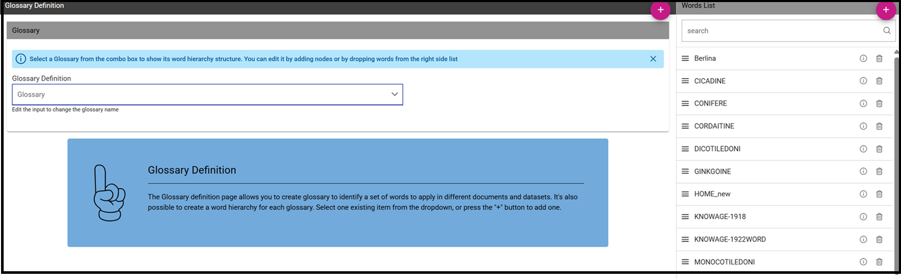

Glossary
##############

The **Glossary** functionality offers a way to find documents by browsing an index page.

Glossary management
---------------------

Once logged in, the user can find the two menu items, **Glossary Definition** and **Glossary Usage** in *CATALOGS* of the Knowage main menu, as showed below.

.. figure:: media/image456_8.1.png

    Glossary menu items.

To create a new glossary, click on the *Glossary Definition* menu item.
As shown in the figure below, the page contains two areas:

- **Words List**: contains the list of all the defined words to be used as labels to attach to analytical objects, as datasets or documents;
      
- **Glossary**: intended as a hierarchical structure made up of *Words*.

.. _glossarydefwindow:

    Glossary definition window.

As shown above, next to each word, there are two icons:

- *i*: prompts the details of the selected word: name of the *Word*, *Status*, *Category*, *Description*, *Formula*, *Links* to other words and *Attributes*
      
- *delete*: deletes the selected word

In the “Word” area are listed, if any, the words created in a previous moment. To explore the detail of each of them, the user just has to right click on it. A panel containing three features will be shown, as figure below highlights .

.. figure:: media/image458_8.1.png

    Exploring the details of an existing word.

To add a new word, click on the *Plus* icon available next to the *Word List* text item an fill in at leats the mandatory information,*Word*, *Category* and *Description*.
Use the *Save* button to save it a. 
Once saved, you can search for it or a different word just using the search filter.

.. _addanewword:

    Add a new word.

The *Glossary* panel contains all the glossaries formerly created. To explore an existing glossary just open the menu of the *Glossary Definition* item and select one of the test options. The figure below shows an example. 
A hierarchical structure of the glossary appears, where each node has its own words .

.. figure:: media/image460_8.1.png

    Exploring a glossary from the menu.

To add a new glossary click on the *Plus* icon next to the *Glossary Definition* text item.

.. _newglossnewahild:

   New glossary wizard.

After assigning a name to the *Glossary Definition* field, the Glossary is automatically saved.
 

Click on *ADD NODE*, fill in the node name and save.
The image below shows the *ADD Node* functionality and also how to add words to a node once created.

.. _additemstonode:

    Add items to the node(s) and words to nodes.

Glossary Usage
-------------------

This functionality is profiled accordingly to the user role and it includes features that allow to

-  visualize the glossary,
-  visualize the associations,
-  manage the associations between the glossary and the documents,
-  manage the associations between the glossary and the datasets.

Selecting **Glossary Usage** from the Catalogs contextual menu, the user encounters the page showed below. Here four tabs are available:**Glossary**, **Navigation**, **Document Management** and **Dataset Management**.

    Glossary Usage graphic interface.

The Glossary tab provides the possibility to visualize the existing glossaries. Select a glossary from the combobox available in this page to inspect its elements. Use the icon with a circled “i” to visualize the details of the related element, as shown below. Note that it is enabled the possibility to look a word up using the configured research box.

    Visualization of glossary details.

The navigation paths can be explored in the second tab. This window has an associative logic which facilitates to browse the associations. In other terms, here it is possible to check the relations between documents or datasets and words of a glossary. An
example is given in the following figure.

.. figure:: media/image466.png

    Navigation tab window.

To use this functionality, select a glossary using the designated combobox available at the top of the “word” column. The window will show all words associated to that glossary. Selecting one of those words a list of documents will be displayed in the area in the middle of the page. Use the circled i icon to inspect the document details and in addition to run it. In fact the “Run” button is available at the right bottom corner of the detail panel, as shown below.

    Execution documents by means of the glossary.

The filters chosen by the user can be removed through the filter red icon or by selecting the **Clear Filter** button |image475| located at the right top corner of the word list.

Note that it is possible to inspect the details of each element using the specific icon.

The Document management tab is the place where to set the associations between the analytical documents and the words of a glossary. This functionality is profiled through the authorization **Manage Glossary Technical**.

The page is made up of three colums: the “documents” one on the left, the “word” in the middle and the “glossary” on the right. To associate a word to a document or see which words are related to it the user must select a document from the list of the left sided column. Then it is mandatory to select a glossary from the combobox available on the right sided column. Finally drag and drop words from the glossary tree to the “word” column in the middle of the page. Note that the user must drag and drop the word at the beginning of the list: when a light blu box with dotted borders appears it is possible to end the action. To deselect the choice the user can click on the icon |image476| aside each word. This procedure is recap by figure below.

    Managing the association with a document: (Left) Select the documnet. (Right) Associate one (or more) word(s).

If one gets back to the navigation tab and select the glossary used in the previous step, it is possible to check the association just set.

Equally, the Dataset management feature allows the user to set the associations between datasets and glossaries. The next figure shows an example. The window is splitted in four areas: **Dataset**, **Dataset/Word**, **Column/Word** and **Glossary**. First the user must select a dataset on the left area. The chosen dataset is highlighted and its fields appear in the Column/Word area. Now, the user select a glossary using the combobox on the right side area. Finally the user can drag and drop words from the glossary tree to the dataset or the single fields of the dataset.

.. _datasetmanagmtab:

    Dataset management tab.

Once the datasets or the documents are linked to the glossaries, the user can enter the Glossary Usage menu item to browse easily the
elements inside the Knowage suite.

Help Online functionality
---------------------------

The user can inspect the association of a specific analytical element (dataset, document or model) by using the **Help Online** funcitonality. The latter can be reached:

-  from the Document Browser,
-  from the toolbar of each document, once launched,
-  from every dataset,
-  from every entity of the Qbe model,
-  from Birt reports,
-  from the cockpit.

As an example, we show in figure below the graphic interface the user will encounter once he/she has launched a document and wishes to use the Help Online functionality.

.. figure:: media/image474.png

    Help Online wizard.

