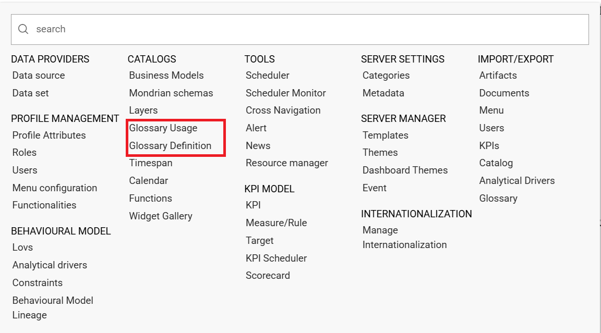
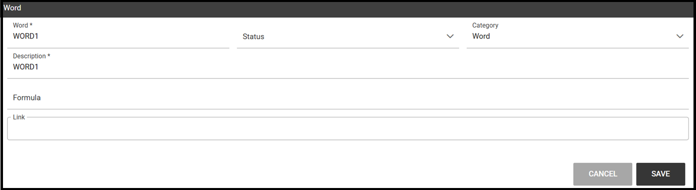
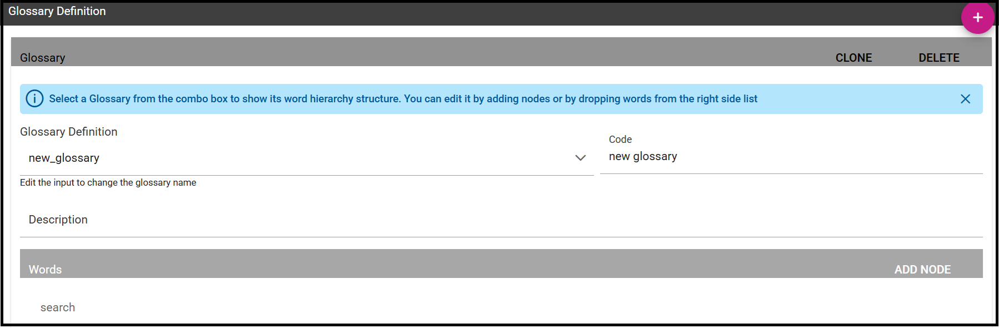
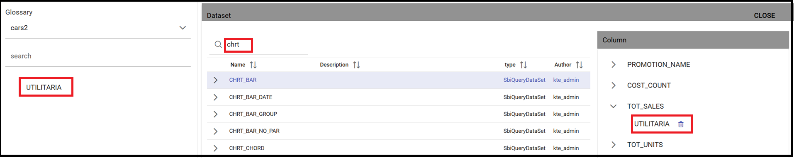

Glossary
########################################################################################################################

The **Glossary** functionality offers a way to find documents by browsing an index page.

Glossary management
------------------------------------------------------------------------------------------------------------------------

Once logged in, the user can find the two menu items, **Glossary Definition** and **Glossary Usage** in *CATALOGS* of the Knowage main menu, as shown below.

    Glossary menu items.

To create a new glossary, just click on the *Glossary Definition* menu item.
As shown in the figure below, the page contains two areas:

- **Words List**: contains the list of all the defined words to be used as labels to attach to analytical objects, as datasets or documents;
      
- **Glossary**: intended as a hierarchical structure made up of *Words*.

.. _glossarydefwindow:
.. figure:: media/image457_8.1.png

    Glossary definition window.

As shown above, next to each word, there are two icons:

- *i*: prompts the details of the selected word: name of the *Word*, *Status*, *Category*, *Description*, *Formula*, *Links* to other words and *Attributes*
      
- *delete*: deletes the selected word

The Word list contains all the words previously created whose details can be visualized just clicking on them.
The following panel will be visible.

    Exploring the details of an existing word.

To add a new word, click the *Plus* icon available next to the *Word List* text item an fill in at leats the mandatory information,*Word*, *Category* and *Description*.
Use the *Save* button for saving. 
Once saved, you can search it or a different word just by using the search filter.

.. _addanewword:
.. figure:: media/image459_8.1.png

    Add a new word.

The *Glossary* panel contains all the glossaries formerly created. 
To explore an existing glossary just open the menu of the *Glossary Definition* item and select one of the options. The figure below shows an example. 
A hierarchical structure of the glossary appears, where each node has its own words .

    Exploring a glossary from the menu.

To add a new glossary click the *Plus* icon next to the *Glossary Definition* text item.

.. _newglossnewahild:
.. figure:: media/image46162_8.1.png

   New glossary wizard.

After assigning a name to the *Glossary Definition* field, the Glossary is automatically saved.
 

Click on *ADD NODE*, fill in the node name and save.
The image below shows the *ADD Node* functionality and also how to add words to a node once created.

Glossary Usage
------------------------------------------------------------------------------------------------------------------------

This functionality works accordingly to the user role and includes features that allow to create/visualize the associations of the words of a glossary to:

-  documents,
-  datasets,
-  business classes and
-  tables (columns).

The details of all the defined glossaries can be displayed just selecting **Glossary Usage** from *CATALOGS* of the Knowage main menu.

    Glossary Usage graphic interface.

Select a glossary from the combobox available and search for a word inside the glossary. The page refreshes showing the links of that word with the components metioned above.

In case of no links with i.e. a Table, a message prompts informing that there are no links to the word.

    No table links to words.

To associate the glossary to a specific component, just click the *LINK* functionality next to each element.
See figure below as example.

    Linking a word to a dataset .

After clickin on *LINK*, a wizard opens. Here you can select the glossary and to associate the word it is enough to drag and drop it in the editor area of the chosen dataset.
After closing the wizard, clicking on the *i* icon you can see the list of words associated.
See image below:

    Linking a word to a dataset .

Help Online functionality
------------------------------------------------------------------------------------------------------------------------

The user can view the association of a specific analytical element (dataset, document or model) by using the **Help Online** functionality from:

-  the Document Browser,
-  the toolbar of each document, once launched,
-  every dataset,
-  every entity of the Qbe model,
-  Birt reports,
-  the cockpit.

As an example, the figure below shows the graphic interface that the user will see once launched a document and used the Help Online functionality.

    Help Online wizard.

